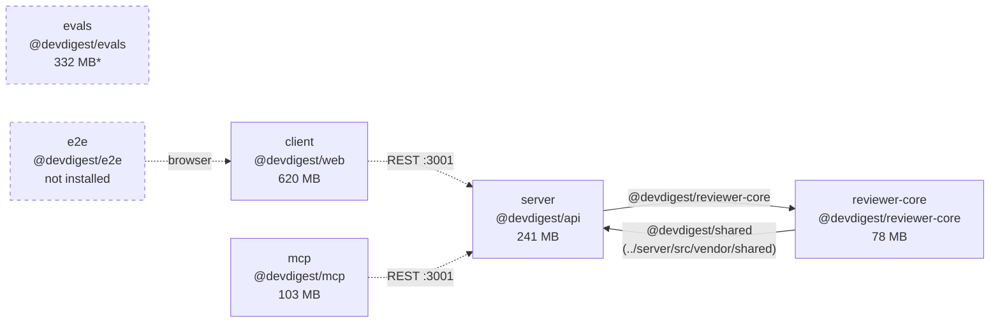
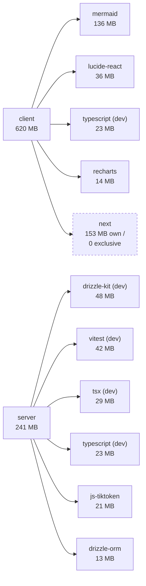
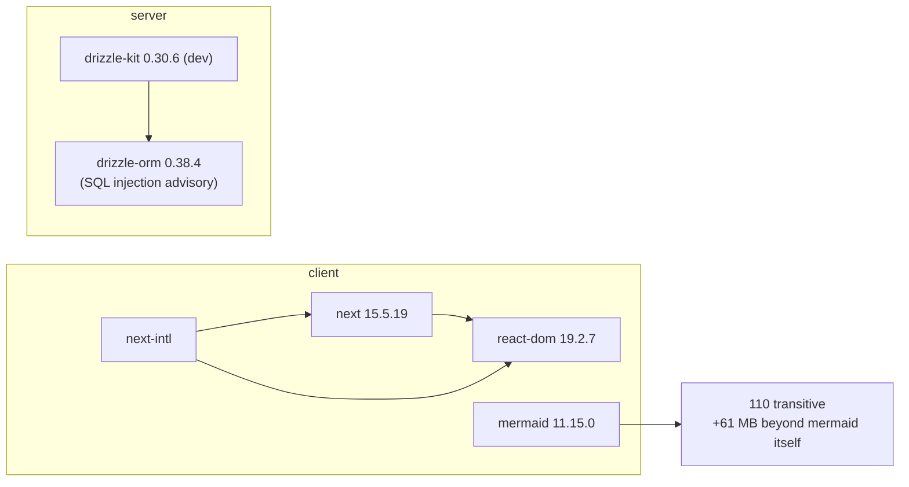
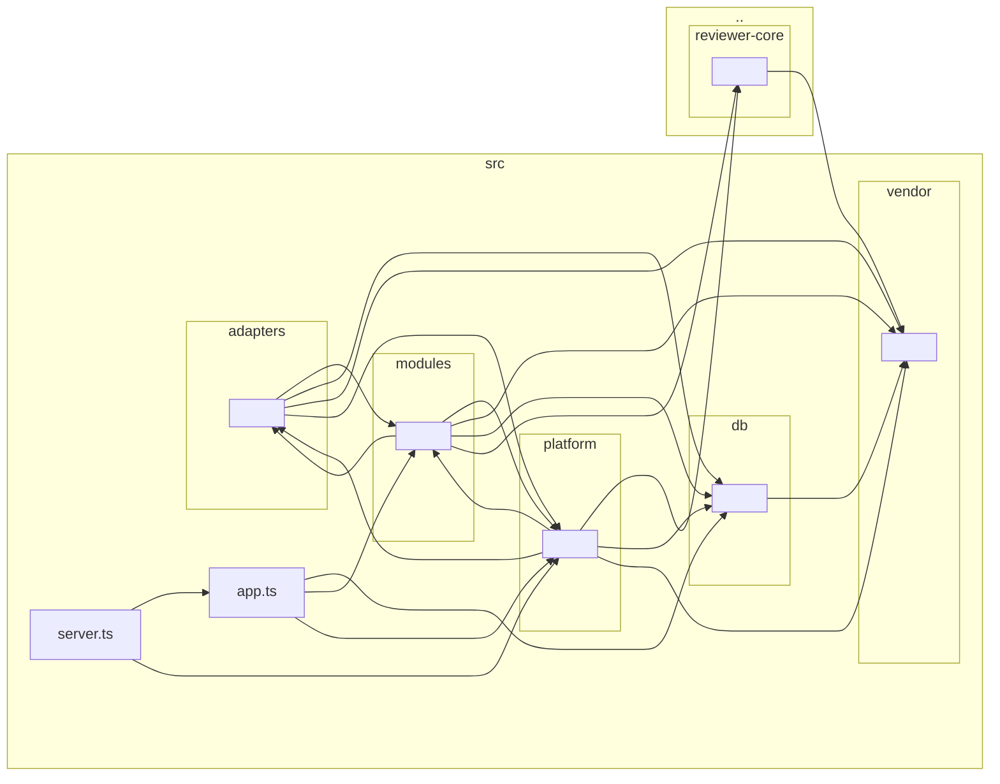

# Dependency report — 2026-08-27

Data: [`data/2026-08-27.json`](data/2026-08-27.json) · Collector:
`.claude/skills/dependency-checker/scripts/collect.py` ·
node v25.7.0 · pnpm 10.34.5 · npm 11.10.1

## 1. Verdict

Six packages, **1.34 GB** of `node_modules`, **18 high-severity vulnerabilities
reachable from production dependencies**, and **129 MB** of the disk spent on
second copies of packages other packages already have.

| P | Head of the queue |
|---|---|
| **P0** | `drizzle-orm` 0.38.4 carries a SQL-injection advisory and sits in `server`'s prod tree; `next` 15.5.19 carries three highs (one DoS, two SSRF) in `client`'s. Fixes exist for both. |
| **P1** | `openai` is three majors behind (4.104.0 → 7.8.0) in `server`, `reviewer-core` and `evals` — one library, three packages, one upgrade. |
| **P2** | `zod` is split across the repo: 3.25.76 in `server`/`client`/`reviewer-core`, 4.4.3 in `mcp`. The shared contracts are Zod schemas. |

Two packages could not be measured fully and are **not** counted as clean: `e2e`
has no `node_modules` at all, and `evals` is installed with a different linker
(section 11).

## 2. Schema 1 — the repository

Edges are `tsconfig` path aliases, which is how this repository shares code —
there are no npm dependencies between our own packages.

`server` and `reviewer-core` alias **into each other**: `server` reaches
`../reviewer-core/src`, and `reviewer-core` reaches back into
`../server/src/vendor/shared`. The dashed edges are runtime calls, not aliases —
they are drawn from `CLAUDE.md`, not measured by the collector.

## 3. Packages

| Package | Manager | prod | dev | Installed | `node_modules` | Status |
|---|---|---:|---:|---:|---:|---|
| `client` | pnpm | 12 | 13 | 421 | 619.5 MB | measured |
| `evals` | pnpm | 2 | 5 | 7 | 332.1 MB | **per-dependency sizes unmeasurable** |
| `server` | pnpm | 24 | 8 | 403 | 240.8 MB | measured |
| `mcp` | npm | 2 | 6 | 64 | 102.8 MB | measured |
| `reviewer-core` | npm | 2 | 4 | 83 | 77.9 MB | measured |
| `e2e` | npm | 0 | 3 | — | — | **not installed** |
| **Total** | | **42** | **39** | | **1373.3 MB** | |

`client` alone is 45% of the tree. Note that `CLAUDE.md` documents five packages;
there are six on disk — `evals/` is not in that table.

## 4. Schema 2 — what each package's weight is made of

Figures are `exclusive_kb`: the dependency plus everything only it reaches.

## 5. Weight

### client — 619.5 MB

| Dependency | Type | own | exclusive | Note |
|---|---|---:|---:|---|
| `mermaid` | prod | 75.3 MB | **136.0 MB** | heaviest single item in the repository |
| `next` | prod | 152.6 MB | 0.0 MB | also reached by `next-intl` — removing it frees nothing |
| `lucide-react` | prod | 36.2 MB | 36.2 MB | icon set, no transitives |
| `typescript` | dev | 22.8 MB | 22.8 MB | |
| `recharts` | prod | 5.2 MB | 14.3 MB | |
| `react-dom` | prod | 7.1 MB | 0.0 MB | reached by `next`, `next-intl`, `recharts`, `@testing-library/react` |

### server — 240.8 MB

| Dependency | Type | own | exclusive |
|---|---|---:|---:|
| `drizzle-kit` | dev | 7.4 MB | **48.1 MB** |
| `vitest` | dev | 1.9 MB | 41.9 MB |
| `tsx` | dev | 10.9 MB | 29.4 MB |
| `typescript` | dev | 22.8 MB | 22.8 MB |
| `js-tiktoken` | prod | 21.5 MB | 21.5 MB |
| `drizzle-orm` | prod | 13.2 MB | 13.2 MB |
| `octokit` | prod | 0.1 MB | 12.6 MB |
| `openai` | prod | 9.5 MB | 9.5 MB |

`server`'s four heaviest items are all dev tooling — 142 MB of the 241 MB never
reaches a deployment.

### reviewer-core — 77.9 MB · mcp — 102.8 MB

`vitest` (33.6 / 33.7 MB) and `typescript` (22.8 MB) lead both. `mcp` carries
`js-tiktoken` at 21.5 MB as a **dev** dependency; `server` carries the same
package at the same size as **prod**.

## 6. Schema 3 — who pulls in the packages named above

`next` and `react-dom` show `exclusive = 0` because `next-intl` reaches them
too; neither can be removed by dropping the other. `mermaid` is the opposite —
nothing else reaches its 110 transitive packages.

## 7. Risk

### Vulnerabilities, split by whether they can reach production

| Package | prod critical | prod high | prod moderate/low | dev critical | dev high |
|---|---:|---:|---:|---:|---:|
| `client` | 0 | **8** | 18 | 1 | 2 |
| `server` | 0 | **6** | 0 | 1 | 11 |
| `evals` | 0 | **3** | 7 | 1 | 5 |
| `reviewer-core` | 0 | **1** | 0 | 1 | 3 |
| `mcp` | 0 | 0 | 0 | 1 | 1 |
| `e2e` | — | — | — | — | — |

Every `critical` in this repository is the same one: the Vitest UI arbitrary-file
advisory, and it is dev-only everywhere. The findings that matter are the highs
on the prod side. All 18 report `fix_available: true`.

| Package | Advisory | Vulnerable package | Declared by us? |
|---|---|---|---|
| `server` | SQL injection via improperly escaped SQL identifiers | `drizzle-orm` | yes, prod |
| `server` | DDoS with HTTP/2 | `find-my-way` | no (via `fastify`) |
| `server` | host confusion ×3 | `fast-uri` | no |
| `server` | CRLF injection in multipart field names | `form-data` | no |
| `client` | DoS in App Router Server Actions; SSRF in Server Actions; SSRF in rewrites | `next` | yes, prod |
| `client` | arbitrary file read via `sourceMappingURL` ×2 | `postcss` | declared, but as dev |
| `client` | non-secure generator loops ×2 | `nanoid` | no |
| `client` | inherited libvips CVEs | `sharp` | no (via `next`) |
| `evals` | host confusion ×2 | `fast-uri` | no |
| `evals` | octal/decimal octet confusion → SSRF | `ip-address` | no |
| `reviewer-core` | CRLF injection in multipart field names | `form-data` | no (via `openai`) |

`e2e` is not listed as clean — it has no `node_modules`, so it was never audited.

### Production dependencies two or more majors behind

| Package | Dependency | Current | Latest | Majors |
|---|---|---|---|---:|
| `server` | `openai` | 4.104.0 | 7.8.0 | 3 |
| `reviewer-core` | `openai` | 4.104.0 | 7.8.0 | 3 |
| `evals` | `openai` | 4.104.0 | 7.8.0 | 3 |
| `server` | `fastify-type-provider-zod` | 4.0.2 | 7.0.0 | 3 |

Across all packages 60 dependencies are outdated; the four above are the ones
that are both production and two-plus majors behind. `typescript` (5.9.3 → 7.0.2)
and `vitest` (2.1.9 → 4.1.11) are two majors behind everywhere, but both are dev.

## 8. Hygiene

### The same dependency installed more than once — 128.8 MB redundant

| Dependency | Installed in | Versions | On disk | Redundant |
|---|---|---|---:|---:|
| `typescript` | client, mcp, reviewer-core, server | one (5.9.3) | 91.4 MB | **68.5 MB** |
| `js-tiktoken` | mcp, server | one | 43.0 MB | 21.5 MB |
| `zod` | client, mcp, reviewer-core, server | **3.25.76 / 4.4.3** | 21.3 MB | 15.0 MB |
| `openai` | reviewer-core, server | one | 19.1 MB | 9.5 MB |
| `@types/node` | client, mcp, reviewer-core, server | **four** (22.19.19 / 22.19.20 / 22.20.0 / 22.20.1) | 10.1 MB | 7.4 MB |
| `vitest` | client, mcp, reviewer-core, server | one | 7.5 MB | 5.6 MB |
| `tsx` | mcp, reviewer-core, server | **4.22.4 / 4.23.12** | 12.2 MB | 1.3 MB |

That 129 MB is the price of the deliberate decision in `CLAUDE.md` not to be a
workspace. It is a cost, not a defect — but `zod` is a different matter: the
shared contracts in `vendor/shared` are Zod schemas, and `mcp` validates them
with a **different major version** than the three packages that produce them.

### Dependencies that appear to be unused

Candidates, not verdicts — each was checked by hand and each is listed with what
that check found.

| Package | Dependency | Type | Checked |
|---|---|---|---|
| `server` | `@fastify/autoload` | **prod** | the only mention in tracked source is a comment in `src/modules/index.ts` saying modules are registered statically *instead of* filesystem autoload |
| `server` | `testcontainers` | dev | the tests import `@testcontainers/postgresql`; the base package is never imported directly |
| `reviewer-core` | `tsx` | dev | scripts are `tsc` and `vitest`; nothing invokes `tsx` |
| `client` | `postcss` | dev | `postcss.config.mjs` names only `@tailwindcss/postcss`; `postcss` arrives as its transitive |

## 9. Schema 4 — internal modules

Produced by `dependency-cruiser` 17.4.3, collapsed to depth 2, with node_modules
and Node builtins excluded. Only `server` and `reviewer-core` have a
`.dependency-cruiser.cjs`; `client`, `mcp`, `evals` and `e2e` have no internal
graph in this report because there is no configuration to produce one.

### server

At this collapse depth the graph shows edges in **both** directions between
`src/adapters` and `src/modules`, and between `src/platform` and both of them.
Whether any individual edge is a violation is decided by `pnpm arch:check`
against `.dependency-cruiser.cjs`, not by this diagram — a folder-level arrow
can be two different files pointing opposite ways.

### reviewer-core

The graph confirms the alias direction from section 2: `reviewer-core/src`
imports `../server/src/vendor/shared`.

## 10. Priorities

| P | What | Why | Action | What it buys |
|---|---|---|---|---|
| **P0** | `drizzle-orm` 0.38.4 in `server` prod | SQL injection via improperly escaped identifiers, reachable from production | upgrade; `fix_available: true` | removes the only injection-class advisory in the repo |
| **P0** | `next` 15.5.19 in `client` prod | one DoS and two SSRF advisories, all prod-reachable | upgrade Next | clears 3 of `client`'s 8 prod highs |
| **P0** | `fast-uri`, `form-data`, `find-my-way`, `nanoid`, `sharp`, `ip-address`, `postcss` | 14 more prod-reachable highs, none declared by us | upgrade the parents (`fastify`, `openai`, `next`) — all report a fix | clears the remaining prod highs |
| **P1** | `openai` 4.104.0 → 7.8.0 in three packages | three majors behind, production, and the LLM path is the product | one coordinated upgrade | removes `form-data` in `reviewer-core` too |
| **P1** | `fastify-type-provider-zod` 4.0.2 → 7.0.0 | three majors behind; couples Fastify and Zod, both of which we want to move | upgrade with the Zod decision below | unblocks the Zod split |
| **P1** | `mermaid` 136 MB exclusive in `client` prod | largest single item in the repo, and nothing else reaches it | check whether the diagram views can load it lazily | up to 136 MB off `client`; bundle effect must be measured separately |
| **P2** | `zod` 3.25.76 vs 4.4.3 | the shared contracts are Zod schemas and `mcp` validates them on a different major | pick one major repo-wide | removes a whole class of "works in server, fails in mcp" |
| **P2** | `@fastify/autoload` declared in `server` **prod** | never imported; the code comments say autoload was deliberately not used | remove from `package.json` | one fewer production dependency |
| **P2** | `@types/node` at four versions | four packages, four patch versions of the same types | align | 7.4 MB, and one less source of type drift |
| **P3** | `testcontainers`, `tsx`, `postcss` unused (dev) | listed above with the check for each | remove after confirming | small |
| **P3** | 57 advisories outside the prod tree | none reachable from production | upgrade `vitest`/`vite` when convenient | clears every remaining `critical` |
| **P3** | `e2e` not installed, `evals` on a different linker | not findings, but blind spots in this report | `npm install` in `e2e`; add `.npmrc` to `evals` | makes the next report complete |

## 11. Not measured

- **`e2e` has no `node_modules`.** No sizes, no versions, no `outdated`, no
  `audit`. Its empty row means unmeasured, not clean.
- **`evals` per-dependency sizes are unusable.** 100% of its `node_modules`
  entries are symlinks — it has no `.npmrc`, so pnpm installed it with the
  default isolated linker, and `du` measures the link rather than the package.
  Its 332 MB total is real; the per-dependency breakdown is reported as `null`.
- **Sizes are on-disk bytes, not bundle bytes.** They include sourcemaps, type
  declarations and dual CJS/ESM builds. No figure in this report says what any
  package costs a browser — that needs a production build, which this report
  does not run.
- **Unused dependencies are a heuristic** over imports, config files, CSS and
  `scripts` entries. The four listed in section 8 were each verified by hand; a
  dependency reached only through a computed name would still be missed.
- **Internal graphs exist only for `server` and `reviewer-core`.** The other four
  packages have no `.dependency-cruiser.cjs`.
- **Advisory counts are as of 2026-08-27** against the registry on that date.
