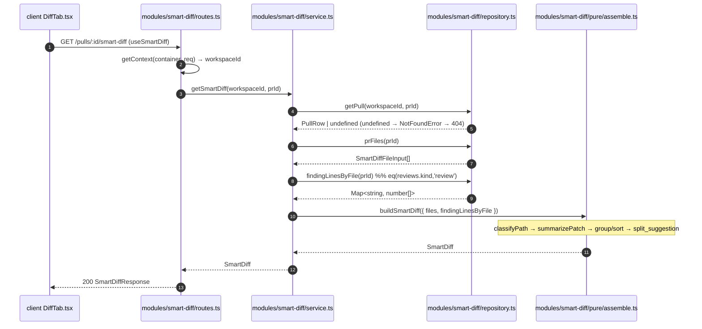

# Development Plan: Smart Diff (course lesson L03)

- **Date:** 2026-08-14
- **Author:** planner
- **Status:** approved

## 0. Context & scope

- **Task:** Sort a PR's changed files by risk (`core` / `wiring` /
  `boilerplate`), expose them at `GET /pulls/:id/smart-diff` using the
  already-existing `SmartDiff` contract, and **reorder the real diff itself**
  into role groups behind a `Smart order` / `Original order` toggle, with
  per-file finding badges that scroll to the finding's line.
  **Fully deterministic — zero LLM calls.**

- **In scope:**
  - New server module `server/src/modules/smart-diff/` with a *pure*
    sub-directory (`pure/`) holding the classifier, the patch summarizer, the
    assembler and all thresholds/patterns.
  - `GET /pulls/:id/smart-diff` reading `pr_files` + persisted findings
    directly from the DB.
  - `pseudocode_summary` filled from dry patch statistics only.
  - Client: `useSmartDiff` hook + query key + invalidation; a
    **`Smart order` / `Original order` toggle** over **one** diff list;
    role group sections inside the existing `DiffViewer` that wrap the **real
    `FileCard`s with their inline diffs**; **role-aware collapse** on
    `FileCard`; an "N findings" badge on the real file card header; and the
    `target` / `nonce` plumbing that makes a badge click force-expand the
    group **and** the card and scroll to the line.
  - `verify:l03` npm script running the pure unit tests.

- **Out of scope:**
  - **Any edit to `vendor/shared`.** `SmartDiffRole` / `SmartDiffFile` /
    `SmartDiffGroup` / `ProposedSplit` / `SmartDiff` already exist at
    `server/src/vendor/shared/contracts/brief.ts:99-132`, and
    `SmartDiffResponse = SmartDiff` at
    `server/src/vendor/shared/contracts/review-api.ts:69-71`. Both copies are
    already in sync. **Do not touch either copy; do not run a resync.**
  - Any DB migration or new table. Smart Diff is derived on every request.
  - Caching into `pr_brief` (see §2b).
  - Any change to `pulls/service.ts`, `reviews/*`, `repo-intel/*`,
    `reviewer-core/*`.
  - **A second, parallel list of file names.** There is exactly **one** diff
    list on the Files-changed tab; no summary strip duplicating the file rows
    (see §2b, R1).
  - **Persisting the order toggle** (URL, `localStorage` or server). It is a
    per-visit view preference — see §2b.
  - Per-finding chips (one clickable chip per `finding_lines` entry). The badge
    jumps to `finding_lines[0]`.
  - LEFT-side (deleted-line) anchoring. Findings carry new-file line numbers.
  - A browser e2e flow (`e2e/specs/*.flow.json`) — deliberately declined, §7.

- **Definition of done:**
  1. `cd server && pnpm verify:l03` exits 0 and runs ≥3 real test files.
  2. `cd server && pnpm exec vitest run smart-diff` (unit + integration) passes,
     including an assertion that both injected `MockLLMProvider`s recorded
     `calls.length === 0` across a `GET /pulls/:id/smart-diff` request.
  3. `GET /pulls/:id/smart-diff` on a PR whose `pr_files` contains
     `pnpm-lock.yaml` returns that file in the `boilerplate` group, and
     `groups.map(g => g.role)` is a prefix-ordered subsequence of
     `['core','wiring','boilerplate']`.
  4. `GET /pulls/:id/smart-diff` on a PR with **zero** `pr_files` rows returns
     `200` with `{ groups: [], split_suggestion: { too_big: false,
     total_lines: 0, proposed_splits: [] } }` — not a 404, not `null`.
  5. `cd server && pnpm typecheck && pnpm arch:check` pass, and
     `.dependency-cruiser-known-violations.json` is **unchanged** (still 0).
  6. `cd client && pnpm test && pnpm typecheck` pass, including tests asserting:
     - in **Smart order**, group sections wrap the real `FileCard`s in
       `core → wiring → boilerplate` order, and the `boilerplate` **group**
       starts collapsed;
     - a **small** boilerplate file (`+3 −1`, far under
       `AUTO_EXPAND_MAX_LINES = 200`) **still starts collapsed** — the
       size-threshold path must not rescue it;
     - a core file of the same size starts **expanded**;
     - clicking an "N findings" badge on a real file card header calls
       `onJumpToLine(path, finding_lines[0])`;
     - a `target` pointing at a file inside the **collapsed boilerplate group**
       force-expands the group **and** the card and calls `scrollIntoView`;
     - switching to **Original order** restores the flat, server-ordered list
       with no group headers and with the original `AUTO_EXPAND_MAX_LINES`
       collapse seeding (a small boilerplate file is expanded there).
  7. `./scripts/check-shared-sync.sh` prints `vendor/shared in sync` (it must
     pass **because nothing changed there**, not because a resync was run).

## 1. Affected modules

| Module | Package manager | Layer / area | Constraint from INSIGHTS.md |
|---|---|---|---|
| `server/src/modules/smart-diff/pure/*` (new) | pnpm | ring 1, pure — no I/O | New dir is invisible to `no-app-to-schema`'s current `from.path`; the same step must extend that regex (`server/INSIGHTS.md`, dependency-cruiser entries: a rule whose regex does not match reports 0 violations *silently*). |
| `server/src/modules/smart-diff/repository.ts` (new) | pnpm | ring 2 — Drizzle | Must NOT be covered by the `no-app-to-schema` regex extension; it legitimately imports `db/schema`. |
| `server/src/modules/smart-diff/service.ts` (new) | pnpm | ring 1 | Already matched by `no-app-to-schema` via `^src/modules/[^/]+/(service\|…)\.ts$`. May name rows via `db/rows.ts` only. |
| `server/src/modules/smart-diff/routes.ts` (new) | pnpm | ring 3 | Already matched by `no-route-to-db`. Response schema must satisfy `SmartDiff` **exactly** — `server/INSIGHTS.md`, Tool & Library Notes (2026-08-14): a missing/invalid field in a `response` schema serializes as a `500`, and `pnpm typecheck` does not catch it. |
| `server/src/modules/index.ts` | pnpm | composition root | Static registry; `:22-24` already anticipates a smart-diff module. |
| `server/package.json` | pnpm | scripts | TESTING.md claims this file is `skip-worktree`; `git ls-files -v server/package.json` currently reports `H` (normal). Re-check before editing (see §6). |
| `client/src/lib/hooks/{keys.ts,reviews.ts}` | pnpm | data layer | `client/INSIGHTS.md`, Codebase Patterns: every key **and** every invalidation goes through `queryKeys` — never a bare string-array key. |
| `client/src/components/diff-viewer/*` | pnpm | shared component | `client/INSIGHTS.md`: styling is colocated JS objects in `styles.ts`, not Tailwind classes; expand `border*` to per-side longhands when a border colour changes on state. Copy lives in the **`shell`** i18n namespace (`useTranslations("shell")`, `messages/en/shell.json` → `diffViewer.*`), not `prReview`. |
| `client/src/app/repos/[repoId]/pulls/[number]/_components/{SmartDiffViewer,DiffTab,PrDetailView}` | pnpm | feature-colocated UI | `client/AGENTS.md`: every `_components/<Name>` with real logic ships a colocated `.test.tsx`; user-facing copy goes in `messages/en/prReview.json`. |
| **`server/src/vendor/shared/**` and `client/src/vendor/shared/**` — NOT edited** | — | ring 0 | The contract already exists and is already mirrored. Editing either copy is the single largest avoidable risk in this change. |
| **`reviewer-core/**` — NOT edited** | npm | ring 0 | Smart Diff makes no model call and needs no engine slot; adding one would be pure scope creep. |
| **`server/src/modules/repo-intel/**` — NOT edited** | pnpm | — | Its `EXCLUDED_DIRS` is *copied from, not imported* (see §2b). |
| **`server/src/db/**` — NOT edited** | pnpm | ring 2 | No migration; Smart Diff is derived. |
| **`e2e/**` — NOT edited** | npm | — | A browser flow was considered and declined (§7). |

## 2. Constraints

- **dependency-cruiser rules touched:**
  - `no-app-to-schema` — its `from.path`
    (`server/.dependency-cruiser.cjs:48`) is extended with
    `|^src/modules/smart-diff/pure/`, mirroring the existing
    `^src/modules/reviews/intent/` alternative. Without this, a stray
    `drizzle-orm` / `db/schema` import inside the classifier is **not** an
    error — the rule reports zero violations because the regex never matches
    those paths. `smart-diff/service.ts` is already matched by the
    `(service|helpers|…)\.ts$` alternative and needs no change.
  - `no-route-to-db` — already matches
    `^src/modules/[^/]+/routes\.ts$`, so `smart-diff/routes.ts` is covered with
    no config change. The route must call the service, never Drizzle.
  - `no-cross-module-internals` — `smart-diff/*` must not import
    `modules/pulls/repository.ts`, `modules/pulls/service.ts`,
    `modules/reviews/repository.ts` or `modules/reviews/repository/*.ts`. The
    two queries it needs are **duplicated** into its own repository (see §2b).
  - `no-infra-to-app` — `smart-diff/repository.ts` must not import
    `smart-diff/service.ts`.
  - `no-circular` — `pure/` must not import `service.ts` or `repository.ts`.
- **`vendor/shared` mirroring required:** **no.** Nothing under
  `vendor/shared` changes. `./scripts/check-shared-sync.sh` still runs in §5 as
  a guard that no one edited it by reflex.
- **DB migration required:** **no.**
- **`reviewer-core` purity affected:** **no** — `reviewer-core` is untouched.
- **Client import direction** (`frontend-architecture`, Feature Folder
  Structure): shared code → feature → route, one way only.
  `client/src/components/diff-viewer/*` (shared) must **not** import anything
  from `src/app/**/_components/**`. The feature components pass data *down*
  into `DiffViewer` as props; `DiffViewer` never reaches up.
- **Other constraints from AGENTS.md / tsconfig:**
  - ESM: every relative import carries the `.js` extension
    (`./constants.js`, `./classify.js`).
  - `server/tsconfig.json:8` sets `noUncheckedIndexedAccess: true` — `arr[0]`
    is `T | undefined`; the implementer must narrow, not `!`-assert blindly.
    Check whether `client/tsconfig.json` sets it too and narrow accordingly.
  - Colocated `src/**/*.test.ts` are included by both
    `server/vitest.config.ts:14` and `tsconfig.json:28`, and must
    `import { describe, it, expect } from 'vitest'` explicitly
    (`types: ["node"]` only — precedent
    `src/modules/reviews/intent/scope-filter.test.ts:1`).
  - Client tests live beside their component and are picked up by
    `client/vitest.config.ts` (`include: ["src/**/*.test.{ts,tsx}"]`).

## 2b. Decisions and rejected alternatives

| Decision | Alternative considered | Why rejected |
|---|---|---|
| **One list.** Role group sections wrap the **real `FileCard`s** inside the existing `DiffViewer`, behind a `Smart order` / `Original order` toggle. | A `SmartDiffViewer` summary panel (group headers + file-name rows + badges) rendered **above** an unmodified `DiffViewer`. | Three defects. (1) The code a reviewer actually reads would stay in original GitHub order, ungrouped — the feature's thesis ("business logic first, not lock-files") would hold only in a strip above the unchanged diff. (2) Every file would be listed twice. (3) **The acceptance criterion would not actually be met**: the panel's boilerplate *group* would collapse, but the real lock-file `FileCard` below is seeded by `AUTO_EXPAND_MAX_LINES = 200` (`client/src/components/diff-viewer/constants.ts:4`), a **line-count** threshold that is role-blind — a small boilerplate diff such as `package.json +3 −1` would render **expanded**, violating "a lock-file always starts collapsed" literally. |
| **Group chrome lives in `DiffViewer`** (`client/src/components/diff-viewer/`); **`SmartDiffViewer` is a thin header** under `_components/` owning the order toggle, the `too_big` / `proposed_splits` banner and the "no smart-diff data yet" notice. It lists **no files**. | Fold everything into `DiffViewer`, or keep group chrome in `SmartDiffViewer` and have it render `FileCard`s itself. | `DiffViewer` owns the list layout and the `FileCard`s, so the sections that wrap them belong there — and it is the shared component, so the grouping stays reusable. The toggle and the split banner are PR-review-specific product chrome and belong in the route-colocated feature folder. Having `SmartDiffViewer` render `FileCard`s would make a feature folder reach into the shared component's internals, against `frontend-architecture`'s one-way import rule. Splitting this way leaves exactly one component listing files. |
| **`DiffTab` owns the `useSmartDiff` call and the toggle state**, passing data down to both children. | `SmartDiffViewer` calls the hook itself (same cache, no extra request). | `DiffTab` is the closest common parent of the two components that read the data (`frontend-architecture`, State Location), and a props-only `SmartDiffViewer` is a pure function of its inputs — testable with no hook mock at all. |
| Toggle state is `React.useState` in `DiffTab`, defaulting to **Smart order**, and is **not persisted** — not in `searchParams`, not in `localStorage`, not server-side. | Persist it in `?order=` like the existing `?tab=` / `?sort=` params. | `frontend-architecture` puts URL-dependent state in `searchParams`, but this is a per-visit *view* preference on one tab, not a linkable application state — nobody shares a "Files changed in original order" URL. `PrDetailView` already owns `?tab=` / `?trace=` via `setParam`; adding a third param would push toggle state two components up from the only consumer for no user-visible gain. **Stated, not left open.** |
| **Role-aware collapse on `FileCard`**: `role === 'boilerplate' → collapsed`, otherwise the existing `AUTO_EXPAND_MAX_LINES` size rule. | Keep the size rule only and rely on the group section's collapse. | The group collapse hides the cards, but the moment a user opens the boilerplate group (or a `target` force-opens it) every small lock diff inside would spring open. Role-first seeding is what actually satisfies the acceptance criterion, and it is pinned by a test on a `+3 −1` boilerplate file. |
| `FileCard` receives `role` **only in Smart order**; it receives `findingLines` in **both** orders. | Pass `role` always. | Original order is specified as "exactly today's behaviour", which includes role-blind, size-only collapse seeding. Finding badges, by contrast, are a property of the file rather than of the ordering, and the data is already fetched — hiding them in Original order would be a gratuitous regression. |
| Files present in `files` but absent from every `groups[].files` render in a **trailing "Other files" section**, expanded by default. | Silently drop them; or fold them into the `core` group; or fold them into `boilerplate`. | Dropping is unacceptable — a path mismatch between `pr_files.path` and `PrDetail.files[].path` would make real code vanish from the diff. Folding into `core` would assert a classification the server never made; folding into `boilerplate` would collapse real code. A visible trailing section keeps every file reachable and makes the mismatch diagnosable. |
| A **new module** `modules/smart-diff/` registered in `modules/index.ts`. | Add the route to `modules/reviews/routes.ts` next to `/pulls/:id/intent`. | `modules/index.ts:22-24` names smart-diff as its own lesson module. Reviews is already the largest module (1 500+ lines across `run-executor.ts`, `repository/`, `intent/`); a deterministic, LLM-free read has no business inside the run-execution module. |
| Pure code lives in `modules/smart-diff/**pure/**` (`constants.ts`, `classify.ts`, `summary.ts`, `assemble.ts`). | Flat files `modules/smart-diff/classify.ts` etc. | The `no-app-to-schema` regex is filename-anchored (`(service\|helpers\|…)\.ts$`) and a flat `classify.ts` matches nothing. The only clean fix is a directory alternative — and `^src/modules/smart-diff/` as a whole would also swallow `repository.ts`, which *must* import Drizzle. `pure/` is exactly the surface the ban should cover, and mirrors `^src/modules/reviews/intent/`. |
| **Duplicate** the two DB queries into `smart-diff/repository.ts`. | Import `reviews/repository/pull.repo.ts:getPull` / `pulls/repository.ts:latestReviewsByPr`, or expose a new getter on `Container`. | `no-cross-module-internals` forbids the import outright. A new `container.smartDiffRepo` getter is possible but pointless: the container's existing shared repos (`agentsRepo`, `reviewRepo`) exist because *several* modules need them; nothing else needs these two queries. Duplicating ~15 lines of `select()` is the sanctioned cost. **Existing symbols to mirror, not import:** `getPull` (`server/src/modules/reviews/repository/pull.repo.ts:9-19`), `getPrFiles` (`:29-34`), and the `eq(t.reviews.kind, 'review')` filter (`server/src/modules/pulls/repository.ts:128`, `:148`). Row types come from the sanctioned seam `db/rows.ts` (`PullRow`, `PrFileRow`, `FindingRow` already exist there at `:19`, `:23`, `:18`). |
| The classifier's patterns are **duplicated** into `pure/constants.ts`, not imported from `repo-intel/constants.ts` or `intent/gather.ts`. | `import { EXCLUDED_DIRS } from '../../repo-intel/constants.js'`. | Two reasons, one hard and one substantive. Hard: `repo-intel/constants.ts` is another module's internals — and more importantly, its list is **wrong for this purpose**. `EXCLUDED_DIRS` (`server/src/modules/repo-intel/constants.ts:17-26`) contains `'vendor'`, but in *this* repository `server/src/vendor/shared/**` and `client/src/vendor/shared/**` are the Zod contracts — the most review-critical code in the codebase. Importing that list would classify every contract change as `boilerplate`. `intent/gather.ts:11-20`'s `MANIFEST_NAMES` is also unusable directly: it lumps `package.json` (wiring) with `package-lock.json` (boilerplate). Different purpose, different layer, different correct contents. **`vendor` and `out` are deliberately NOT in `BOILERPLATE_DIR_SEGMENTS`.** |
| `total_lines` / `too_big` count **only `core` + `wiring`** files. | Sum `additions + deletions` over every row in `pr_files`. | A 40 000-line lock file would make every PR `too_big`, which inverts the feature's own thesis. This is a *downstream-of-transform* decision: after classification, `total_lines`, `too_big` **and** `proposed_splits` all read the post-classification lists, never the raw `pr_files` array. |
| `proposed_splits` is a **real deterministic rule**, not `[]`. | Always return `[]` "for now". | The contract requires the field and the course brief asks for a concrete rule. Rule: when `too_big`, group the `core` files by first path segment (root files under the literal `(root)`), drop groups with fewer than `SPLIT_MIN_FILES_PER_GROUP` files, sort by descending file count then ascending name, cap at `MAX_PROPOSED_SPLITS`. When `too_big` is false → `[]`. When `too_big` is true but nothing qualifies → `[]`. |
| `finding_lines` aggregates **every** `reviews` row with `kind='review'` for the PR, deduplicated and sorted ascending. | Only the single newest `reviews` row (`ORDER BY created_at DESC LIMIT 1`). | `server/INSIGHTS.md` (2026-07-31, PR-list Findings column) documents this exact trap: a review run fans out to **one `reviews` row per agent** created moments apart, so "newest row" means "whichever agent's timestamp landed last" and silently drops every other agent's findings. That produced a user-visible "list count ≠ detail count" bug once already. The client's own definition is `PrDetailView.tsx:63-66` (`runs.flatMap(r => r.findings)`). The `kind='review'` filter — which is what actually prevents the `summary`/`review` double-count that `reviews/service.ts:162-176` does not do — is retained. See §8. |
| Empty `pr_files` → `200` with empty `groups`. | `404`, or `200` + JSON `null`. | The PR exists; only its file list was never imported (it is populated as a side effect of `pulls/service.ts:getDetail`, which the Smart Diff route deliberately does not call). `404` would be a lie. `null` would force `.nullable()` on the response schema for no gain and drag in the `server/INSIGHTS.md` (2026-08-14) `.nullable()` serializer footgun. |
| **No caching** into `pr_brief`. | Persist the computed `SmartDiff` as `pr_brief.json`. | The `PrBrief` contract (`brief.ts:135-141`) composes `intent`/`blast`/`risks`/`history` and has **no `smart_diff` key** — writing one in would be an unplanned contract change (i.e. a `vendor/shared` edit, explicitly out of scope). The computation is two indexed `SELECT`s plus string work over already-loaded patches; there is nothing to cache yet. |
| `useFindingAction` (`client/src/lib/hooks/reviews.ts:187-190`) does **not** invalidate the smart-diff key. | Invalidate it there too, "for symmetry". | Accept/dismiss sets `accepted_at`/`dismissed_at`; it deletes nothing. Under the decision above, `finding_lines` is identical before and after, so the invalidation would be a guaranteed-wasted refetch on every keystroke of the `a`/`d` shortcuts. The other four sites *do* change the result and *are* invalidated (S7). |
| Click-to-line is implemented by threading an optional `target` prop down `DiffViewer → DiffGroupSection → FileCard → CodeLine`. | A DOM `id` per line + `document.getElementById(...).scrollIntoView()` from the header component. | `FileCard` owns its own `open` state (`FileCard.tsx:35-37`) **and**, after this rework, the group section owns a second level of collapse — so a targeted line can be two levels deep in unmounted DOM. `getElementById` returns `null` for exactly the case the feature exists for (a lock-file inside a collapsed boilerplate group). React state is the only way to force-expand both levels first and scroll last. |

## 2c. Architecture of the change

### Layers / ownership

- **ring 0 (`vendor/shared`)** — **unchanged.** Provides `SmartDiff`,
  `SmartDiffRole`, `SmartDiffFile`, `SmartDiffGroup`, `ProposedSplit`
  (`brief.ts:99-132`) and `SmartDiffResponse` (`review-api.ts:69-71`).
- **ring 1 pure (`modules/smart-diff/pure/`)** — thresholds, path patterns,
  `classifyPath`, `summarizePatch`, `buildSmartDiff`. No imports except
  `@devdigest/shared` (types) and sibling `pure/*.js` files. Explicitly **not**
  `node:path`: PR file paths from GitHub are always POSIX and
  `String.split('/')` is enough; importing `node:path` would make the
  classifier platform-coupled for zero benefit.
- **ring 1 (`modules/smart-diff/service.ts`)** — workspace guard, calls its own
  repository, calls `buildSmartDiff`. Names rows via `db/rows.ts` only.
- **ring 2 (`modules/smart-diff/repository.ts`)** — the only file here that
  imports `drizzle-orm` and `db/schema.js`.
- **ring 3 (`modules/smart-diff/routes.ts`)** — `IdParams` in,
  `SmartDiffResponse` out.
- **composition root (`modules/index.ts`)** — one import, one registry entry.
- **client shared (`src/components/diff-viewer/`)** — owns the diff list, the
  new group sections, and role-aware collapse. Imports nothing from
  `src/app/**`.
- **client feature (`_components/{DiffTab,SmartDiffViewer}/`)** — owns the
  query call, the order toggle state, and the split banner. Passes data down.
- **`reviewer-core`** — gains **nothing**. Not an optional slot, not a type.

### Unchanged

`vendor/shared` (both copies), `reviewer-core/`, `server/src/db/**`,
`server/src/modules/reviews/**`, `server/src/modules/pulls/**`,
`server/src/modules/repo-intel/**`, `server/src/platform/**`, `e2e/`.
Reasons in §1, §2b and §7.

### Data sources

| Read | From | Notes |
|---|---|---|
| PR ownership | `pull_requests` filtered by `workspace_id` + `id` (`server/src/db/schema/pulls.ts:5-34`) | Missing → `NotFoundError` → 404. |
| Changed files | `pr_files.path`, `.additions`, `.deletions`, `.patch` (`server/src/db/schema/pulls.ts:36-45`) | `patch` is **nullable** — see below. |
| Findings | `findings.file`, `.startLine` joined to `reviews` on `review_id`, filtered `reviews.pr_id = $1 AND reviews.kind = 'review'` (`server/src/db/schema/reviews.ts:29-47`, `:10-27`) | `file`, `startLine`, `severity` are all `NOT NULL`; the `Finding` contract (`contracts/findings.ts:47-58`) has them required too, so anchoring is reliable. |
| Diff bodies rendered in the UI | `PrDetail.files[]` — already fetched by `usePullDetail` and passed into `DiffTab` as `files` (`DiffTab.tsx:16`, `PrDetailView.tsx:148-155`) | Smart Diff **reorders** this existing array; it never re-fetches patches. `PrFile.patch` is `.nullish()` (`contracts/platform.ts:186-192`). |

- **Never sent to a model:** nothing at all. This request path constructs no
  prompt and resolves no `LLMProvider`. `container.llm(...)` is never called.
- **Missing / unavailable sources, recorded not invented:**
  - `pr_files` empty (PR detail never opened) → `groups: []`,
    `split_suggestion: { too_big: false, total_lines: 0, proposed_splits: [] }`.
    `SmartDiffViewer` renders `prReview.smartDiff.empty` and `DiffViewer`
    falls back to the flat, ungrouped list. **Nothing is fabricated.**
  - **`pr_files.patch IS NULL`** → `summarizePatch(null)` returns `null`,
    which serializes as `pseudocode_summary: null`
    (`SmartDiffFile.pseudocode_summary` is `.nullish()`, `brief.ts:105`). The
    file still appears in its group with its DB `additions`/`deletions`.
  - A `findings.file` value matching no `pr_files.path` (exact string equality;
    no normalization) is **dropped** server-side — there is no file card to
    anchor it to. It does not create a phantom `SmartDiffFile`.
  - A `PrDetail.files[]` path present in no `groups[].files` (server/GitHub
    path drift) renders in the trailing **"Other files"** section, expanded.
    It is never dropped and never silently reclassified.

### Call sequence

Two DB reads, zero LLM calls, zero writes.



Client-side render path (no network hop; `order` is local state):

```
DiffTab.tsx                          — useSmartDiff(prId); useState<Order>('smart'); useState<DiffLineTarget|null>
  └─ SmartDiffViewer.tsx             — order toggle · too_big/proposed_splits banner · empty notice   (lists NO files)
  └─ DiffViewer.tsx                  — grouped={order === 'smart' && !!smartDiff}; smartDiff={smartDiff}
       ├─ DiffGroupSection.tsx       — one per SmartDiffGroup, in server ROLE_ORDER; boilerplate collapsed by default
       │    └─ FileCard.tsx          — role-aware collapse seed · findings badge · target force-expand
       │         └─ CodeLine.tsx     — anchorRef on the matched line → scrollIntoView
       └─ (Other files section)      — any PrFile absent from every group; expanded
```

- **LLM calls: 0.** No model, no feature id, no `settings/feature-models.ts`
  lookup, no `platform/model-router.ts`.
- **The inner function that does the server work is `buildSmartDiff`**, not the
  service. Every new value is threaded in as a **named field of its single
  input object**: `buildSmartDiff(input: { files: SmartDiffFileInput[];
  findingLinesByFile: Map<string, number[]> }): SmartDiff`. `classifyPath` and
  `summarizePatch` are called from inside `buildSmartDiff`, not from the
  service.
- **The inner component that does the client work is `FileCard`**, not
  `DiffViewer`. The three new values reach it as named props threaded through
  `DiffGroupSection`: `role` (Smart order only), `findingLines` (both orders),
  and `target`.

### Schema

- **Existing tables only.** `pull_requests`, `pr_files`, `reviews`, `findings`.
- **No new table, no `ALTER`, no new column, no migration.**
- **Forbidden:** any file under `server/src/db/migrations/`; any edit to
  `0000_init.sql`; any `DROP`. `pr_brief` exists but is not written (§2b).

### API

| Method | Path | Module's `routes.ts` | Params | Response |
|---|---|---|---|---|
| `GET` | `/pulls/:id/smart-diff` | `server/src/modules/smart-diff/routes.ts` (new) | `IdParams` (`modules/_shared/schemas.ts:11`, `z.string().uuid()`) | `200: SmartDiffResponse` |

Status codes: `200` on success **including the empty-`pr_files` case**; `404`
via `NotFoundError` when the PR is not in the caller's workspace; `422` from
the Zod type provider for a non-uuid `:id`. No rate-limit config — this is a
cheap deterministic read (contrast `POST /pulls/:id/review`, which sets
`rateLimit: { max: 10 }` because it fans out to LLM runs).

The order toggle triggers **no request**: it re-renders already-fetched data.

### Prompt builder

**Unchanged.** No `assemblePrompt` call, no new `PromptParts` slot, no
`wrapUntrusted` / trusted-system-text decision — because no prompt is built.
`server/src/platform/prompt-log.ts:20-26` types `prompt: 'review' | 'intent'`;
Smart Diff adds **no third value**, and that untouched union is itself part of
the evidence for the "no new model call" criterion.

### UI

- **Screen:** the PR detail page's **Files changed** tab —
  `client/src/app/repos/[repoId]/pulls/[number]/_components/DiffTab/DiffTab.tsx`.
- **One diff list.** `DiffTab` renders `SmartDiffViewer` (header chrome only)
  above the existing `<DiffViewer>` (`DiffTab.tsx:66`) and passes the smart-diff
  payload plus the current order into `DiffViewer`. There is **no second list
  of file names anywhere**.
- **Order toggle** — two states, `Smart order` (default) and `Original order`,
  rendered by `SmartDiffViewer`, backed by `React.useState` in `DiffTab`, not
  persisted (§2b).
  - *Smart order*: `DiffViewer` renders one `DiffGroupSection` per
    `SmartDiffGroup`, in the order the server returned (`core → wiring →
    boilerplate`), each wrapping the **real `FileCard`s with their inline
    diffs**. The `boilerplate` **group** starts collapsed; `FileCard`s inside
    it also start collapsed because they receive `role="boilerplate"`.
  - *Original order*: exactly today's behaviour — a flat `files.map(...)` in
    server order, no group headers, `role` **not** passed, so collapse seeding
    is the existing `AUTO_EXPAND_MAX_LINES = 200` size rule.
- **New shared components:**
  `client/src/components/diff-viewer/DiffGroupSection/{DiffGroupSection.tsx,index.ts}`
  and `client/src/components/diff-viewer/target.ts`.
- **New colocated component:**
  `client/src/app/repos/[repoId]/pulls/[number]/_components/SmartDiffViewer/`
  with `SmartDiffViewer.tsx`, `constants.ts`, `styles.ts`,
  `SmartDiffViewer.test.tsx` (mirrors the `IntentCard/` layout).
- **Badges live on the real file card header** (`FileCard.tsx:55-75`, beside
  the existing comment-count badge at `:67-74`), never on a duplicate row.
- **Empty parent state:** when the smart-diff query returns `groups: []` (PR
  files never imported, or the query errored), `SmartDiffViewer` renders the
  `prReview.smartDiff.empty` notice and hides the toggle, and `DiffViewer`
  falls back to the flat list. The tab must never look like the feature failed
  to ship — `SmartDiffViewer` does **not** return `null` in that case.
- **Query keys:** new `queryKeys.smartDiff(prId) = ["smart-diff", prId]` in
  `client/src/lib/hooks/keys.ts`. Neighbours: `queryKeys.reviews`,
  `queryKeys.prRuns`, `queryKeys.prActiveRuns`, `queryKeys.prIntent`.
- **i18n split:** `diff-viewer` components use `useTranslations("shell")`, so
  group role labels, the "Other files" label and the findings-badge label go in
  `client/messages/en/shell.json` under `diffViewer.*`. The toggle labels,
  banner and empty notice belong to `SmartDiffViewer` and go in
  `client/messages/en/prReview.json` under `smartDiff.*`.
- **Backward compatibility:** every new prop on `DiffViewer`, `FileCard` and
  `CodeLine` is optional; existing call sites compile unchanged.

### Logging / observability

The two channels are distinct APIs and **Smart Diff writes to neither**:

- **Live log / SSE** — `RunLogger` (`server/src/platform/run-logger.ts:35-60`),
  constructed per `runId` over the `RunBus`. Real signatures:
  `event(kind: RunEventKind, msg: string, data?: unknown): void`,
  `info(msg: string, data?: unknown): void`,
  `tool(msg: string, data?: unknown): void` — **`tool` takes a human message,
  not a tool id.** Smart Diff creates no `agent_runs` row, therefore has no
  `runId`, therefore constructs no `RunLogger`. Do not invent one.
- **Persisted trace** — `run_traces.log` / `trace.tool_calls[]`
  (`vendor/shared/contracts/trace.ts`), written by `run-executor.ts` at the end
  of a run. Smart Diff appends **no** `tool_calls` entry. This is the
  mechanically checkable form of "no new model call in the Smart Diff logs":
  running smart-diff produces no new trace at all.
- **Request logging** is Fastify's own `req.log` (pino), automatic. The route
  adds no explicit log line.
- **Must never appear anywhere:** patch bodies, finding rationale/evidence
  text, secrets. `pseudocode_summary` is derived from patch text but is
  returned in the API response, not logged.
- **Token / cost fields:** none. Smart Diff has no tokens and no cost, and
  **must not touch `agent_runs.cost_usd`, `RunStats.cost_usd` or
  `trace.stats`** — mixing a non-LLM helper into a run's totals is exactly the
  failure `server/INSIGHTS.md` warns about for auxiliary calls.

## 3. Skill routing

| Step | Files | Skills the implementer must apply |
|---|---|---|
| S1 | `server/src/modules/smart-diff/pure/{constants,classify}.ts` + tests, `server/.dependency-cruiser.cjs` | `onion-architecture`, `typescript-expert` |
| S2 | `server/src/modules/smart-diff/pure/summary.ts` + test | `typescript-expert` |
| S3 | `server/src/modules/smart-diff/pure/assemble.ts` + test | `onion-architecture`, `typescript-expert` |
| S4 | `server/src/modules/smart-diff/repository.ts` | `onion-architecture`, `drizzle-orm-patterns` |
| S5 | `server/src/modules/smart-diff/{service,routes}.ts`, `server/src/modules/index.ts`, `server/test/smart-diff.it.test.ts` | `onion-architecture`, `fastify-best-practices`, `drizzle-orm-patterns`, `zod` |
| S6 | `server/package.json` | — (script only; no code skill applies) |
| S7 | `client/src/lib/hooks/{keys,reviews}.ts`, `…/_components/PrDetailView/PrDetailView.tsx` | `frontend-architecture`, `react-best-practices`, `typescript-expert` |
| S8 | `client/src/components/diff-viewer/{target.ts,index.ts,styles.ts,DiffViewer/DiffViewer.tsx,DiffGroupSection/*,FileCard/FileCard.tsx,CodeLine/CodeLine.tsx}`, `client/messages/en/shell.json` | `frontend-architecture`, `react-best-practices`, `react-testing-library`, `typescript-expert` |
| S9 | `…/_components/SmartDiffViewer/*`, `…/_components/DiffTab/DiffTab.tsx`, `client/messages/en/prReview.json` | `frontend-architecture`, `react-best-practices`, `react-testing-library`, `next-best-practices` |

Verified against `.claude/skills/*/SKILL.md` on 2026-08-14: the available set is
`drizzle-orm-patterns`, `engineering-insights`, `fastify-best-practices`,
`frontend-architecture`, `mermaid-diagram`, `next-best-practices`,
`onion-architecture`, `postgresql-table-design`, `pr-self-review`,
`react-best-practices`, `react-testing-library`, `security`,
`typescript-expert`, `zod`. `postgresql-table-design` is **not** routed (no
schema change). `security` is **not** routed: the change adds no auth path, no
user input beyond a uuid already validated by `IdParams`, no upload and no
secret — the one new input, `pr_files.patch`, is repo content already rendered
by the existing `DiffViewer` through React's escaping.

## 4. Steps

### S1. Pure constants + path classifier (+ the cruiser rule that guards them)

- **Files:**
  - `server/src/modules/smart-diff/pure/constants.ts` (new)
  - `server/src/modules/smart-diff/pure/classify.ts` (new)
  - `server/src/modules/smart-diff/pure/classify.test.ts` (new)
  - `server/.dependency-cruiser.cjs` (existing — one regex edit)
- **Change:**
  - `constants.ts` exports, with no imports beyond
    `import type { SmartDiffRole } from '@devdigest/shared';`:
    - `BOILERPLATE_FILENAMES: ReadonlySet<string>` — `package-lock.json`,
      `pnpm-lock.yaml`, `yarn.lock`, `bun.lockb`, `Cargo.lock`, `go.sum`,
      `poetry.lock`, `composer.lock`, `Gemfile.lock`, `Podfile.lock`.
    - `BOILERPLATE_DIR_SEGMENTS: ReadonlySet<string>` — `node_modules`,
      `dist`, `build`, `coverage`, `.next`, `__snapshots__`, `__generated__`,
      `generated`. **Deliberately excludes `vendor` and `out`** (§2b).
    - `BOILERPLATE_SUFFIXES: readonly string[]` — `.lock`, `.snap`, `.min.js`,
      `.min.css`, `.map`, `.generated.ts`, `.pb.go`.
    - `WIRING_FILENAMES: ReadonlySet<string>` — `package.json`, `tsconfig.json`,
      `index.ts`, `index.tsx`, `index.js`, `Dockerfile`, `docker-compose.yml`,
      `.env.example`.
    - `WIRING_DIR_SEGMENTS: ReadonlySet<string>` — `.github`, `config`,
      `migrations`, `scripts`.
    - `WIRING_SUFFIXES: readonly string[]` — `.json`, `.yaml`, `.yml`, `.toml`,
      `.ini`, `.cfg`, `.config.ts`, `.config.js`, `.config.mjs`, `.d.ts`.
    - `SPLIT_TOO_BIG_TOTAL_LINES = 400`, `SPLIT_MIN_FILES_PER_GROUP = 2`,
      `MAX_PROPOSED_SPLITS = 3`, `ROOT_SPLIT_NAME = '(root)'`,
      `MAX_SUMMARY_SYMBOLS = 5`,
      `ROLE_ORDER: readonly SmartDiffRole[] = ['core', 'wiring', 'boilerplate']`.
  - `classify.ts` exports exactly
    `export function classifyPath(path: string): SmartDiffRole`.
    Deterministic precedence, **boilerplate wins, then wiring, then core**:
    1. Split on `'/'` (never `node:path`). `const segments = path.split('/')`,
       `const base = segments[segments.length - 1] ?? path`.
    2. any segment in `BOILERPLATE_DIR_SEGMENTS` → `'boilerplate'`.
    3. `base` in `BOILERPLATE_FILENAMES` → `'boilerplate'`.
    4. `base` ends with any `BOILERPLATE_SUFFIXES` entry → `'boilerplate'`.
    5. any segment in `WIRING_DIR_SEGMENTS` → `'wiring'`.
    6. `base` in `WIRING_FILENAMES` → `'wiring'`.
    7. `base` ends with any `WIRING_SUFFIXES` entry → `'wiring'`.
    8. otherwise `'core'`.
    Comparisons are case-sensitive except the two filename-set lookups, which
    lowercase `base` first (the sets are stored lowercase) so `PNPM-LOCK.YAML`
    still classifies.
  - `server/.dependency-cruiser.cjs:48` — extend the `no-app-to-schema`
    `from.path` by appending `|^src/modules/smart-diff/pure/` to the existing
    alternation (which today ends
    `…|^src/modules/repo-intel/pipeline/|^src/modules/reviews/intent/`).
    Do **not** add `^src/modules/smart-diff/` unqualified — that would also
    match `repository.ts`, which must import `db/schema`. Update the rule's
    `comment` to name the new directory.
- **Skills:** `onion-architecture`, `typescript-expert`
- **Test:** `server/src/modules/smart-diff/pure/classify.test.ts` — a table test
  over `[path, expectedRole]` pairs. **Required cases, including the traps:**
  | path | expected | why it is in the table |
  |---|---|---|
  | `pnpm-lock.yaml` | `boilerplate` | acceptance criterion: a lock-file is **always** boilerplate |
  | `client/pnpm-lock.yaml` | `boilerplate` | nested lock-file |
  | `package.json` | `wiring` | **two rules, one example:** `package.json` and `package-lock.json` share the `.json` suffix *and* the "manifest" concept; the filename checks run before the suffix check and boilerplate before wiring, so exactly one rule wins for each |
  | `package-lock.json` | `boilerplate` | the other half of the same example |
  | `server/src/vendor/shared/contracts/brief.ts` | **`core`** | the trap: `repo-intel`'s `EXCLUDED_DIRS` contains `vendor`; copying that list wholesale would demote this repo's own Zod contracts to boilerplate |
  | `server/dist/index.js` | `boilerplate` | dir segment beats the `index.js` wiring filename |
  | `server/src/modules/pulls/index.ts` | `wiring` | wiring filename beats the `core` default |
  | `server/src/modules/pulls/service.ts` | `core` | the happy path |
  | `.github/workflows/server-unit.yml` | `wiring` | dir segment |
  | `client/src/components/__snapshots__/x.snap` | `boilerplate` | snapshot dir **and** suffix |
  | `README.md` | `core` | documented: no `.md` rule exists, so docs read as core — pin it so a later `.md` rule is a deliberate change |
- **Definition of done:** every row of the table passes;
  `cd server && pnpm arch:check` exits 0 and
  `.dependency-cruiser-known-violations.json` is byte-identical to `HEAD`.
- **Depends on:** none
- **Track:** A

### S2. Deterministic patch summary (no model call)

- **Files:**
  - `server/src/modules/smart-diff/pure/summary.ts` (new)
  - `server/src/modules/smart-diff/pure/summary.test.ts` (new)
- **Change:** export exactly
  `export function summarizePatch(patch: string | null | undefined): string | null`.
  Dry statistics only — **it must be structurally incapable of a model call**:
  the file imports nothing but `./constants.js`.
  - `patch == null` or `patch.trim() === ''` → return `null`.
  - Split on `'\n'`. A line counts as **added** when it starts with `'+'` and
    not `'+++'`; **removed** when it starts with `'-'` and not `'---'`. (Mirrors
    the convention `client/src/components/diff-viewer/helpers.ts:12-38` already
    uses, minus the hunk bookkeeping.)
  - Over the **added lines only**, collect exported symbol names with a single
    module-level regex
    `/^\s*export\s+(?:default\s+)?(?:async\s+)?(?:const|let|var|function|class|type|interface|enum)\s+([A-Za-z_$][\w$]*)/`
    applied to the line text **after** stripping the leading `'+'`. Deduplicate
    preserving first-seen order, cap at `MAX_SUMMARY_SYMBOLS`.
  - Return `` `+${added}/−${removed}` `` when no symbols were found, else
    `` `+${added}/−${removed} · new exports: ${names.join(', ')}` ``.
  - No LLM provider, no `container`, no `async`. A `Promise` return type is a
    defect.
- **Skills:** `typescript-expert`
- **Test:** `server/src/modules/smart-diff/pure/summary.test.ts`
  - happy path: two `+` lines exporting `createThing` and `type Thing` →
    `"+2/−0 · new exports: createThing, Thing"`.
  - **`summarizePatch(null)` returns `null`** (the nullable-column case) and so
    does `summarizePatch('')`.
  - `+++ b/file.ts` / `--- a/file.ts` header lines are **not** counted.
  - more than `MAX_SUMMARY_SYMBOLS` exports → truncated to exactly that many.
  - the returned string never contains raw patch text of a non-export line
    (assert it omits a planted `sk_live_` literal sitting on an added,
    non-export line).
- **Definition of done:** all five cases pass;
  `grep -rn "llm\|LLMProvider\|container" server/src/modules/smart-diff/pure/`
  returns nothing.
- **Depends on:** S1
- **Track:** A

### S3. `buildSmartDiff` — grouping, ordering and `split_suggestion`

- **Files:**
  - `server/src/modules/smart-diff/pure/assemble.ts` (new)
  - `server/src/modules/smart-diff/pure/assemble.test.ts` (new)
- **Change:** export the input type and the builder:
  ```ts
  export type SmartDiffFileInput = {
    path: string;
    additions: number;
    deletions: number;
    patch: string | null;
  };

  export function buildSmartDiff(input: {
    files: SmartDiffFileInput[];
    findingLinesByFile: Map<string, number[]>;
  }): SmartDiff;
  ```
  New values are threaded as **named fields of that single input object**;
  `buildSmartDiff` calls `classifyPath` and `summarizePatch` itself.
  Algorithm, in order:
  1. Map each input file to
     `{ path, pseudocode_summary: summarizePatch(patch), additions, deletions,
     finding_lines: [...new Set(findingLinesByFile.get(path) ?? [])].sort((a,b) => a-b) }`
     alongside its `role = classifyPath(path)`. A key in `findingLinesByFile`
     with no matching `path` is silently dropped (§2c Data sources).
  2. Bucket by role. Sort **within** each bucket by `(additions + deletions)`
     descending, then `path` ascending.
  3. Emit `groups` by walking `ROLE_ORDER` and pushing `{ role, files }`
     **only for non-empty buckets** — so `core` is first whenever it exists and
     `groups` is `[]` when there are no files at all.
  4. **`total_lines`** = sum of `additions + deletions` over the `core` and
     `wiring` buckets only. `boilerplate` is excluded — and so are `too_big`
     and `proposed_splits`, which read the post-classification buckets, never
     `input.files`.
  5. **`too_big`** = `total_lines > SPLIT_TOO_BIG_TOTAL_LINES`.
  6. **`proposed_splits`**: `[]` when `!too_big`. Otherwise group the **`core`**
     bucket's paths by first segment (`path.split('/')[0]`, or
     `ROOT_SPLIT_NAME` when the path has no `'/'`), drop groups with
     `< SPLIT_MIN_FILES_PER_GROUP` files, sort by file count descending then
     name ascending, take the first `MAX_PROPOSED_SPLITS`, and emit
     `{ name, files }` with `files` in the bucket's existing sorted order.
     Nothing qualifies → `[]`.
  7. Return `{ groups, split_suggestion: { too_big, total_lines,
     proposed_splits } }` — **all three `split_suggestion` fields always
     present** (`brief.ts:126-130` makes them non-optional; a missing one is a
     `500` at serialization time, not a typecheck failure).
- **Skills:** `onion-architecture`, `typescript-expert`
- **Test:** `server/src/modules/smart-diff/pure/assemble.test.ts`
  - `SmartDiff.parse(buildSmartDiff(...))` **does not throw** for every fixture
    below — the cheap proxy for the Fastify serializer.
  - `files: []` → `{ groups: [], split_suggestion: { too_big: false,
    total_lines: 0, proposed_splits: [] } }`.
  - group order: one core, one wiring and one lock file →
    `groups.map(g => g.role)` is exactly `['core','wiring','boilerplate']`.
  - **boilerplate-exclusion trap:** one core file `+5/−5` plus
    `pnpm-lock.yaml` `+5000/−4000` → `total_lines === 10`,
    `too_big === false`. A test that only checked `groups` would miss this.
  - `too_big` true: 12 core files across two top-level dirs totalling > 400
    lines → `too_big === true`, `proposed_splits` has ≤ 3 entries, each with
    ≥ 2 files, sorted by descending file count.
  - `too_big` true but every dir has one file → `proposed_splits` is `[]`.
  - `finding_lines`: duplicates across two reviews collapse
    (`[52, 28, 52] → [28, 52]`); a file with no findings gets `[]`; a
    `findingLinesByFile` key naming a path absent from `files` produces no
    extra `SmartDiffFile`.
  - a file whose `patch` is `null` still appears, `pseudocode_summary === null`.
- **Definition of done:** all cases pass; `pnpm verify:l03` (S6) runs this file.
- **Depends on:** S1, S2
- **Track:** A

### S4. `SmartDiffRepository` (ring 2)

- **Files:** `server/src/modules/smart-diff/repository.ts` (new)
- **Change:** `export class SmartDiffRepository { constructor(private db: Db) {} }`
  with exactly three methods. Imports allowed here and nowhere else in this
  module: `drizzle-orm`, `../../db/schema.js`, `../../db/client.js`,
  `../../db/rows.js`.
  ```ts
  /** Duplicated from modules/reviews/repository/pull.repo.ts:9-19 —
   *  no-cross-module-internals forbids importing it. */
  async getPull(workspaceId: string, prId: string): Promise<PullRow | undefined>

  async prFiles(prId: string): Promise<SmartDiffFileInput[]>

  /** Every kind='review' row for the PR — see this plan §2b. */
  async findingLinesByFile(prId: string): Promise<Map<string, number[]>>
  ```
  - `getPull` — `select().from(t.pullRequests).where(and(eq(t.pullRequests.workspaceId,
    workspaceId), eq(t.pullRequests.id, prId)))`, return `row` (may be
    `undefined`).
  - `prFiles` — `select({ path: t.prFiles.path, additions: t.prFiles.additions,
    deletions: t.prFiles.deletions, patch: t.prFiles.patch })
    .from(t.prFiles).where(eq(t.prFiles.prId, prId))`. `patch` is
    `text('patch')` with no `.notNull()` (`db/schema/pulls.ts:44`) so its
    inferred type is `string | null`, matching `SmartDiffFileInput`.
  - `findingLinesByFile` — the join shape already proven at
    `server/src/modules/pulls/repository.ts:144-148`:
    `select({ file: t.findings.file, startLine: t.findings.startLine })
     .from(t.findings)
     .innerJoin(t.reviews, eq(t.reviews.id, t.findings.reviewId))
     .where(and(eq(t.reviews.prId, prId), eq(t.reviews.kind, 'review')))`.
    Fold into a `Map<string, number[]>` keyed by `file`. Deduplication and
    sorting happen in `buildSmartDiff` (S3), not here — one owner per transform.
    **The `eq(t.reviews.kind, 'review')` clause is load-bearing**: without it
    `summary` rows join in and findings are double-counted
    (`reviews/service.ts:162-176` does no such filtering).
  - Must **not** import `pure/`, `service.ts` or any other module
    (`no-infra-to-app`, `no-cross-module-internals`).
- **Skills:** `onion-architecture`, `drizzle-orm-patterns`
- **Test:** No dedicated unit test — a Drizzle repository is not unit-testable
  without a DB by design (TESTING.md: "One real integration per data-backed
  workflow"). All three methods are exercised by S5's integration test,
  including the two-reviews-one-PR case that proves the `kind='review'` filter.
- **Definition of done:** `pnpm typecheck` passes and `pnpm arch:check` reports
  zero violations — in particular `no-app-to-schema` must **not** fire here; if
  it does, the S1 regex was written too broadly.
- **Depends on:** S3
- **Track:** A

### S5. Service, route, module registration + integration test

- **Files:**
  - `server/src/modules/smart-diff/service.ts` (new)
  - `server/src/modules/smart-diff/routes.ts` (new)
  - `server/src/modules/index.ts` (existing)
  - `server/test/smart-diff.it.test.ts` (new)
- **Change:**
  - `service.ts`:
    ```ts
    export class SmartDiffService {
      private repo: SmartDiffRepository;
      constructor(private container: Container) {
        this.repo = new SmartDiffRepository(container.db);
      }
      async getSmartDiff(workspaceId: string, prId: string): Promise<SmartDiff> {
        const pull = await this.repo.getPull(workspaceId, prId);
        if (!pull) throw new NotFoundError('Pull request not found');
        const [files, findingLinesByFile] = await Promise.all([
          this.repo.prFiles(prId),
          this.repo.findingLinesByFile(prId),
        ]);
        return buildSmartDiff({ files, findingLinesByFile });
      }
    }
    ```
    `NotFoundError` from `../../platform/errors.js` (same message string as
    `reviews/service.ts:112`). Must **not** call `container.llm(...)`,
    `container.github()`, `container.git` (a getter, `container.ts:94`) or
    `container.repoIntel`. May import `db/rows.ts` but not `db/schema`.
  - `routes.ts` — mirrors `reviews/routes.ts:200-209`:
    ```ts
    export default async function smartDiffRoutes(appBase: FastifyInstance) {
      const app = appBase.withTypeProvider<ZodTypeProvider>();
      const { container } = app;
      const service = new SmartDiffService(container);
      app.get(
        '/pulls/:id/smart-diff',
        { schema: { params: IdParams, response: { 200: SmartDiffResponse } } },
        async (req) => {
          const { workspaceId } = await getContext(container, req);
          return service.getSmartDiff(workspaceId, req.params.id);
        },
      );
    }
    ```
    `SmartDiffResponse` from `@devdigest/shared`; `IdParams` from
    `../_shared/schemas.js`; `getContext` from `../_shared/context.js`. No
    `rateLimit`. No `drizzle-orm` / `db/schema` import (`no-route-to-db`).
  - `modules/index.ts` — add `import smartDiff from './smart-diff/routes.js';`
    and `smartDiff,` to the `modules` record (`:26-37`). Registration is static
    (`app.ts:166-170`).
- **Skills:** `onion-architecture`, `fastify-best-practices`, `drizzle-orm-patterns`, `zod`
- **Test:** `server/test/smart-diff.it.test.ts` — the `*.it.test.ts` suffix is
  **mandatory** (TESTING.md), gated on `dockerAvailable()` exactly like
  `test/intent.it.test.ts:12-13`. Build with `buildApp({ config, db:
  pg.handle.db, overrides: { llm: { openai, openrouter }, git: new
  MockGitClient({}), embedder: new MockEmbedder() } })`. Cases:
  1. **Zero model calls (headline criterion).** Seed a PR with `pr_files`,
     insert a `reviews` (`kind: 'review'`) row + findings, `GET
     /pulls/:id/smart-diff` → `200`, and assert
     `openai.calls.length === 0 && openrouter.calls.length === 0`
     (`MockLLMProvider.calls`, `server/src/adapters/mocks.ts:66`). Assert the
     **total** call count, not only `completeStructured`, so a stray
     `listModels` also fails.
  2. **Lock-file → boilerplate, core on top.** `pr_files` = `src/service.ts`,
     `package.json`, `pnpm-lock.yaml` → `groups.map(g => g.role)` is
     `['core','wiring','boilerplate']` and `pnpm-lock.yaml` is the only file in
     the boilerplate group.
  3. **Empty `pr_files` (trap).** A PR with **no** `pr_files` rows →
     `res.statusCode === 200` and `res.json()` deep-equals
     `{ groups: [], split_suggestion: { too_big: false, total_lines: 0,
     proposed_splits: [] } }`. Assert the status **before** the body — an
     omitted `split_suggestion` field surfaces here as a `500`.
  4. **`kind='review'` filter + multi-agent aggregation.** Two `kind='review'`
     rows for the same PR (two agents, findings on lines 11 and 42 of the same
     file) **and** one `kind='summary'` row with a finding on line 11. Assert
     the file's `finding_lines` is exactly `[11, 42]`.
  5. **PR not in the workspace / unknown uuid** → `404`. **Non-uuid `:id`** →
     `422`.
  6. **Nullable patch** — a `pr_files` row with `patch: null` appears in its
     group with `pseudocode_summary: null`.
- **Definition of done:** all six cases pass with Docker; `pnpm arch:check`
  still zero.
- **Depends on:** S3, S4
- **Track:** A

### S6. `verify:l03` script

- **Files:** `server/package.json` (existing)
- **Change:** add one entry to `scripts` (currently `dev`, `build`, `start`,
  `typecheck`, `test`, `db:generate`, `db:migrate`, `db:seed`, `arch:check`,
  `arch:baseline`, `arch:check:core` at `server/package.json:6-18`):
  ```json
  "verify:l03": "vitest run src/modules/smart-diff/pure"
  ```
  The positional argument is a vitest filename filter, and
  `server/vitest.config.ts:14` includes `src/**/*.test.ts`, so this resolves to
  the three real test files from S1–S3. It needs **no Docker** (the
  `.it.test.ts` file lives under `test/` and is not matched). The name contains
  both `verify` and `l03`. Do **not** also add `scripts/verify-l03.sh`; one
  mechanism, not two.
- **Skills:** — (script only)
- **Test:** the script *is* the check. Run `cd server && pnpm verify:l03` and
  confirm the output names all three files and reports a non-zero test count. A
  stub (`echo ok`, `--passWithNoTests`, or a path matching nothing) fails the
  acceptance criterion — verify by reading the reported file list, not just the
  exit code.
- **Definition of done:** `pnpm verify:l03` exits 0 and its summary lists 3 test
  files. Additionally, `git ls-files -v server/package.json` reports `H`; if it
  reports `S`, `skip-worktree` is set (TESTING.md warns about this) and the
  human must clear it before this edit can be committed.
- **Depends on:** S1, S2, S3
- **Track:** A

### S7. Client query key, `useSmartDiff`, and every invalidation site

- **Files:**
  - `client/src/lib/hooks/keys.ts` (existing)
  - `client/src/lib/hooks/reviews.ts` (existing)
  - `client/src/app/repos/[repoId]/pulls/[number]/_components/PrDetailView/PrDetailView.tsx` (existing)
- **Change:**
  - `keys.ts` — add next to `reviews`:
    `smartDiff: (prId: string | null | undefined) => ["smart-diff", prId] as const,`.
    Never a bare string-array key (`client/INSIGHTS.md`).
  - `reviews.ts` — add, mirroring `usePrIntent` (`:149-155`):
    ```ts
    export function useSmartDiff(prId: string | null | undefined) {
      return useQuery({
        queryKey: queryKeys.smartDiff(prId),
        queryFn: () => api.get<SmartDiffResponse>(`/pulls/${prId}/smart-diff`),
        enabled: !!prId,
      });
    }
    ```
    `SmartDiffResponse` added to the existing type-only import from
    `@devdigest/shared` (`:10-18`).
  - **Four invalidation sites** — every place the result can actually change:
    | # | Site | Line today | Why it changes `finding_lines` |
    |---|---|---|---|
    | 1 | `useDeleteRun.onSuccess` | `reviews.ts:76-80` | deleting a run deletes its review + findings |
    | 2 | `useDeleteReview.onSuccess` | `reviews.ts:95` | deletes a review + findings |
    | 3 | `useRunReview.onSuccess` | `reviews.ts:142-146` | a new run is starting |
    | 4 | `PrDetailView`'s `onRunDone` | `PrDetailView.tsx:140-144` | **the one that makes badges appear after Run Review** — SSE `done` fires here, after the findings are persisted |
    Sites 1–3 add
    `qc.invalidateQueries({ queryKey: queryKeys.smartDiff(prId) })` beside the
    existing `queryKeys.reviews(prId)` call. Site 4 adds
    `if (prId) qc.invalidateQueries({ queryKey: queryKeys.smartDiff(prId) })`
    inside the existing `onRunDone` callback, next to `refetchReviews()`
    (`queryKeys` and `qc` are already in scope — `PrDetailView.tsx:15,38`).
  - **`useFindingAction` (`reviews.ts:187-190`) is deliberately NOT changed** —
    accept/dismiss mutates timestamps only, so `finding_lines` is unchanged
    (§2b). Leave a one-line comment saying so, or the next reader will "fix" it.
- **Skills:** `frontend-architecture`, `react-best-practices`, `typescript-expert`
- **Test:** No dedicated test file — hooks here have no existing unit tests and
  the behaviour is proven by S9's component tests plus `pnpm typecheck`. The
  checkable artefact is the grep below.
- **Definition of done:**
  `grep -c "queryKeys.smartDiff" client/src/lib/hooks/reviews.ts` returns `4`
  (one query + three invalidations),
  `grep -c "queryKeys.smartDiff" client/src/app/repos/\[repoId\]/pulls/\[number\]/_components/PrDetailView/PrDetailView.tsx`
  returns `1`, and `cd client && pnpm typecheck` passes.
- **Depends on:** none (the contract type already exists)
- **Track:** B

### S8. One list: group sections, role-aware collapse, badges, click-to-line

This is the step that makes the feature real — it reorders the **actual diff**,
not a summary of it.

- **Files:**
  - `client/src/components/diff-viewer/target.ts` (new)
  - `client/src/components/diff-viewer/DiffGroupSection/DiffGroupSection.tsx` (new)
  - `client/src/components/diff-viewer/DiffGroupSection/index.ts` (new)
  - `client/src/components/diff-viewer/index.ts` (existing — export the new type)
  - `client/src/components/diff-viewer/styles.ts` (existing — add group styles)
  - `client/src/components/diff-viewer/DiffViewer/DiffViewer.tsx` (existing)
  - `client/src/components/diff-viewer/FileCard/FileCard.tsx` (existing)
  - `client/src/components/diff-viewer/CodeLine/CodeLine.tsx` (existing)
  - `client/messages/en/shell.json` (existing — `diffViewer.*` keys)
  - `client/src/components/diff-viewer/FileCard/FileCard.test.tsx` (new)
  - `client/src/components/diff-viewer/DiffViewer/DiffViewer.test.tsx` (new)
- **Change:** every new prop is **optional**; existing call sites compile
  unchanged. `diff-viewer` must not import anything from `src/app/**`.
  - **`target.ts`:**
    ```ts
    /** A request to reveal one line of one file. `nonce` re-fires the scroll
     *  when the same (path, line) is clicked twice. */
    export interface DiffLineTarget {
      path: string;
      /** New-file line number (findings carry `start_line`). */
      line: number;
      nonce: number;
    }
    ```
    Re-export the type from `index.ts` beside `DiffCommentApi`.
  - **`DiffViewer.tsx`** — today
    `export function DiffViewer({ files, commenting }: { files: PrFile[];
    commenting?: DiffCommentApi })` (`:14-20`), rendering
    `files.map((f, i) => <FileCard key={i} file={f} commenting={commenting} />)`
    inside `<div style={s.list}>` (`:26-31`). New signature:
    ```ts
    export function DiffViewer({
      files,
      commenting,
      target,
      smartDiff,
      grouped = false,
    }: {
      files: PrFile[];
      commenting?: DiffCommentApi;
      target?: DiffLineTarget | null;
      smartDiff?: SmartDiff | null;
      grouped?: boolean;
    })
    ```
    - Keep the existing `files.length === 0` early return (`:22-24`) untouched.
    - Derive one lookup, memoized on `smartDiff`:
      ```ts
      const meta = React.useMemo(() => {
        const m = new Map<string, { role: SmartDiffRole; findingLines: number[] }>();
        for (const g of smartDiff?.groups ?? []) {
          for (const f of g.files) m.set(f.path, { role: g.role, findingLines: f.finding_lines });
        }
        return m;
      }, [smartDiff]);
      ```
    - **When `!grouped || !smartDiff`** — render exactly today's flat list,
      passing `findingLines={meta.get(f.path)?.findingLines}` and
      `target={target}` but **not** `role`. This is Original order: server file
      order, no group headers, existing size-based collapse seeding.
    - **When `grouped && smartDiff`** — walk `smartDiff.groups` in the order the
      server returned them (do **not** re-sort; `ROLE_ORDER` is decided in S3)
      and render one `<DiffGroupSection>` per group, resolving each
      `SmartDiffFile` back to the real `PrFile` through
      `new Map(files.map(f => [f.path, f]))`. A `SmartDiffFile` with no matching
      `PrFile` is skipped (there is no patch to render).
    - **Leftovers, defensively:** collect every `files` entry whose `path` is in
      **no** group and, when that list is non-empty, render a final
      `<DiffGroupSection>` with `label={t("diffViewer.otherFiles")}`,
      `role={null}` and `defaultOpen`. A file must never vanish from the diff
      because of a path mismatch, and it must not be silently reclassified.
  - **`DiffGroupSection.tsx`** (new, `"use client"`,
    `useTranslations("shell")`):
    ```ts
    export function DiffGroupSection({
      role,
      files,
      meta,
      commenting,
      target,
      defaultOpen,
    }: {
      role: SmartDiffRole | null;
      files: PrFile[];
      meta: Map<string, { role: SmartDiffRole; findingLines: number[] }>;
      commenting?: DiffCommentApi;
      target?: DiffLineTarget | null;
      defaultOpen?: boolean;
    })
    ```
    - Header: a `<button type="button">` with a chevron (`chevronFor(open)`
      already exists in `styles.ts`), the label
      `role ? t(\`diffViewer.role.${role}\`) : t("diffViewer.otherFiles")`, and
      the file count `t("diffViewer.groupCount", { count: files.length })`.
    - `const [open, setOpen] = React.useState(defaultOpen ?? role !== "boilerplate");`
      — the **boilerplate group starts collapsed**; every other group and the
      "Other files" section start open.
    - **Second-level force-expand** (the new collapse level this rework
      introduces):
      ```ts
      const containsTarget = !!target && files.some((f) => f.path === target.path);
      React.useEffect(() => {
        if (containsTarget) setOpen(true);
        // eslint-disable-next-line react-hooks/exhaustive-deps
      }, [containsTarget, target?.nonce]);
      ```
      Only when this fires does the `FileCard` mount, after which its own
      effects (below) run. Without it, a badge click on a lock-file inside the
      collapsed boilerplate group does nothing at all.
    - Body renders `files.map(f => <FileCard … role={meta.get(f.path)?.role ?? null}
      findingLines={meta.get(f.path)?.findingLines} target={target} />)`.
  - **`FileCard.tsx`** — today
    `export function FileCard({ file, commenting }: { file: PrFile;
    commenting?: DiffCommentApi })` (`:33`) with
    `const [open, setOpen] = React.useState((file.additions ?? 0) +
    (file.deletions ?? 0) <= AUTO_EXPAND_MAX_LINES)` (`:35-37`) and
    `const lines = React.useMemo(() => parsePatch(file.patch), [file.patch])`
    (`:38`). Add three optional props — `role?: SmartDiffRole | null`,
    `findingLines?: number[]`, `target?: DiffLineTarget | null`,
    `onJumpToLine?: (path: string, line: number) => void` — and:
    - **Role-aware collapse seed** (this is what satisfies the acceptance
      criterion; the size rule alone does not):
      ```ts
      const [open, setOpen] = React.useState(() =>
        role === "boilerplate"
          ? false
          : (file.additions ?? 0) + (file.deletions ?? 0) <= AUTO_EXPAND_MAX_LINES,
      );
      ```
      Role is checked **first**, so a `+3 −1` lock/`package-lock.json` diff —
      far under `AUTO_EXPAND_MAX_LINES = 200` (`constants.ts:4`) — still starts
      collapsed. In Original order `role` is `undefined`, so the expression
      degrades to exactly today's behaviour.
    - **Findings badge** in the header (`:55-75`), beside the existing
      comment-count badge (`:67-74`), rendered only when
      `findingLines && findingLines.length > 0`:
      ```tsx
      <button
        type="button"
        onClick={(e) => { e.stopPropagation(); const first = findingLines[0];
          if (first !== undefined) onJumpToLine?.(file.path, first); }}
        style={s.findingsBadge}
      >
        {t("diffViewer.findingsBadge", { count: findingLines.length })}
      </button>
      ```
      **`e.stopPropagation()` is required** — the header `<div>` at `:57` has
      `onClick={() => setOpen(o => !o)}`, so without it a badge click would also
      toggle the card closed.
    - **Target force-expand + scroll:**
      ```ts
      const rootRef = React.useRef<HTMLDivElement | null>(null);
      const lineRef = React.useRef<HTMLDivElement | null>(null);
      const isTarget = !!target && target.path === file.path;
      const targetIndex = isTarget
        ? lines.findIndex((ln) => ln.kind !== "hunk" && ln.newNo === target!.line)
        : -1;

      React.useEffect(() => {
        if (isTarget) setOpen(true);
        // eslint-disable-next-line react-hooks/exhaustive-deps
      }, [isTarget, target?.nonce]);

      React.useEffect(() => {
        if (!isTarget || !open) return;
        (lineRef.current ?? rootRef.current)?.scrollIntoView({ behavior: "smooth", block: "center" });
        // eslint-disable-next-line react-hooks/exhaustive-deps
      }, [isTarget, open, targetIndex, target?.nonce]);
      ```
      **`open` must be in the second effect's dependency list.** The first
      effect only *schedules* the expand; the target line is not mounted until
      the next commit, so a scroll effect that does not depend on `open` fires
      against an empty body and silently does nothing for a collapsed card —
      exactly the lock-file case. Attach `rootRef` to the outer
      `<div style={s.fileCard}>` (`:56`) and pass
      `anchorRef={i === targetIndex ? lineRef : undefined}` to `CodeLine`
      (`:82-88`). `Line.newNo` is set for `add` and `ctx` lines and left
      `undefined` for `del` (`helpers.ts:25-35`), so a deleted-line target finds
      nothing — covered by the `?? rootRef.current` fallback.
  - **`CodeLine.tsx`** — today
    `export function CodeLine({ ln, path, threads, commenting }: { ln: Line;
    path: string; threads: CommentThread[]; commenting?: DiffCommentApi })`
    (`:13-23`). Add `anchorRef?: React.Ref<HTMLDivElement>` and attach it to the
    **existing** root `<div style={cs.rowWrap}>` (`:41`). Do **not** wrap the
    output in a new element; the hunk branch returns early (`:28-34`) and never
    receives the ref.
  - **`styles.ts`** — add `groupSection`, `groupHeader`, `groupLabel`,
    `groupCount`, `groupBody`, `findingsBadge` beside the existing keys
    (`list`, `empty`, `fileCard`, `fileHeader`, …). Colocated JS style objects,
    not Tailwind. If any `border*` colour changes on state, expand to per-side
    longhands (`client/INSIGHTS.md`, Recurring Errors).
  - **`client/messages/en/shell.json`** — extend the existing `diffViewer` block
    (`:33-43`):
    ```json
    "role": {
      "core": "Core logic",
      "wiring": "Wiring & config",
      "boilerplate": "Boilerplate & lock files"
    },
    "otherFiles": "Other files",
    "groupCount": "{count} files",
    "findingsBadge": "{count} findings"
    ```
- **Skills:** `frontend-architecture`, `react-best-practices`, `react-testing-library`, `typescript-expert`
- **Test:** two new files. **jsdom does not implement
  `Element.prototype.scrollIntoView`** — no existing test in this repo stubs it,
  so both files must set `Element.prototype.scrollIntoView = vi.fn();` before
  any render, or every case throws `scrollIntoView is not a function`.
  - `FileCard.test.tsx`:
    - **the acceptance-criterion trap:** a `+3 −1` file with
      `role="boilerplate"` starts **collapsed** (its diff text is not in the
      document) — the size-threshold path must not rescue it.
    - the same `+3 −1` file with `role="core"` starts **expanded**.
    - the same `+3 −1` file with **no** `role` prop (Original order) starts
      **expanded** — proving role-blind seeding is preserved.
    - a 500-line `role="core"` file starts collapsed (existing size rule intact).
    - `findingLines={[28, 52]}` renders a "2 findings" button; clicking it calls
      `onJumpToLine("src/service.ts", 28)` — the **first** line — **and does not
      toggle the card** (the `stopPropagation` case).
    - `findingLines={[]}` / omitted → no findings button.
    - a matching `target` expands a collapsed card and calls `scrollIntoView`
      once; a `target.line` present in **no** hunk still expands the card and
      still calls `scrollIntoView` (the `rootRef` fallback) without throwing;
      a `target` for another path leaves this card untouched and calls
      `scrollIntoView` zero times; bumping only `nonce` fires it again.
  - `DiffViewer.test.tsx`:
    - **Smart order** (`grouped` + `smartDiff`): three group headers render in
      `Core logic → Wiring & config → Boilerplate & lock files` order, each
      wrapping the real file cards; the **boilerplate group** starts collapsed
      (its file's path is not in the document) and clicking its header reveals
      it.
    - **the two-level trap:** with the boilerplate group collapsed, passing a
      `target` for a file inside it force-expands **the group and the card** and
      calls `scrollIntoView`.
    - **Original order** (`grouped={false}`, same `smartDiff`): no group headers
      render, files appear in the `files` prop's order, and a small boilerplate
      file is **expanded**.
    - **leftover file:** a `PrFile` whose path is in no group renders under the
      "Other files" section and is **not** dropped.
    - **no smart-diff data** (`smartDiff={null}`): identical output to today's
      flat list; no group headers; no crash.
- **Definition of done:** all cases pass; `cd client && pnpm typecheck` passes
  **before** S9 edits `DiffTab.tsx` — i.e. the untouched
  `<DiffViewer files={files} commenting={commenting} />` call at
  `DiffTab.tsx:66` still compiles, proving every new prop is genuinely optional.
- **Depends on:** none
- **Track:** B

### S9. `SmartDiffViewer` header + the order toggle + DiffTab wiring

- **Files:**
  - `client/src/app/repos/[repoId]/pulls/[number]/_components/SmartDiffViewer/SmartDiffViewer.tsx` (new)
  - `…/SmartDiffViewer/constants.ts` (new)
  - `…/SmartDiffViewer/styles.ts` (new)
  - `…/SmartDiffViewer/SmartDiffViewer.test.tsx` (new)
  - `client/src/app/repos/[repoId]/pulls/[number]/_components/DiffTab/DiffTab.tsx` (existing)
  - `client/messages/en/prReview.json` (existing)
- **Change:**
  - `SmartDiffViewer/constants.ts`:
    ```ts
    export const DIFF_ORDERS = ["smart", "original"] as const;
    export type DiffOrder = (typeof DIFF_ORDERS)[number];
    export const DEFAULT_DIFF_ORDER: DiffOrder = "smart";
    ```
    Feature-local constants — they stay in this folder until a second feature
    needs them (`frontend-architecture`, Constants & Utils Placement).
  - `SmartDiffViewer.tsx` — `"use client"`, **props only, no hook call, and it
    lists no files**:
    ```ts
    export function SmartDiffViewer({
      smartDiff,
      order,
      onOrderChange,
    }: {
      smartDiff: SmartDiff | null | undefined;
      order: DiffOrder;
      onOrderChange: (next: DiffOrder) => void;
    })
    ```
    `const t = useTranslations("prReview.smartDiff");`
    - `!smartDiff || smartDiff.groups.length === 0` → render **only** the empty
      notice `<div style={s.empty}>{t("empty")}</div>` and **hide the toggle**
      (there is nothing to reorder). It must **not** return `null` — an empty
      group list is the visible symptom of "PR files never imported", and a
      silent `null` reads as "the feature didn't ship".
    - Otherwise render, in one row: the two-state toggle (two
      `<button type="button">`s labelled `t("order.smart")` /
      `t("order.original")`, the active one marked with
      `aria-pressed={order === …}` so tests can query it by role), and, when
      `smartDiff.split_suggestion.too_big`, the banner
      `t("tooBig", { lines: smartDiff.split_suggestion.total_lines })` followed
      by one `t("proposedSplit", { name: p.name, count: p.files.length })` line
      per `proposed_splits` entry.
    - Styling is colocated JS objects in `styles.ts` — **not** Tailwind
      (`client/INSIGHTS.md`). Expand `border*` to per-side longhands if a border
      colour changes with the active toggle state.
  - `DiffTab.tsx` — today
    `export function DiffTab({ prId, filesCount, files, canComment }: DiffTabProps)`
    (`:19`), rendering `<SectionLabel …>` then
    `<DiffViewer files={files} commenting={commenting} />` (`:66`). Add:
    ```ts
    const { data: smartDiff } = useSmartDiff(prId);
    const [order, setOrder] = React.useState<DiffOrder>(DEFAULT_DIFF_ORDER);
    const [target, setTarget] = React.useState<DiffLineTarget | null>(null);
    ```
    Render `<SmartDiffViewer smartDiff={smartDiff} order={order}
    onOrderChange={setOrder} />` between the `<SectionLabel>` and the
    `<DiffViewer>`, and change the `DiffViewer` call to:
    ```tsx
    <DiffViewer
      files={files}
      commenting={commenting}
      smartDiff={smartDiff ?? null}
      grouped={order === "smart"}
      target={target}
    />
    ```
    `onJumpToLine` reaches `FileCard` through `DiffViewer`/`DiffGroupSection`;
    `DiffTab` supplies it as
    `(path, line) => setTarget((prev) => ({ path, line, nonce: (prev?.nonce ?? 0) + 1 }))`
    — the `nonce` bump is what re-fires the scroll when the same badge is
    clicked twice. Nothing else in this file changes; the existing
    comments-toggle logic (`:21-43, 45-65`) is untouched.
  - `client/messages/en/prReview.json` — add a `smartDiff` block beside the
    existing `diffTab` block (`:101-106`):
    ```json
    "smartDiff": {
      "order": {
        "smart": "Smart order",
        "original": "Original order"
      },
      "empty": "No changed files imported yet — open this PR's Files changed tab to load them.",
      "tooBig": "This PR is large ({lines} reviewable lines). Consider splitting it:",
      "proposedSplit": "{name} ({count} files)"
    }
    ```
    Group role labels, the "Other files" label and the findings-badge label are
    **not** here — they belong to `diff-viewer`, which uses the `shell`
    namespace (S8).
- **Skills:** `frontend-architecture`, `react-best-practices`, `react-testing-library`, `next-best-practices`
- **Test:** `SmartDiffViewer.test.tsx`, wrapped in `NextIntlClientProvider` with
  the real `messages/en/prReview.json` (import style:
  `FindingsPanel.test.tsx:5`). Because the component takes props only, **no hook
  mock is needed**.
  - toggle renders both labels; clicking `Original order` calls
    `onOrderChange("original")` exactly once; clicking the already-active
    button is harmless.
  - `aria-pressed` marks the button matching the `order` prop.
  - `too_big: true` with two `proposed_splits` renders the banner plus two
    split lines with their names and counts.
  - `too_big: false` renders no banner.
  - **empty (the trap):** `smartDiff={{ groups: [], split_suggestion: {
    too_big: false, total_lines: 0, proposed_splits: [] } }}` renders the empty
    copy, renders **no** toggle, and does **not** return `null`. Same for
    `smartDiff={undefined}`.
  - the component renders **no file paths** — assert that a path present in the
    fixture's groups does **not** appear in the document (this is the
    regression guard against re-introducing a duplicate file list).
- **Definition of done:** all cases pass; `cd client && pnpm test &&
  pnpm typecheck` pass; DoD item 6 in §0 is satisfied by S8's and S9's tests
  together.
- **Depends on:** S7, S8
- **Track:** B

## 5. Test & verification plan

| Package | Command | Docker needed | Migrations needed |
|---|---|---|---|
| server | `cd server && pnpm verify:l03` | no | no |
| server | `cd server && pnpm exec vitest run --exclude '**/*.it.test.ts'` | no | no |
| server | `cd server && pnpm exec vitest run .it.test` | **yes** | no (testcontainers runs the chain) |
| server | `cd server && pnpm typecheck` | no | no |
| server | `cd server && pnpm arch:check` | no | no |
| server | `cd server && pnpm arch:check:core` | no | no |
| client | `cd client && pnpm test` | no | no |
| client | `cd client && pnpm typecheck` | no | no |
| repo | `./scripts/check-shared-sync.sh` | no | no |

**Run order** (fail fast, cheapest first):

1. `cd server && pnpm verify:l03` — after S3, and again at the end.
2. `cd server && pnpm typecheck`
3. `cd server && pnpm arch:check` — and confirm
   `git diff --stat server/.dependency-cruiser-known-violations.json` is empty.
4. `cd server && pnpm arch:check:core`
5. `cd server && pnpm exec vitest run --exclude '**/*.it.test.ts'`
6. `cd server && pnpm exec vitest run .it.test` (Docker up)
7. `cd client && pnpm typecheck && pnpm test`
8. `./scripts/check-shared-sync.sh`
9. `git status --porcelain server/src/vendor/shared client/src/vendor/shared`
   must print **nothing** — the strongest form of "the contract was not touched".

Manual demo (the course acceptance video), against `./scripts/dev.sh`:
open a PR detail → **Files changed** tab → **one** list, `Smart order` active by
default, `Core logic` group first with its real diffs expanded, the
`Boilerplate & lock files` group collapsed → expand it and confirm the lock-file
card is still collapsed even when its diff is small → **Run Review** → after the
run completes, "N findings" badges appear on the real file card headers without
a reload (invalidation site 4, S7) → click a badge → the group expands, the card
expands, the view scrolls to the line → flip to `Original order` and confirm the
familiar flat, unordered list returns → the run's Live Log and its trace contain
**no** smart-diff model call.

## 6. Risks & rollback

| Risk | Likelihood | How it shows up | How to roll back |
|---|---|---|---|
| Someone "syncs" or edits `vendor/shared` out of reflex because the feature is contract-shaped. | medium | `git status` shows changes under `*/vendor/shared/`; possibly a client type error in an unrelated fixture (`client/INSIGHTS.md`, 2026-07-31). | `git checkout -- server/src/vendor/shared client/src/vendor/shared`. Nothing in this plan requires an edit there. |
| The `no-app-to-schema` regex is written as `^src/modules/smart-diff/` instead of `…/pure/`. | medium | `pnpm arch:check` fails on `repository.ts` importing `db/schema` — a *correct* file. | Narrow the alternative to `^src/modules/smart-diff/pure/`. **Never** run `pnpm arch:baseline` to make it pass; the baseline may only shrink (`server/INSIGHTS.md`, What Doesn't Work). |
| `split_suggestion` field omitted or mistyped by the assembler. | medium | The route returns **`500`**, not a shape error — `pnpm typecheck` does not catch it (`server/INSIGHTS.md`, 2026-08-14, same failure class). | S3's `SmartDiff.parse(...)` assertion and S5 case 3 both catch it pre-merge. Fix the assembler; do not loosen the response schema. |
| `total_lines` accidentally counts boilerplate. | medium | Every PR with a lock file reports `too_big: true`; the split banner is always on. | S3's boilerplate-exclusion case pins it. Revert to the bucketed sum. |
| `finding_lines` silently drops agents (single-newest-review query). | low-medium | Smart Diff badge total < the header's findings count — the exact mismatch `server/INSIGHTS.md` (2026-07-31) documents as user-reported. | S5 case 4 pins it. Keep the `kind='review'`-only filter without a `LIMIT 1`. |
| **The implementer builds a summary panel above an unmodified diff** (the reviewed-away design). | medium — it is the smaller change and the obvious reading of "a SmartDiffViewer component" | Two lists of the same files; the real diff still in GitHub order; a small `package.json` boilerplate diff rendering **expanded** below a collapsed panel group. | Re-read §2b row 1 and §2c UI. The guard is S9's test asserting `SmartDiffViewer` renders **no file paths**, plus S8's `DiffViewer` grouping tests. |
| Role-aware collapse implemented as an effect that overwrites `open` after mount instead of a lazy `useState` initializer. | medium | The lock-file card visibly flashes open then collapses; and once the user expands it manually, a re-render slams it shut again. | Seed with `React.useState(() => …)` as written in S8 — role is read once at mount, exactly like today's size rule. |
| Badge click toggles the file card instead of (or as well as) jumping. | medium | Clicking "2 findings" collapses the card the user is trying to read. | `e.stopPropagation()` in the badge handler — the header `<div>` at `FileCard.tsx:57` owns the toggle. Pinned by an S8 test. |
| `scrollIntoView` fires before the card's body mounts, or before the **group** expands. | medium | Click-to-line works for already-expanded core files and silently does nothing for a lock-file inside the collapsed boilerplate group — i.e. it fails exactly for the demo. | The `open` dependency in `FileCard`'s second effect **and** `DiffGroupSection`'s `containsTarget` effect. Pinned by S8's two-level test. |
| `client` tests throw `scrollIntoView is not a function`. | high (jsdom gap; no existing stub in this repo) | Every new diff-viewer test fails immediately. | Stub `Element.prototype.scrollIntoView` at the top of both new test files (S8). |
| A file present in `files` but missing from `groups` disappears from the diff. | low | A reviewer silently never sees a changed file — the worst possible failure for a diff viewer. | The "Other files" trailing section (S8) plus its `DiffViewer.test.tsx` case. |
| `server/package.json` is `skip-worktree` (TESTING.md warns; currently `H`). | low | The `verify:l03` edit never lands in a commit and CI has no such script. | `git ls-files -v server/package.json`; if `S`, the human clears the bit before committing. |
| Rollback of the whole feature. | — | — | Every server file is new except `modules/index.ts` (one import + one entry) and `.dependency-cruiser.cjs` (one regex alternative). Every client change is an **optional** prop, a new component folder, or an additive i18n key — `DiffTab.tsx` is the only existing client file whose render output changes, and reverting it restores today's tab exactly. A clean `git revert` leaves no schema or contract residue. |

## 7. Out of scope / handoff

- **A browser e2e flow was considered and deliberately declined.** The human
  weighed adding an `e2e/specs/*.flow.json` covering the Files-changed tab and
  decided against it: the change already carries classifier unit tests
  (S1–S3), a route integration test against a real Postgres (S5) and component
  tests for grouping, collapse, badges and click-to-line (S8, S9), and the
  course criterion is met by the demo video. This is a decision, not an
  oversight — adding one later is a single additive step under `e2e/` (npm, not
  pnpm) that touches nothing else.
- **To `architecture-reviewer`** (the human runs it; the planner does not):
  Is `modules/smart-diff/pure/` genuinely pure — does it import anything beyond
  `@devdigest/shared` types and its own siblings? Does `service.ts` avoid
  `db/schema` (only `db/rows.ts`)? Does `routes.ts` avoid `drizzle-orm`? Does
  any smart-diff file import `pulls/*` or `reviews/*` internals
  (`no-cross-module-internals`)? Is the `no-app-to-schema` regex extension
  scoped to `pure/` and not the module root? On the client: does anything under
  `src/components/diff-viewer/` import from `src/app/**` (the one-way rule the
  grouping rework could easily break)? Do the new components carry
  `'use client'` at the leaf and not at a `page.tsx`? Are all new props on
  `DiffViewer` / `FileCard` / `CodeLine` still optional? Confirm
  `reviewer-core` and both `vendor/shared` copies are byte-unchanged.
- **To `plan-verifier`:** this file,
  `docs/plans/2026-08-14-smart-diff.md`. Re-derive from source: DoD 1–7 in §0.
  Specifically that `verify:l03` runs three real test files (not
  `--passWithNoTests`); that `.dependency-cruiser-known-violations.json` is
  unchanged; that the empty-`pr_files` response is exactly the documented
  object; that all four S7 invalidation sites exist; that there is **one** file
  list on the Files-changed tab (`SmartDiffViewer` renders no paths); and that
  a small boilerplate file starts collapsed in Smart order.
- **To `doc-writer`:** after implementation, `GET /pulls/:id/smart-diff` will
  exist with no entry in `server/README.md`'s API map; `client/README.md` will
  not describe the Smart/Original order toggle or the group sections; there
  will be no `AGENTS.md` for the new `modules/smart-diff/` module; and
  `TESTING.md` will need a line about the `verify:l03` lane (a third server
  command alongside the unit/integration split). None of this is in scope for
  the implementer.
- **To the `security` skill pass / `/pr-self-review`:** confirm
  `pseudocode_summary` cannot leak secret material — it is derived from patch
  text and returned over HTTP, so check that only matched export *identifiers*
  (not arbitrary added-line text) reach the string, which S2's `sk_live_` case
  pins. Confirm the new route is workspace-scoped via `getContext` like every
  other `/pulls/:id/*` route, and that no smart-diff value is written to a log
  line.
- **To the human:** no migration is needed. Order: `implementer` on this plan →
  `plan-verifier` / `architecture-reviewer` / `doc-writer` as desired →
  commit → `/pr-self-review` → `gh pr create` (note `origin/main` on this
  remote is stale; retarget `--base` accordingly). The planner launches none of
  these.

## 8. Open questions

- **Should `finding_lines` come from every `kind='review'` row, or only the
  newest one?** This plan chose *every* row, because `server/INSIGHTS.md`
  (2026-07-31) documents that "the newest `reviews` row" arbitrarily picks one
  agent out of a multi-agent fan-out, and because `PrDetailView.tsx:63-66`
  already defines the PR's finding set that way — so the badge totals match the
  header count. Not blocking: flipping to "newest only" is a one-clause change
  in `SmartDiffRepository.findingLinesByFile` (add
  `orderBy(desc(t.reviews.createdAt))` + a `LIMIT 1` sub-select, precedent
  `pulls/repository.ts:118-137`) plus one edit to S5 case 4. Assumption taken:
  every `kind='review'` row.
- **Should dismissed findings still produce a badge?** This plan includes them,
  for the same consistency reason (`allFindings` at `PrDetailView.tsx:63-66`
  does not filter on `dismissed_at`). The counter-argument — a dismissed
  finding is explicitly "not a problem", so badging it contradicts the user's
  own action — is real. Not blocking: one extra
  `isNull(t.findings.dismissedAt)` clause in the same query. Assumption taken:
  no dismissal filter.
- **Are the threshold values (`SPLIT_TOO_BIG_TOTAL_LINES = 400`,
  `SPLIT_MIN_FILES_PER_GROUP = 2`, `MAX_PROPOSED_SPLITS = 3`,
  `AUTO_EXPAND_MAX_LINES = 200`) the right numbers?** They are judgement calls
  with no data behind them. Not blocking — the server-side three live in
  `pure/constants.ts` and the client one already lives in
  `diff-viewer/constants.ts`, so tuning is a one-line change with no code edit,
  which is itself an acceptance criterion ("thresholds and patterns are
  extracted into constants").
