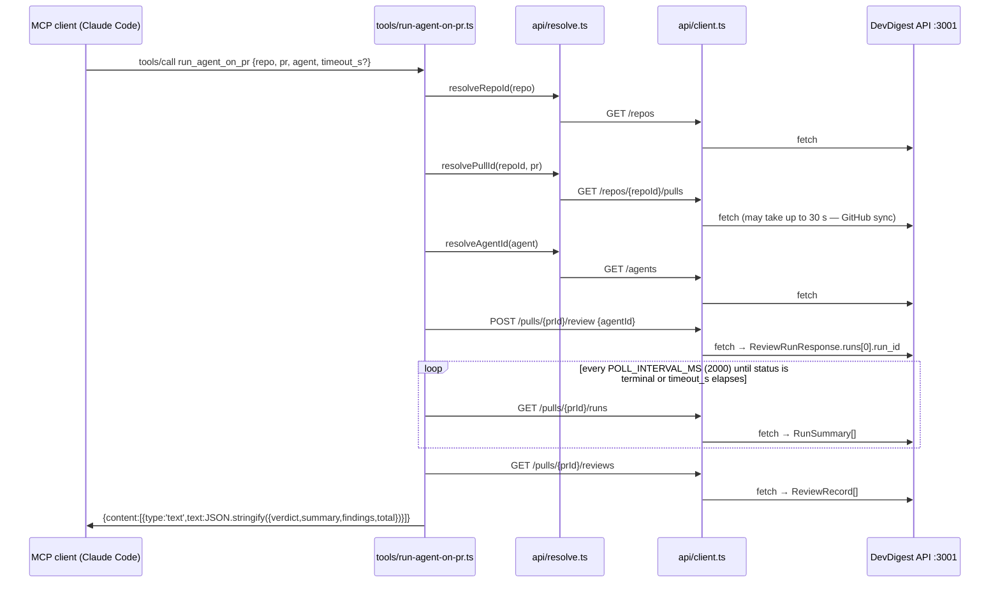

# Development Plan: `mcp/` — a local stdio MCP server for DevDigest

- **Date:** 2026-08-18
- **Author:** planner
- **Status:** **approved** 2026-08-18 — implementation may begin at S0

> **Revision note (2026-08-18).** This plan was first written against
> `@modelcontextprotocol/sdk@^1.30.0`. The human then ruled on all four open
> questions: **switch to SDK v2**, **commit `.mcp.json`**, **keep the array
> caps**, **keep `list_agents` returning skill names** — then separately
> required S6's contracts guard to cover the **`@devdigest/shared/*` subpath
> alias**, and finally **approved the five tool `description` strings
> verbatim** (S4). This file is the rewrite. §2b/§4/§5 describe v2 only;
> places where the v2 switch *invalidated* a 1.x assertion are marked
> **[was 1.x]** so a reader of the earlier draft can see what moved.

## 0. Context & scope

- **Task:** add a **fifth standalone package** `mcp/` (`@devdigest/mcp`, npm) —
  a local **stdio** MCP server that exposes five tools over the existing
  DevDigest REST API at `http://localhost:3001`, cheap enough at chat startup
  that `tools/list` + `instructions` cost ≤ 900 tokens.

- **Why v2, and what that costs.** The task's original premise — that
  `@modelcontextprotocol/server` was a beta that "would break during the
  course" — was false: v2.0.0 shipped **stable on 2026-07-27** (R1). With that
  reason gone the human chose the current line. The switch is not free, and
  the plan is built around its one real hazard: **v2 depends directly on
  `zod@^4.2.0`** (R1) while `server/` and `reviewer-core/` are on
  `zod@^3.24.1`. Because the contracts are consumed through a tsconfig alias,
  `tsc` would compile Zod-3-authored source inside a Zod-4 package. **S0
  settles that empirically before any other code is written**, and both
  outcomes are specified.

- **In scope** (everything under `mcp/`, plus four documentation edits and one
  new root file):
  - **S0 — the compatibility spike** that decides how `mcp/` names the API's
    DTO shapes (aliased contracts vs. local types).
  - The package skeleton: `mcp/package.json` (npm), `tsconfig.json`,
    `vitest.config.ts`.
  - A thin HTTP client + three resolvers (`owner/name` → repo id, PR number →
    pr id, agent name → agent id) — the API has **no** lookup by
    `owner/name` + number, verified in §2c.
  - Five tools: `list_agents`, `run_agent_on_pr`, `get_findings`,
    `get_conventions`, `get_blast_radius` (deliberate stub), with the
    human-approved `description` strings reproduced verbatim in S4.
  - Compact response formatting: finding trimming, `severity_min`,
    `detail: 'summary' | 'full'`, array caps with `{total, truncated}`.
  - Three mechanical guards: token budget, stdout purity, package purity.
  - Docs: `mcp/README.md`, `mcp/AGENTS.md`, the `CLAUDE.md → AGENTS.md`
    symlink, `mcp/INSIGHTS.md`, plus rows added to root `AGENTS.md`, root
    `README.md`, and `TESTING.md`.
  - **A committed `.mcp.json` at the repo root** so a student who clones the
    repo has the server pre-registered, with an empirical verification step.
  - CI workflow `.github/workflows/mcp.yml`.

- **Out of scope:**
  - **Any edit to `server/`, `client/`, `reviewer-core/`, `e2e/`.** No new
    route, no service change, no contract change. Proof: DoD item 5.
  - **Any edit to either `vendor/shared` copy**, and **no third vendored
    copy** — under either S0 branch. `./scripts/check-shared-sync.sh` stays a
    two-way check and is untouched.
  - **Bumping `server/` or `reviewer-core/` to Zod 4.** That is a separate,
    much larger change; S0's red branch exists precisely so this plan never
    needs it.
  - **Rewording the five tool `description` strings.** They are approved and
    budgeted; S4 requires a character-for-character copy.
  - **The 2026-07-28 "modern" protocol era.** v2's
    `LATEST_PROTOCOL_VERSION` is `'2025-11-25'` (R3); the 2026-07-28 era
    (`server/discover`, `_meta` envelopes, no `initialize`) is a separate
    opt-in documented in the SDK's `support-2026-07-28.md`. This server uses
    the default negotiation. **[was 1.x: the earlier draft claimed the SDK
    negotiates 2026-07-28 — it does not.]**
  - **A real blast-radius implementation.** `getBlastRadius` exists as a
    facade method but has no HTTP route (§2c, Data sources) — the tool is an
    honest stub, and wiring the route is a later lesson (L04).
  - **Any DB migration.** `mcp/` never touches Postgres.
  - **Auth.** The API resolves the default workspace via `LocalNoAuthProvider`
    on every request (`server/src/modules/_shared/context.ts:14-23`); the MCP
    server sends no credentials and needs none.
  - **SSE.** `run_agent_on_pr` polls (§2c, Call sequence).
  - Publishing to npm; a `dist/` build. Like `reviewer-core`, this package
    never emits JS — it runs from TypeScript source via `tsx`.

- **Definition of done:**
  1. `cd mcp && npm run typecheck` exits 0.
  2. `cd mcp && npm test` exits 0 and every test named in §4 is present and
     green.
  3. `./scripts/check-shared-sync.sh` prints `vendor/shared in sync` — because
     nothing changed there, not because a resync was run.
  4. `cd server && pnpm arch:check` and `pnpm arch:check:core` both still exit
     0 (neither config's `from.path` matches `mcp/` — see §2).
  5. `git status --porcelain -- server client reviewer-core e2e` is empty.
  6. `ls mcp/src/vendor` fails with "No such file or directory" — no third
     vendored copy of the contracts exists, under either S0 branch.
  7. `grep -rn 'console\.\(log\|info\|debug\|dir\|table\|trace\)' mcp/src`
     returns nothing.
  8. **The S0 branch is recorded in `mcp/AGENTS.md`** and the repo state
     matches it: branch A ⇒ `mcp/tsconfig.json` contains a
     `"@devdigest/shared"` paths entry and `mcp/src/api/types.ts` does not
     exist; branch B ⇒ the reverse.
  9. **The committed `.mcp.json` was verified to actually launch** (S7's
     restart check) — or, if it could not, the documented fallback is in place
     and `.mcp.json` is git-ignored instead.
  10. **The five `description` strings in the shipped code are byte-identical
      to S4's table** — asserted mechanically by S5.
  11. Every row of the §5 acceptance-criteria table is green.

## 1. Affected modules

| Module | Package manager | Layer / area | Constraint from INSIGHTS.md |
|---|---|---|---|
| `mcp/` (**new**) | **npm** (matches `reviewer-core/`, `e2e/`) | New package: MCP presentation over HTTP | No INSIGHTS.md yet — S7 creates the skeleton file |
| `.mcp.json` (**new**, repo root) | — | Client registration, committed | — |
| Root docs (`AGENTS.md`, `README.md`, `TESTING.md`) | — | Repo map / test map | Root `AGENTS.md:54-57`: edit `AGENTS.md`, **never** the `CLAUDE.md` symlink |
| `.github/workflows/mcp.yml` (**new**) | — | CI | `TESTING.md:94`: CI is path-filtered per package; cross-package source aliases go in the workflow's `paths:` |
| `server/` | pnpm | **unchanged** — read only, as an HTTP API and (branch A only) as the type source | `server/INSIGHTS.md`: `GET /repos/:id/pulls` measured **up to 30 s** (GitHub sync); `GET /pulls/:id/reviews` can **500** on out-of-enum `findings.category` from the seed. Both drive §2c and S2/S3. |
| `server/src/vendor/shared` | pnpm | **unchanged** — branch A reads it type-only via tsconfig `paths` (ring 0, see §2c); branch B does not touch it at all | Root `AGENTS.md:61-63`: both copies must stay byte-identical. Neither branch adds a copy. |
| `client/` | pnpm | **unchanged** — the MCP server is a sibling of the UI, not a consumer of it | — |
| `reviewer-core/` | npm | **unchanged** — no purity impact; it is only the *precedent* for the alias trick | `reviewer-core/AGENTS.md`: "The package never compiles to JS … consumers import the TypeScript source directly via a tsconfig path alias" |
| `e2e/` | npm | **unchanged** — no browser flow covers a stdio server | `e2e/AGENTS.md`: flows target read-only seeded data; a stdio process is not a browser flow |

## 2. Constraints

- **dependency-cruiser rules touched: none.** `server`'s `arch:check` runs
  `depcruise src --config .dependency-cruiser.cjs` **from `server/`**
  (`server/package.json` `scripts.arch:check`); `arch:check:core` targets
  `../reviewer-core/src`. **Neither ever walks `mcp/`.** Every `from.path` in
  `server/.dependency-cruiser.cjs` is anchored `^src/…`, and
  `reviewer-core/.dependency-cruiser.cjs` uses `(^|/)src/` but is only ever
  invoked against `../reviewer-core/src`. So the purity of `mcp/` is **not**
  machine-enforced by either config, and this plan does **not** pretend it is
  — S6 adds a package-local guard test instead (§2b, D6). Do not "extend" a
  server rule to cover `mcp/`: the server config's `tsConfig` points at
  `server/tsconfig.json`, which does not include `mcp/`.
- **The dependency-cruiser baseline is not touched.** No step runs
  `arch:baseline`. `server/.dependency-cruiser-known-violations.json` is at
  **0** (`server/INSIGHTS.md`, "What Doesn't Work") and stays there.
- **`vendor/shared` mirroring required: no.** No contract file changes.
- **DB migration required: no.**
- **`reviewer-core` purity affected: no.**
- **Zod major divergence is now real and intentional:** `mcp/` runs
  `zod@^4.2.0`, `server/` and `reviewer-core/` stay on `zod@^3.24.1`. This is
  forced — v2 depends directly on `zod@^4.2.0` (R1). S0 proves whether that
  divergence is compatible with the D1 alias; §6 carries the risk row.
- **Other constraints from root `AGENTS.md`:**
  - Not a monorepo workspace — `mcp/` gets its own `package.json` **and its own
    `package-lock.json`**.
  - ESM: relative imports carry the `.js` extension. `mcp/package.json` sets
    `"type": "module"`. (v2 ships dual ESM/CJS — R1 — so this is our choice,
    not a constraint the SDK imposes.)
  - Module docs are `AGENTS.md` with a `CLAUDE.md → AGENTS.md` **symlink** —
    S7 creates it with `ln -s AGENTS.md mcp/CLAUDE.md`, and never edits it.

## 2b. Decisions and rejected alternatives

| Decision | Alternative considered | Why rejected |
|---|---|---|
| **D1.** How `mcp/` names the API's DTO shapes is **decided empirically by S0**, and has exactly two outcomes. **Branch A (preferred):** `import type` only, through a tsconfig path alias `@devdigest/shared → ../server/src/vendor/shared/index.ts`, mirroring `reviewer-core/tsconfig.json:22-23`. **Branch B (fallback):** hand-written narrow local interfaces in `mcp/src/api/types.ts`, no alias at all. Note the alias block declares **two** entries — the bare specifier *and* `@devdigest/shared/*` — which is why S6's guard must match the subpath form too. | (a) A third vendored copy under `mcp/src/vendor/shared`. (b) A *value* import of the contract schemas and `Contract.parse(json)` on every response. (c) Bumping `server`/`reviewer-core` to Zod 4 so one alias works everywhere. | (a) `scripts/check-shared-sync.sh` diffs exactly two directories — a third copy is invisible to it and would silently drift. Refused under **both** branches. (b) A value import creates a **runtime** edge into `server/src`, and would make `mcp/` re-validate responses against `FindingCategory` — the exact enum that already 500s a real endpoint against seeded data (§2c, Data sources). It would also drag Zod-3 schema *values* into a Zod-4 runtime, which the SDK's own guide flags as a silent-failure class (R11). (c) A repo-wide Zod 3→4 migration is a far larger change than this feature and would put `server/`, `client/` and `reviewer-core/` in scope; §0 excludes it. |
| **D2.** Use **`@modelcontextprotocol/server@^2.0.0`** + `@modelcontextprotocol/client@^2.0.0` (dev-only), with **`zod@^4.2.0`**. **[was 1.x]** | `@modelcontextprotocol/sdk@^1.30.0`. | The original reason to avoid v2 ("beta, will break mid-course") is factually wrong — v2.0.0 is the stable line, published 2026-07-27 (R1). Staying on 1.x would put the course on a maintenance branch from day one. Three concrete consequences the steps must honour: the package split into `server`/`client`/`core` (R1); `inputSchema` now takes a **full `z.object({…})`**, with the raw-shape form explicitly `@deprecated` (R5); and **Zod 4.2.0 is a floor, not a preference** — see D12. |
| **D3.** `run_agent_on_pr` **polls `GET /pulls/:id/runs`**, it does not consume the SSE stream. | Subscribe to `GET /runs/:id/events` (SSE). | `POST /pulls/:id/review` is fire-and-forget — `ReviewService.runReview` ends with `return { runs, reviews: [] }` (`server/src/modules/reviews/service.ts:139`) after `void this.executor.executeRuns(...)` (`:135`). Polling needs no `EventSource` shim, no long-lived socket in a stdio child process, and no reconnect logic. Reinforced by v2: `SSEServerTransport` was removed from the main package and `WebSocketClientTransport` deleted outright (R11). |
| **D4.** `timeout_s` bounds **only the polling wait**. Each HTTP request gets its own `AbortSignal.timeout(REQUEST_TIMEOUT_MS = 60_000)`. | One overall deadline covering resolution + run. | `server/INSIGHTS.md` measures `GET /repos/:id/pulls` at **up to 30 s** (inline GitHub sync, plus up to 10 serial `getPullRequest` backfills). Folding that into `timeout_s` would make a 180 s budget silently mean "150 s of review", varying with GitHub's latency. |
| **D5.** `get_findings` with **no `agent` argument** returns the **newest review per agent**, unioned — not "the single newest review row". | `reviews[0]` (the newest row). | `server/INSIGHTS.md` documents this exact trap: a run fans out to one `reviews` row **per reviewer agent** created moments apart, so "newest" means "whichever agent's row got its timestamp last", and taking it silently drops every other agent's findings. |
| **D6.** Package purity is enforced by a **vitest source-scan test** (S6), not by a new dependency-cruiser config. | A `mcp/.dependency-cruiser.cjs` + an `arch:check:mcp` script. | A third cruiser config costs a devDependency and a third set of cwd-sensitive unanchored regexes — the exact class of silent-zero-match bug `server/INSIGHTS.md` records twice. The rules `mcp/` needs are three checks over ~15 files. Because a regex guard that matches nothing fails silently, S6 additionally **tests the guard itself against fixtures** (including the subpath case). |
| **D7.** `list_agents` issues **1 + N** requests (`GET /agents`, then `GET /agents/:id/skills` per agent) and returns skill **names**. **Ruled on and kept.** | Return `skill_count` from `GET /agents` alone (0 extra requests — the field already exists, `knowledge.ts:288`). | The tool's whole purpose is helping a model *pick the right agent*; names do that and a bare count does not. The extra requests are localhost-only and never reach the model's context — only names are serialized, so the cost is wire, not tokens. Rollback preserved in §6. |
| **D8.** Tool results are returned as **one `content[0].text` holding `JSON.stringify(payload)`**, never as prose or markdown. | Human-readable formatted text per tool. | `findings[].title` / `.suggestion` / `.rationale` and `conventions[].rule` are **LLM-generated text derived from third-party repository code** — a prompt-injection surface. Emitting them inside a JSON string under named data keys is the structural mitigation: the payload is unambiguously data, never instructions. Also keeps the token cost predictable. |
| **D9.** Run `mcp/` from TypeScript source via `tsx`, no build step. | `tsc` to `dist/` + a bundler. | Under branch A, `tsc` does not rewrite tsconfig `paths` in emitted JS, so a built `dist/` would need `tsc-alias` or esbuild. `reviewer-core/AGENTS.md` already establishes "the package never compiles to JS"; `server`'s own `dev` script is `tsx watch`. One less moving part, and it is what makes the committed `.mcp.json` (D11) a two-token command. |
| **D10.** Declare `capabilities: { tools: { listChanged: false } }` **explicitly**. **[was 1.x: the earlier draft accepted `listChanged: true` and parked this in §8 as unachievable — v2 makes it achievable and this is now a decision.]** | (a) Omit `capabilities` and accept the auto-declared `true`. (b) Drop to the low-level `Server`, whose capabilities are "advertised verbatim". | (a) `McpServer.setToolRequestHandlers()` computes `listChanged: this.server.getCapabilities().tools?.listChanged ?? true` (R10) — omission yields `true`, which is a **lie**: this server's tool set is static and it never sends `notifications/tools/list_changed`. (b) The low-level `Server` would achieve true omission but costs the entire `registerTool` ergonomics for ~5 tokens that appear in the `initialize` result, not in `tools/list`. Explicit `false` is accurate, cheap, and testable. |
| **D11.** **Commit `.mcp.json` at the repo root with relative paths.** **[was 1.x: the earlier draft git-ignored it — reversed by ruling.]** | Git-ignore it and document `claude mcp add` with absolute paths in `mcp/README.md`. | The course wants a student to clone and have the server already registered; an absolute path cannot be committed, so relative is the only committed form. Its one unverified premise — that the client launches the command from the repository root — is settled **empirically in S7**, not assumed, and the git-ignore form is retained verbatim as S7's red branch. |
| **D12.** Pin **`zod@^4.2.0`**, not `^4.0.0`. | `zod@^4.0.0`, matching the SDK's own floor loosely. | Not cosmetic. Under Zod 4.0–4.1 the SDK falls back to a conversion path that **drops `.describe()` field descriptions** and emits a one-time console warning (R5). Both are unacceptable here: `repo`'s `.describe('owner/name, …')` is the single most load-bearing description in the tool surface, and a stray console warning from a dependency is exactly the stdout hazard R9 forbids. S5 asserts the description actually survived, so a future loosening of this pin fails a test rather than silently degrading the tools. |
| **D13.** The caps `MAX_FINDINGS_SUMMARY = 50`, `MAX_FINDINGS_FULL = 20`, `MAX_CONVENTIONS = 100`, `MAX_AGENTS = 50` stay as **named exported constants** in `format.ts`. **Ruled on and kept.** | Deriving them from a measured token budget. | Accepted as *chosen*, not derived — no repo artifact or MCP document specifies them. Named exports mean one edit retunes them, and S3's tests assert the cap *mechanism* (filter → sort → cap, honest `total`/`truncated`) rather than the specific numbers, so a retune does not invalidate the suite. |
| **D14.** The five tool `description` strings are **fixed text, copied character-for-character** from S4's table, and are **English in a Ukrainian-language course repo**. | (a) Let the implementer write or paraphrase them. (b) Translate them to Ukrainian to match the course language. | (a) They are budgeted and deliberately worded — each carries *routing* (which tool to call next, what this tool does **not** do), not argument documentation. Paraphrasing silently changes both the routing and the token cost. S5 asserts them byte-for-byte. (b) The description is read by **the model, not the student**. Models follow English tool descriptions more reliably, and Cyrillic tokenizes worse: the same `get_findings` sentence is **106 characters in English against 174 in Ukrainian**, and the token gap is wider than the character gap. Translating would cost context on every chat startup for zero reader benefit. |
| **D15.** `get_blast_radius`'s description **describes the tool as if it worked**, and does not say "not implemented yet". | Add "not implemented yet" / "stub" to the description. | Chosen deliberately by the human, and it looks like an oversight unless the reasoning is recorded (which is why it appears here, in S4, **and** in `mcp/AGENTS.md`). The point is that the model **will** call it, receive the forward-leading `isError`, and act on the alternative it names — that is the live classroom demonstration of design principle 4, *errors lead forward*. A description saying "not implemented" would suppress the call entirely and turn the tool into dead context weight: ~30 tokens paid at every chat startup to teach nothing. |

**Research references** (external facts, verified 2026-08-18 against the npm
registry and the `modelcontextprotocol/typescript-sdk` source at commit
`cc4b41617ce3601b1290d67216ea0b194a3cd9ac`, the tag for all three of
`@modelcontextprotocol/{server,client,core}@2.0.0`):

- **R1 — packages and versions.** `@modelcontextprotocol/server@2.0.0`,
  published `2026-07-27`, `dependencies: { zod: "^4.2.0", "@modelcontextprotocol/core": "2.0.0" }`,
  `"type": "module"`, `engines.node: ">=20"`, exports `.` and `./stdio`
  (both dual ESM/CJS). `@modelcontextprotocol/client@2.0.0` — same publish
  timestamp, deps include `zod: "^4.2.0"` and `@modelcontextprotocol/core: "2.0.0"`.
  `@modelcontextprotocol/core@2.0.0` — `dependencies: { zod: "^4.2.0" }`.
  Both `server` and `client` pin `core` to the **exact** version `2.0.0`, not a
  caret range. `@modelcontextprotocol/core-internal` is private and
  unpublished; it is bundled into the published `dist/`.
- **R3 — protocol constants.** `packages/core/src/constants.ts`:
  `export const LATEST_PROTOCOL_VERSION = '2025-11-25';`
  `export const DEFAULT_NEGOTIATED_PROTOCOL_VERSION = '2025-03-26';`
  `packages/core-internal/src/shared/protocolEras.ts`:
  `export const FIRST_MODERN_PROTOCOL_VERSION = '2026-07-28';`, with the
  comment that the wire protocol *"splits into two eras: legacy (the
  2025-11-25 family and earlier; the version is negotiated via the
  `initialize` handshake) and modern (2026-07-28 and later; no `initialize`)"*.
  2026-07-28 is the spec's "current" revision, but it is **not** what the
  SDK's `LATEST_PROTOCOL_VERSION` holds.
- **R4 — server construction.** `packages/server/src/server/server.ts:75-91`:
  `export type ServerOptions = ProtocolOptions & { capabilities?: ServerCapabilities; /** Optional instructions describing how to use the server and its features. */ instructions?: string; … }`.
  `packages/server/src/server/mcp.ts:117-118`:
  `constructor(serverInfo: Implementation, options?: ServerOptions) { this.server = new Server(serverInfo, options); … }`.
  Unchanged from 1.x in name and position.
- **R5 — `registerTool`.** `packages/server/src/server/mcp.ts:953-1011`, primary
  (non-deprecated) overload:
  `registerTool<OutputArgs extends StandardSchemaWithJSON, InputArgs extends StandardSchemaWithJSON | undefined = undefined>(name: string, config: { title?: string; description?: string; inputSchema?: InputArgs; outputSchema?: OutputArgs; annotations?: ToolAnnotations; icons?: Icon[]; _meta?: Record<string, unknown> }, cb: ToolCallback<InputArgs>): RegisteredTool`.
  The raw-shape overload carries
  `/** @deprecated Wrap with z.object({...}) instead. */`.
  Migration guide, canonical form:
  `server.registerTool('greet', { description: 'Greet a user', inputSchema: z.object({ name: z.string() }) }, async ({ name }) => …)`.
  On Zod: *"**Zod v3 is no longer supported** … Zod **≥4.2.0** self-converts
  via `~standard.jsonSchema` — the supported path."* Zod 4.0–4.1 works through
  a fallback that drops `.describe()` text and logs a one-time warning.
  Standard Schema means ArkType/Valibot also work; Zod is not hard-required.
- **R6 — tool result shape.** `packages/core/src/schemas.ts:1401-1439`:
  `export const CallToolResultSchema = ResultSchema.extend({ content: z.array(ContentBlockSchema).default([]), structuredContent: z.unknown().optional(), isError: z.boolean().optional() });`
  Unchanged from 1.x.
- **R7 — import specifiers.**
  `packages/server/src/index.ts`: `export { McpServer, ResourceTemplate } from './server/mcp';`
  `packages/server/src/stdio.ts`: `export { serveStdio } from './server/serveStdio'; export { StdioServerTransport } from './server/stdio';`
  `packages/client/src/index.ts:71`: `export { Client } from './client/client';`
  `packages/client/src/stdio.ts`: `export { DEFAULT_INHERITED_ENV_VARS, getDefaultEnvironment, StdioClientTransport } from './client/stdio';`
  `InMemoryTransport.createLinkedPair(): [InMemoryTransport, InMemoryTransport]`
  lives in `core-internal` and is re-exported from **both** `server` and
  `client` root barrels — each bundling its own private copy, so the guide
  warns *"the halves of a linked pair must come from the **same package's**
  import — pick one package per file (per linked pair)."*
  `packages/client/src/client/client.ts:2501-2529`:
  `async listTools(params?, options?): Promise<ListToolsResult>`, which
  **returns `{ tools: [] }` rather than throwing when the server never
  advertised a `tools` capability** (unless `enforceStrictCapabilities`), and
  auto-aggregates all pages when called without a cursor.
- **R8 — annotations.** `packages/core/src/schemas.ts:1268-1320`:
  `ToolAnnotationsSchema = z.object({ title, readOnlyHint, destructiveHint, idempotentHint, openWorldHint })`,
  all optional, defaults `readOnlyHint: false`, `destructiveHint: true`,
  `idempotentHint: false`, `openWorldHint: true`; doc comment *"Clients should
  never make tool use decisions based on `ToolAnnotations` received from
  untrusted servers."* Spec 2026-07-28, `server/tools`: *"For trust & safety
  and security, clients **MUST** consider tool annotations to be untrusted
  unless they come from trusted servers."*
- **R9 — stdio purity.** Spec 2026-07-28, `basic/transports/stdio`:
  *"The server **MAY** write UTF-8 strings to `stderr` for any logging
  purposes including informational, debug, and error messages."* and
  *"The server **MUST NOT** write anything to its `stdout` that is not a valid
  MCP message."* Verbatim identical in substance to 2025-11-25.
- **R10 — capabilities.** `packages/server/src/server/mcp.ts:161-173`, inside
  `setToolRequestHandlers()`:
  `this.server.registerCapabilities({ tools: { listChanged: this.server.getCapabilities().tools?.listChanged ?? true } });`
  Migration guide: *"a declared `tools: {}` … is advertised with
  `listChanged: true` at construction … To advertise without the default, set
  `listChanged: false` explicitly; capabilities declared on the low-level
  `Server` are advertised verbatim."*
- **R11 — migration guide** (`docs/migration/upgrade-to-v2.md`, 1854 lines).
  Breaking changes touching this plan: import paths move from
  `@modelcontextprotocol/sdk/...` to package roots/subpaths (a codemod,
  `npx @modelcontextprotocol/codemod@latest v1-to-v2 .`, rewrites them);
  variadic `.tool()` / `.prompt()` / `.resource()` removed in favour of the
  `register*` + config-object form; **a tool with no `inputSchema` now
  receives `(ctx)` as its sole callback argument, not `(extra)`**; raw shapes
  deprecated; Zod 3 fails **silently at first `tools/list`**, not at
  registration; `SSEServerTransport` moved to `@modelcontextprotocol/server-legacy/sse`
  and `WebSocketClientTransport` removed.
- **R12 — Claude Code registration.** `code.claude.com/docs/en/mcp`:
  `claude mcp add [options] <name> -- <command> [args...]`, with *"`--env`
  accepts multiple `KEY=value` pairs. If the server name comes directly after
  `--env`, the CLI reads the name as another pair and rejects it, so place at
  least one other option between `--env` and the server name."* `.mcp.json`
  stdio entry shape:
  `{"mcpServers": {"<name>": {"type": "stdio", "command": …, "args": […], "env": {…}}}}`.
- **R13 — Inspector.** npm `@modelcontextprotocol/inspector` `latest = 2.2.0`
  (2026-08-12): `npx @modelcontextprotocol/inspector` (web UI), `--cli`,
  `--tui`.

**Explicitly not established by research** (kept out of every step, listed in
§8): whether `FIRST_MODERN_PROTOCOL_VERSION` is on the *public*
`@modelcontextprotocol/core` barrel; the contents of
`docs/migration/support-2026-07-28.md`; the export surface of
`@modelcontextprotocol/express` and `@modelcontextprotocol/node`. None are
needed by any step below.

## 2c. Architecture of the change

### Layers / ownership

`mcp/` is a **presentation adapter over HTTP**, structurally the mirror of
`client/`: it owns transport and formatting, and owns **no** business logic.
It may know URL paths and DTO shapes; it may not know Postgres, Drizzle, the
DI container, or `server/src/db`. The onion rings of `server/` are unaffected
— from `server`'s point of view `mcp/` is just another REST client.

**Why branch A's type-only import is architecturally sound, in the repo's own
ring vocabulary** (this is what `mcp/AGENTS.md` must teach, per S7):
`server/src/vendor/shared/contracts/*` is **ring 0 — Domain** in this repo's
onion map, alongside `vendor/shared/adapters.ts` and `reviewer-core/src/*`.
A new outer consumer importing ring 0 points strictly **inward**, which is the
one direction the dependency rule permits. What must never happen is an import
of anything further out:

| Target | Ring | Why `mcp/` must not import it |
|---|---|---|
| `server/src/vendor/shared/contracts/*` | **0 — Domain** | Allowed (type-only). Pure Zod contracts, no I/O. |
| `server/src/db/rows.ts` | **2**, but the sanctioned seam ring 1 may import | Persistence shapes. Naming a DB row from outside the server is exactly the coupling the seam exists to *contain*, not to export. |
| `server/src/modules/*/service.ts` | **1 — Application** | Orchestration with side effects; reachable only through HTTP from here. |
| `server/src/modules/*/repository.ts` | **2 — Infrastructure** | Drizzle queries. Importing it would put SQL in an MCP process. |
| `drizzle-orm`, `postgres`, `fastify`, `@fastify/*` | ring 2/3 machinery | `mcp/` is an HTTP client, not a server or a DB consumer. |

The `../server/src` regex in S6's guard exists to block rows 2–4 of that
table; the `@devdigest/shared` type-only rule governs row 1. Stating the ring
numbers is what makes the rule teachable rather than arbitrary.

Internal layering inside `mcp/src/`:

```
tools/*.ts   (tool handlers: validate → orchestrate → format → JSON)
   ↓
api/resolve.ts  (owner/name → id, number → id, agent name → id)
   ↓
api/client.ts   (fetch, timeouts, error envelope → typed errors)
```

`format.ts`, `errors.ts`, `log.ts`, `config.ts` (and, under branch B,
`api/types.ts`) are leaf modules with no imports from the layers above them.

### Unchanged

- **`server/`** — no route, service, repository, contract, or test is edited.
- **`client/`** — the studio UI already covers every one of these reads.
- **`reviewer-core/`** — untouched. Named only because
  `reviewer-core/tsconfig.json:22-23` is the precedent branch A copies.
- **`e2e/`** — untouched.
- **Both `vendor/shared` copies** — untouched, and no third copy is created
  under either branch.

### Data sources

Every read is a `GET` against `http://localhost:3001`. Exact endpoints, each
verified in this repo:

| Purpose | Endpoint | Verified at | Response type |
|---|---|---|---|
| Repo id from `owner/name` | `GET /repos` | `server/src/modules/repos/routes.ts:38` | `z.array(Repo)`; `Repo.full_name` at `contracts/platform.ts:145` |
| PR id from number | `GET /repos/:id/pulls` | `server/src/modules/pulls/routes.ts:29-36` | `z.array(PrMeta)`; `id` populated at `pulls/service.ts:227`, `number` at `:228` |
| Agent id from name | `GET /agents` | `server/src/modules/agents/routes.ts:89` | `Agent[]`; `contracts/knowledge.ts:272-296` |
| Agent's skills | `GET /agents/:id/skills` | `server/src/modules/agents/routes.ts:160` | `AgentSkillEditorRow[]`; `contracts/knowledge.ts:307-313` |
| Start a run | `POST /pulls/:id/review` body `{agentId}` | `server/src/modules/reviews/routes.ts:36` | `ReviewRunResponse` (`contracts/review-api.ts:52-56`) |
| Poll run status | `GET /pulls/:id/runs` | `server/src/modules/reviews/routes.ts:118` | `z.array(RunSummary)` (`contracts/trace.ts:98-120`) |
| Collect findings | `GET /pulls/:id/reviews` | `server/src/modules/reviews/routes.ts:162` | `z.array(ReviewRecord)` — **already embeds `findings: FindingRecord[]`** (`contracts/review-api.ts:36`) |
| Conventions | `GET /repos/:id/conventions` | `server/src/modules/conventions/routes.ts:27` | `ConventionsList` (`contracts/knowledge.ts:199-203`) |

**No lookup by `owner/name` + PR number exists.** Confirmed: `pulls/routes.ts`
exposes only `/repos/:id/pulls` and `/pulls/:id`, both keyed by internal uuid
(`IdParams`). Hence the three resolvers.

**The complete field set `mcp/` reads** — this is the exact scope of branch B's
`api/types.ts`, so it is enumerated here rather than left as "the few fields we
need". Ten shapes, 34 fields:

| Shape | Fields read |
|---|---|
| `Repo` | `id`, `full_name` |
| `PrMeta` | `id`, `number` |
| `Agent` | `id`, `name`, `model` |
| `AgentSkillEditorRow` | `skill.name`, `linked`, `enabled`, `order` |
| `ReviewRunResponse` | `runs[].run_id` |
| `RunSummary` | `run_id`, `status`, `error` |
| `ReviewRecord` | `run_id`, `agent_id`, `agent_name`, `verdict`, `summary`, `findings` |
| `FindingRecord` | `id`, `severity`, `category`, `title`, `file`, `start_line`, `end_line`, `rationale`, `suggestion` |
| `ConventionsList` | `candidates[].{rule, category, status}`, `scan.scanned_at` |
| `ApiErrorBody` | `error.code`, `error.message` |

**What is never sent to a model:** `finding.rationale` unless `detail: 'full'`;
`finding.confidence`, `.kind`, `.evidence`, `.trifecta_components`,
`.review_id`, `.accepted_at`, `.dismissed_at`; `convention.evidence_snippet`
and `.evidence_url` (verbatim third-party repo text — the largest injection
surface and the largest token cost); the whole `Skill.body` returned by
`GET /agents/:id/skills` (only `skill.name` is kept); `Agent.system_prompt`;
every `RunSummary` field except `status` and `error`; raw diffs, patches, and
API keys.

**Missing / unavailable sources, recorded not invented:**

- **The API is down.** `fetch` rejects → `ApiUnreachableError` → every tool
  returns `isError: true` with
  `"Cannot reach the DevDigest API at <url>. Start it with ./scripts/dev.sh, then retry."`
  Checked on the **first tool call**, never at construction.
- **`GET /pulls/:id/reviews` returns 500.** A documented, reproducible failure:
  `server/INSIGHTS.md` records that `findings.category` is an unconstrained
  `text` column, `db/seed.ts:524,550,563,576` writes `coverage` / `flaky` /
  `over-mocking`, and the route's `FindingCategory` enum rejects them at
  **response serialization**, permanently 500ing that endpoint for the
  affected PR. `mcp/` surfaces this as a forward-leading `isError` naming the
  PR and the likely cause — and never re-validates the category itself (D1).
- **`getBlastRadius` has no HTTP route.** The facade method exists
  (`server/src/modules/repo-intel/service.ts:214`, declared on the `RepoIntel`
  interface at `types.ts:147`, returning `BlastResult`), but
  `server/src/modules/repo-intel/routes.ts` exposes only
  `GET /repos/:id/index-state` and `POST /repos/:id/resync`. Hence the stub.
  The pointer to `service.ts:214` lives in `mcp/AGENTS.md` and a source
  comment, **not** in the user-facing error text.

**Nullable fields — explicit behaviour when `null`:**

| Field | Contract | `mcp/` behaviour |
|---|---|---|
| `ReviewRecord.verdict` | `Verdict.nullable()` (`review-api.ts:30`) | Passed through as JSON `null`. Never substituted, never derived from findings. |
| `ReviewRecord.summary` | `z.string().nullable()` (`:31`) | Passed through as `null`. |
| `ReviewRecord.agent_name` | `z.string().nullish()` (`:28`) | Falls back to `agent_id`; if that is `null` too, the key is omitted. |
| `ReviewRecord.run_id` | `z.string().nullable()` (`:27`) | A review with `run_id: null` can never match a `run_agent_on_pr` correlation and is skipped there; still counted by `get_findings`. |
| `RunSummary.status` | `z.string().nullable()` (`trace.ts:104`) | Treated as "still running" — polling continues until `timeout_s`. |
| `RunSummary.error` | `z.string().nullable()` (`:105`) | On `status: 'failed'` with `error: null`, the message reads `"run failed without a recorded error"`. |
| `PrMeta.id` | `z.string().nullish()` (`platform.ts:158`) | A row with `id == null` is skipped by the PR resolver — it cannot address any downstream endpoint. |
| `ConventionsList.scan` | `ConventionScan.nullable()` (`knowledge.ts:201`) | `scanned_at` key omitted when `scan` is `null`. |
| `ConventionCandidate.category` | `z.string().nullable()` (`:181`) | Key omitted when `null`. |
| `Finding.suggestion` | `z.string().nullish()` (`findings.ts:56`) | Key omitted when `null`/absent/empty. |

### Call sequence

**`mcp/` makes zero LLM calls of its own.** The only model spend it can cause
is the **one review run per invoked agent** that `POST /pulls/:id/review`
starts on the server, executed by `run-executor.ts` using the agent's own
provider/model. `mcp/` never chooses a model and never adds a token or cost
field to any response.

`run_agent_on_pr` — the only non-read tool:



The inner function that performs the wait is
**`pollRunUntilTerminal(api, prId, runId, timeoutMs, log)`** in
`mcp/src/tools/run-agent-on-pr.ts`. `timeout_s` is threaded into it as the
named `timeoutMs` parameter (`timeout_s * 1000`); it is **not** read from
module scope and **not** conflated with `api/client.ts`'s per-request
`REQUEST_TIMEOUT_MS`. Terminal statuses are exactly `done`, `failed`,
`cancelled` — verified against the writers: `repository/run.repo.ts:104`
(`'cancelled'`), `:115` (`'failed'`), `:142` (`'running'` at creation), `:153`
(the update signature `status: 'done' | 'failed' | 'cancelled'`), and
`run-executor.ts:363` (`status: 'done'`).

**No network in the constructor.** `createMcpServer()` builds the tool registry
and returns; `index.ts` then calls
`await server.connect(new StdioServerTransport())`. The first `fetch` happens
inside a tool handler. Declaring `capabilities.tools` up front (D10) makes
`McpServer` install its tool request handlers eagerly in the constructor
(R10) — handler wiring, not I/O, so this still holds.

`get_findings`: resolve repo → resolve pr → optional resolve agent →
`GET /pulls/{prId}/reviews` → select → filter → sort → cap → JSON.

`list_agents`: `GET /agents` → `Promise.all(agents.map(a => GET /agents/{a.id}/skills))`
→ per agent, keep rows where `row.linked === true && row.enabled === true`,
sort by `row.order` ascending, map to `row.skill.name`. Semantics verified in
`server/src/modules/agents/helpers.ts:96-124` (`buildEditorRows`): linked rows
carry `enabled: link.enabled` and the real `order`; unlinked rows are always
`{linked: false, enabled: false, order: -1}`.

`get_conventions`: resolve repo → `GET /repos/{repoId}/conventions` → drop
`status === 'rejected'` → trim → cap → JSON.

`get_blast_radius`: **no network at all.** Validate args, return `isError`.

### Schema

**Unchanged.** No table is added, altered, or read. `mcp/` has no database
connection, no `drizzle-orm` dependency, and no `DATABASE_URL`. Forbidden by
this plan: any edit under `server/src/db/`, including
`server/src/db/migrations/`.

### API

**Unchanged — no route is added, and no module's `routes.ts` is edited.**
Status codes `mcp/` must handle from the `ApiErrorBody` envelope
(`contracts/platform.ts:276-281`, produced by `server/src/app.ts:116-164`):

| Status | Meaning here | Tool behaviour |
|---|---|---|
| `404` | `NotFoundError` — repo/PR/agent id not found | Should be unreachable after resolution; if it happens, `isError` naming the resolved id and telling the model to re-resolve |
| `422` | `validation_error` | `isError` echoing `error.message`; indicates an `mcp/` bug, so the text says so |
| `429` | Rate limit — global `120/min` (`app.ts:96`), and **`10/min` on `POST /pulls/:id/review`** (`reviews/routes.ts:40`) | `isError`: `"DevDigest rate-limited this request (max 10 review runs per minute). Wait a minute and retry."` |
| `500` | `internal_error` | `isError` with `error.message`; on `GET /pulls/:id/reviews` specifically, append the known-cause hint (see Data sources) |
| network reject | API down | `ApiUnreachableError` → the `./scripts/dev.sh` message |

### Prompt builder

**Unchanged.** `mcp/` does not import `reviewer-core`, does not call
`assemblePrompt`, adds no `PromptParts` slot, and does not touch
`wrapUntrusted` / `INJECTION_GUARD`. Prompt assembly stays entirely inside
`server/src/modules/reviews/run-executor.ts` + `reviewer-core`.

The trust boundary that *is* in scope is the **outbound** one, handled
structurally by D8: every tool result is a JSON string under named data keys,
so LLM-generated, repo-derived text (`title`, `suggestion`, `rationale`,
`rule`) is returned as data and never as formatted instructions.

### UI

**Unchanged.** No screen, no component, no query key. `client/` is not edited.
The MCP server's "UI" is the MCP client (Claude Code); its surface is the tool
list, which S4 defines and S5 measures.

### Logging / observability

Two channels, and they are different from the server's two:

1. **`stderr`** — the only channel `mcp/` may write to. Spec (R9): *"The server
   **MAY** write UTF-8 strings to `stderr` for any logging purposes"* /
   *"The server **MUST NOT** write anything to its `stdout` that is not a valid
   MCP message."* `mcp/src/log.ts` exports exactly:
   - `logInfo(msg: string, data?: Record<string, unknown>): void`
   - `logError(msg: string, data?: Record<string, unknown>): void`

   Both write one line of `JSON.stringify({ level, msg, ...data })` via
   `process.stderr.write(line + '\n')`. **`stdout` is never written by
   application code** — it belongs to `StdioServerTransport`. D12's Zod pin is
   part of the same guarantee: it keeps a dependency from logging a warning.

2. **The MCP client's own view** — `isError` results and `content[0].text`.
   That is the only thing the model sees. It is not a log.

**`mcp/` writes nothing to the server's channels.** `RunLogger` and the
persisted `run_traces.log` / `trace.tool_calls` are produced by the server's
run executor when `POST /pulls/:id/review` fires; `mcp/` neither calls them nor
receives them, and must not attempt to inject a "tool call" record — there is
no API for that.

**Must never appear in a log line:** any response body, `finding.rationale` or
`.suggestion`, `Skill.body`, `convention.evidence_snippet`, or any secret
(there are none — this server sends no credentials). Log lines carry only:
tool name, resolved ids, HTTP status, elapsed ms, poll count.

**Token / cost fields:** none. `RunSummary.tokens_in` / `.tokens_out` /
`.cost_usd` exist on the polled rows (`contracts/trace.ts:107-110`) and are
deliberately **not** surfaced — per-run server accounting, not part of any
tool's contract.

## 3. Skill routing

| Step | Files | Skills the implementer must apply |
|---|---|---|
| S0 | `mcp/package.json`, `mcp/tsconfig.json`, `mcp/src/api/types.ts` (branch B only) | `typescript-expert` (tsconfig `paths`, module resolution); `zod` (reading Zod 3 vs 4 inference differences in the diagnostics) |
| S1 | `mcp/package.json`, `mcp/tsconfig.json`, `mcp/vitest.config.ts`, `mcp/src/config.ts`, `mcp/src/log.ts` | `typescript-expert` |
| S2 | `mcp/src/api/client.ts`, `mcp/src/api/resolve.ts`, `mcp/src/errors.ts`, `mcp/test/resolve.test.ts` | `typescript-expert`; **`security`** (URL-path interpolation via `encodeURIComponent`, request timeouts, no credentials) |
| S3 | `mcp/src/format.ts`, `mcp/test/format.test.ts` | `typescript-expert` |
| S4 | `mcp/src/server.ts`, `mcp/src/tools/*.ts`, `mcp/src/index.ts`, `mcp/test/tools.test.ts` | `zod` (**Zod 4** `z.object()` tool schemas, `.describe()` discipline); `typescript-expert`; **`security`** (tool results as data not instructions, annotations are untrusted hints) |
| S5 | `mcp/test/token-budget.test.ts` | `typescript-expert` |
| S6 | `mcp/test/guards.test.ts`, `mcp/test/stdio-smoke.test.ts` | `typescript-expert`; `onion-architecture` (the ring table in §2c is the rationale the guard encodes — §2 records that neither cruiser config covers `mcp/`) |
| S7 | `mcp/README.md`, `mcp/AGENTS.md`, `mcp/CLAUDE.md` (symlink), `mcp/INSIGHTS.md`, `.mcp.json`, `AGENTS.md`, `README.md`, `TESTING.md` | none (documentation + config) |
| S8 | `.github/workflows/mcp.yml` | none (CI config) |

Skills **named but not loaded by the planner**: `zod`, `security`,
`typescript-expert`, `onion-architecture` (preloaded). Confirmed current
against `.claude/skills/*/SKILL.md`, which holds exactly:
`drizzle-orm-patterns`, `engineering-insights`, `fastify-best-practices`,
`frontend-architecture`, `mermaid-diagram`, `next-best-practices`,
`onion-architecture`, `postgresql-table-design`, `pr-self-review`,
`react-best-practices`, `react-testing-library`, `security`,
`typescript-expert`, `zod`. **No MCP-specific skill exists.**

Note for S2/S4: the `security` skill here is written for a different stack
(React + Express + Mongo + JWT). Apply its *principles* (validate at the
boundary, never interpolate unescaped input into a URL, treat third-party text
as data); treat its code examples as illustrative, not as this project's
fixtures.

## 4. Steps

### S0. Decide the DTO-typing strategy empirically (Zod 4 vs the Zod 3 contracts)

This step exists because v2 forces `zod@^4.2.0` into `mcp/` (R1) while the
contracts at `server/src/vendor/shared` were authored for `zod@^3.24.1`.
Branch A's alias makes `tsc` compile those Zod-3 files inside a Zod-4 package.
**Do not guess the outcome — measure it.**

- **Files:**
  - `mcp/package.json` (new — minimal, extended by S1)
  - `mcp/tsconfig.json` (new — the `paths` block is what this step decides)
  - `mcp/src/api/types.ts` (new, **branch B only**)
  - `mcp/src/spike.ts` (new, temporary — deleted before the step ends)

- **Change:**
  1. Create `mcp/package.json` with `"name": "@devdigest/mcp"`,
     `"private": true`, `"type": "module"`, a `typecheck` script
     (`tsc --noEmit -p tsconfig.json`), and dependencies
     `"@modelcontextprotocol/server": "^2.0.0"`, `"zod": "^4.2.0"`,
     devDependencies `"typescript": "^5.7.2"`, `"@types/node": "^22.10.0"`.
     Run `npm install`.
  2. Create `mcp/tsconfig.json` by copying `reviewer-core/tsconfig.json`,
     changing `include` to `["src/**/*.ts", "test/**/*.ts"]`, and keeping its
     `paths` block **verbatim** — note it declares **two** `@devdigest/shared`
     entries, the bare specifier and the subpath wildcard:
     ```json
     "paths": {
       "@devdigest/shared": ["../server/src/vendor/shared/index.ts"],
       "@devdigest/shared/*": ["../server/src/vendor/shared/*"],
       "zod": ["./node_modules/zod"],
       "zod/*": ["./node_modules/zod/*"]
     }
     ```
  3. Create `mcp/src/spike.ts` containing **type-only** imports of every shape
     §2c's field table lists:
     ```ts
     import type { Repo, PrMeta, Agent, AgentSkillEditorRow, ReviewRunResponse,
       RunSummary, ReviewRecord, FindingRecord, ConventionsList, ApiErrorBody }
       from '@devdigest/shared';
     export type _Probe = [Repo, PrMeta, Agent, AgentSkillEditorRow,
       ReviewRunResponse, RunSummary, ReviewRecord, FindingRecord,
       ConventionsList, ApiErrorBody];
     ```
  4. Run `cd mcp && npm run typecheck` and branch on the exit code.

  **Branch A — typecheck exits 0.** Keep the `paths` block exactly as written
  (both `@devdigest/shared` entries). Delete `mcp/src/spike.ts`. Do **not**
  create `mcp/src/api/types.ts`. Every later step's
  `import type { … } from '@devdigest/shared'` is valid as written.

  **Branch B — typecheck fails.** Do not attempt to patch the contracts (out
  of scope, and `check-shared-sync.sh` would force a matching client edit).
  Instead:
  - Remove **both** the `"@devdigest/shared"` and `"@devdigest/shared/*"`
    entries from `mcp/tsconfig.json`, keeping the two `zod` entries.
  - Delete `mcp/src/spike.ts`.
  - Create `mcp/src/api/types.ts` declaring plain TypeScript `interface`s for
    the **ten shapes and 34 fields enumerated in §2c (Data sources)** — no
    Zod, no runtime code, structurally minimal (a field the table does not
    list is not declared). Head the file with a comment naming this plan and
    the contract file each interface mirrors, so drift is traceable by hand.
  - Every later step reads `import type { … } from '../api/types.js'` instead
    of `from '@devdigest/shared'`.

  **The three lines most likely to force branch B**, so the implementer reads
  the diagnostics instead of being surprised — each verified present in the
  contracts today:
  1. **`contracts/platform.ts:94` —
     `feature_models: z.record(FeatureModelId, FeatureModelChoice).default({})`,
     where `FeatureModelId` is a five-value `z.enum` (`platform.ts:14-20`).**
     The strongest candidate. Zod 4 made `z.record(enum, value)` *exhaustive*
     (`z.partialRecord` is the new opt-in for Zod 3's partial behaviour), so
     the inferred type becomes a `Record` requiring all five keys — and
     `.default({})` supplies an empty object, which such a type does not
     accept.
  2. **`contracts/platform.ts:99` — `SettingsKnown.passthrough()`.**
     Deprecated in Zod 4 in favour of `z.looseObject()` / `.loose()`;
     deprecated is not removed, so this most likely compiles with a hint.
  3. **`contracts/platform.ts:136` — `url: z.string().url()`.** Deprecated in
     Zod 4 in favour of `z.url()`; same expectation.

  Verified **absent** from the contracts, so *not* candidates: single-argument
  `z.record` (all three call sites — `platform.ts:94`,
  `observability.ts:132`, `observability.ts:169` — pass two arguments),
  `z.function`, `z.nativeEnum`, `errorMap` / `required_error` /
  `invalid_type_error`, `.deepPartial`, `.superRefine`, `.catchall`,
  `z.intersection`, `.brand`, `z.promise`, `z.preprocess`.

- **Skills:** `typescript-expert`, `zod`
- **Test:** `cd mcp && npm run typecheck` **is** the test — its exit code
  selects the branch. Record the exit code and, on failure, the full
  diagnostic text in the step's completion note; S7 copies the conclusion into
  `mcp/AGENTS.md`.
- **Definition of done:** `cd mcp && npm run typecheck` exits 0;
  `mcp/src/spike.ts` no longer exists; and **exactly one** of these holds:
  (A) `grep -q '@devdigest/shared' mcp/tsconfig.json` succeeds **and**
  `mcp/src/api/types.ts` does not exist, or (B) the reverse.
- **Depends on:** none
- **Track:** A

### S1. Complete the package skeleton, config, and stderr logger

- **Files:**
  - `mcp/package.json` (extends S0's)
  - `mcp/vitest.config.ts` (new)
  - `mcp/src/config.ts` (new)
  - `mcp/src/log.ts` (new)
  - `mcp/test/config.test.ts` (new)
  - `mcp/package-lock.json` (regenerated by `npm install`, committed)

- **Change:**
  - `package.json` — add the remaining scripts (these exact names are used by
    §5 and by `.github/workflows/mcp.yml`):
    ```
    "typecheck": "tsc --noEmit -p tsconfig.json",
    "test": "vitest run",
    "start": "tsx src/index.ts"
    ```
    Final dependencies: `"@modelcontextprotocol/server": "^2.0.0"`,
    `"zod": "^4.2.0"` (the `^4.2` floor is load-bearing — D12).
    Final devDependencies: `"@modelcontextprotocol/client": "^2.0.0"` (test
    only — S4/S5/S6 drive the server through a real MCP client),
    `"@types/node": "^22.10.0"`, `"js-tiktoken": "^1.0.21"`,
    `"tsx": "^4.19.2"`, `"typescript": "^5.7.2"`, `"vitest": "^2.1.8"`.
    Versions other than the two MCP packages and `zod` are copied from
    `reviewer-core/package.json` / `server`'s existing `js-tiktoken` pin.
    The SDK's `engines.node: ">=20"` (R1) is satisfied — this repo requires
    Node ≥22.
  - `vitest.config.ts`: copy `reviewer-core/vitest.config.ts`, change
    `include` to `['test/**/*.test.ts']`. **Under branch A** keep its
    `resolve.alias` mapping `@devdigest/shared` →
    `../server/src/vendor/shared`; **under branch B** delete that alias block
    entirely (nothing resolves that specifier any more).
  - `src/config.ts`:
    `export function loadConfig(env: NodeJS.ProcessEnv = process.env): { apiUrl: string }`
    returning `{ apiUrl: (env.DEVDIGEST_API_URL ?? 'http://localhost:3001').replace(/\/+$/, '') }`.
    The trailing-slash strip matters because every path is concatenated
    (`${apiUrl}/repos`), and `http://localhost:3001/` would produce `//repos`.
    No other env var is read. Nothing throws — a bad URL surfaces as
    `ApiUnreachableError` on first use, not as a boot crash.
  - `src/log.ts`: the two functions with the exact signatures in §2c
    (Logging), writing to `process.stderr` only.

- **Skills:** `typescript-expert`
- **Test:** `mcp/test/config.test.ts` —
  - `'loadConfig defaults to http://localhost:3001'`
  - `'loadConfig strips a trailing slash from DEVDIGEST_API_URL'` (input
    `'http://localhost:3001/'` → `'http://localhost:3001'`) — the trap case:
    without the strip, every subsequent URL is malformed.
  - `'logInfo writes one JSON line to stderr and nothing to stdout'` — spy on
    `process.stderr.write` and `process.stdout.write`, assert the latter is
    never called.
- **Definition of done:** `cd mcp && npm install && npm run typecheck && npm test`
  all exit 0. `mcp/package-lock.json` exists and pins
  `@modelcontextprotocol/server` at a `2.x` version.
- **Depends on:** S0
- **Track:** A

### S2. HTTP client, typed errors, and the three resolvers

- **Files:**
  - `mcp/src/errors.ts` (new)
  - `mcp/src/api/client.ts` (new)
  - `mcp/src/api/resolve.ts` (new)
  - `mcp/test/resolve.test.ts` (new)

- **Change:**
  - `errors.ts`: `export class ToolError extends Error` carrying the exact
    forward-leading text; plus
    `export class ApiUnreachableError extends ToolError` and
    `export class ApiStatusError extends ToolError { readonly status: number }`.
    Every message names the next tool to call or the next command to run.
  - `api/client.ts`: `export class DevDigestApi` with
    - `constructor(apiUrl: string)` — **stores the string, performs no I/O.**
    - `async get<T>(path: string): Promise<T>`
    - `async post<T>(path: string, body: unknown): Promise<T>`

    Both call `fetch(`${this.apiUrl}${path}`, { signal: AbortSignal.timeout(REQUEST_TIMEOUT_MS), … })`
    with `REQUEST_TIMEOUT_MS = 60_000` exported as a named constant.
    A `fetch` rejection (including `TimeoutError`) becomes
    `ApiUnreachableError`:
    `Cannot reach the DevDigest API at <apiUrl>. Start it with ./scripts/dev.sh, then retry.`
    A non-`ok` response is parsed for the `ApiErrorBody` envelope
    (`{error:{code,message,details}}`) and becomes `ApiStatusError`, mapped per
    the §2c API table (including the `429` review-rate-limit text and the
    `500`-on-`/reviews` hint). **Responses are not Zod-parsed** (D1): the
    return is cast to the type-only DTO type — from `@devdigest/shared`
    (branch A) or `../api/types.js` (branch B).
  - `api/resolve.ts` — three functions, each taking the api instance first:
    - `export async function resolveRepoId(api: DevDigestApi, repo: string): Promise<{ repoId: string; fullName: string }>`
      — `GET /repos`, match `r.full_name.toLowerCase() === repo.trim().toLowerCase()`.
      Not found → `ToolError`:
      `Repo "<repo>" is not imported into DevDigest. Imported repos: <a, b, c>. Add it in the studio at http://localhost:3000 first.`
      (list capped at 20). Zero repos → `… No repos are imported yet. …`
    - `export async function resolvePullId(api: DevDigestApi, repoId: string, pr: number): Promise<string>`
      — `GET /repos/${encodeURIComponent(repoId)}/pulls`, match
      `p.number === pr && p.id != null` (the `id != null` guard is required:
      `PrMeta.id` is `z.string().nullish()`). Not found → `ToolError`:
      `PR #<pr> was not found in <repo>. Known PR numbers: <…>.` (capped at 20).
    - `export async function resolveAgentId(api: DevDigestApi, agent: string): Promise<{ agentId: string; name: string }>`
      — `GET /agents`, match `a.id === agent` exactly **or**
      `a.name.toLowerCase() === agent.trim().toLowerCase()`. Not found →
      `ToolError`: `Agent "<agent>" not found. Call list_agents to see the available agents.`

      **An id match wins outright. A name match must collect ALL matches and
      fail when there is more than one** — never `[0]`. `agents.name` has
      **no unique constraint** (`server/src/db/schema/agents.ts:13` is a bare
      `text('name').notNull()`, no unique index in the file) and the create
      path does not check for one: `POST /agents`
      (`modules/agents/routes.ts:101`) → `AgentService.create`
      (`service.ts:90`) → `AgentRepository.insert` (`repository.ts:87`) is a
      plain INSERT. Two agents named `Security Reviewer` in one workspace is
      a legal, UI-reachable state. First-match-wins would start a **paid LLM
      run against the wrong reviewer and report success** — a silent wrong
      answer, which is exactly what design principle 4 exists to prevent.
      Ambiguous name → `ToolError`:
      `Two agents are named "<agent>". Pass the id instead: <id1>, <id2>.`
      (ids listed in the order `GET /agents` returned them, capped at 10).
      Recorded in `server/INSIGHTS.md` under Codebase Patterns (2026-08-18).

      A **disabled** agent still resolves and still runs — verified:
      `ReviewService.resolveTargets` uses `this.agents.getById(...)` with no
      `enabled` check (`server/src/modules/reviews/service.ts:53-57`); only
      the `all: true` branch filters to `listEnabled`, and `mcp/` never sends
      `all: true`.

    **Every interpolated path segment goes through `encodeURIComponent`** —
    `repoId`, `prId`, `agentId`, `runId`.

- **Skills:** `typescript-expert`, `security`
- **Test:** `mcp/test/resolve.test.ts`, against a stubbed `globalThis.fetch`
  (`vi.stubGlobal('fetch', …)`), no network:
  - `'resolveRepoId matches full_name case-insensitively'`
  - `'resolveRepoId lists the imported repos when the name is unknown'` —
    asserts the message contains the literal `Add it in the studio`.
  - `'resolvePullId skips a PrMeta row whose id is null'` — **the null trap**:
    a fixture with `{number: 482, id: null}` plus `{number: 7, id: 'uuid'}`;
    asking for 482 must throw, not return `undefined` as an id.
  - `'resolveAgentId accepts either the agent uuid or its name'`
  - `'resolveAgentId error text tells the model to call list_agents'`
  - `'resolveAgentId fails with both ids when two agents share a name'` —
    **the silent-wrong-answer trap**: a fixture of two agents both named
    `Security Reviewer` with different ids must throw, and the message must
    contain both ids. Taking `[0]` would pass every other test in this file
    while running the wrong agent in production.
  - `'resolveAgentId prefers an exact id match over a same-named agent'` —
    fixture where one agent's `id` equals the argument and another agent's
    `name` also matches it; the id match must win and must not be reported
    as ambiguous.
  - `'get() turns a fetch rejection into the ./scripts/dev.sh message'`
  - `'get() maps a 429 on POST /pulls/:id/review to the rate-limit message'`
  - `'get() percent-encodes the id in the path'` — pass an id containing
    `../` and assert the outgoing URL contains `%2F` and no `..` segment.
  - `'no request carries an Authorization or Cookie header'`
- **Definition of done:** `cd mcp && npm test` green; every resolver error
  message contains a concrete next action, asserted above.
- **Depends on:** S1
- **Track:** A

### S3. Response formatting — trimming, filtering, capping

- **Files:**
  - `mcp/src/format.ts` (new)
  - `mcp/test/format.test.ts` (new)

- **Change:** `format.ts` exports, with these exact signatures:
  - `export const SEVERITY_RANK: Record<Severity, number>` —
    `{CRITICAL: 0, WARNING: 1, SUGGESTION: 2}`, matching
    `Severity = z.enum(['CRITICAL','WARNING','SUGGESTION'])`
    (`contracts/findings.ts:11`).
  - `export const MAX_FINDINGS_SUMMARY = 50` / `MAX_FINDINGS_FULL = 20` /
    `MAX_CONVENTIONS = 100` / `MAX_AGENTS = 50` (D13 — chosen, not derived;
    named so one edit retunes them).
  - `export function trimFinding(f: FindingRecord, detail: 'summary' | 'full'): TrimmedFinding`
    → `{severity, category, title, file, lines}`, plus `suggestion` **only**
    when it is a non-empty string, plus `rationale` and `id` **only** when
    `detail === 'full'`. `lines` is `String(start_line)` when
    `start_line === end_line`, otherwise `` `${start_line}-${end_line}` ``.
    `category` is passed through as the **raw string** — never re-validated
    against `FindingCategory` (§2c, Data sources).
  - `export function selectFindings(findings: FindingRecord[], opts: { severityMin?: Severity; detail: 'summary' | 'full' }): { findings: TrimmedFinding[]; total: number; truncated: boolean }`

    **The order is fixed and load-bearing: filter → sort → cap.**
    1. Filter: keep `SEVERITY_RANK[f.severity] <= SEVERITY_RANK[severityMin]`
       when `severityMin` is given.
    2. Sort: severity rank ascending, then `file` ascending, then
       `start_line` ascending.
    3. Cap at `MAX_FINDINGS_SUMMARY` / `MAX_FINDINGS_FULL` by `detail`.

    `total` is the **post-filter, pre-cap** count. `truncated` is `true` only
    when the cap actually dropped something.
  - `export function jsonContent(payload: unknown): { content: [{ type: 'text'; text: string }] }`
    — the single place `JSON.stringify` is called for a success result (D8).
  - `export function errorContent(text: string): { content: [{ type: 'text'; text: string }]; isError: true }`
    — the single place `isError: true` is produced (R6).

  **Downstream consumers of the transform, all switched to the post-filter
  list:** `total` (post-filter), `truncated`, the serialized `findings` array.
  **`verdict` and `summary` are explicitly NOT consumers** — they are passed
  through verbatim from the `ReviewRecord` and never recomputed from the
  surviving findings. This is the bug this step exists to prevent: filtering
  to `severity_min: 'CRITICAL'` on a review with zero criticals must still
  report the review's real `verdict: 'request_changes'`.

- **Skills:** `typescript-expert`
- **Test:** `mcp/test/format.test.ts` —
  - `'filter runs before the cap so criticals are never dropped'` — **the
    one-example-two-rules case**: 3 CRITICAL + 60 WARNING + 10 SUGGESTION with
    `severityMin: 'WARNING'` must yield exactly 50 findings, `total: 63`,
    `truncated: true`, and **all 3 CRITICAL present**. Capping first would
    return 50 of the unsorted 73 and could drop a critical.
  - `'severity_min: CRITICAL keeps the review verdict untouched'` — 0
    surviving findings, `verdict` still `'request_changes'`.
  - `'suggestion is omitted when null and rationale only under detail: full'`
  - `'lines collapses to a single number when start_line === end_line'`
  - `'an out-of-enum category string passes through unchanged'` — fixture
    `category: 'coverage'` (the value `db/seed.ts` really writes) must survive
    trimming rather than throw.
  - `'truncated is absent when nothing was dropped'`
- **Definition of done:** `cd mcp && npm test` green.
- **Depends on:** S1
- **Track:** A

### S4. The five tools, the server, and the stdio entrypoint

- **Files:**
  - `mcp/src/tools/list-agents.ts` (new)
  - `mcp/src/tools/run-agent-on-pr.ts` (new)
  - `mcp/src/tools/get-findings.ts` (new)
  - `mcp/src/tools/get-conventions.ts` (new)
  - `mcp/src/tools/get-blast-radius.ts` (new)
  - `mcp/src/server.ts` (new)
  - `mcp/src/index.ts` (new)
  - `mcp/test/tools.test.ts` (new)

- **Change:**

  **v2 imports — use exactly these specifiers** (R7). **[was 1.x: every one of
  these changed; nothing from `@modelcontextprotocol/sdk/...` survives.]**
  ```ts
  import { McpServer } from '@modelcontextprotocol/server';
  import { StdioServerTransport } from '@modelcontextprotocol/server/stdio';
  // tests only:
  import { InMemoryTransport } from '@modelcontextprotocol/server';
  import { Client } from '@modelcontextprotocol/client';
  import { StdioClientTransport, getDefaultEnvironment } from '@modelcontextprotocol/client/stdio';
  ```

  `server.ts` exports two things:

  ```ts
  export const INSTRUCTIONS: string;
  export function createMcpServer(api: DevDigestApi): McpServer;
  ```

  `createMcpServer` builds:

  ```ts
  new McpServer(
    { name: 'devdigest', version: '0.1.0' },
    { instructions: INSTRUCTIONS, capabilities: { tools: { listChanged: false } } },
  );
  ```

  The second argument is `ServerOptions`, whose `instructions?: string` field
  is confirmed at `packages/server/src/server/server.ts:75-91` (R4). The
  explicit `listChanged: false` is D10: without it,
  `setToolRequestHandlers()` computes `… ?? true` (R10) and advertises a
  notification this server never sends. **Taking `api` as a parameter is what
  makes S4 testable without a network** and keeps the constructor I/O-free.

  `INSTRUCTIONS` — exactly four lines, no more:
  ```
  DevDigest reviews GitHub pull requests with local AI agents.
  Call list_agents first, then run_agent_on_pr; use get_findings to re-read a past review.
  repo is always "owner/name" (e.g. octocat/hello-world); pr is the PR number.
  Requires the DevDigest API running on localhost:3001 (./scripts/dev.sh).
  ```

  Tools are registered with `server.registerTool(name, config, cb)`, whose v2
  signature is quoted in R5. Config carries **`description`, `inputSchema`,
  `annotations` only** — no `title`, no `outputSchema`, no `icons`, no
  `_meta`. No `registerResource`, no `registerPrompt`.

  **`inputSchema` is a full `z.object({…})`, not a raw shape.** **[was 1.x:
  the earlier draft specified raw shapes (`{ repo: z.string() }`); that form
  is `@deprecated` in v2 (R5) and must not be used.]**

  #### The five tools

  > **The `description` column below is approved, budgeted, fixed text.
  > Copy each string character-for-character into `registerTool`'s config —
  > do not paraphrase, reflow, translate, shorten, or "improve" it.** S5
  > asserts them byte-for-byte against a fixture, so a reworded description
  > fails the suite. The rationale is D14/D15 and the three points below the
  > table.

  | Tool | `description` (verbatim) | `inputSchema` | `annotations` |
  |---|---|---|---|
  | `list_agents` | `Lists the review agents configured in DevDigest, with their model and skills. Call this first to get a valid agent name for run_agent_on_pr.` | *(omitted entirely — no arguments)* | `{ readOnlyHint: true }` |
  | `run_agent_on_pr` | `Runs one review agent on a pull request, waits for it to finish, and returns the verdict with its findings. Starts a real LLM run: slow and not free.` | `z.object({ repo: z.string().describe('owner/name, e.g. octocat/hello-world'), pr: z.number().int().positive().describe('pull request number'), agent: z.string().describe('agent name or id from list_agents'), timeout_s: z.number().int().min(10).max(900).default(180).optional().describe('seconds to wait for the run') })` | **none** — it creates a run and spends money on LLM calls, so it must not carry `readOnlyHint` |
  | `get_findings` | `Returns the verdict and findings from reviews already done for a pull request, without starting a new run.` | `z.object({ repo: z.string().describe('owner/name'), pr: z.number().int().positive().describe('pull request number'), agent: z.string().optional().describe('name or id from list_agents; omit to union every agent'), severity_min: z.enum(['CRITICAL','WARNING','SUGGESTION']).optional().describe('lowest severity to keep'), detail: z.enum(['summary','full']).default('summary').optional().describe('full adds rationale and id but caps at 20 findings; summary caps at 50') })` | `{ readOnlyHint: true }` |
  | `get_conventions` | `Returns the coding conventions DevDigest extracted for a repository.` | `z.object({ repo: z.string().describe('owner/name') })` | `{ readOnlyHint: true }` |
  | `get_blast_radius` | `Maps which files and symbols a pull request impacts, and who calls them.` | `z.object({ repo: z.string().describe('owner/name'), pr: z.number().int().positive().describe('pull request number') })` | `{ readOnlyHint: true }` |

  **Three things about these strings a later editor must not undo:**

  1. **They are English on purpose, in a Ukrainian-language course repo.** The
     description is read by **the model, not the student**. Models follow
     English tool descriptions more reliably, and Cyrillic tokenizes worse —
     the `get_findings` sentence is **106 characters in English against 174 in
     Ukrainian**, and the token gap is wider than the character gap. That cost
     would be paid on every chat startup, forever, for no reader benefit.
  2. **They carry routing, not argument documentation.** `list_agents` names
     `run_agent_on_pr` as the next step. `get_findings` carries *"without
     starting a new run"* — the only phrase separating it from
     `run_agent_on_pr`, and the thing that stops a model spending money to
     re-read a result it already has. `run_agent_on_pr` says *"slow and not
     free"* for the same reason, in the other direction. **No description
     restates a schema**: argument formats live in `.describe()`, on `repo`
     and on `agent` only.
  3. **`get_blast_radius` describes the tool as if it worked, deliberately**
     (D15). It does *not* say "not implemented". The model is *supposed* to
     call it, receive the forward-leading `isError`, and follow the
     alternative that error names — that is the live classroom demonstration
     of design principle 4, *errors lead forward*. A "not implemented"
     description would suppress the call and turn the tool into ~30 tokens of
     dead context weight at every startup. This looks like an oversight to
     anyone who does not know it was chosen, which is why it is recorded here,
     in D15, and again in `mcp/AGENTS.md` (S7).

  `.describe()` appears **only** on `repo` (format is non-obvious) and on
  `agent` in `run_agent_on_pr` (it accepts a name *or* an id). `pr`,
  `timeout_s`, `severity_min`, `detail` carry no description — the field name
  plus the enum already say it.

  **`list_agents` has no `inputSchema`, so in v2 its callback receives `(ctx)`
  as its sole argument** — not `(extra)` as in 1.x (R11). Write the handler as
  `async (_ctx) => …`.

  **Annotations are untrusted hints, never a security control.** Spec 2026-07-28
  (R8): *"clients **MUST** consider tool annotations to be untrusted unless
  they come from trusted servers"*, and the SDK's own doc comment adds
  *"Clients should never make tool use decisions based on `ToolAnnotations`
  received from untrusted servers."* `readOnlyHint: true` is a UX signal so a
  client can auto-approve a read; it enforces nothing. The real guarantee that
  the four read tools are read-only is that their code paths issue only `GET`s.
  Stated in `mcp/AGENTS.md` (S7).

  Tool bodies:
  - **`list_agents`** — per §2c Call sequence. Returns
    `{agents: [{id, name, model, skills}], total, truncated?}`. Zero agents →
    `{agents: [], total: 0, hint: 'No agents configured. Create one in the studio at http://localhost:3000/agents.'}`
    (a success, not an `isError` — the read worked).
  - **`run_agent_on_pr`** — resolve ×3 → `POST /pulls/{prId}/review` with body
    `{ agentId }` (`RunRequest`, `contracts/platform.ts:269-273`) → take
    `response.runs[0].run_id`; **if `runs` is empty, `isError`** naming the
    agent. Then `pollRunUntilTerminal(api, prId, runId, timeoutMs, log)` —
    the inner function named in §2c — with `POLL_INTERVAL_MS = 2000` and the
    first poll after one interval. Outcomes:
    - `done` → `GET /pulls/{prId}/reviews`, pick the record with
      `r.run_id === runId`, return
      `{verdict, summary, findings, total, truncated?}` via `selectFindings`
      (`detail: 'summary'`). **`run_agent_on_pr` deliberately exposes neither
      `detail` nor `severity_min`** — unlike `get_findings`, which has both.
      This is a decision, not an omission: it is the one tool that spends
      money, so its response size stays fixed and predictable, and a caller
      who wants `rationale` or a severity filter re-reads the same run
      through `get_findings`, which is free. Adding the two arguments here
      would grow the most expensive tool's schema to serve a case the cheap
      tool already covers. **No matching review** → `isError`:
      `Run <runId> finished but no review was persisted. Call get_findings with the same repo and pr.`
    - `failed` → `isError`:
      `Review run <runId> failed: <error ?? 'run failed without a recorded error'>.`
    - `cancelled` → `isError`: `Review run <runId> was cancelled.`
    - **timeout** → `isError`, exactly this shape:
      `Review run <runId> is still going after <timeout_s>s. It is not lost — call get_findings with repo "<repo>", pr <pr> and agent "<agent>" in a minute to collect the result.`
  - **`get_findings`** — resolve repo + pr; resolve `agent` when given.
    Selection (D5): group `GET /pulls/{prId}/reviews` (already newest-first —
    `repository/review.repo.ts` `reviewsForPull` orders
    `desc(t.reviews.createdAt)`) by `agent_id`, keep the first per agent; if
    `agent` was given, keep only that `agent_id`. Union their `findings` and
    run `selectFindings`. `verdict` = the worst across the kept reviews, using
    `request_changes > comment > approve` (from
    `Verdict = z.enum(['request_changes','approve','comment'])`,
    `contracts/findings.ts:26`), with `null` ranked lowest and only winning
    when it is the only value. `summary` = each kept review's
    `` `${agent_name ?? agent_id}: ${summary}` `` joined by `\n`, or the bare
    string when exactly one review is kept. **Zero reviews** →
    `{verdict: null, summary: null, findings: [], total: 0, hint: 'No review yet for this PR. Call run_agent_on_pr.'}`
    — a success, not an `isError`.
  - **`get_conventions`** — resolve repo → `GET /repos/{repoId}/conventions`
    → drop `status === 'rejected'` → map to `{rule, status}` plus `category`
    when non-null → cap at `MAX_CONVENTIONS` → `{conventions, total,
    truncated?}` plus `scanned_at` when `scan !== null`.
    **`evidence_snippet` and `evidence_url` are never included.** Zero
    candidates → `{conventions: [], total: 0, hint: 'No conventions extracted yet. Run the Conventions Extractor for this repo in the studio.'}`
  - **`get_blast_radius`** — **no network.** Its description (above) promises a
    working tool on purpose (D15); the handler immediately returns
    `errorContent` with:
    `get_blast_radius is not implemented yet (planned for a later lesson). Instead: call get_conventions(repo) for this repo's rules, or read the "file" field of each finding from run_agent_on_pr / get_findings to see what this PR touches.`
    The description/handler mismatch is the design, not a bug — the `isError`
    is where the honesty lives, and where the model is handed its next move.
    A source comment — not the user-facing text — records where the next
    lesson picks up: the facade method
    `repoIntel.getBlastRadius(repoId, changedFiles): Promise<BlastResult>`
    (`server/src/modules/repo-intel/service.ts:214`, interface at
    `types.ts:147`) exists but has no route in
    `server/src/modules/repo-intel/routes.ts`.

  `index.ts` — the entrypoint, and the only file that touches the transport:
  ```ts
  const api = new DevDigestApi(loadConfig().apiUrl);
  const server = createMcpServer(api);
  await server.connect(new StdioServerTransport());
  ```
  No top-level `await fetch`, no `console.*`.

- **Skills:** `zod`, `typescript-expert`, `security`
- **Test:** `mcp/test/tools.test.ts` — in-process, `fetch` stubbed, using
  `InMemoryTransport.createLinkedPair()` with a `Client`. **Import
  `InMemoryTransport` from `@modelcontextprotocol/server` and use both halves
  of the pair from that one import** — `server` and `client` each bundle their
  own private copy, and the SDK's guide warns that the halves of a linked pair
  must come from the same package (R7).
  - `'tools/list returns exactly the five expected tool names'` — assert
    `tools.length === 5` explicitly. **This guard is not optional in v2:**
    `Client.listTools()` returns `{ tools: [] }` instead of throwing when the
    server never advertised a `tools` capability (R7), so a length assertion
    is the only thing between a capability regression and a silently green
    suite.
  - `'run_agent_on_pr polls until the run is done and returns the review'` —
    stub `GET /pulls/:id/runs` to answer `running`, `running`, `done`; use
    `vi.useFakeTimers()` to advance past two `POLL_INTERVAL_MS` ticks.
  - `'run_agent_on_pr returns isError with the run_id when timeout_s elapses'`
    — **the required trap case**: status stays `running`; assert
    `result.isError === true` and that the text contains the run id and the
    literal `get_findings`.
  - `'run_agent_on_pr reports a failed run with its error text'`
  - `'get_findings returns the newest review per agent, not just the newest row'`
    — **the D5 trap**: two agents, agent B's review 1 ms newer; assert the
    payload's `findings` contains findings from **both**.
  - `'get_findings on a PR with no reviews returns a 200-shaped empty payload, not isError'`
    — **the empty-parent case**: `{verdict: null, summary: null, findings: [], total: 0}`
    and `isError` undefined.
  - `'get_findings surfaces a 500 from /pulls/:id/reviews as an actionable isError'`
  - `'get_conventions never returns evidence_snippet'` — fixture carries one;
    assert the serialized text does not contain it.
  - `'get_conventions on an unscanned repo omits scanned_at'` (`scan: null`).
  - `'list_agents keeps only linked and enabled skills, in order'` — fixture
    with one `{linked:true,enabled:true,order:1}`, one
    `{linked:true,enabled:false,order:0}`, one `{linked:false,enabled:false,order:-1}`;
    exactly one name survives.
  - `'get_blast_radius returns isError and makes no HTTP request'` — assert
    `fetch` was never called and the text names `get_conventions`.
  - `'get_blast_radius describes itself as working and does not say "not implemented"'`
    — D15's tripwire: assert the tool's `description` does **not** match
    `/not implemented|stub|coming soon/i`, so a well-meaning future edit that
    "fixes" the description trips a test that points at D15.
  - `'run_agent_on_pr is the only tool without readOnlyHint'`
- **Definition of done:** `cd mcp && npm test && npm run typecheck` exit 0;
  all five tools reachable over an in-memory MCP client; the five
  `description` strings byte-identical to the table above (asserted by S5).
- **Depends on:** S2, S3
- **Track:** A

### S5. The startup token-budget gate

- **Files:** `mcp/test/token-budget.test.ts` (new)

- **Change:** a test that measures what a chat actually pays at startup.
  Build the server with a stub `DevDigestApi`, connect a `Client` over
  `InMemoryTransport.createLinkedPair()` (same-package rule as S4), call
  `client.listTools()` (R7), and count tokens with
  `getEncoding('cl100k_base').encode(text).length` from `js-tiktoken` — the
  same encoder and call shape the server already uses at
  `server/src/adapters/tokenizer/index.ts:14,32-33` (`mcp/` gets its own
  devDependency; it must **not** import `server/src/adapters`).

  `INSTRUCTIONS` is imported directly from `mcp/src/server.ts` rather than read
  back off the connection — the constant is the thing under budget, and
  importing it avoids depending on a client API this plan has not verified.

  Assertions, with named constants at the top (`PER_TOOL_TOKEN_CAP = 150`,
  `TOTAL_TOKEN_CAP = 900`):
  - `tools.length === 5` first — see the S4 note on `listTools()`'s
    empty-array-on-missing-capability behaviour (R7); every assertion below is
    vacuous without it.
  - **the five `description` strings are byte-identical to S4's table** —
    hold them in an `EXPECTED_DESCRIPTIONS: Record<string, string>` fixture at
    the top of the test file, copied from S4, and assert
    `tool.description === EXPECTED_DESCRIPTIONS[tool.name]` for each. This is
    what makes D14's "do not paraphrase" mechanical rather than aspirational.
  - per tool: `countTokens(JSON.stringify(tool)) <= 150`, failure message
    printing the tool name and its actual count.
  - total: `countTokens(JSON.stringify({ tools, instructions: INSTRUCTIONS })) <= 900`,
    failure message printing the actual total.
  - `INSTRUCTIONS.split('\n').length <= 4`.
  - **no tool declares `outputSchema`, `title`, `icons`, or `_meta`** —
    iterate `tools` and assert each key is `undefined`. (`icons` is a real v2
    config key — R5 — so this assertion is live, not theoretical.)
  - **the server declares no `resources` and no `prompts` capability** —
    `client.getServerCapabilities()?.resources` and `?.prompts` are both
    `undefined`.
  - **`capabilities.tools.listChanged === false`** — the D10 assertion.
    **[was 1.x: the earlier draft asserted nothing here and parked
    `listChanged` in §8 as unachievable.]**
  - **`repo`'s description survives into the published `inputSchema`** —
    assert the JSON Schema for `run_agent_on_pr` has
    `properties.repo.description` containing `owner/name`. D12's tripwire:
    under `zod@4.0`–`4.1` the SDK silently drops `.describe()` text (R5),
    which would *shrink* the token count and pass every budget assertion while
    quietly breaking the tool surface.
  - **`run_agent_on_pr`'s `timeout_s` default is `180`** in the published
    JSON Schema.

  **Expected headroom**, so the gate is a real check and not a rubber stamp —
  and so the implementer knows which tool to watch. The five approved
  descriptions total roughly **134 tokens**; adding tool names, the generated
  JSON Schemas (the two `.describe()` strings included), the four
  `annotations` objects and JSON punctuation puts the whole `tools` array
  plus `INSTRUCTIONS` at roughly **500–600 tokens against the 900 cap**.
  Per tool, **`run_agent_on_pr` is the tightest** — its four-property schema
  and two descriptions land it near **130 of the 150** allowed, so it is the
  one that will trip first if anything grows. These are estimates; the test
  prints the real numbers on failure, and the implementer should record the
  measured totals in `mcp/AGENTS.md`.

- **Skills:** `typescript-expert`
- **Test:** this step *is* the test. Exact names:
  - `'tools/list returns five tools'`
  - `'every tool description is byte-identical to the approved text'`
  - `'each tool definition stays under 150 tokens'`
  - `'tools/list plus instructions stays under 900 tokens'`
  - `'no tool declares outputSchema, title, icons, or _meta'`
  - `'the server declares no resources or prompts capability'`
  - `'the server advertises tools.listChanged as false'`
  - `'the repo description survives into the published inputSchema'`
  - `'timeout_s defaults to 180 in the published schema'`
- **Definition of done:** `cd mcp && npm test` green, and two red-proofs run
  once and reverted: (1) appending a 200-word `description` to any tool fails
  `'each tool definition stays under 150 tokens'`; (2) changing a single word
  of any approved description fails
  `'every tool description is byte-identical to the approved text'`.
- **Depends on:** S4
- **Track:** A

### S6. Protocol-safety and package-purity guards

- **Files:**
  - `mcp/test/guards.test.ts` (new)
  - `mcp/test/stdio-smoke.test.ts` (new)

- **Change:**

  `guards.test.ts` — first define, **in the test file and exported**, the two
  pure helpers the scan is built on, so the guard itself can be tested against
  fixtures rather than trusted:

  ```ts
  /** Every import statement's specifier, plus whether it was `import type`. */
  export function importsOf(source: string): { specifier: string; typeOnly: boolean }[];
  /** Specifiers that violate the @devdigest/shared rule for the active branch. */
  export function sharedImportViolations(source: string): string[];
  ```

  `importsOf` must recognise all three forms — `import … from '<spec>'`,
  `import type … from '<spec>'`, and the side-effect form `import '<spec>'`
  (which has no `from`) — and must tolerate multi-line import clauses.

  **The `@devdigest/shared` rule matches the subpath alias too.** S0's
  `paths` block declares **two** entries, `@devdigest/shared` *and*
  `@devdigest/shared/*`, so a value import written as
  `import { Finding } from '@devdigest/shared/contracts/findings.js'`
  resolves perfectly and would sail past a check that only compares against
  the bare specifier. The predicate is therefore:

  ```ts
  const isShared = (s: string) =>
    s === '@devdigest/shared' || s.startsWith('@devdigest/shared/');
  ```

  - **Branch A:** `sharedImportViolations` returns every `isShared` specifier
    whose statement was **not** `typeOnly`. Only the statement-level
    `import type … from` form counts as type-only — the inline
    `import { type Finding } from …` form is **rejected on purpose**, because
    statement-level `import type` is the only shape that is greppable and
    erased regardless of `verbatimModuleSyntax`.
  - **Branch B:** `sharedImportViolations` returns every `isShared` specifier,
    type-only or not — the alias no longer exists and nothing may reference it.

  Then the scan: walk every `.ts` file under `mcp/src` with `node:fs`'s
  `readdirSync(..., { recursive: true })` and assert per file:
  1. **stdout purity:** no match for
     `/\bconsole\.(log|info|debug|dir|table|trace)\s*\(/` and none for
     `/process\.stdout\.write/`. `console.error` / `console.warn` are
     permitted (stderr), though `log.ts` is the intended path. This encodes
     R9: *"The server MUST NOT write anything to its `stdout` that is not a
     valid MCP message."*
  2. **`sharedImportViolations(source)` is empty** — the branch-appropriate
     rule above.
  3. **no server internals:** no specifier matching
     `/(drizzle-orm|^postgres$|^fastify$|@fastify\/|\.\.\/server\/src|@devdigest\/reviewer-core)/`.
     Per the ring table in §2c, this is what blocks `db/rows.ts` (ring 2's
     persistence seam), `modules/*/service.ts` (ring 1) and
     `modules/*/repository.ts` (ring 2) — everything outside ring 0.

  `stdio-smoke.test.ts` — spawn the real thing and speak the real protocol:
  a `Client` over
  ```ts
  new StdioClientTransport({
    command: <abs path to mcp/node_modules/.bin/tsx>,
    args: [<abs path to mcp/src/index.ts>],
    env: { ...getDefaultEnvironment(), DEVDIGEST_API_URL: 'http://127.0.0.1:9' },
  })
  ```
  Both absolute paths are derived from `import.meta.url` so the test does not
  depend on the working directory. Spreading `getDefaultEnvironment()` (R7) is
  required — passing a bare `env` object replaces the child's environment and
  would strip `PATH`. Then `await client.listTools()` and assert **5** tools.
  This proves three things no unit test can: the entrypoint boots, it frames
  JSON-RPC cleanly on stdout (any stray write breaks framing and the client
  errors), and **it needs no network at startup** — port 9 is discard, so a
  constructor-time `fetch` would hang or throw. Test timeout 20 s.

- **Skills:** `typescript-expert`, `onion-architecture`
- **Test:** this step *is* the tests. Exact names — the first three test the
  **guard**, the next three run it, and the last is the smoke test:
  - `'the shared-contracts guard catches a bare value import'` — feed
    `sharedImportViolations` the string
    `import { Finding } from '@devdigest/shared';` and assert it returns that
    specifier.
  - `'the shared-contracts guard catches a subpath value import'` — **the
    hole this rule exists to close**: feed it
    `import { Finding } from '@devdigest/shared/contracts/findings.js';` and
    assert it returns that specifier. Under branch B, feed the same string
    prefixed with `import type` and assert it is *still* returned.
  - `'the shared-contracts guard accepts a subpath type-only import'`
    (**branch A only** — feed
    `import type { Finding } from '@devdigest/shared/contracts/findings.js';`
    and assert the result is empty; omit this test under branch B, where the
    previous test already covers the type-only subpath case).
  - `'no source file writes to stdout'`
  - `'@devdigest/shared is imported as type-only everywhere'` (branch A) **or**
    `'@devdigest/shared is never imported, bare or subpath'` (branch B) —
    write whichever branch S0 selected; do not write both.
  - `'no source file imports drizzle-orm, postgres, fastify, or server internals'`
  - `'the stdio entrypoint boots and lists 5 tools with the API unreachable'`
    — the trap case: an unreachable API must **not** prevent startup.
- **Definition of done:** `cd mcp && npm test` green. Two red-proofs, each run
  once and reverted: (1) adding `console.log('x')` to `mcp/src/index.ts` fails
  `'no source file writes to stdout'`; (2) adding
  `import { Finding } from '@devdigest/shared/contracts/findings.js';` to any
  file under `mcp/src` fails the branch-appropriate `@devdigest/shared` test.
  The second red-proof is what proves the subpath rule is live rather than a
  regex that matches nothing.
- **Depends on:** S4
- **Track:** A

### S7. Documentation, the symlink, the repo map, and the committed `.mcp.json`

- **Files:**
  - `mcp/README.md` (new)
  - `mcp/AGENTS.md` (new)
  - `mcp/CLAUDE.md` (new — **symlink**, `ln -s AGENTS.md mcp/CLAUDE.md`)
  - `mcp/INSIGHTS.md` (new)
  - `.mcp.json` (new — repo root, **committed**)
  - `AGENTS.md` (existing — root)
  - `README.md` (existing — root)
  - `TESTING.md` (existing)

- **Change:**

  **The committed `.mcp.json`** (D11). Write exactly:
  ```json
  {
    "mcpServers": {
      "devdigest": {
        "type": "stdio",
        "command": "mcp/node_modules/.bin/tsx",
        "args": ["mcp/src/index.ts"],
        "env": { "DEVDIGEST_API_URL": "http://localhost:3001" }
      }
    }
  }
  ```
  `"type": "stdio"` is written explicitly because the Claude Code docs'
  `add-json` example includes it while the plugin example omits it (R12) —
  including it is correct under either reading. Paths are **relative**, which
  is the only committable form.

  **Then verify it empirically — a required part of the step, not a
  suggestion.** Restart Claude Code in this repository, approve the server if
  prompted, and confirm it starts and lists five tools (`/mcp`, or the
  Inspector command below).
  - **Green** — it launches: keep `.mcp.json` as written. `mcp/README.md`
    documents that a fresh clone must run `cd mcp && npm ci` **before** the
    registration works, because `mcp/node_modules/.bin/tsx` does not exist
    until then.
  - **Red** — it does not launch (the client's working directory is not the
    repository root): `git rm .mcp.json`, add `.mcp.json` to root
    `.gitignore` with the comment that a local registration holds
    machine-specific absolute paths, and make `mcp/README.md`'s primary path
    the CLI form below. Record which branch happened in `mcp/AGENTS.md`.

  `claude mcp add` form for `mcp/README.md`, using the exact CLI shape from
  R12 (note the documented `--env` ordering trap: another option must sit
  between `--env` and the server name):
  ```sh
  claude mcp add --env DEVDIGEST_API_URL=http://localhost:3001 --transport stdio devdigest \
    -- "$PWD/mcp/node_modules/.bin/tsx" "$PWD/mcp/src/index.ts"
  ```

  Manual verification with the Inspector (R13):
  ```sh
  npx @modelcontextprotocol/inspector --cli \
    "$PWD/mcp/node_modules/.bin/tsx" "$PWD/mcp/src/index.ts"
  ```

  - `mcp/README.md` — the five-tool table must name each tool's lineage
    where one exists, because this is a course repo and students meet these
    features in earlier lessons: `get_conventions` surfaces the same
    repo-conventions extracted in **L02** (`GET /repos/:id/conventions`,
    `modules/conventions`), and `get_blast_radius` is the stub they complete
    in **L04**. Without the pointers the tools read as new inventions rather
    than as an MCP surface over work they already did.
  - `mcp/README.md` — what it is, the five tools as a table, the
    `DEVDIGEST_API_URL` knob, the `cd mcp && npm ci` prerequisite, the
    registration section above, the Inspector command, and a short
    **evaluation questions** section — read-only, idempotent, unambiguously
    verifiable:
    1. *"Which review agents are configured, and which skills does the
       Security Reviewer have?"* → must call `list_agents` only.
    2. *"For `acme/payments-api` PR #482, what are the critical findings?"* →
       `get_findings` with `severity_min: 'CRITICAL'`; the answer must cite
       `file` and `lines`.
    3. *"What conventions has DevDigest extracted for `acme/payments-api`?"*
       → `get_conventions` only.
    4. *"What is the blast radius of PR #482?"* → the model **must actually
       call `get_blast_radius`** (D15 is what makes it do so), receive the
       `isError`, and follow it — calling `get_conventions` or reading finding
       `file`s — rather than stalling. This question is the acceptance test
       for design principle 4.
    5. *"Has PR #482 been reviewed yet, and by whom?"* → `get_findings`
       without `agent`; must name **every** agent, exercising D5.

    (The fixture — repo `acme/payments-api`, PR #482 — is the seeded demo data
    `e2e/AGENTS.md` already relies on.)
  - `mcp/AGENTS.md` — module conventions in this repo's house style
    (Commands / Structure / Non-default conventions / Gotchas / Do-not-touch /
    Read when). It must state, at minimum:
    - **Which S0 branch was taken and why**, and **which `.mcp.json` branch
      was taken**.
    - **Why the contracts rule is what it is, in ring vocabulary** — reproduce
      §2c's ring table in short form: `vendor/shared/contracts/*` is **ring 0
      (Domain)**, so `mcp/` importing it points strictly **inward**, which is
      the one direction the dependency rule allows; what must never be
      imported is anything further out — `db/rows.ts` (ring 2's persistence
      seam, which ring 1 may use and outsiders may not),
      `modules/*/service.ts` (ring 1), `modules/*/repository.ts` (ring 2).
      Stating the ring numbers is what makes the rule teachable in a course
      repo rather than an arbitrary lint.
    - **The rule covers the subpath alias**: `@devdigest/shared/*` is aliased
      too, so `@devdigest/shared/contracts/findings.js` is exactly as
      reachable as the bare specifier and is held to the same type-only rule.
    - **The tool `description` strings are fixed text** — English on purpose
      (the model reads them, not the student; Cyrillic tokenizes worse), they
      carry routing rather than argument docs, and S5 asserts them
      byte-for-byte. Do not paraphrase or translate them.
    - **Why `get_blast_radius`'s description promises a working tool** (D15):
      it is deliberate, not stale. The model is meant to call it, get the
      forward-leading `isError`, and follow it — that is the *errors lead
      forward* demonstration. Adding "not implemented" to the description
      would suppress the call and waste the tokens. A test
      (`'get_blast_radius describes itself as working…'`) enforces this.
    - stdout belongs to the protocol; all logging goes through `src/log.ts` to
      stderr.
    - the `zod@^4.2.0` floor is load-bearing because 4.0–4.1 silently drops
      `.describe()` (D12).
    - `readOnlyHint` is an untrusted hint, not enforcement (R8).
    - the token budget is a CI gate, so a new tool must be measured — record
      the measured `tools/list` total here.
    - **and record the real in-session cost beside it.** S5 measures our own
      `JSON.stringify(tools)`, but what a chat actually pays is what the
      *client* assembles: tool names arrive namespaced
      (`mcp__devdigest__run_agent_on_pr`, roughly four times the bare name,
      times five tools) plus the client's own framing. Our figure is
      therefore a **systematic underestimate** of the headline requirement
      ("cheap at chat startup"), and the gap must be visible rather than
      assumed. After the S7 registration check, read the server's actual
      context cost in a live session (`/context`) and write both numbers
      here as `tools/list: N tok · in-session: M tok (measured
      <date>)`. If M exceeds the 900 cap even though N does not, that is a
      finding for `mcp/INSIGHTS.md`, not a reason to loosen the gate.
    - the blast-radius pickup point
      (`server/src/modules/repo-intel/service.ts:214`, no route in
      `repo-intel/routes.ts`).
  - `mcp/CLAUDE.md` — the symlink, per root `AGENTS.md:54-57`. Created with
    `ln -s AGENTS.md mcp/CLAUDE.md`; never edited directly.
  - `mcp/INSIGHTS.md` — the empty skeleton, copied heading-for-heading from
    `e2e/INSIGHTS.md`, with the package name swapped.
  - Root `AGENTS.md`: add to the "Map" table (lines 30-35 region)
    `| \`mcp/\` | \`@devdigest/mcp\` | local stdio MCP server over the REST API |`,
    and extend the package-managers sentence at lines 14-16 so `mcp/` is
    listed with `reviewer-core/` and `e2e/` under **npm**.
  - Root `README.md`: add the matching row to the table at lines 12-18
    (`| \`mcp/\` | \`@devdigest/mcp\` | Local stdio MCP server (tools for AI coding agents) | — |`).
  - `TESTING.md`: add a row to the "Suite map" table (lines 27-33)
    `| mcp | \`mcp/\` | unit + stdio smoke | vitest | \`mcp.yml\` | no |`, a
    short "What each suite covers" paragraph naming the token-budget gate, and
    `cd mcp && npm test` in the "Running locally" block beside
    `cd reviewer-core && npm test`.

- **Skills:** none (documentation + config)
- **Test:** none — documentation. Checkable conditions instead:
  - `readlink mcp/CLAUDE.md` prints `AGENTS.md`.
  - `grep -c 'mcp/' AGENTS.md README.md TESTING.md` returns a non-zero count
    for each of the three files.
  - `grep -n 'devdigest' .mcp.json` matches (green branch) **or**
    `grep -n '^\.mcp\.json$' .gitignore` matches (red branch) — exactly one.
  - `grep -n 'npm ci' mcp/README.md` matches — the fresh-clone prerequisite is
    documented.
  - `grep -n 'ring 0' mcp/AGENTS.md` matches — the ring rationale is recorded,
    not just the rule.
  - `grep -n 'get_blast_radius' mcp/AGENTS.md` matches — D15's reasoning is
    recorded where a future editor will look before "fixing" the description.
- **Definition of done:** the checks above pass; the `.mcp.json` restart
  verification was actually performed and its outcome recorded in
  `mcp/AGENTS.md`; and the `claude mcp add` line in `mcp/README.md` matches
  R12's form apart from the DevDigest-specific name, env value, and paths.
- **Depends on:** S6 (so the documented commands are the ones that were
  actually verified)
- **Track:** A

### S8. CI workflow

- **Files:** `.github/workflows/mcp.yml` (new)

- **Change:** copy `.github/workflows/reviewer-core.yml` and adapt:
  `name: mcp`; `working-directory: mcp`;
  `cache-dependency-path: mcp/package-lock.json`; steps `npm ci` →
  `npm run typecheck` → `npm test`.

  `paths:` must list **`mcp/**` and `.github/workflows/mcp.yml`**, plus —
  **under branch A only** — `server/src/vendor/shared/**`, for exactly the
  reason `reviewer-core.yml` already documents in its header comment
  ("reviewer-core aliases `@devdigest/shared` to it at type-check time").
  Without it under branch A, a contract change that breaks `mcp`'s typecheck
  would ship green. **Under branch B that entry must be omitted** — `mcp/`
  does not read the contracts, and listing it would trigger the suite on
  changes that cannot affect it.

- **Skills:** none (CI config)
- **Test:** none locally. Checkable conditions:
  - `grep -E 'npm (ci|run typecheck|test)' .github/workflows/mcp.yml` returns
    three lines — the commands are exactly the `mcp/package.json` scripts from
    S1.
  - `grep -c 'server/src/vendor/shared' .github/workflows/mcp.yml` returns
    `2` under branch A (push + pull_request filters) and `0` under branch B.
- **Definition of done:** both greps return the value matching the S0 branch;
  `npm ci` in `mcp/` succeeds locally with the committed lockfile.
- **Depends on:** S1, S0 (the `paths:` entry depends on the branch)
- **Track:** A

## 5. Test & verification plan

| Package | Command | Docker needed | Migrations needed |
|---|---|---|---|
| `mcp/` | `cd mcp && npm install` (first time only; then `npm ci`) | no | no |
| `mcp/` | `cd mcp && npm run typecheck` | no | no |
| `mcp/` | `cd mcp && npm test` | no | no |
| repo root | `./scripts/check-shared-sync.sh` | no | no |
| `server/` | `cd server && pnpm arch:check` | no | no |
| `server/` | `cd server && pnpm arch:check:core` | no | no |
| `server/` | `cd server && pnpm typecheck` | no | no |
| repo root (manual, human) | `./scripts/dev.sh` then `npx @modelcontextprotocol/inspector --cli "$PWD/mcp/node_modules/.bin/tsx" "$PWD/mcp/src/index.ts"` | yes (Postgres) | yes (`cd server && pnpm db:migrate`) |
| repo root (manual, human) | restart Claude Code in this repo and confirm `.mcp.json` launches the server with 5 tools | no | no |

Every command is copied from a real `scripts` entry: `typecheck`/`test` are the
ones S0/S1 create in `mcp/package.json`; `arch:check`, `arch:check:core`,
`typecheck`, `db:migrate` are `server/package.json`; `check-shared-sync.sh` and
`dev.sh` are in `scripts/`.

**Run order:**

1. **S0 first** — `cd mcp && npm install && npm run typecheck`. Its exit code
   selects the branch every later step reads.
2. `cd mcp && npm run typecheck && npm test` after **each** of S1–S6.
3. After S7: the six doc/config checks, plus the Claude Code restart
   verification.
4. After S8: the two workflow greps, matching the S0 branch.
5. `./scripts/check-shared-sync.sh` — must print `vendor/shared in sync`.
6. `cd server && pnpm typecheck && pnpm arch:check && pnpm arch:check:core` —
   proving `server/` is genuinely untouched.
7. `git status --porcelain -- server client reviewer-core e2e` — must be empty.
8. Manual: `./scripts/dev.sh`, then the Inspector command, then the five
   evaluation questions from `mcp/README.md` in a real Claude Code session.

**Acceptance criteria traceability:**

| Acceptance criterion | Step | What proves it |
|---|---|---|
| Five tools with the stated names and flat scalar args | S4 | `mcp/test/tools.test.ts` — `'tools/list returns exactly the five expected tool names'` (asserts `tools.length === 5`); flatness asserted by reading `tools[i].inputSchema.properties` in the same test |
| The five approved `description` strings ship verbatim | S4 + S5 | `mcp/test/token-budget.test.ts` — `'every tool description is byte-identical to the approved text'`, against an `EXPECTED_DESCRIPTIONS` fixture copied from S4's table; red-proof in S5's DoD |
| `get_blast_radius`'s description stays "as if it worked" (D15) | S4 | `mcp/test/tools.test.ts` — `'get_blast_radius describes itself as working and does not say "not implemented"'` |
| Separate package `mcp/` = `@devdigest/mcp`, npm, own lockfile | S1 | `cd mcp && npm ci` succeeds against the committed `mcp/package-lock.json`; `mcp/package.json` `name` field |
| No Drizzle / DI container / `db/` imports | S6 | `mcp/test/guards.test.ts` — `'no source file imports drizzle-orm, postgres, fastify, or server internals'` |
| The contracts are reachable **only** as ring-0 types, by bare *and* subpath specifier | S6 | `mcp/test/guards.test.ts` — `'the shared-contracts guard catches a subpath value import'` (proves the guard is live) plus the branch-appropriate scan test; second red-proof in S6's DoD |
| stdio transport only; launched by the client | S6 | `mcp/test/stdio-smoke.test.ts` — `'the stdio entrypoint boots and lists 5 tools with the API unreachable'` (uses the real `StdioClientTransport`) |
| No auth; default workspace always resolved | S2 | `mcp/test/resolve.test.ts` — `'no request carries an Authorization or Cookie header'`; server-side this holds via `getContext` → `LocalNoAuthProvider` (`server/src/modules/_shared/context.ts:14-23`) |
| `DEVDIGEST_API_URL` is the only config, default `http://localhost:3001` | S1 | `mcp/test/config.test.ts` — `'loadConfig defaults to http://localhost:3001'` and `'loadConfig strips a trailing slash…'` |
| `run_agent_on_pr` waits by polling, not SSE | S4 | `mcp/test/tools.test.ts` — `'run_agent_on_pr polls until the run is done and returns the review'`; `mcp/test/guards.test.ts` rejects any SSE/EventSource import via the server-internals regex |
| `timeout_s` defaults to 180 | S5 | `mcp/test/token-budget.test.ts` — `'timeout_s defaults to 180 in the published schema'` |
| On timeout: `isError` carrying the `run_id` + instruction to call `get_findings` | S4 | `mcp/test/tools.test.ts` — `'run_agent_on_pr returns isError with the run_id when timeout_s elapses'` (asserts both the run id and the literal `get_findings` in the text) |
| `get_blast_radius` is an `isError` stub with forward-leading text | S4 | `mcp/test/tools.test.ts` — `'get_blast_radius returns isError and makes no HTTP request'` |
| An ambiguous agent name fails loudly instead of running the wrong agent | S2 | `mcp/test/resolve.test.ts` — `'resolveAgentId fails with both ids when two agents share a name'` and `'resolveAgentId prefers an exact id match over a same-named agent'`; the schema fact is `server/src/db/schema/agents.ts:13` |
| The **real** chat-startup cost is measured, not only our serialization | S5 + S7 | S5 measures `JSON.stringify(tools)`; S7 additionally requires the in-session figure (client-namespaced names such as `mcp__devdigest__run_agent_on_pr`) to be recorded in `mcp/AGENTS.md` beside it |
| ≤150 tokens per tool definition | S5 | `mcp/test/token-budget.test.ts` — `'each tool definition stays under 150 tokens'` |
| ≤900 tokens for `tools/list` + `instructions` | S5 | `mcp/test/token-budget.test.ts` — `'tools/list plus instructions stays under 900 tokens'` |
| No `outputSchema`, `icons`, or `title` declared | S5 | `mcp/test/token-budget.test.ts` — `'no tool declares outputSchema, title, icons, or _meta'` |
| No `resources` and no `prompts` capability | S5 | `mcp/test/token-budget.test.ts` — `'the server declares no resources or prompts capability'` |
| No `listChanged: true` advertised **[was 1.x: unachievable, parked in §8]** | S4 + S5 | `mcp/test/token-budget.test.ts` — `'the server advertises tools.listChanged as false'`. v2 permits the explicit override (R10); the server never sends `notifications/tools/list_changed`, so `false` is the accurate value |
| `instructions` ≤ 4 lines, naming call order, `owner/name`, and the API requirement | S4 + S5 | `mcp/test/token-budget.test.ts` asserts `INSTRUCTIONS.split('\n').length <= 4`; the S4 block fixes the four lines' content |
| A CI test fails when tool descriptions bloat | S5 + S8 | `.github/workflows/mcp.yml` runs `npm test`, which includes `token-budget.test.ts`; red-proof recorded in S5's DoD |
| `.describe()` text actually reaches the client (not silently dropped by a loose Zod pin) | S5 | `mcp/test/token-budget.test.ts` — `'the repo description survives into the published inputSchema'` |
| `readOnlyHint: true` on the four read tools, absent on `run_agent_on_pr` | S4 | `mcp/test/tools.test.ts` — `'run_agent_on_pr is the only tool without readOnlyHint'` |
| Findings trimmed to `{severity, category, title, file, lines, suggestion?}` | S3 | `mcp/test/format.test.ts` — `'suggestion is omitted when null and rationale only under detail: full'` + `'lines collapses to a single number…'` |
| `rationale` only under `detail: 'full'` | S3 | same test as the row above (its second assertion) |
| Arrays capped with `{total, truncated: true}` | S3 | `mcp/test/format.test.ts` — `'filter runs before the cap so criticals are never dropped'` (asserts `total: 63, truncated: true`) and `'truncated is absent when nothing was dropped'` |
| `list_agents` returns skill **names**, not a count (D7) | S4 | `mcp/test/tools.test.ts` — `'list_agents keeps only linked and enabled skills, in order'` (asserts the surviving `skills` array holds a name string) |
| All logging to stderr; nothing else on stdout | S1 + S6 | `mcp/test/config.test.ts` — `'logInfo writes one JSON line to stderr and nothing to stdout'`; `mcp/test/guards.test.ts` — `'no source file writes to stdout'` |
| No network in the constructor; actionable error when the API is down | S2 + S6 | `mcp/test/resolve.test.ts` — `'get() turns a fetch rejection into the ./scripts/dev.sh message'`; `mcp/test/stdio-smoke.test.ts` boots against port 9 and still lists tools |
| `encodeURIComponent` on every interpolated path segment | S2 | `mcp/test/resolve.test.ts` — `'get() percent-encodes the id in the path'` |
| LLM-generated text returned as data, never as instructions | S3 + S4 | `format.ts`'s `jsonContent` is the sole success serializer (D8); `mcp/test/tools.test.ts` — `'get_conventions never returns evidence_snippet'` |
| Zod-4/contract compatibility settled before any code depends on it | S0 | `cd mcp && npm run typecheck` exit code; DoD item 8's mutually-exclusive `grep`/`ls` pair |
| No third vendored copy of the contracts, under either branch | S0 + S6 | `ls mcp/src/vendor` fails (DoD 6); `./scripts/check-shared-sync.sh` prints `vendor/shared in sync` |
| `mcp/AGENTS.md` + `README.md` + `CLAUDE.md` symlink + root map updates | S7 | `readlink mcp/CLAUDE.md` → `AGENTS.md`; `grep -c 'mcp/' AGENTS.md README.md TESTING.md` non-zero for each |
| The contracts rule is recorded as onion rings, not as an arbitrary lint | S7 | `grep -n 'ring 0' mcp/AGENTS.md` matches; §2c's ring table is the source |
| D15's reasoning is recorded where a future editor will find it | S7 | `grep -n 'get_blast_radius' mcp/AGENTS.md` matches |
| A cloned repo has the server pre-registered (D11) | S7 | `.mcp.json` is committed **and** the Claude Code restart check confirmed 5 tools; if it failed, the recorded fallback (git-ignored + `claude mcp add`) is in place, with the outcome written in `mcp/AGENTS.md` |
| Registration instructions + Inspector verification documented | S7 | `grep -n 'claude mcp add' mcp/README.md` and `grep -n '@modelcontextprotocol/inspector' mcp/README.md` each match |
| Evaluation questions (read-only, idempotent, verifiable) | S7 | `mcp/README.md` contains the five numbered questions listed in S7; each names the tool it must exercise, and Q4 is the acceptance test for "errors lead forward" |

## 6. Risks & rollback

| Risk | Likelihood | How it shows up | How to roll back |
|---|---|---|---|
| **The Zod-3 contracts do not typecheck under Zod 4**, forcing branch B | **medium-high** — `contracts/platform.ts:94`'s `z.record(<5-value enum>, …).default({})` is a strong candidate, since Zod 4 made enum-keyed records exhaustive | `cd mcp && npm run typecheck` fails in S0 with errors pointing *into* `server/src/vendor/shared/contracts/*.ts` | Not a rollback — it is S0's designed second outcome. Take branch B: drop **both** alias entries, write `mcp/src/api/types.ts` (10 shapes / 34 fields, enumerated in §2c), switch S6's guard rule and test name, drop S8's `vendor/shared` `paths:` entry. No `server/` change either way |
| A **subpath** value import (`@devdigest/shared/contracts/findings.js`) slips past a bare-specifier guard | medium — it is the natural way to import one contract, and the alias makes it resolve | Nothing fails; `mcp/` silently gains a runtime edge into `server/src` and a Zod-3 schema value in a Zod-4 runtime | Closed by design: S6's predicate is `s === '@devdigest/shared' \|\| s.startsWith('@devdigest/shared/')`, the guard is unit-tested against a subpath fixture, and S6's DoD requires a red-proof with exactly that import |
| A future editor "fixes" `get_blast_radius`'s description by adding "not implemented" | medium — it reads like a bug to anyone who has not read D15 | The model stops calling the tool; the *errors lead forward* demonstration silently dies, and the tool becomes pure context cost | Caught by `'get_blast_radius describes itself as working and does not say "not implemented"'` (S4), with the reasoning in D15, S4's note, and `mcp/AGENTS.md` |
| A tool description gets paraphrased, quietly changing routing or token cost | medium over the life of a course repo | `list_agents` stops naming `run_agent_on_pr`, or `get_findings` loses "without starting a new run" and the model re-runs reviews it already has | Caught by `'every tool description is byte-identical to the approved text'` (S5) against the `EXPECTED_DESCRIPTIONS` fixture |
| `GET /repos/:id/pulls` takes up to 30 s (inline GitHub sync + up to 10 serial `getPullRequest` backfills — `server/INSIGHTS.md`) | **high** on a fresh repo, low on warm seeded data | The model waits ~30 s before `run_agent_on_pr` even posts | Nothing to roll back — D4 keeps this out of `timeout_s`. If intolerable, cache the resolved `repoId`/`prId` in module scope for the process lifetime (a follow-up) |
| `GET /pulls/:id/reviews` returns 500 for a PR whose seeded `findings.category` is outside the enum | medium — it is in the seed | `get_findings` and the collect phase of `run_agent_on_pr` fail for that PR only | Handled, not avoided: S2 maps it to a forward-leading `isError`. The real fix is server-side and out of scope |
| `list_agents`'s 1+N calls pull the whole skill pool with `Skill.body` per agent | medium with a large pool | `list_agents` latency grows with agents × skills | Drop to the zero-extra-call form: return `skill_count` from `GET /agents` (`contracts/knowledge.ts:288`) and delete the `skills` key. One file, `tools/list-agents.ts`. (D7 keeps names by ruling; this row is the escape hatch, not a plan) |
| **`.mcp.json`'s relative paths do not resolve** because the client's launch cwd is not the repo root | medium — unverified in the docs (R12 gives no cwd guarantee) | The server fails to start after a Claude Code restart; `/mcp` shows it as failed | S7's red branch, spelled out: `git rm .mcp.json`, git-ignore it, promote the `claude mcp add` absolute-path form to primary in `mcp/README.md` |
| A fresh clone has no `mcp/node_modules`, so the committed `.mcp.json` points at a non-existent `tsx` | **certain** until `npm ci` is run | Server fails to start on a brand-new clone | Documented, not fixed: `mcp/README.md` and root `README.md` state `cd mcp && npm ci` as the prerequisite. Asserted by S7's `grep -n 'npm ci' mcp/README.md` |
| `zod@^4.2` in `mcp/` diverges from `^3.24.1` in `server`/`reviewer-core` | certain, by design | Two Zod majors in the repo | Safe under both branches: branch A imports contracts **type-only** (no runtime instance shared), branch B does not import them at all. If they must converge, bump `server`/`reviewer-core` to Zod 4 in a separate change; never lower `mcp/` below `^4.2` (D12) |
| A future `zod` bump to 4.0/4.1 (or a loosened caret) silently drops `.describe()` text | low | Tools still work; `repo`'s format hint vanishes from the schema and the model starts passing bare repo names | Caught by S5's `'the repo description survives into the published inputSchema'` |
| v2's `Client.listTools()` returns `{tools: []}` instead of throwing when the `tools` capability is missing (R7) | low | A capability regression yields an empty tool list that passes every per-tool loop vacuously | Closed by asserting `tools.length === 5` first, in both S4 and S5 |
| `tsx` startup cost on every chat session | low | Slightly slower MCP handshake | Add a `tsc` + `esbuild` bundle step and point `.mcp.json` at the bundle. D9 rejects this for now on simplicity grounds |
| The Inspector's v2 CLI flags drift from the documented form | low | The manual verification command errors | `mcp/README.md` also records `npx @modelcontextprotocol/inspector@2.2.0` as the pinned fallback (R13) |

## 7. Out of scope / handoff

- **To `architecture-reviewer`:** whether `mcp/` genuinely stayed a thin HTTP
  client — no `drizzle-orm`, no `postgres`, no `@fastify/*`, no
  `../server/src` import beyond the branch-A type-only alias, **and no
  `@devdigest/shared/<subpath>` value import**, which is the form a
  bare-specifier check would miss. Confirm the §2c ring table is the rationale
  actually recorded in `mcp/AGENTS.md`, and that `server/`'s rings are
  provably untouched (`pnpm arch:check` and `pnpm arch:check:core` still 0,
  baseline not regrown). Ask it explicitly to confirm that **neither cruiser
  config covers `mcp/`** (§2) so the guard test is understood as the only
  enforcement. I do not run this agent.
- **To `plan-verifier`:** re-derive DoD items 1–11 of §0 from source, and every
  row of the §5 traceability table — in particular that each named test exists
  under `mcp/test/` and asserts what the table claims. Pay special attention
  to **which S0 branch the repo is actually in**: DoD item 8's two conditions
  are mutually exclusive, and S6's guard rule + test name, S8's `paths:`
  entry, and `mcp/vitest.config.ts`'s alias block must all match the same
  branch. Also verify the two S6 red-proofs and the two S5 red-proofs were
  actually run — a guard regex that matches nothing passes silently, and a
  description fixture copied from the shipped code instead of from S4's table
  asserts nothing. I do not run this agent.
- **To `doc-writer`:** after implementation, `server/README.md`'s API map and
  the root `README.md` architecture mermaid diagram both describe a
  three-consumer world (web, engine, CI runner); the MCP server is a fourth
  consumer of the same REST surface and appears in neither. Also worth a
  `mcp/docs/` ADR recording D1 + its S0 outcome, D2 (why v2, and the Zod-4
  consequence), D11 (committed `.mcp.json`), and D14/D15 (fixed English
  descriptions; the deliberately optimistic blast-radius description) — all of
  these will be re-litigated. I do not run this agent.
- **To the `security` skill pass / `/pr-self-review`:** confirm no credential
  or secret is ever sent or logged; confirm every interpolated path segment is
  `encodeURIComponent`-escaped; confirm tool results carry repo-derived LLM
  text as JSON data and never as formatted instructions (D8); confirm
  `readOnlyHint` is documented as an untrusted hint and is not load-bearing
  anywhere (R8); confirm `run_agent_on_pr` — the one tool that spends money —
  is correctly *not* marked read-only; and review the newly committed
  `.mcp.json` for anything machine- or user-specific that should not be in
  version control.
- **To the human:** no migration is needed. Run `cd mcp && npm install` once,
  then `implementer` against this plan **starting at S0**; then
  `plan-verifier` / `architecture-reviewer` / `doc-writer` as needed; then
  restart Claude Code to exercise the committed `.mcp.json` and walk the five
  evaluation questions — **question 4 is the one that proves the
  `get_blast_radius` design (D15) works on a real model**. Then commit,
  `/pr-self-review`, PR. I never launch any of those.

## 8. Open questions

All earlier questions have been ruled on and are now decisions — SDK v2 (D2),
committed `.mcp.json` (D11), the caps as chosen (D13), `list_agents` returning
skill names (D7), the subpath-aware contracts guard (S6), and the five
approved `description` strings (D14/D15). What remains open is only what
research could not establish from primary sources, plus what the v2 switch
newly exposed. None of these block implementation.

- **Whether the Zod-3 contracts typecheck under Zod 4.** Genuinely unknown
  until run — the known Zod 4 breaking constructs are largely absent (all
  three `z.record` call sites are two-argument; no `z.function`,
  `z.nativeEnum`, `errorMap`, `.deepPartial`, `.superRefine`, `.catchall`,
  `z.intersection`, `.brand`, `z.promise`, `z.preprocess`), but that is
  absence-of-known-breakage, not proof. The one construct that looks likely to
  break — `z.record(<enum>, …).default({})` at `contracts/platform.ts:94` — is
  named in S0 so the implementer reads the diagnostic rather than being
  surprised. **Assumption taken:** none. S0 measures it; both outcomes are
  fully specified.
- **Whether a project-scoped `.mcp.json` with relative paths resolves against
  the repository root.** The Claude Code docs (R12) document the file's shape
  but state no working-directory guarantee. **Assumption taken:** none. S7
  verifies it by restarting the client, and its red branch is the previously
  planned git-ignore + `claude mcp add` form.
- **Whether `"type": "stdio"` is required in a hand-written `.mcp.json`.** The
  docs' `add-json` example includes it; the plugin example omits it; no
  default rule is stated (R12). **Assumption taken:** write it explicitly,
  which is valid under either reading.
- **Whether `FIRST_MODERN_PROTOCOL_VERSION` is exported from the public
  `@modelcontextprotocol/core` barrel.** It lives in the private
  `core-internal` package and research could not trace the public re-export.
  Blocks nothing: no step reads it, and the 2026-07-28 protocol era is
  explicitly out of scope (§0). **Assumption taken:** the server uses v2's
  default negotiation, whose `LATEST_PROTOCOL_VERSION` is `'2025-11-25'` (R3).
- **Whether v2's tool-schema JSON conversion produces exactly the JSON Schema
  shape S5's assertions read** (`properties.repo.description`,
  `properties.timeout_s.default`). The conversion path is documented
  (`~standard.jsonSchema` on Zod ≥4.2 — R5) but the emitted shape was not
  inspected field-by-field. **Assumption taken:** standard JSON Schema keys.
  If they differ, S5's two schema-shape assertions are the only thing to
  adjust — the token-count assertions read `JSON.stringify(tool)` and the
  description-equality assertion reads `tool.description`, both of which are
  shape-agnostic.
- **The exact token counts.** §5's "roughly 500–600 total, `run_agent_on_pr`
  near 130 of 150" is an estimate built from the coordinator's ~134-token
  figure for the five descriptions plus the schema/annotation overhead; it was
  not measured, because measuring requires the built server. **Assumption
  taken:** the caps hold with headroom. S5 prints the real numbers on failure,
  and S7 requires the measured `tools/list` total to be recorded in
  `mcp/AGENTS.md` — at which point this question closes with a fact.
