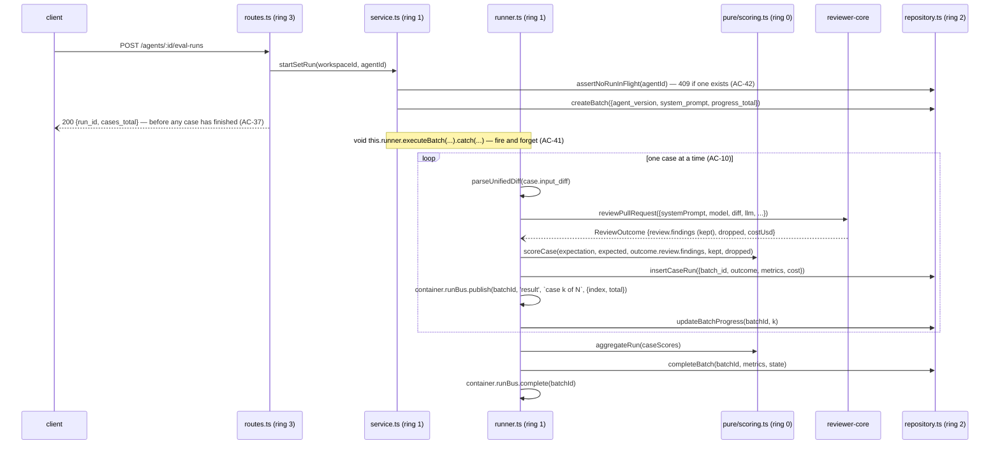

# Implementation Plan: Eval pipeline — a regression harness for the reviewer agents

- **Date:** 2026-08-29
- **Author:** implementation-planner
- **Status:** approved
- **Approved:** 2026-08-29 — the human read the plan and approved it in their own word ("план апрув").
- **Amended:** 2026-08-29 — **track F (skill evals) added** as a new feature on the human's decision; see the Track F paragraph in `## 0`, the architecture in `## 2d` and steps F1–F9. S1–S17 are untouched. Earlier the same day: S2 split into S2a (snapshot-chain repair) and S2b (the eval migration) after S2 hit its own stop condition in track A; S3's verification one-liner corrected; `server/src/db/schema.ts` given an owner. No criterion changed; S1, S3 and S4 keep their ids.

## 0. Requirements & scope

- **Task:** Give an agent author a mechanical regression harness: turn a real finding into an eval case in one click, hold a case set per agent, run the set in the background, score it with no model call, and compare two runs' metrics and prompts side by side.
- **Requirements source:** `specs/2026-08-29-eval-pipeline.md` — `SPEC-2026-08-29-eval-pipeline`, `approved`, AC-1…AC-67, no `[NEEDS CLARIFICATION]` marker anywhere in the document. Plus the coordinator's answers of 2026-08-29 to the four Phase 1 questions (schema shape, SSE, the case set through the UI on `Security Reviewer`, one shared spend confirmation). **Criterion ids are the spec's; this plan never renumbers them and never copies their text.**
- **Execution mode:** multi-agent — **track A alone first**, then **B ‖ C ‖ D**, then **E** last. Four implementers at peak. A owns every surface more than one track reads (both `vendor/shared` copies, the DB schema, the dependency-cruiser config, the client data layer and the shared spend-confirmation component). The client hooks are in A rather than in a client track for one reason the implementer must not "tidy" away: **a file named by track C may not appear in track D**, and both C and D read the same hooks.
- **In scope:** a new `server/src/modules/eval/` module (pure scorer, repository, service, background runner, routes); an additive schema change (`eval_run_batches` + three nullable columns on `eval_runs`); an additive contract change in both `vendor/shared` copies; the agent editor's `Evals` tab, the eval-case editor modal and the `Turn into eval case` seeding on a finding; a new `/evals` Eval Dashboard route with its overview, per-agent view and compare modal; `verify:l06`.
- **Out of scope:** anything the spec lists as a non-goal (skill evals, promoting/rolling back an agent version, exporting eval results to CI, changing how a pull-request review itself runs). Also out of scope and stated here so its absence is a decision: **no seed-script delivery of the case set** — the human chose to author it through the UI (Q3 answer (b)), and compensating with a seeder would defeat the point.
- **Definition of done:** every criterion in the table below is covered by the step named against it and proven by the check named against it; `cd server && pnpm test && pnpm typecheck && pnpm arch:check && pnpm arch:check:core && pnpm verify:l06`, `cd client && pnpm test && pnpm typecheck`, and `./scripts/check-shared-sync.sh` all pass; and the two manual criteria (AC-8, AC-33) are demonstrated on `Security Reviewer` against the running dev stack.

### Criterion coverage

| Criterion | Covered by | Proven by |
|---|---|---|
| `AC-1` | S12 | `FindingCard.test.tsx` — the action is present on an expanded finding |
| `AC-2` | S8, S11, S12 | `eval.it.test.ts` seed of a dismissed finding returns `expectation: "must_not_flag"` + the assertion string; `EvalCaseEditor.test.tsx` renders it |
| `AC-3` | S8, S11, S12 | same tests, on an accepted finding and on an undecided one (both → `must_find`) |
| `AC-4` | S8, S12 | `eval.it.test.ts` — the saved case's `owner_id` is the review's `agent_id`, and it appears in `GET /agents/:id/eval-cases` |
| `AC-5` | S8 | `eval.it.test.ts` — the seed's `input_diff` contains the finding's file and no other file from the PR |
| `AC-6` | S10 | `EvalsTab.test.tsx` — a row shows name, expectation badge, last-run result, and Play/Edit/Trash |
| `AC-7` | S10, S11 | `EvalsTab.test.tsx` — `New eval case` opens the editor with no seed |
| `AC-8` | S16 | manual — the SQL in S16's DoD returns ≥8 rows covering all three kinds |
| `AC-9` | S11 | `EvalCaseEditor.test.tsx` — required name, `Diff`/`Files`/`PR meta` tabs, expected output, validity badge |
| `AC-10` | S7 | `eval.it.test.ts` — N cases → N `completeStructured` calls on the injected `MockLLMProvider`, using the agent's own provider/model |
| `AC-11` | S6, S7 | `eval.it.test.ts` — every `eval_runs` row of the batch shares `batch_id`; the batch carries `agent_version` and `system_prompt` |
| `AC-12` | S6, S7 | `eval.it.test.ts` — metrics are read back byte-identical after the agent's prompt is edited post-run |
| `AC-13` | S5 | `scoring.test.ts` runs with no provider in scope; `verify:l06` runs offline |
| `AC-14` | S10 | `EvalsTab.test.tsx` — the mechanical-scoring line is rendered |
| `AC-15` | S5 | `scoring.test.ts` — same file + overlapping range matches; same file + disjoint range does not; different file with identical range does not; identical title with a different file does not |
| `AC-16` | S5 | `scoring.test.ts` — an extra unmatched actual finding in a `must_find` case moves neither `tp` nor `fp` |
| `AC-17` | S5 | `scoring.test.ts` — two actual findings overlapping the forbidden range give `fp = 2` |
| `AC-18` | S5 | `aggregate.test.ts` — `recall` over `must_find` cases that produced output |
| `AC-19` | S5 | `aggregate.test.ts` — a set of only `must_find` cases reads `precision = 1`; adding a violated `must_not_flag` case lowers it |
| `AC-20` | S5, S7 | `aggregate.test.ts` on kept/dropped counts; `eval.it.test.ts` that the runner passes `outcome.review.findings.length` and `outcome.dropped.length` |
| `AC-21` | S5 | `aggregate.test.ts` — passed over produced-output, not over set size |
| `AC-22` | S13 | `nav.ts` entry asserted in `EvalOverview.test.tsx` via the rendered sidebar, plus the S13 screenshot |
| `AC-23` | S13 | `EvalOverview.test.tsx` — a row renders model, last run identity/date/pass count, sparkline, three metrics |
| `AC-24` | S13 | `EvalOverview.test.tsx` — an agent with no runs renders `No eval runs yet`, three `—`, no sparkline |
| `AC-25` | S13 | `EvalOverview.test.tsx` — the cross-agent feed is newest-first with agent, time, version, three metrics, pass count |
| `AC-26` | S14 | `AgentEvalView.test.tsx` — metric cards with deltas, trend chart, runs table columns |
| `AC-27` | S14 | `AgentEvalView.test.tsx` — precision down vs previous renders the alert naming the drop in pp and the version |
| `AC-28` | S14 | `AgentEvalView.test.tsx` — `Compare` disabled and the affordance shown at 0 and 1 selected |
| `AC-29` | S14 | `AgentEvalView.test.tsx` — selecting a third run drops the earliest and keeps two |
| `AC-30` | S15 | `RunCompare.test.tsx` — selecting newest-then-oldest still renders oldest → newest |
| `AC-31` | S15 | `RunCompare.test.tsx` — a removed word is struck through, an added word highlighted |
| `AC-32` | S6, S15 | `RunCompare.test.tsx` diffs `run.system_prompt`; `eval.it.test.ts` proves the stored prompt survives an agent edit |
| `AC-33` | S17 | manual — the S17 procedure, with its recorded numbers |
| `AC-34` | S11 | `EvalCaseEditor.test.tsx` — invalid JSON disables Save and shows the invalid badge |
| `AC-35` | S10 | `EvalsTab.test.tsx` — Trash opens a confirmation naming the history loss |
| `AC-36` | S2b, S6 | `eval.it.test.ts` — deleting a case with runs removes its `eval_runs` rows |
| `AC-37` | S7, S10 | `eval.it.test.ts` — the POST returns a `run_id` while `state = 'running'`; `EvalsTab.test.tsx` renders the running state |
| `AC-38` | S7, S10 | `EvalsTab.test.tsx` — the progress reads `k / N` and advances on a `RunEvent` |
| `AC-39` | S4, S10, S14 | `eval-run-state.test.ts` for the predicate; both tab and dashboard tests assert the control shows in-progress |
| `AC-40` | S10, S14 | `AgentEvalView.test.tsx` — the runs query is invalidated on stream completion and the new row renders without a remount |
| `AC-41` | S7 | `eval.it.test.ts` — the batch reaches `complete` after the HTTP response has already returned |
| `AC-42` | S7 | `eval.it.test.ts` — a second set run and a trial both get `409` while one is in flight |
| `AC-43` | S7 | `eval.it.test.ts` — an unparseable diff and a throwing provider each fail one case; the batch still completes |
| `AC-44` | S10 | `EvalsTab.test.tsx` — a failed case renders its reason, distinct from a case that ran and did not pass |
| `AC-45` | S10, S14 | `EvalsTab.test.tsx` / `AgentEvalView.test.tsx` — `7 of 8` partial wording |
| `AC-46` | S5 | `scoring.test.ts` — the `users.ts:3` / `users.ts:40` example passes the case with `fp = 0` |
| `AC-47` | S10, S13, S14 | each test renders `—` for a zero-denominator metric, never `0%`, never `NaN` |
| `AC-48` | S8, S13 | `eval.it.test.ts` — one call starts one batch per enabled agent with a case set; `EvalOverview.test.tsx` for the control |
| `AC-49` | S5 | `aggregate.test.ts` — a case with `outcome: 'errored'` leaves every numerator and denominator |
| `AC-50` | S10, S14 | both tests render `7 of 8 ran` beside the metrics |
| `AC-51` | S5 | `scoring.test.ts` — every expected finding matched plus one extra → case passes |
| `AC-52` | S12 | `FindingCard.test.tsx` — `Learn` and `Reply to author` present and disabled |
| `AC-53` | S11 | `EvalCaseEditor.test.tsx` — `Files` and `PR meta` render values with no editable control |
| `AC-54` | S11 | `EvalCaseEditor.test.tsx` — save with the toggle on fires the trial mutation after the save |
| `AC-55` | S11 | `EvalCaseEditor.test.tsx` — the skeleton is appended and the existing entries survive |
| `AC-56` | S14 | `AgentEvalView.test.tsx` — the control narrows the chart's point count and leaves the table row count unchanged |
| `AC-57` | S15 | `RunCompare.test.tsx` — the action names the newer version and is disabled with a reason |
| `AC-58` | S9 | `AgentEditor.test.tsx` — six tabs in order, `CI` disabled |
| `AC-59` | S13, S14, S15 | each test asserts the caption reads the fixture's real case count, and never the literal `20` |
| `AC-60` | S9, S12, S15 | each of the four controls asserted `disabled` with its stated reason |
| `AC-61` | S5 | `cd server && pnpm verify:l06` exits 0 with no network and no DB |
| `AC-62` | S6, S7 | `eval.it.test.ts` — a trial writes `eval_runs` with `batch_id IS NULL` and adds no row to `GET /agents/:id/eval-runs` |
| `AC-63` | S6 | `eval.it.test.ts` — after a set run then a trial, the case's last result is the trial's |
| `AC-64` | S4, S10, S11, S13, S14 | `EvalRunConfirm.test.tsx` plus one assertion per control that it is routed through the confirmation |
| `AC-65` | S8, S10, S12 | `eval.it.test.ts` for the seeded-case flag on the findings response; `FindingCard.test.tsx` renders it |
| `AC-66` | S12 | `FindingCard.test.tsx` — activating it on a finding that already has a case states so before creating a second |
| `AC-67` | S15 | `RunCompare.test.tsx` — the comparability statement is rendered on the modal |

### Track F — skill evals (added 2026-08-29)

`specs/2026-08-29-eval-pipeline.md` records **evals for skills** as a non-goal, on the ground that a skills eval is "a *different kind* of eval" checking whether a skill instruction produces the right artifact, whose fixtures "have to be synthetic and generated by a model". **The human reversed that non-goal on 2026-08-29 and the reason the spec gave no longer applies**, because the feature being built is not the one the spec declined: it is not an artifact-format eval at all. A skill eval here runs **the same case twice against the same diff** — once with the skill's body in the prompt, once without — and shows the two results side by side. The spec's own sentence anticipated it: "the existing eval-case owner kind already admits `skill`, which keeps the door open." `owner_kind` does admit `'skill'` (`server/src/db/schema/eval.ts:24`), and every runtime site hard-codes `'agent'` today.

**Requirements source for track F:** the human's four decisions of 2026-08-29 and the transcription of the course mentor's screencast (`Oleksandr_Yudaiev_hw6.mov`, from ~6:00) carried in the invocation. **The human asked for no separate spec.** The frames that transcription was taken from lived in a session scratchpad that no longer exists, so **the transcription in `## 2d` is the design record and is treated as the mockup** — there is no image any reviewer can re-open, which makes the element checklists in F7 and F8 the only surviving form of the design.

**No `AC-` id is assigned to anything in track F.** Criterion ids belong to the spec, and this feature has none; the table below keys each row to the decision or the reference element it came from, quoted rather than paraphrased.

| Requirement (verbatim source) | Stated by | Covered by | Proven by |
|---|---|---|---|
| "does this skill change what the agent finds — by running the same case **twice** against the same diff: once with that skill's body in the prompt, once without" | human, decision 1, 2026-08-29 | F4 | `skill-eval.it.test.ts` — one case run makes exactly two `completeStructured` calls, one carrying the skill body and one not |
| "the case's pass/fail and its `recall` come from the run **with** the skill; `Without skill` is the same recall recomputed from the run **without** it" | human, decision 2, 2026-08-29 — **superseded for `MUST FIND` by the ruling below; still governs `MUST NOT FLAG` and both sides' `recall`** | F2, F4 | `skill-scoring.test.ts` on the per-side formula |
| A `MUST FIND` case passes when the expected finding is "present in the run **with** the skill **and absent** in the run **without** it"; a `MUST NOT FLAG` case passes on the with-run alone | human, 2026-08-29, ruling "как в эксперименте" after being shown both readings | F2, F4, F5, F7 | `skill-scoring.test.ts` reproduces all four transcribed rows including the two that differ only in `Without skill`; `skill-eval.it.test.ts` on the two-sided mark |
| "the first enabled agent the skill is linked to, and **that agent's name is visible on screen**" | human, decision 3, 2026-08-29 | F3, F7 | `skill-eval.it.test.ts` picks the lowest-`order` enabled link; `SkillEvalsTab.test.tsx` renders the agent name |
| "one case is **two** paid model calls; a four-case set is eight" | human, decision 4, 2026-08-29 | F6, F7, F8 | `SkillEvalsTab.test.tsx` — the confirmation states `2 × N`, not `N` |
| Screen A: tab bar with `Evals` appended last; **no metric strip** | reference, screen A | F7 | `SkillEditor.test.tsx` six tabs in order; `SkillEvalsTab.test.tsx` renders no RECALL/PRECISION/CITATION card |
| Screen A: header `Eval cases`, badge `3/4 passing`, muted `4 cases`, `▷ Run all evals`, `+ New eval case` | reference, screen A | F7 | `SkillEvalsTab.test.tsx` element checklist |
| Screen A case row: status icon, name, `MUST FIND`/`MUST NOT FLAG`, second line `expected N finding, got M · recall X% · With skill A% / Without skill B%`, right severity·category, `▷ Run` `✎ Edit` trash | reference, screen A | F7 | `SkillEvalsTab.test.tsx`, row by row against the four transcribed cases |
| Screen B: `Input` tabs `Code` \| `PR meta`; `Code` sub-tabs `New file` \| `Modified file`; labelled `Before`/`After` textareas; collapsed `› Preview generated diff` | reference, screen B | F8 | `SkillEvalCaseEditor.test.tsx` element checklist |
| "The case's diff is authored as Before/After and **generated** — not pasted" | reference, screen B; human, 2026-08-29 | F2, F3, F8 | `diff-builder.test.ts` round trip through `parseUnifiedDiff` |
| Screen B: `Expected output` with `✓ valid JSON` and `+ Finding skeleton`, over a second **`Actual output`** panel reading `Never run yet` before a run, then `{ "with": {…}, "without": {…} }` | reference, screen B | F8 | `SkillEvalCaseEditor.test.tsx` both states |
| Screen B footer: `Run on save` toggle left; `Cancel`, `▷ Run case` (`Running…` in flight), `Save` | reference, screen B | F8 | `SkillEvalCaseEditor.test.tsx` |
| "linked skills change a finding's CONTENT, not the finding COUNT" — the delivered set needs a **policy-dependent** defect | `server/INSIGHTS.md:210-233`, measured 2026-08-08 | F7, F9 | F9's DoD names the policy-dependent case and records its two percentages; F7 renders the account of `100% / 100%` |

## 1. Affected modules

| Module | Package manager | Layer / area | Constraint from INSIGHTS.md |
|---|---|---|---|
| `server/src/vendor/shared/contracts/` | pnpm | ring 0 | `server/INSIGHTS.md:719` — `.default([])` and `.nullable()` break existing object literals; `server/INSIGHTS.md:702` — `pnpm typecheck` is `include: ["src/**/*.ts"]` and never compiles `server/test/**` |
| `client/src/vendor/shared/contracts/` | pnpm | ring 0 (mirror) | must stay byte-identical; `./scripts/check-shared-sync.sh` |
| `server/src/db/schema/eval.ts` + `migrations/` | pnpm | ring 2 | `server/INSIGHTS.md:770` — `db:generate` snapshot drift; never delete `0015_snapshot_baseline` |
| `server/src/modules/eval/` (new) | pnpm | rings 0/1/2/3 | `server/INSIGHTS.md:475` — `no-app-to-schema` enumerates basenames, so a new application file is silently unprotected and the rule prints the same `0 violations` it prints when nothing is wrong |
| `server/.dependency-cruiser.cjs` | pnpm | config | verify by regex, never by running `arch:check` |
| `server/package.json` | pnpm | config | `verify:l03` at `:18` is the shape `verify:l06` mirrors |
| `client/src/lib/hooks/`, `lib/api.ts` | pnpm | data layer | `client/INSIGHTS.md:388` — adding a hook to a component with an existing test breaks it through the test's catch-all `fetch` stub; guard list payloads with `Array.isArray` |
| `client/src/app/agents/[id]/_components/AgentEditor/` | pnpm | feature | `client/INSIGHTS.md:589` — no gate here can see a mockup; `client/INSIGHTS.md:250` — i18n namespace follows the component's location |
| `client/src/app/evals/` (new) | pnpm | route | `client/INSIGHTS.md:611` — `src/vendor/ui/nav.ts` is this app's own route config; a sidebar entry is one line there |
| `client/src/app/repos/[repoId]/pulls/[number]/_components/FindingCard/` | pnpm | feature | `client/INSIGHTS.md:440` — two affordances for one action must read one predicate |

**Related and deliberately NOT edited:**

- `reviewer-core/` — the eval runner is a second caller of `reviewPullRequest`, not a change to it. Nothing is added to the engine; `pnpm arch:check:core` must stay clean.
- `server/src/modules/reviews/` — the PR-review path is untouched. Its `RunBus`, its SSE route and its `ReviewRepository` are **reused through the container**, never edited. `modules/reviews/diff-loader.ts` is deliberately not imported (see §2b).
- `client/src/vendor/ui/**` except `nav.ts` — `client/AGENTS.md:46-47` makes these read-only third-party code. Every primitive the screens need already exists; `Tabs` lacking a `disabled` flag is worked around in S9 rather than patched.
- `server/src/db/seed.ts` — no eval seeding, per the Q3 answer.

## 2. Constraints

- **dependency-cruiser rules touched:** `no-domain-io` (`server/.dependency-cruiser.cjs:11`), `no-domain-node-builtins` (`:22`) and `no-app-to-schema` (`:57`). All three carry a `from.path` allow-list that names directories and basenames; a new `src/modules/eval/pure/` and the module's application files match **none** of them today, so the rules would inspect nothing and still print `0 violations`. S3 extends all three. `no-route-to-db`, `no-infra-to-app`, `no-cross-module-internals` and `no-circular` apply unchanged and need no edit.
- **The baseline may only shrink.** Never run `pnpm arch:baseline` to make `arch:check` pass.
- **`vendor/shared` mirroring required:** yes — S1 edits both copies and runs `./scripts/check-shared-sync.sh`.
- **DB migration required:** yes — **two** generated migrations: the snapshot-chain repair in S2a and the eval migration in S2b, both applied by the **human** with `cd server && pnpm db:migrate`. Migrations never run on boot.
- **`reviewer-core` purity affected:** no.
- **Other constraints from AGENTS.md:** ESM — every relative import carries the `.js` extension. Modules are registered statically in `server/src/modules/index.ts`. `server/` and `client/` are pnpm.

## 2b. Decisions and rejected alternatives

| Decision | Alternative considered | Why rejected |
|---|---|---|
| The scorer is pure functions in `server/src/modules/eval/pure/`, tests colocated, run by `verify:l06` | `reviewer-core/src/eval/` | The scorer needs the eval contracts and the `must_find` / `must_not_flag` vocabulary, which are server-owned; widening the engine's API for a server-only concern is what the spec's "the eval runner lives in `server`" guards. `server/src/modules/smart-diff/pure/` + `verify:l03` (`server/package.json:18`) is the repository's own precedent for exactly this shape |
| A new `eval_run_batches` table + nullable `batch_id` on `eval_runs` | one table with a self-referencing parent, or a `kind` discriminator column | With `batch_id`, AC-62 ("a trial never enters run history") is a `WHERE batch_id IS NOT NULL` and AC-63 ("last run is whichever touched the case most recently") is an unfiltered `ORDER BY ran_at DESC LIMIT 1`. A discriminator would need two code paths that can drift apart |
| Progress is delivered over the **existing** `GET /runs/:id/events` (`modules/reviews/routes.ts:62`), keyed by the batch id | a new `GET /eval-runs/:id/events` in the eval module | `RunBus` (`server/src/platform/sse.ts`) is keyed by an arbitrary string id and the route is generic — it calls `getContext`, then `container.runBus.subscribe`/`onDone`. Reusing it costs zero new SSE plumbing and lets the client reuse `useRunEvents` (`client/src/lib/hooks/reviews.ts:247`) unchanged. No import crosses a module boundary: the client calls a URL |
| The seed for AC-2/AC-3/AC-5 is built **server-side** by `GET /findings/:id/eval-seed` | build the seed in the client from the finding it already renders | AC-5 needs the reviewed diff of the finding's own file, which lives in `pr_files`. Building it client-side would mean shipping the whole PR diff to the browser to slice one file out of it |
| That endpoint reaches the finding through `container.reviewRepo` — `getFinding(findingId)` (`modules/reviews/repository.ts:120`) → `getReview(review_id)` (`:72`) → `getPrFiles(pr_id)` (`:39`) | import `modules/reviews/diff-loader.ts`'s `diffFromPrFiles` | `no-cross-module-internals` would not catch that import (its regex matches only `service`/`repository`), so it would pass `arch:check` and still be a reach into another module's application layer. `container.reviewRepo` is the documented seam — `container.ts:77` says so in as many words. The ~8 lines that rebuild a unified diff from `pr_files` patches are duplicated rather than imported |
| The eval runner uses `parseUnifiedDiff` from `server/src/adapters/git/diff-parser.ts:14` | put a parser in `modules/eval/pure/` | `modules/reviews/diff-loader.ts:3` already imports that exact adapter from ring 1 and `arch:check` is clean on it — it is an established, rule-legal edge |
| The disabled `CI` tab (AC-58 + AC-60) is a sibling `<button disabled title="…">` beside the `Tabs` bar in `AgentEditor.tsx` | add `disabled?: boolean` to `TabDef` (`client/src/vendor/ui/kit/types.ts:3`) | `client/AGENTS.md:46-47` makes `src/vendor/ui` read-only third-party code, and `nav.ts` is the single carved-out exception (it is DevDigest's own route config). A disabled `<button>` with a `title` is also the mockup's own idiom for explaining a control (`findings.jsx:25`, `agent_widgets.jsx:53`) |
| New contracts (`EvalRunBatch`, `EvalAgentDashboard`, `EvalOverview`) are **added**; `EvalRun`, `EvalRunResult` and `EvalDashboard` are left untouched | reshape the existing scaffolding contracts to fit | They are unused scaffolding whose shape does not fit (`EvalRun.recall` is `.min(0).max(1)` and non-nullable, so it cannot express AC-47's `—`; `traces_total` and `per_trace` are required). Reshaping them buys nothing and risks the literal-breakage class of `server/INSIGHTS.md:719`. **The implementer must not delete them** — root `CLAUDE.md`: empty tables and future-lesson scaffolding are not dead code |
| `expectation` is `z.enum` **parsed on the write path** in the eval repository | rely on the read schema, as the rest of the repo does | `server/INSIGHTS.md:426` measured the cost: `findings.category` is `text` with no DB constraint, the insert path wrote three values the read schema's `z.enum` rejects, and `GET /pulls/:id/reviews` returned `internal_error` permanently for one PR while its siblings were fine — invisible to `typecheck` and to every test |
| The `/evals` route is workspace-scoped, not repo-scoped | `/repos/:repoId/evals`, mirroring `Conventions` | Agents are workspace entities, not repo entities — `/skills` and `/agents` are the right precedent, and `resolveHref` (`nav.ts`) only rewrites hrefs containing `:repoId` |
| One shared `EvalRunConfirm` component in `client/src/components/`, owned by track A | five inline "N calls" labels | AC-64 covers five controls across two tracks (`Run eval` and `Run all agents` in D; `Run all evals`, `Play`/`Run case`, `Run on save` in C). A shared component keeps the two client tracks file-disjoint, and `Run on save` attaches spend to a save where no label is being read |
| No `run_traces` document is written for an eval run | mirror the PR path's persisted trace | An eval run has no `agent_runs` row and the spec asks for none. The two observability channels here are the live `RunBus` stream and the persisted `eval_run_batches` / `eval_runs` rows — stated so the implementer does not invent a third |

## 2c. Architecture of the change

**Layers / ownership.** `reviewer-core` **unchanged** — it gains nothing, not even an optional slot; the runner calls `reviewPullRequest` exactly as `modules/reviews/run-executor.ts:363` does. `server/src/modules/eval/` owns everything else: `pure/` is ring 0 (no I/O, imports only `@devdigest/shared` and `zod`), `service.ts` + `runner.ts` are ring 1, `repository.ts` is ring 2, `routes.ts` is ring 3. `client/` renders and never computes a metric.

**Unchanged.** `modules/reviews/**` (reused through `container.reviewRepo`, `container.runBus` and the existing `GET /runs/:id/events` route); `modules/agents/**` (read through `container.agentsRepo`); `reviewer-core/**`; `client/src/vendor/ui/**` except `nav.ts`; `server/src/db/seed.ts`; the `EvalRun`, `EvalRunResult` and `EvalDashboard` contracts.

**Data sources.**
- The case set: `eval_cases` rows for `owner_kind = 'agent'`, `owner_id = <agent id>`, workspace-scoped.
- The prompt a run sends: `agents.system_prompt` read **once, when the batch is created**, and copied onto `eval_run_batches.system_prompt`. Never re-read, never joined to `agent_versions` — `server/INSIGHTS.md:14` measured that a seeded agent such as `Security Reviewer` sits at version 1 with **zero** `agent_versions` rows, so a version join reconstructs nothing for exactly the agent this feature is demonstrated on.
- The provider and model: `agents.provider`, `agents.model` (AC-10 — the agent's own, not a feature-model override).
- The seed for a case: `findings` row → `reviews` row (for `pr_id` and `agent_id`) → `pr_files` patches, sliced to the finding's own file.
- **Not sent to a model:** a case's `expected_output`. It is only ever compared by code. The `input_diff` and `input_meta` reach the prompt in the same trust position a real PR diff does, under the engine's existing injection guard.
- **Nullable behaviour:** `eval_runs.batch_id IS NULL` means a single-case trial. `eval_cases.expected_output` may be `null` (a `must_not_flag` case asserts an absence) — the scorer reads it as `[]`. `eval_run_batches.recall/precision/citation_accuracy` are `null` when the denominator is zero, and the client renders `—` (AC-47), never `0%` and never `NaN`. An agent with no batch renders `No eval runs yet` (AC-24).

**Call sequence.** One LLM call per case, on the agent's own provider/model; the scorer never appears on a model edge.



Real signatures the steps must call, read from source, not from a call site:

- `reviewPullRequest(input: ReviewInput): Promise<ReviewOutcome>` — `reviewer-core/src/review/run.ts:132`. `ReviewInput` (`:46`) requires `systemPrompt`, `model`, `diff: UnifiedDiff`, `llm: LLMProvider`; `strategy`, `skills`, `task`, `onEvent`, `sessionId`, `correlationId` are optional. `ReviewOutcome` (`:104`) returns `review: Review` — **already grounded**: `run.ts:238` returns `{...merged, findings: ground.kept}` — plus `dropped: {finding, reason}[]`, `costUsd: number | null`, `tokensIn`, `tokensOut`, `raw`.
- `groundFindings(findings, diff): {kept, dropped}` — `reviewer-core/src/grounding.ts:52`. **The runner does not call it**: the engine already ran it, and `outcome.review.findings.length` / `outcome.dropped.length` are the kept/dropped counts AC-20 needs.
- `parseUnifiedDiff(raw: string): UnifiedDiff` — `server/src/adapters/git/diff-parser.ts:14`.
- `container.llm(id: 'openai' | 'anthropic' | 'openrouter'): Promise<LLMProvider>` — `server/src/platform/container.ts:179`. **A method, and async** — `await container.llm(agent.provider as Provider)`, exactly as `run-executor.ts:311` does. `container.git` by contrast is a **getter** (`container.ts:98`); `container.runBus` is a readonly field (`:67`); `container.agentsRepo` (`:100`) and `container.reviewRepo` (`:104`) are getters.
- `RunBus.publish(runId: string, kind: RunEventKind, msg: string, data?: unknown): RunEvent` — `server/src/platform/sse.ts:52`. `subscribe(runId, listener): () => void` (`:63`), `complete(runId): void` (`:76`), `onDone(runId, listener): () => void` (`:90`). **`msg` is a human-readable string, not an id.**
- `getContext(container, req): Promise<{workspaceId, userId}>` — `server/src/modules/_shared/context.ts:14`.
- `container.reviewRepo.getFinding(findingId): Promise<FindingRow | undefined>` (`modules/reviews/repository.ts:120`), `.getReview(reviewId)` (`:72`), `.getPrFiles(prId)` (`:39`). `FindingRow` has `file`, `startLine`, `endLine`, `severity`, `category`, `title`, `acceptedAt`, `dismissedAt`, `reviewId` — and **no `prId`**: it is reached through the review (`db/schema/reviews.ts:29-47`, `:15`, `:18`).
- Client: `useRunEvents(runIds: string[]): {events: RunEvent[]; running: boolean}` — `client/src/lib/hooks/reviews.ts:247`.
- Client: `Tabs({tabs, value, onChange, pad})` — `client/src/vendor/ui/kit/Tabs.tsx:5`. `TabDef = string | {key, label, icon?, count?}` (`kit/types.ts:3`) — **no `disabled`**. `Modal({width, title, subtitle, onClose, children, footer, bodyScroll})` — `kit/Modal.tsx:4`. `Button` spreads `...rest` onto the DOM button (`primitives/Button.tsx:20`), so `disabled` and `title` both work.

**Schema.** Additive only. A **new** `eval_run_batches` table and an additive `ALTER` on `eval_runs`. `eval_cases` and `eval_runs` already exist in the baseline (`server/src/db/migrations/0000_init.sql:116,129`) and are already applied in the dev database. **Forbidden:** any `DROP`, any edit to `0000_init.sql`, and deleting `0015_snapshot_baseline` **or** `0019_snapshot_baseline` (`server/INSIGHTS.md`; the second is created by S2a for the same reason the first exists).

- `eval_run_batches`: `id uuid pk default random`, `workspace_id uuid not null → workspaces(id) on delete cascade`, `agent_id uuid not null → agents(id) on delete cascade`, `agent_version integer not null`, `system_prompt text not null`, `state text not null default 'running'`, `progress_index integer not null default 0`, `progress_total integer not null`, `started_at timestamptz not null default now()`, `ran_at timestamptz`, `recall double precision`, `precision double precision`, `citation_accuracy double precision`, `traces_passed integer`, `traces_produced integer`, `cost_usd double precision`, `duration_ms integer`. Index on `(agent_id, started_at desc)` — every screen reads an agent's runs newest-first.
- `eval_cases` gains: `expectation text not null default 'must_find'`, `seeded_from jsonb`.
- `eval_runs` gains: `batch_id uuid → eval_run_batches(id) on delete cascade`, `outcome text`, `failure_reason text`. The existing `case_id → eval_cases on delete cascade` (`db/schema/eval.ts:26`) is what already satisfies AC-36; it is not touched.

**API.** All new, all in `modules/eval/routes.ts` (ring 3): validate with a contract, call the service, map errors.

| Method | Path | Purpose | Codes |
|---|---|---|---|
| `GET` | `/agents/:id/eval-cases` | the case set (AC-6) | 200, 404 |
| `POST` | `/agents/:id/eval-cases` | create (AC-4, AC-7) | 201, 400, 404 |
| `PUT` | `/eval-cases/:id` | update (AC-34) | 200, 400, 404 |
| `DELETE` | `/eval-cases/:id` | delete with its history (AC-36) | 200, 404 |
| `POST` | `/eval-cases/:id/run` | single-case trial (AC-62) | 200, 404, 409 |
| `GET` | `/findings/:id/eval-seed` | an unsaved seed (AC-2, AC-3, AC-5) | 200, 404 |
| `POST` | `/agents/:id/eval-runs` | start a set run (AC-10, AC-37) | 200, 404, 409, 422 when the set is empty |
| `GET` | `/agents/:id/eval-runs` | run history, newest first | 200, 404 |
| `GET` | `/eval-runs/:id` | one batch + its per-case results | 200, 404 |
| `POST` | `/eval-runs/all` | `Run all agents` (AC-48) | 200 |
| `GET` | `/eval-dashboard` | all-agents overview (AC-23…AC-25) | 200 |
| `GET` | `/agents/:id/eval-dashboard` | per-agent view (AC-26, AC-27) | 200, 404 |

Progress is **not** a new route: the client opens `GET /runs/:id/events` with the batch id.

**Prompt builder.** **Unchanged.** No new `assemblePrompt` slot, no new `PromptParts` field, no change to `wrapUntrusted`. A case's `input_diff` enters through `ReviewInput.diff` in exactly the trust position a real PR diff occupies; `input_meta.title`/`.body` enter through the existing `prDescription` slot, which `assemblePrompt` already delimiter-wraps. The `expected_output` never enters a prompt.

**UI.** Three surfaces. (1) The agent editor gains a sixth tab, `Evals`, at `client/src/app/agents/[id]/_components/AgentEditor/_components/EvalsTab/` — the tab currently does not exist at all, and `constants.ts` hard-codes four tabs, so a "tab that renders nothing" is not a risk here; it renders the new component from the first commit. (2) A new route `client/src/app/evals/` with a Server Component `page.tsx` delegating to a `'use client'` view, per `frontend-architecture`. (3) `FindingCard` gains a third action. Query keys added to the central factory (`client/src/lib/hooks/keys.ts`): `evalCases(agentId)`, `evalRuns(agentId)`, `evalRun(runId)`, `evalDashboard`, `agentEvalDashboard(agentId)`, `findingEvalSeed(findingId)`.

**Logging.** Two channels, different APIs, both named:

- **Live:** `container.runBus.publish(batchId, kind, msg, data)` — `kind` is a `RunEventKind`, `msg` is human-readable prose, `data` carries `{index, total}`. Ended with `container.runBus.complete(batchId)` in a `finally`, so a crash still closes every SSE subscriber.
- **Persisted:** the `eval_run_batches` row (`state`, `progress_index`, metrics) and one `eval_runs` row per case (`outcome`, `failure_reason`, `actual_output`). **No `run_traces` document is written** — an eval run has no `agent_runs` row.
- **Never logged:** the model's raw output beyond the `actual_output` column, secrets, and full diff bodies. `failure_reason` carries the provider's error message, truncated to 500 characters.
- **Cost:** `ReviewOutcome.costUsd` is `number | null`. Each case run records its own; the batch's `cost_usd` is the sum of the non-null case costs, and `null` when every case cost is null. **The eval run's cost never enters the PR review's totals** — it is a different table and a different agent run.

## 2d. Track F — skill evals: the reference, the pass rule it implies, and one real contradiction

**The reference, transcribed.** Frames from `Oleksandr_Yudaiev_hw6.mov` (~6:00) were extracted to a scratchpad that no longer exists. This is the design record; F7 and F8 turn it into element checklists, which is the only form a design survives into a text-only review.

*Screen A — the skill editor's `Evals` tab, `/skills/<id>?tab=evals`.* Skill header: name, version badge (`v3`), enable toggle far right. Tab bar with `Evals` added. **No metric strip** — unlike the agent Evals tab, no RECALL/PRECISION/CITATION cards; the screen goes straight to the list. Header row: `Eval cases`, badge `3/4 passing`, muted `4 cases`, right-aligned `▷ Run all evals` and `+ New eval case`. Case row: status icon (green check / red cross), case name, badge `MUST FIND` or `MUST NOT FLAG`; second line, muted: `expected 1 finding, got 0 · recall 100% · With skill 100% / Without skill 0%`; right-aligned severity·category (`CRITICAL · security`, absent on MUST NOT FLAG rows), then `▷ Run`, `✎ Edit`, trash. The four cases visible, which also fix the naming convention:

*Corrected 2026-08-29 by re-cropping the source frame at 3×. An earlier transcription carried two errors — `got 1` for row 2 and `recall 0%` for row 3 — and those errors, not the reference, produced a contradiction an earlier revision of this plan was asked to design around. The table below is authoritative.*

| # | Case name | Expectation | Mark | Second line |
|---|---|---|---|---|
| 1 | `breaking-change-gate-additive-optional-field-not-flagged` | MUST NOT FLAG | ✓ | `expected 0 finding, got 0 · recall 100% · With skill 100% / Without skill 100%` |
| 2 | `breaking-change-gate-field-removal-is-flagged` | MUST FIND · CRITICAL · security | ✓ | `expected 1 finding, got 0 · recall 100% · With skill 100% / Without skill 0%` |
| 3 | `adversarial-suppress-positive` | MUST FIND · CRITICAL · security | **✗** | `expected 1 finding, got 0 · recall 100% · With skill 100% / Without skill 100%` |
| 4 | `adversarial-hallucinate-negative` | MUST NOT FLAG | ✓ | `expected 0 finding, got 0 · recall 100% · With skill 100% / Without skill 100%` |

*Screen B — the skill eval case editor (modal).* Title `Eval case · <name>`. Left, `Input`: tabs `Code` | `PR meta`; under `Code`, sub-tabs `New file` | `Modified file`; under `Modified file`, labelled `Before` and `After` textareas holding file contents (the example loses a field from a TS `type UserResponse = {…}`); below, a collapsed `› Preview generated diff`. Right: `Expected output` with a `✓ valid JSON` badge and `+ Finding skeleton`, over a JSON editor; below it a second panel, **`Actual output`**, reading `Never run yet` before a run and afterwards holding `{ "with": { "recall": 1, "findings": [ { "id": …, "file": "snippet.ts", "kind": …, "title": …, "category": … } ] }, "without": { … } }`. Footer: `Run on save` toggle left; right `Cancel`, `▷ Run case` (`Running…` in flight), `Save`.

### The pass rule the reference implies, and one contradiction that survives

**The rule, derived from rows 2 and 3, and confirmed by the human on 2026-08-29.** With the corrected numbers, **rows 2 and 3 are identical in every visible field** — `expected 1 finding, got 0 · recall 100% · With skill 100%` — and yet row 2 is a green check and row 3 a red cross. Exactly one field differs: `Without skill`, `0%` against `100%`. The reference is therefore not inconsistent; it is telling us what decides the mark, and the mark is decided by the **difference between the two runs**:

- A **`MUST FIND`** skill case passes when the expected finding is present in the run **with** the skill **and absent** in the run **without** it. The case asserts *the skill causes this finding*; if the agent finds it anyway, the case has demonstrated nothing about the skill and fails. This is what makes row 2 pass and row 3 fail.
- A **`MUST NOT FLAG`** skill case keeps the with-run rule: it passes when no finding overlaps the forbidden location in the run **with** the skill. The without-run is reported beside it and does not decide the mark. This is what lets rows 1 and 4 pass at `100% / 100%`.

This rule reproduces **all four** transcribed rows. The alternative the human was shown and rejected — pass a `MUST FIND` case on the with-run alone — reproduces three, because it cannot tell row 2 from row 3 at all. It is recorded in the Decisions table below.

**The consequence that runs through the whole track: the *without* run is load-bearing, not informational.** It cannot be skipped, deferred, made optional, or treated as a nice-to-have extra, because for a `MUST FIND` case there is no mark without it. F2, F4, F5, F7 and F9 each carry that consequence explicitly.

**C1 — the reference's per-row `recall` is not the `recall` this repository already ships.** `aggregateRun` (`server/src/modules/eval/pure/aggregate.ts:23`) computes `recall = Σtp / (Σtp + Σfn)` over the `must_find` cases that produced output, and returns `null` when that denominator is zero. A `must_not_flag` case contributes nothing to it, so **under the shipped formula the reference's rows 1 and 4 read `—`, not `recall 100%`** — and they already do: the runner calls `aggregateRun([{…score, outcome}], 1)` per case (`runner.ts`), so `eval_runs.recall` is null for every `must_not_flag` case in the database today.

*Resolution, unchanged by the corrected transcription and overturnable in one sentence:* track F computes a **separate, differently-named** per-side number and never reuses `aggregateRun`. `skillCaseRecall(score, expectation)` = `tp / (tp + fn)` for a `must_find` case, `passed ? 1 : 0` for a `must_not_flag` case, applied to each side independently. **The label on screen stays the reference's word `recall` although for `must_not_flag` rows the number is a pass indicator** — that is the reference's naming, not this plan's. F2 gives it its own file and its own test so the two formulas can never drift into each other.

**C2 — `expected 1 finding, got 0` beside `recall 100%` does not reconcile under any reading, and the frame is probably transient.** Rows 2 and 3 both claim one expected finding and zero found, next to a recall of 100%. No pass rule makes those agree: a `must_find` case that got none of its expected findings has a recall of 0 by every definition on the table, including the reference's own. In neighbouring frames those same rows are mid-`Running…`, so the sub-line is plausibly a **partial update** — some fields from the finished run, some stale from the previous one.

*What this plan does about it:* implement internally consistent numbers and **expect the `expected N, got M` segment not to reproduce that frame row for row**. Under this plan a passing `must_find` case renders `expected 1 finding, got 1`, because it found what it expected. **That divergence is stated here so a future reader does not treat the frame as a failing acceptance check** — it is the strongest evidence available that the frame was captured mid-run, and F7's tests assert internal consistency rather than pixel equality with it.

*One further consequence worth stating:* `recall N%` and `With skill N%` remain the same number by construction, so one of screen A's three segments is redundant. All three are kept as drawn, following the same "keep every drawn element" verdict the agent-eval mockup got; dropping the standalone `recall N%` segment later costs one line in F7.

### Decisions

| Decision | Alternative considered | Why rejected |
|---|---|---|
| **A skill eval creates no `eval_run_batches` row.** Each execution is one `eval_runs` row with `batch_id NULL` — which this repository already defines as "not a run in history" | give skill runs their own batch, or relax `eval_run_batches` | `eval_run_batches` cannot hold one as shaped: `agentId` is a NOT NULL FK, and `agentVersion` and `systemPrompt` are NOT NULL (`schema/eval.ts:52-59`) — a skill run has no agent version and no prompt of its own to snapshot. Relaxing three NOT NULLs to serve a screen that shows **no run history and no metric strip** would weaken the guarantee AC-11 and AC-32 rest on. The reference's own screen is the evidence that no batch is wanted |
| **A `MUST FIND` case's mark is `withScore.passed && !withoutScore.passed`; a `MUST NOT FLAG` case's is `withScore.passed` alone** | **rule A** — mark a `MUST FIND` case on the with-run alone, reporting `Without skill` beside it as information | It cannot distinguish row 2 from row 3: both have the expected finding present with the skill, and under rule A both would pass, where the reference marks one ✓ and the other ✗. More plainly, it cannot express the one thing a skill eval exists to measure — that the skill *caused* the finding. Its only cost is that a case built on a defect the agent finds anyway now fails, which is the correct verdict and is what F9's delivered set is required to avoid. Confirmed by the human on 2026-08-29, "как в эксперименте" |
| **Both calls of a case are stored in one `eval_runs` row**: `recall` and `pass`/`outcome` from the with-run for a `MUST NOT FLAG` case and from the two-sided rule above for a `MUST FIND` case, one new nullable column `recall_without`, and `actual_output` holding `{ with: {…}, without: {…} }` exactly as screen B draws it | two rows, one per call, joined by a new column | The row is the unit the screen renders and the unit `latestRunPerCase` (`repository.ts:386`) already returns; two rows would need every existing read path taught which of them is "the" result. `recall_without` is a column rather than a jsonb dig because the case list renders it on every row, and `server/INSIGHTS.md`'s jsonb entry warns that a blob has no migration to remind you older shapes are on disk |
| **The diff is built on the server**, by a pure builder in `modules/eval/pure/`, from `{path, before, after, mode}` stored in `input_files`; `input_diff` is generated on create and update | build it in the browser for the preview and post the result | One builder, one round-trip test. A client-side builder would be a second implementation whose output must also survive `parseUnifiedDiff`, and the case would break in a way only a run reveals. Screen B's `› Preview generated diff` reads a `POST /eval-cases/preview-diff` response, so the preview and the stored diff are the same bytes |
| **The agent for decision 3 is resolved through `container.skillsRepo`**, a new composition-root getter alongside `container.agentsRepo` and `container.reviewRepo`, exposing the existing `SkillsRepository.listLinkedAgents(skillId)` (`modules/skills/repository.ts:222`, which already joins `agent_skills ⋈ agents` and selects `linkEnabled`) | duplicate that join in `modules/eval/repository.ts` | `no-cross-module-internals` forbids `modules/eval` importing `modules/skills/repository.ts` directly, and `container.ts:77` says in as many words that the container exists "so consuming modules use `container.agentsRepo` instead of reaching into another module's folder". Two exact precedents already exist. `platform/container.ts` is owned by no open track, so this re-opens nothing |
| **A skill case run reuses the shipped in-flight guard** — it is refused while the resolved agent has a set run in flight, and it takes the same `409` path as `POST /eval-cases/:id/run` | let skill runs proceed independently | Skill runs create no batch, so without this they would run the same agent concurrently with an agent set run — the exact situation AC-42 exists to prevent, arriving through a door AC-42 does not cover |
| **A new `SkillEvalCaseEditor` component; the shipped `client/src/components/eval-case-editor/` is not touched** | extend the shipped editor with `Code`/`Before`/`After` tabs | The two editors disagree on their whole left pane — the agent editor's input tabs are `Diff` / `Files` / `PR meta` over a stored diff, the skill editor's are `Code` / `PR meta` over authored Before/After — and the agent editor is shipped, reviewed and green. Retrofitting would re-open track C's work to serve a screen it was not designed for |
| **The `Evals` tab is appended last** to the skill editor's five tabs, keeping the existing order | insert it to mirror the agent editor's position | `SkillEditor/constants.ts:10-19` fixes `config, preview, context, stats, versions` and its own header comment says `(no Evals)`. The reference shows `Evals` added to the bar without reordering what was there |


## 3. Skill routing

| Step | Files | Skills the implementer must apply |
|---|---|---|
| S1 | `server/src/vendor/shared/contracts/{knowledge,eval-ci}.ts` + the `client/` mirror | `zod`, `typescript-expert`, mandatory `./scripts/check-shared-sync.sh` |
| S2a | `server/src/db/migrations/0019_snapshot_baseline.sql`, `migrations/meta/` | `drizzle-orm-patterns` |
| S2b | `server/src/db/schema/eval.ts`, `server/src/db/schema.ts`, `server/src/db/migrations/` | `drizzle-orm-patterns`, `postgresql-table-design` |
| S3 | `server/.dependency-cruiser.cjs` | `onion-architecture` |
| S4 | `client/src/lib/hooks/eval.ts`, `keys.ts`, `lib/eval-run-state.ts`, `components/eval-run-confirm/` | `frontend-architecture`, `react-best-practices`, `react-testing-library` |
| S5 | `server/src/modules/eval/pure/`, `server/package.json` | `onion-architecture` (purity), `typescript-expert` |
| S6 | `server/src/modules/eval/repository.ts` | `drizzle-orm-patterns`, `onion-architecture`, `zod` |
| S7 | `server/src/modules/eval/{service,runner}.ts` | `onion-architecture`, `typescript-expert` |
| S8 | `server/src/modules/eval/routes.ts`, `server/src/modules/index.ts`, `server/test/eval.it.test.ts` | `fastify-best-practices`, `onion-architecture`, `zod`, `security` |
| S9–S12 | `client/src/app/agents/**`, `client/src/app/repos/**/FindingCard/` | `frontend-architecture`, `react-best-practices`, `react-testing-library`, `next-best-practices` |
| S13–S15 | `client/src/app/evals/**`, `client/src/vendor/ui/nav.ts` | `frontend-architecture`, `next-best-practices`, `react-best-practices`, `react-testing-library` |
| S16–S17 | none (human-run) | — |
| F1 | `*/vendor/shared/contracts/`, `server/src/db/schema/eval.ts`, `migrations/` | `zod`, `drizzle-orm-patterns`, `postgresql-table-design`, mandatory `./scripts/check-shared-sync.sh` |
| F2 | `server/src/modules/eval/pure/` | `onion-architecture` (purity), `typescript-expert` |
| F3 | `server/src/modules/eval/{repository,service}.ts`, `server/src/platform/container.ts` | `drizzle-orm-patterns`, `onion-architecture`, `zod` |
| F4 | `server/src/modules/eval/runner.ts` | `onion-architecture`, `typescript-expert` |
| F5 | `server/src/modules/eval/routes.ts`, `server/test/skill-eval.it.test.ts` | `fastify-best-practices`, `onion-architecture`, `zod`, `security` |
| F6 | `client/src/lib/hooks/eval.ts`, `keys.ts` | `frontend-architecture`, `react-best-practices` |
| F7–F8 | `client/src/app/skills/[id]/_components/SkillEditor/**`, `client/src/components/skill-eval-case-editor/` | `frontend-architecture`, `react-best-practices`, `react-testing-library`, `next-best-practices` |
| F9 | none (human-run) | — |

`security` is written for a different stack (React + Express + Mongo + JWT); apply its rules to S8, treat its code examples as illustrative.

## 4. Steps

### S1. Extend the shared eval contracts in both `vendor/shared` copies

- **Files:** `server/src/vendor/shared/contracts/knowledge.ts` (existing), `server/src/vendor/shared/contracts/eval-ci.ts` (existing), `client/src/vendor/shared/contracts/knowledge.ts` (existing), `client/src/vendor/shared/contracts/eval-ci.ts` (existing)
- **Change:**
  - In `knowledge.ts`, beside the existing `EvalOwnerKind` (`:70`): add `export const EvalExpectation = z.enum(['must_find', 'must_not_flag'])`. Extend `EvalCase` (`:72-82`) with `expectation: EvalExpectation` (required) and `seeded_from: z.object({ finding_id: z.string(), disposition: z.enum(['accepted','dismissed','open']) }).nullish()`.
  - In `eval-ci.ts`, extend `EvalCaseInput` (`:20-29`) with the same two fields, `seeded_from` `.nullish()`. Extend `EvalRunRecord` (`:32-45`) with `batch_id: z.string().nullish()`, `outcome: z.enum(['passed','failed','errored']).nullish()`, `failure_reason: z.string().nullish()`, `expected_count: z.number().int().nullish()`, `actual_count: z.number().int().nullish()`.
  - Add `EvalRunBatch`: `id`, `agent_id`, `agent_name`, `agent_version: z.number().int()`, `system_prompt: z.string()`, `state: z.enum(['running','complete','partial'])`, `progress_index: z.number().int()`, `progress_total: z.number().int()`, `started_at: z.string()`, `ran_at: z.string().nullable()`, `recall/precision/citation_accuracy: z.number().nullable()`, `traces_passed/traces_produced: z.number().int().nullable()`, `cases_total: z.number().int()`, `cost_usd: z.number().nullable()`, `duration_ms: z.number().int().nullable()`.
  - Add `EvalCaseSeed`: `expectation`, `name`, `assertion: z.string()`, `input_diff`, `input_files: z.unknown().nullish()`, `input_meta: z.unknown().nullish()`, `expected_output: z.unknown()`, `owner_id`, `seeded_from`, `existing_case_id: z.string().nullish()` (AC-65/AC-66).
  - Add `EvalOverviewRow` (agent id/name/model, `latest: EvalRunBatch.nullable()`, `recall_trend: z.array(z.number())`) and `EvalOverview` (`agents: EvalOverviewRow[]`, `recent_runs: EvalRunBatch[]`).
  - Add `EvalAgentDashboard`: `agent_id`, `agent_name`, `model`, `cases_total`, `current` / `delta` (each `recall/precision/citation_accuracy: z.number().nullable()`), `trend: z.array(EvalTrendPoint)`, `runs: z.array(EvalRunBatch)`, `alert: z.string().nullable()`.
  - **Leave `EvalRun`, `EvalRunResult` and `EvalDashboard` exactly as they are** — unused scaffolding, and deleting them is forbidden.
  - **Nullability rule, from `server/INSIGHTS.md:719` and its `.nullable()` sibling:** every field **added to an existing** contract above is `.nullish()` — never `.nullable()`, never `.default([])`, because in Zod 3 `.default()` is optional on input and **required on output**, and `z.infer` is the output, so a literal annotated with the contract type stops compiling. The **new** contracts may use `.nullable()` for a field that is always present and sometimes null (the metrics), which is what that entry recommends.
  - Copy the finished files byte-identically into `client/src/vendor/shared/`.
- **Skills:** `zod`, `typescript-expert`
- **Test:** no new test file — the check is mechanical. Run, in this order: `./scripts/check-shared-sync.sh`; `cd server && pnpm typecheck`; `cd client && pnpm typecheck`; then **`grep -rn "EvalCase\|EvalRunRecord\|EvalCaseInput" server/test/ client/src/ server/src/`** and update any object literal the new required `expectation` breaks. That grep is not optional: `server/tsconfig.json:28` is `"include": ["src/**/*.ts"]`, so `pnpm typecheck` **never compiles `server/test/**`** and a green gate is no evidence about those files (`server/INSIGHTS.md:702`, measured 2026-08-23 on three test files at once).
- **Definition of done:** `check-shared-sync.sh` exits 0; both `typecheck`s pass; the grep above returns no literal missing `expectation`.
- **Satisfies:** contract surface for `AC-2`, `AC-3`, `AC-5`, `AC-11`, `AC-62`, `AC-65`
- **Depends on:** none
- **Track:** A

### S2a. Repair the drizzle-kit snapshot chain with a baseline migration

- **Files:** `server/src/db/migrations/0019_snapshot_baseline.sql` (new — generated, then blanked), `server/src/db/migrations/meta/0019_snapshot.json` (new — generated, **kept**), `server/src/db/migrations/meta/_journal.json` (existing)
- **Change:** this step exists because S2 hit its own stop condition on 2026-08-29 and the plan was amended rather than worked around.
  - **The state on disk, verified 2026-08-29:** `migrations/meta/` holds `0000`–`0010_snapshot.json` and `0015_snapshot.json` and **nothing after**. `0016_pr_intent_layer`, `0017_project_context_attachments` and `0018_pr_brief_cache` were hand-written and left no snapshot, so drizzle-kit diffs the live TypeScript schema against `0015` and honestly re-emits everything added since — measured: all of `0017`'s tables, 11 `pr_brief` columns and 7 `pr_intent` columns. This is `server/INSIGHTS.md`'s documented drift **recurring one generation after `0015_snapshot_baseline` repaired it**, and the re-emitted SQL carries **no `IF NOT EXISTS`** where the hand-written originals did, so running it dies on `column "head_sha" of relation "pr_brief" already exists`.
  - **Why the documented repair cannot be applied to a mixed generation.** `server/INSIGHTS.md`'s pattern — keep the snapshot, blank the `.sql` — is correct only when every statement in the file is already applied. `schema/eval.ts` already carries this feature's additions, so one generation mixes the drift with `CREATE TABLE eval_run_batches`, and blanking it would record the new table as migrated **while creating nothing**. The two generations must therefore be separated, and this step takes the first one against a schema that does not yet contain the feature.
  1. `cp server/src/db/schema/eval.ts /tmp/eval-with-batches.ts` — preserve the finished file before touching it.
  2. `git show HEAD:server/src/db/schema/eval.ts > server/src/db/schema/eval.ts`. Every eval change is an uncommitted working-tree modification (verified 2026-08-29 with `git status --short`), so `HEAD` is exactly the post-`0018` shape. If that is no longer true when this step runs, restore from `/tmp/eval-with-batches.ts` and report — do not improvise a revert.
  3. Confirm the revert took: `grep -c "evalRunBatches\|batchId\|expectation" server/src/db/schema/eval.ts` must print `0`. The barrel `server/src/db/schema.ts` re-exports with `export * from './schema/eval'` and `drizzle.config.ts` points at that barrel, so reverting the domain file is what removes the table from drizzle-kit's view — nothing else needs touching.
  4. `cd server && pnpm db:generate`. The produced `.sql` is the drift and **every statement in it is already in the database**, so replace its entire contents with `SELECT 1;`. **Keep** the produced `meta/0019_snapshot.json` — it captures the real current schema and becomes the new diff baseline. Rename the SQL file and its `_journal.json` `tag` to `0019_snapshot_baseline`, following `0015_snapshot_baseline`; a hand-touched journal entry keeps the previous entry's `version`, bumps `idx`, and keeps `when` monotonically increasing.
  5. **Verify the snapshot took:** `pnpm db:generate` again must print **"No schema changes, nothing to migrate"**. Anything else means it did not — stop and report.
  6. `cp /tmp/eval-with-batches.ts server/src/db/schema/eval.ts` and confirm with the same grep from 3, which must now print a non-zero count.
  - **`0019_snapshot_baseline` must never be deleted**, for exactly the reason `0015` must not: without it, every later `db:generate` re-emits three migrations' worth of already-applied SQL in a file that looks perfectly plausible.
  - The implementer **does not run `pnpm db:migrate`** — that is the human's, in the handoff.
- **Skills:** `drizzle-orm-patterns`
- **Test:** step 5's second `db:generate` is the check. The chain is proven end to end once S8 lands: `cd server && pnpm exec vitest run eval.it.test` applies every migration to a fresh Postgres via testcontainers, which is the only cheap proof they actually run.
- **Definition of done:** `cat server/src/db/migrations/0019_snapshot_baseline.sql` is `SELECT 1;` and nothing else; `meta/0019_snapshot.json` exists; `meta/_journal.json` has an `idx: 19` entry tagged `0019_snapshot_baseline`; a second `cd server && pnpm db:generate` prints "No schema changes, nothing to migrate"; and `grep -c "evalRunBatches" server/src/db/schema/eval.ts` is non-zero again, proving the feature's schema was restored.
- **Satisfies:** no criterion directly — it is the precondition without which S2b cannot produce a correct migration. Recorded as a step rather than a note because it has its own files, its own stop condition and its own check.
- **Depends on:** none
- **Track:** A

### S2b. Generate the eval migration and register the table in the schema barrel

- **Files:** `server/src/db/schema/eval.ts` (existing — already carries the additions), `server/src/db/schema.ts` (existing), `server/src/db/migrations/0020_*.sql` (new, generated), `server/src/db/migrations/meta/0020_snapshot.json` (new, generated)
- **Change:**
  - **Verify, do not re-add**, the schema additions: track A landed them on 2026-08-29 (`evalRunBatches` at `schema/eval.ts:46`, `batchId` at `:94`, `expectation` at `:33`, `seededFrom` at `:37`, `outcome` at `:95`, `failureReason` at `:97`), and S2a restores that file. They must match §2c's Schema section.
  - `server/src/db/schema.ts`: add `evalRunBatches` to the `import { evalCases, evalRuns, conformanceChecks, composedReviews } from './schema/eval'` line and to the `schema` const below it. That file was outside the original S2's scope and the const is therefore incomplete today. **This has no effect on `db:generate`** — the barrel's `export * from './schema/eval'` already makes the table visible to drizzle-kit, which is why S2a's revert had to happen in the domain file — so it is a correctness fix for the `drizzle()` client typing the const feeds, and it is safe before or after the generation. Track B needs it for any query going through `db.query.*`; `db.select().from(t.evalRunBatches)` works either way.
  - `cd server && pnpm db:generate` → `0020`. **Do not hand-write the SQL and do not hand-edit anything under `migrations/`** (root `CLAUDE.md`).
  - The implementer **does not run `pnpm db:migrate`.**
- **Skills:** `drizzle-orm-patterns`, `postgresql-table-design`
- **Test:** `cd server && pnpm exec vitest run eval.it.test` once S8 lands — testcontainers applies the whole chain to a fresh Postgres. Until then the step's own check is the SQL inspection below.
- **Definition of done:** the generated `0020_*.sql` contains exactly one `CREATE TABLE … eval_run_batches` plus the `ALTER TABLE eval_cases` / `ALTER TABLE eval_runs` `ADD COLUMN` statements **and nothing else** — no statement naming `pr_brief`, `pr_intent`, or any project-context table. **If any appears, S2a did not take: stop and report, do not run it.** A second `pnpm db:generate` prints "No schema changes, nothing to migrate"; `meta/_journal.json` has an `idx: 20` entry; `grep -c evalRunBatches server/src/db/schema.ts` returns 2 (the import and the const).
- **Satisfies:** `AC-11`, `AC-36`, `AC-62`, `AC-63`
- **Depends on:** S2a
- **Track:** A

### S3. Extend the three dependency-cruiser `from.path` allow-lists

- **Files:** `server/.dependency-cruiser.cjs` (existing)
- **Change:** add `|^src/modules/eval/pure/` to the `from.path` of **`no-domain-io`** (`:11`) and **`no-domain-node-builtins`** (`:22`), and add `|^src/modules/eval/` to the `from.path` of **`no-app-to-schema`** (`:57`). The whole-directory form for `no-app-to-schema` follows the `^src/modules/brief/` and `^src/modules/_shared/` precedent already in that regex, and the rule's existing `pathNot: '^src/modules/[^/]+/repository(\.ts|/)'` keeps the module's own data layer correctly outside it.
  - **Why this cannot be skipped, from `server/INSIGHTS.md:475`:** these rules protect files by **enumerating their basenames and directories**. `src/modules/eval/pure/scoring.ts` and `src/modules/eval/runner.ts` match none of them today, so the rules would inspect nothing — and a rule that matches nothing prints the identical `0 violations` a rule that finds nothing wrong prints. That is why this class of gap survives a green build.
- **Skills:** `onion-architecture`
- **Test:** **verify by regex, not by running `arch:check`.** Run:
  ```sh
  cd server && node -e '
  const c = require("./.dependency-cruiser.cjs");
  const paths = ["src/modules/eval/pure/scoring.ts","src/modules/eval/runner.ts","src/modules/eval/repository.ts"];
  for (const n of ["no-domain-io","no-domain-node-builtins","no-app-to-schema"]) {
    const r = c.forbidden.find(x => x.name === n);
    const inc = new RegExp(r.from.path);
    const exc = r.from.pathNot ? new RegExp(r.from.pathNot) : null;
    for (const p of paths) console.log(n, p, inc.test(p) && !(exc && exc.test(p)));
  }'
  ```
  **A rule's `from` is `path` AND NOT `pathNot`, and the probe must apply both.** The first version of this check read `from.path` alone; since `^src/modules/eval/` matches `src/modules/eval/repository.ts`, it could never print the `false` it expected for that row, and the mismatch looked like a config defect when the config was correct. Ignoring `pathNot` is the same class of error as trusting a `0 violations` line — a check that cannot produce its own expected output proves nothing.

  Expected, and confirmed by running it against the landed config on 2026-08-29: `no-domain-io` and `no-domain-node-builtins` are `true` for `pure/scoring.ts` and `false` for the other two; `no-app-to-schema` is `true` for `pure/scoring.ts` and `runner.ts` and **`false` for `repository.ts`** (the data layer is supposed to import `db/schema`).
- **Definition of done:** that command prints the nine expected booleans; `cd server && pnpm arch:check` still exits 0 and the baseline file is unchanged (`git diff --stat server/.dependency-cruiser-known-violations.json` is empty).
- **Satisfies:** the enforcement `AC-13` and `AC-61` depend on — a scorer that is only claimed to be pure is not proven pure
- **Depends on:** none
- **Track:** A

### S4. Client data layer: hooks, query keys, the in-flight predicate, the spend confirmation

- **Files:** `client/src/lib/hooks/eval.ts` (new), `client/src/lib/hooks/keys.ts` (existing), `client/src/lib/hooks/index.ts` (existing), `client/src/lib/eval-run-state.ts` (new), `client/src/lib/eval-run-state.test.ts` (new), `client/src/components/eval-run-confirm/EvalRunConfirm.tsx` (new), `client/src/components/eval-run-confirm/styles.ts` (new), `client/src/components/eval-run-confirm/EvalRunConfirm.test.tsx` (new), `client/messages/en/eval.json` (existing)
- **Change:**
  - `keys.ts`: add `evalCases`, `evalRuns`, `evalRun`, `evalDashboard`, `agentEvalDashboard`, `findingEvalSeed` beside the existing agent keys (`:16-20`). This file is the central factory — no inline literal query key anywhere in S10–S15.
  - `hooks/eval.ts` (`"use client"`): `useEvalCases(agentId)`, `useCreateEvalCase()`, `useUpdateEvalCase()`, `useDeleteEvalCase()`, `useRunEvalCase()` (the trial), `useEvalRuns(agentId)`, `useEvalRun(runId)`, `useStartEvalRun()`, `useStartAllEvalRuns()`, `useEvalOverview()`, `useAgentEvalDashboard(agentId)`, `useFindingEvalSeed(findingId, enabled)`. All go through `api` from `client/src/lib/api.ts` — no Server Actions, no Route Handlers (`frontend-architecture`, Data Architecture PROJECT).
  - **Guard every list payload with `Array.isArray(x) ? x : []`, never `x ?? []`.** `client/INSIGHTS.md:388` measured why: the component tests stub one `fetch` with a URL chain ending in a catch-all `jsonResponse({})`, so an unmatched URL yields `{}` — not `undefined` — the nullish coalesce passes it through, and `.filter`/`.map` throws a `TypeError` that surfaces as five unrelated "unable to find an element" failures.
  - `hooks/index.ts`: add `export * from "./eval";` beside the existing domain re-exports.
  - `lib/eval-run-state.ts`: one exported predicate, `evalRunInFlight(runs: EvalRunBatch[] | undefined): EvalRunBatch | null`, returning the batch whose `state === "running"` or `null`. **Every control that starts a run or a trial reads this one function** — `client/INSIGHTS.md:440` measured two affordances for one action drifting apart three times in a single session, and `client/INSIGHTS.md:39` is the matching rule: mirror the server's guard, not a state enum, in whatever enables the control. Here the server's guard is S7's `assertNoRunInFlight`, and this is its mirror.
  - `components/eval-run-confirm/`: a `Modal`-based confirmation taking `{calls: number, label: string, onConfirm, onCancel}` and stating the model-call count before the action starts (AC-64). It lives in `src/components/` rather than in a feature folder because two routes use it — the promotion rule in `frontend-architecture`, Feature Folder Structure. Copy goes in `client/messages/en/eval.json` under a new `runConfirm` key; `eval.json` **already exists** with `dashboard`, `caseEditor`, `evalsTab` and `page` sections — extend it, do not create it.
- **Skills:** `frontend-architecture`, `react-best-practices`, `react-testing-library`
- **Test:** `client/src/lib/eval-run-state.test.ts` — a running batch is returned, a complete-only list returns `null`, `undefined` returns `null`, and a **`{}`-shaped payload** (the catch-all-stub case) returns `null` rather than throwing. `client/src/components/eval-run-confirm/EvalRunConfirm.test.tsx` — the rendered text contains the call count; `onConfirm` fires only after the confirm control.
- **Definition of done:** `cd client && pnpm test && pnpm typecheck` pass; `grep -rn 'queryKey: \[' client/src/lib/hooks/eval.ts` returns nothing (every key comes from the factory).
- **Satisfies:** `AC-39`, `AC-64`
- **Depends on:** S1
- **Track:** A

### S5. The pure scorer and `verify:l06`

- **Files:** `server/src/modules/eval/pure/scoring.ts` (new), `server/src/modules/eval/pure/scoring.test.ts` (new), `server/src/modules/eval/pure/aggregate.ts` (new), `server/src/modules/eval/pure/aggregate.test.ts` (new), `server/src/modules/eval/pure/types.ts` (new), `server/package.json` (existing)
- **Change:** pure functions only — **no import of `db/`, `drizzle-orm`, `fastify`, `node:*`, or any provider.** The only imports permitted are `zod` and `@devdigest/shared`.
  - `matchesExpected(actual: Finding, expected: ExpectedFinding): boolean` — true when, and only when, `actual.file === expected.file` **and** `[actual.start_line, actual.end_line]` overlaps `[expected.start_line, expected.end_line]`. **No other field takes part** — not title, not severity, not category, not rationale (AC-15). Overlap is inclusive on both ends and tolerant of reversed ranges, matching `rangeIntersects` at `reviewer-core/src/grounding.ts:40`.
  - `scoreCase(input: { expectation: EvalExpectation; expected: ExpectedFinding[]; actual: Finding[]; kept: number; dropped: number }): CaseScore` returning `{ passed: boolean; tp: number; fn: number; fp: number; kept: number; dropped: number; expected_count: number; actual_count: number }`.
    - `must_find`: `tp` = expected findings matched by **at least one** actual (a duplicate is absorbed into the single true positive); `fn` = unmatched expected; **`fp` is always 0** — an actual finding matching no expected finding is counted **nowhere**, because no human judged it (AC-16). `passed` = every expected finding matched, **whatever else the case produced** (AC-51).
    - `must_not_flag`: `fp` = the count of actual findings overlapping the forbidden file and range — each overlapping finding counts, so a duplicate at the forbidden location counts twice (AC-17). `tp` = 0, `fn` = 0. `passed` = `fp === 0`, **whatever the case produced elsewhere in the diff** (AC-46).
    - A `must_not_flag` case's `expected_output` may be `null` or `[]`; the forbidden location comes from `seeded_from` when present and from the first entry of `expected_output` otherwise. Read a `null` `expected_output` as `[]`, never throw.
  - `aggregateRun(cases: Array<CaseScore & { outcome: 'passed'|'failed'|'errored' }>, casesInSet: number): RunMetrics` returning `{ recall, precision, citation_accuracy, traces_passed, traces_produced, cases_total }` where each metric is `number | null`.
    - **Every case with `outcome === 'errored'` is dropped from both the numerator and the denominator of every metric, first** (AC-49). `casesInSet` is carried through untouched so AC-50's completion count reads `produced of set`.
    - `recall` = `Σtp / (Σtp + Σfn)` over the `must_find` cases that produced output (AC-18).
    - `precision` = `Σtp / (Σtp + Σfp)` over **every** case that produced output (AC-19).
    - `citation_accuracy` = `Σkept / (Σkept + Σdropped)` over every case that produced output (AC-20).
    - `traces_passed` / `traces_produced` = passed over produced-output, **not over the set size** (AC-21).
    - **Any zero denominator yields `null`, never `0` and never `NaN`** (AC-47). The client renders `—`.
  - `server/package.json`: add `"verify:l06": "vitest run src/modules/eval/pure"` beside `verify:l03` (`:18`), which is `"vitest run src/modules/smart-diff/pure"` — the same shape over the same kind of directory.
- **Skills:** `onion-architecture` (purity), `typescript-expert`
- **Test:** `scoring.test.ts` and `aggregate.test.ts`, each test named with the criterion it proves. The traps, not only the happy paths:
  - **The one example both rules must agree on (AC-46 × AC-17):** a `must_not_flag` case seeded from a dismissed "Unused import" at `users.ts:3`, where the agent instead reports a real SQL injection at `users.ts:40`. AC-46 says the case passes; AC-17 says `fp = 0`. Both must hold on this single fixture. Then the same fixture with the finding moved to `users.ts:2-4`: the case fails and `fp = 1`.
  - AC-15 negatives: same file, disjoint ranges → no match. Different file, identical range → no match. Identical title, different file → no match.
  - AC-16 × AC-19: a `must_find` case where every expected finding matched **and** one extra unmatched finding appeared — the case passes, `fp` stays 0, and the run's `precision` is unchanged. Then: a set of only `must_find` cases reads `precision = 1` on every run, and adding one violated `must_not_flag` case is the only thing that moves it.
  - AC-49 × AC-50: a set of 8 with one `errored` case reads `recall` over 7 and a completion count of `7 of 8`. Then **all 8 errored**: all three metrics `null`, `traces_passed` `null`, completion `0 of 8` — a visible non-result, not a score of zero.
  - AC-47: a set with no `must_find` case → `recall` is `null`. A run in which no case produced any finding → `citation_accuracy` is `null`.
  - Duplicate handling: the same defect reported twice inside one execution — absorbed into one `tp` in a `must_find` case, counted twice as `fp` at a forbidden location.
- **Definition of done:** `cd server && pnpm verify:l06` exits 0 with the network unplugged and no database running; `grep -rnE "from '(\.\./)+db/|drizzle-orm|fastify|node:" server/src/modules/eval/pure/` returns nothing.
- **Satisfies:** `AC-13`, `AC-15`, `AC-16`, `AC-17`, `AC-18`, `AC-19`, `AC-20`, `AC-21`, `AC-46`, `AC-49`, `AC-51`, `AC-61`
- **Depends on:** S1, S3
- **Track:** B

### S6. The eval repository

- **Files:** `server/src/modules/eval/repository.ts` (new)
- **Change:** the module's data layer (ring 2) — the only file here that may import `db/schema` and `drizzle-orm`.
  - Cases: `listCases(workspaceId, ownerKind, ownerId)`, `getCase(workspaceId, caseId)`, `insertCase(...)`, `updateCase(...)`, `deleteCase(workspaceId, caseId)`. Deletion relies on the **existing** `onDelete: 'cascade'` on `eval_runs.case_id` (`db/schema/eval.ts:26`) — AC-36 needs no extra `DELETE`.
  - **Parse `expectation` with the shared `EvalExpectation` enum on the write path**, in `insertCase` and `updateCase`, before the Drizzle call. `server/INSIGHTS.md:426` measured the alternative: `findings.category` is `text` with no DB constraint, the insert path wrote three values the read schema's `z.enum` rejects, and one route returned `internal_error` permanently for one PR while its siblings were fine — invisible to `typecheck` and to every test, surfacing only against real data.
  - Batches: `createBatch({workspaceId, agentId, agentVersion, systemPrompt, progressTotal})` returning the id; `updateBatchProgress(batchId, index)`; `completeBatch(batchId, {state, metrics, costUsd, durationMs, ranAt})`; `listBatches(workspaceId, agentId)` newest-first; `getBatch(workspaceId, batchId)`; `runningBatchForAgent(workspaceId, agentId)` (the AC-42 guard); `listBatchesForWorkspace(workspaceId, limit)` (the cross-agent feed).
  - Case runs: `insertCaseRun({caseId, batchId, ...})` — **`batchId` is `null` for a single-case trial** (AC-62); `resultsForBatch(batchId)`; `latestRunPerCase(caseIds)` — **an unfiltered `ORDER BY ran_at DESC`**, so the last result shown on a case row is whichever execution touched it most recently, set run or trial (AC-63).
  - Everything is workspace-scoped. `getRepo`-style unscoped lookups are a cross-tenant read waiting to happen (`server/INSIGHTS.md:554`); every read here takes `workspaceId`.
- **Skills:** `drizzle-orm-patterns`, `onion-architecture`, `zod`
- **Test:** covered by `server/test/eval.it.test.ts` in S8 — the repository is exercised through the real route chain against a real Postgres, which is where the bugs in SQL and wiring live (`TESTING.md`). No separate unit test: a mocked-DB repository test would prove nothing about the migration.
- **Definition of done:** `cd server && pnpm typecheck && pnpm arch:check` pass; `grep -n "EvalExpectation.parse" server/src/modules/eval/repository.ts` shows a parse in both `insertCase` and `updateCase`.
- **Satisfies:** `AC-11`, `AC-12`, `AC-36`, `AC-62`, `AC-63`, and `AC-32`'s storage half
- **Depends on:** S1, S2b
- **Track:** B

### S7. The service and the background runner

- **Files:** `server/src/modules/eval/service.ts` (new), `server/src/modules/eval/runner.ts` (new)
- **Change:** ring 1 — orchestrates the engine and the repository through ports, knows nothing of HTTP.
  - `EvalService.startSetRun(workspaceId, agentId, logger?)`:
    1. `const agent = await this.container.agentsRepo.getById(workspaceId, agentId)` → `NotFoundError` when absent.
    2. `if (await this.repo.runningBatchForAgent(workspaceId, agentId))` → throw a conflict error the route maps to **409** stating that a run is already in progress for that agent (AC-42).
    3. `const cases = await this.repo.listCases(workspaceId, 'agent', agentId)`; an empty set is **not** an error — the route answers 422 with the stated reason.
    4. `const batchId = await this.repo.createBatch({ agentVersion: agent.version, systemPrompt: agent.systemPrompt, progressTotal: cases.length, ... })`. **The prompt text is copied here, at run start** — never re-read at display time, never joined to `agent_versions` (AC-11, AC-32; `server/INSIGHTS.md:14`).
    5. `void this.runner.executeBatch(workspaceId, agent, cases, batchId, logger).catch((err) => logger?.error(...))` — fire-and-forget, exactly the shape of `modules/reviews/service.ts:135`.
    6. `return { run_id: batchId, cases_total: cases.length }` — the response returns before any case has finished (AC-37) and the run outlives the request (AC-41).
  - `EvalService.runSingleCase(workspaceId, caseId)` — the trial (AC-62). Same 409 guard against a **set run** in flight for that case's agent (AC-42), then `runner.executeOneCase(...)` **awaited** (a trial is one call and the caller wants its result), persisted with `batchId: null`, and returned. It never creates a batch, so it can never appear in the runs table, on the trend chart, or in a comparison.
  - `EvalService.startAllAgentRuns(workspaceId)` (AC-48) — for every enabled agent that has at least one case, call `startSetRun` and collect `{agent_id, run_id}`; an agent already running is skipped with its reason rather than failing the whole call.
  - `EvalService.seedFromFinding(workspaceId, findingId)` (AC-2, AC-3, AC-5, AC-65, AC-66): `container.reviewRepo.getFinding(findingId)` → `container.reviewRepo.getReview(finding.reviewId)` for `agentId` and `prId` → `container.reviewRepo.getPrFiles(review.prId)`, **filtered to `f.path === finding.file`**, rebuilt into a unified diff with `parseUnifiedDiff` (the eight lines that assemble `diff --git` / `---` / `+++` / patch are duplicated here rather than imported from `modules/reviews/diff-loader.ts` — see §2b). Disposition from `finding.dismissedAt != null ? 'dismissed' : finding.acceptedAt != null ? 'accepted' : 'open'`; **dismissed → `must_not_flag`, everything else → `must_find`** (AC-3 admits a still-undecided finding). The name and assertion follow `findingToSeed` (`img/mockup-src/findings.jsx:30-46`) exactly: line range is `start` when `start_line === end_line` and `start-end` otherwise; the slug is the title lower-cased, non-alphanumerics collapsed to `-`, trimmed, truncated to 34 characters; the name is `no-<slug>` or `must-find-<slug>`; the assertion is `MUST NOT comment on <file>:<range> (<title>)` or `MUST find "<title>" at <file>:<range>` with typographic quotes. `existing_case_id` is set when a case for this agent already carries `seeded_from.finding_id === findingId`.
  - `EvalRunner.executeBatch(workspaceId, agent, cases, batchId, logger)` — the inner function every new value is threaded into:
    - `const llm = await this.container.llm(agent.provider as Provider)` — **a method, and async** (`container.ts:179`), resolved **once** before the loop, mirroring `run-executor.ts:311`.
    - `for (const [i, c] of cases.entries())` — **one case at a time** (AC-10), each through `executeOneCase(workspaceId, agent, c, llm, batchId, sessionId)`.
    - After each case: `this.container.runBus.publish(batchId, 'result', \`Case ${i + 1} of ${cases.length}: ${c.name} — ${outcome}\`, { index: i + 1, total: cases.length })` — `msg` is prose, `data` carries the position (AC-38). Then `await this.repo.updateBatchProgress(batchId, i + 1)` so a client that arrives late reads the position from the row rather than from a stream it missed.
    - **A thrown case never aborts the batch** (AC-43): each `executeOneCase` is wrapped in its own `try/catch`; the catch records `outcome: 'errored'` with a `failure_reason` truncated to 500 characters, publishes an `error` event, and continues.
    - After the loop: `aggregateRun(scores, cases.length)` from `pure/aggregate.ts`, `state = scores.some(s => s.outcome === 'errored') ? 'partial' : 'complete'` (AC-45), `completeBatch(...)`, then `this.container.runBus.complete(batchId)` **in a `finally`** so a crash still closes every SSE subscriber.
  - `EvalRunner.executeOneCase(...)`:
    - `const diff = parseUnifiedDiff(c.input_diff ?? '')`. A diff that yields zero files is a case failure, not a throw — `outcome: 'errored'`, reason "stored diff could not be parsed" (AC-43).
    - `const outcome = await reviewPullRequest({ systemPrompt: agent.systemPrompt, model: agent.model, diff, llm, strategy: agent.strategy ?? undefined, ...(skillBodies.length > 0 ? { skills: skillBodies } : {}), ...(prDescription ? { prDescription } : {}), sessionId, correlationId: batchId ?? caseId })` — the agent's **own** provider and model (AC-10). Skill bodies come from `container.agentsRepo.linkedSkills(agent.id)` so a case exercises the agent as configured, matching `run-executor.ts:340`.
    - **Downstream of the engine's grounding transform**, every consumer reads the post-grounding list: the persisted `actual_output` is `outcome.review.findings`; `scoreCase` receives `actual: outcome.review.findings`; `kept` is `outcome.review.findings.length` and `dropped` is `outcome.dropped.length`; the case's `cost_usd` is `outcome.costUsd`. **Nothing reads the pre-grounding set** — `reviewPullRequest` does not return it (`run.ts:238` returns `findings: ground.kept`), so a step that tried would not compile, and the kept/dropped counts are the only representation of the raw set that survives.
    - The batch's `cost_usd` is the sum of the non-null case costs, `null` when all are null.
- **Skills:** `onion-architecture`, `typescript-expert`
- **Test:** covered by `server/test/eval.it.test.ts` in S8 (the runner is only meaningfully testable with an injected provider through the real route chain). The trap cases that must be in it are listed there.
- **Definition of done:** `cd server && pnpm typecheck && pnpm arch:check` pass; `grep -n "groundFindings" server/src/modules/eval/` returns nothing (the engine already ran the gate).
- **Satisfies:** `AC-10`, `AC-11`, `AC-12`, `AC-20`, `AC-37`, `AC-38`, `AC-41`, `AC-42`, `AC-43`, `AC-48`, `AC-62`
- **Depends on:** S5, S6
- **Track:** B

### S8. Routes, module registration, and the integration suite

- **Files:** `server/src/modules/eval/routes.ts` (new), `server/src/modules/index.ts` (existing), `server/test/eval.it.test.ts` (new)
- **Change:**
  - `routes.ts` (ring 3): the twelve routes in §2c's API table. Each validates params/body with a shared contract, calls the service, and maps errors — no Drizzle, no `db/schema`. Follow `modules/reviews/routes.ts` for the `withTypeProvider<ZodTypeProvider>()` + `getContext(container, req)` shape, and reuse `IdParams` from `modules/_shared/schemas.js`. Put a tight per-route `config.rateLimit` on the three routes that spend money (`POST /agents/:id/eval-runs`, `POST /eval-cases/:id/run`, `POST /eval-runs/all`), matching the `{ max: 10, timeWindow: '1 minute' }` precedent at `modules/reviews/routes.ts:39`.
  - The 409 for "a run is already in progress for this agent" must carry that sentence, because AC-42 requires the system to **state** it and the client renders the server's message.
  - `POST /eval-cases` / `PUT /eval-cases/:id` reject an `expected_output` that is not valid JSON with a 400 (AC-34's server half; the editor also blocks the save client-side).
  - **No SSE route is added.** The client subscribes to the existing `GET /runs/:id/events` with the batch id.
  - `modules/index.ts`: one import and one entry, `evalPipeline` (the identifier `eval` is reserved). Registration is static — there is no filesystem autoload.
- **Skills:** `fastify-best-practices`, `onion-architecture`, `zod`, `security`
- **Test:** `server/test/eval.it.test.ts` — a `*.it.test.ts` file, so it runs in the Docker-backed integration suite (`TESTING.md`). Build the app with an injected deterministic provider exactly as `server/test/reviews.it.test.ts:114-126` does: `buildApp({ config: config(), db: pg.handle.db, overrides: { llm: { openai: new MockLLMProvider('openai', { structured: FIXTURE }) } } })`. `Container.llm(id)` returns `overrides.llm?.[id]` first (`container.ts:180`), so the whole route chain runs with no key and no network. Cases to cover, each named with its criterion:
  - AC-4/AC-5/AC-2/AC-3: seed from a dismissed finding → `must_not_flag` and the `MUST NOT comment on …` assertion; from an accepted one and from an **undecided** one → `must_find`. The seed's `input_diff` contains the finding's file and **no other file** from that PR.
  - AC-11/AC-12/AC-32: every `eval_runs` row of a batch shares `batch_id`; the batch carries `agent_version` and `system_prompt`; after the run, `PUT /agents/:id` with a new prompt leaves the batch's stored prompt and metrics byte-identical.
  - AC-37/AC-41: the POST returns a `run_id` while `state = 'running'`, and polling `GET /eval-runs/:id` reaches `complete` **after** the response has already returned.
  - AC-42: a second `POST /agents/:id/eval-runs` **and** a `POST /eval-cases/:id/run` both get 409 while one batch is running, each with the stated reason.
  - AC-43/AC-45: one case with an unparseable `input_diff` and one whose provider throws — both recorded `errored` with a reason, the batch still reaches `partial`, and the remaining cases still ran.
  - AC-62/AC-63: a trial writes an `eval_runs` row with `batch_id IS NULL`, adds no row to `GET /agents/:id/eval-runs`, and **becomes** that case's last result even though a set run touched it earlier.
  - AC-36: deleting a case that has runs removes its `eval_runs` rows.
  - AC-48: `POST /eval-runs/all` starts one batch per enabled agent that has cases, and skips one already running.
  - AC-65: the seed response carries `existing_case_id` once a case exists for that finding.
  - Empty set: `POST /agents/:id/eval-runs` on an agent with zero cases answers 422 with the stated reason and creates no batch.
  - Not found: `GET /eval-runs/:id` for an unknown id answers 404, never a 200 with a blank body.
- **Definition of done:** `cd server && pnpm exec vitest run eval.it.test` passes with Docker running; `pnpm test`, `pnpm typecheck`, `pnpm arch:check` all pass.
- **Satisfies:** `AC-2`, `AC-3`, `AC-4`, `AC-5`, `AC-34`, `AC-48`, `AC-65`, and the route surface for every server criterion above
- **Depends on:** S7
- **Track:** B

### S9. The six-tab agent editor with a disabled `CI` tab

- **Files:** `client/src/app/agents/[id]/_components/AgentEditor/constants.ts` (existing), `client/src/app/agents/[id]/_components/AgentEditor/AgentEditor.tsx` (existing), `client/src/app/agents/[id]/_components/AgentEditor/styles.ts` (existing), `client/src/app/agents/[id]/_components/AgentEditor/AgentEditor.test.tsx` (existing), `client/messages/en/agents.json` (existing)
- **Change:** `constants.ts` currently hard-codes four tabs (`config`, `skills`, `context`, `stats`) with `VALID_TABS` alongside. Add `evals` between `context` and `stats`, and add a `ci` entry marked as disabled. `AgentEditor.tsx:18` builds `tabs` from `TABS` and passes them to `Tabs`; since `TabDef` has no `disabled` field and `client/src/vendor/ui` is read-only third-party code (`client/AGENTS.md:46-47`), render the enabled five through `Tabs` and the `CI` tab as a sibling `<button disabled title={…}>` inside the same `s.tabsBar` row, styled from `styles.ts` to match the inactive tab. The i18n keys already exist: `agents.json:51-58` carries `editor.tabs.evals` ("Evals") and `editor.tabs.ci` ("CI"). Add one key for the CI tab's stated reason.

  **ELEMENT CHECKLIST — agent editor tab bar** (source: `img/mockup-src/screen_agents.jsx:205`, `Tabs({ tabs: ["Config", "Skills", "Context", "Evals", "Stats", "CI"] })`)

  | # | Element | Position | Label / state |
  |---|---|---|---|
  | 1 | Tab | 1st | `Config` — active by default |
  | 2 | Tab | 2nd | `Skills` |
  | 3 | Tab | 3rd | `Context` |
  | 4 | Tab | 4th | `Evals` — new, renders S10 |
  | 5 | Tab | 5th | `Stats` |
  | 6 | Tab | 6th, last | `CI` — **disabled**, `title` states exporting an agent to CI is not part of this feature (AC-60) |
  | 7 | Bar container | full width, `pad="0 24px"`, bottom border | unchanged from today |

  **Departures from the mockup, each with the criterion that forced it:** none. The mockup's six tabs are reproduced in the mockup's order; `CI` is disabled by AC-60, which is itself a criterion, not a drift.
- **Skills:** `frontend-architecture`, `react-best-practices`, `react-testing-library`
- **Test:** extend `AgentEditor.test.tsx` — six tabs render in that exact order; the `CI` tab has the `disabled` attribute and a non-empty `title`; clicking `CI` does not change the rendered panel; clicking `Evals` renders the Evals tab. The existing test already mounts this component, so per `client/INSIGHTS.md:388` its `fetch` stub chain must gain the eval URLs in **this** step, not later.
- **Definition of done:** `cd client && pnpm test -- AgentEditor && pnpm typecheck` pass.
- **Satisfies:** `AC-58`, `AC-60`
- **Depends on:** S4
- **Track:** C

### S10. The `Evals` tab

- **Files:** `client/src/app/agents/[id]/_components/AgentEditor/_components/EvalsTab/EvalsTab.tsx` (new), `.../EvalsTab/styles.ts` (new), `.../EvalsTab/EvalCaseRow.tsx` (new), `.../EvalsTab/EvalsTab.test.tsx` (new), `client/messages/en/eval.json` (existing)
- **Change:** build the mockup's element list and nothing else.

  **ELEMENT CHECKLIST — `EvalsTab`** (source: `img/mockup-src/screen_agents.jsx:157-179` and `EvalMetricStrip` at `:139-155`; row from `img/mockup-src/agent_widgets.jsx:43-65`). Container `maxWidth: 720`.

  | # | Region | Element | Position | Label / behaviour |
  |---|---|---|---|---|
  | 1 | Header row | `SectionLabel icon="Gauge"` | left | `Eval metrics` |
  | 2 | Header row | `MonoLink` | right (`marginLeft: auto`) | `View full dashboard →` — navigates to `/evals?agent=<id>` |
  | 3 | Metric strip | 4 cards in one flex row, `gap: 10` | below header | each: uppercase label, then a large number, then the delta |
  | 4 | ↳ card 1 | `RECALL` | 1st | `Math.round(v*100) + "%"`, or `—` when null (AC-47) |
  | 5 | ↳ card 2 | `PRECISION` | 2nd | same |
  | 6 | ↳ card 3 | `CITATION ACCURACY` | 3rd | same |
  | 7 | ↳ card 4 | `TRACES PASSED` | 4th, last | `passed/produced` (AC-21), **no delta** — the mockup passes `null` for its delta |
  | 8 | ↳ delta | small `▲ Npt` / `▼ Npt` | beside each of cards 1–3 | rendered only when a previous run exists |
  | 9 | Note line | `Icon.Code` + text | below the strip | `Scoring is mechanical — a finding counts when file matches and line ranges overlap. No model call in the scorer.` (AC-14) |
  | 10 | Completion line | text beside the strip | below the note | `N of M ran` (AC-50); `partial` wording when any case errored (AC-45) |
  | 11 | Cases header | `h2` | left | `Eval cases` |
  | 12 | Cases header | `Badge` | after the `h2` | `P / R passing` — green when all passed, amber otherwise |
  | 13 | Cases header | `Badge` | after it | `N cases` — **the real count** (AC-59) |
  | 14 | Cases header | `Button secondary sm icon="Play"` | right | `Run all evals` — routed through `EvalRunConfirm` with the real case count (AC-64) |
  | 15 | Cases header | `Button primary sm icon="Plus"` | right, last | `New eval case` (AC-7) |
  | 16 | Case row | status icon | left | `CheckCircle`/green when passed, `XCircle`/red when failed, `Dot`/muted when never run |
  | 17 | Case row | case name | after the icon | monospace, 600 weight |
  | 18 | Case row | expectation badge | beside the name | `must find` (accent) or `must not flag` (muted), uppercase; `title` reads `Seeded from a <disposition> finding` when seeded |
  | 19 | Case row | result line | under the name | the last run's own result; **a failed case states its reason and reads distinctly from a case that ran and did not pass** (AC-44) |
  | 20 | Case row | `Badge` | right of the text block | the expected-findings count |
  | 21 | Case row | `IconBtn "Play"` | actions, 1st | `Run` — a trial (AC-62), through `EvalRunConfirm` with 1 call (AC-64) |
  | 22 | Case row | `IconBtn "Edit"` | actions, 2nd | `Edit` — opens S11 |
  | 23 | Case row | `IconBtn "Trash" danger` | actions, 3rd, last | `Delete` — opens a confirmation stating the run history goes with it (AC-35) |
  | 24 | Empty state | `EmptyState` | replaces the list | shown at zero cases, instead of a zero-length list under a `0 / 0 passing` badge |
  | 25 | Running state | progress `k / N` + the start control showing in progress | replaces 14 while running | AC-38, AC-39 — **not in the mockup**, specified by the spec's "During a run" section |

  **Departures from the mockup, each with the criterion that forced it:**
  - Row 13 renders the real case count, not the fixture's — **AC-59**.
  - Rows 4–7 render `—` for a null metric where the mockup always shows a percentage — **AC-47**.
  - Row 10 and row 25 do not exist in the mockup at all — **AC-50/AC-45** and **AC-37/AC-38/AC-39**; the spec states the mockup shows no running state.
  - Row 19's failure reason is not in the mockup — **AC-44**.
  - Row 15 reads `New eval case`, not the `evalsTab.newCase` value `New case` already sitting in `eval.json` — **AC-7** and the mockup both say `New eval case`; update the message value.
  - The badges in row 18 and the note in row 9 follow the **HTML** mockup, which the PNG screenshot lacks — the spec settles that divergence in favour of the HTML.
  - Both affordances that start work (rows 14 and 21) read `evalRunInFlight` from S4, never a locally derived flag.
- **Skills:** `frontend-architecture`, `react-best-practices`, `react-testing-library`
- **Test:** `EvalsTab.test.tsx` — a row renders name, expectation badge, last result and three actions (AC-6); the mechanical-scoring line is present (AC-14); zero cases render the empty state; a null metric renders `—` and never `0%` or `NaN` (AC-47); an errored case renders its reason and is visually distinct from a failed-assertion case (AC-44); the completion count reads `7 of 8` (AC-45, AC-50); with a running batch the start control shows in progress instead of offering a second start (AC-39) and the position advances on a `RunEvent` (AC-38); `Trash` opens a confirmation naming the history loss (AC-35); `Run all evals` and `Play` both go through `EvalRunConfirm` (AC-64). Stub `fetch` with the URL chain **plus** the new eval URLs.
- **Definition of done:** `cd client && pnpm test -- EvalsTab && pnpm typecheck` pass; every element row above is present in the rendered output and no element outside the list is.
- **Satisfies:** `AC-6`, `AC-7`, `AC-14`, `AC-35`, `AC-37`, `AC-38`, `AC-39`, `AC-40`, `AC-44`, `AC-45`, `AC-47`, `AC-50`, `AC-59`, `AC-64`
- **Depends on:** S9
- **Track:** C

### S11. The eval-case editor modal

- **Files:** `client/src/app/agents/[id]/_components/AgentEditor/_components/EvalCaseEditor/EvalCaseEditor.tsx` (new), `.../EvalCaseEditor/styles.ts` (new), `.../EvalCaseEditor/EvalCaseEditor.test.tsx` (new), `client/messages/en/eval.json` (existing)
- **Change:** a `Modal` (`width: 920`) with a two-column body (`gridTemplateColumns: "1fr 1fr"`, `height: 480`), both panes scrolling independently.

  **ELEMENT CHECKLIST — `EvalCaseEditor`** (source: `img/mockup-src/screen_ciruns_and_eval_case_editor.jsx:56-104`)

  | # | Region | Element | Position | Label / behaviour |
  |---|---|---|---|---|
  | 1 | Modal | title | header | `Eval case · <name>` |
  | 2 | Modal | subtitle | header | seeded: `Seeded from a <dismissed\|accepted> finding · assert the expected output`; unseeded: `<agent name> · simulate a PR and assert the expected output` |
  | 3 | Footer | `Toggle` + label | far left (`marginRight: auto`) | `Run on save` (AC-54) |
  | 4 | Footer | `Button ghost` | 2nd | `Cancel` |
  | 5 | Footer | `Button secondary icon="Play"` | 3rd | `Run case` — a trial (AC-62), through `EvalRunConfirm` with 1 call (AC-64) |
  | 6 | Footer | `Button primary icon="Check"` | 4th, last | `Save` |
  | 7 | Left pane | seed banner | top, seeded only | uppercase `Positive case` (accent border/background) or `Negative case` (muted), then the assertion string; `Target` icon vs `XCircle` icon |
  | 8 | Left pane | `FormField label="Name" required` + `TextInput mono` | below the banner | AC-9's required name |
  | 9 | Left pane | `Input` heading | below the name | plain text, 12.5px, 600 weight |
  | 10 | Left pane | `Tabs` | below it | `Diff`, `Files`, `PR meta` — in that order |
  | 11 | ↳ `Diff` | `pre.mono` | tab body | added lines on `--code-add`, removed on `--code-del`, `@@` lines in accent |
  | 12 | ↳ `Files` | file list (130px, right border) + `pre` | tab body | **read-only**, no editable control (AC-53) |
  | 13 | ↳ `PR meta` | three `FormField`s | tab body | `Title`, `Body`, `Linked issue` — **read-only** (AC-53) |
  | 14 | Right pane | heading | top | `Expected output`, or `Expected: no finding here` for a negative case |
  | 15 | Right pane | `Badge` | beside the heading | `valid JSON` / `assert empty` when valid, `invalid JSON` when not (AC-34) |
  | 16 | Right pane | `Button ghost sm icon="Plus"` | right of the heading | `Finding skeleton` — appends one empty finding object, leaving the rest unchanged (AC-55) |
  | 17 | Right pane | editable `pre`/textarea | fills the pane | the expected output; scrolls independently |
  | 18 | Right pane | result panel | bottom | `Last run passed` / `Last run failed` in bold, then `· expected N finding(s), got M · Xs · $Y` |

  **Departures from the mockup, each with the criterion that forced it:**
  - Row 6 `Save` is disabled while the expected output is not valid JSON, and row 15 reads `invalid JSON` — **AC-34**; the mockup's badge is always green.
  - Row 18's outcome comes from whichever execution touched the case most recently, set run or trial — **AC-63**.
  - Rows 12 and 13 are explicitly non-editable; the mockup draws `TextInput`s in `PR meta` that imply editing — **AC-53** settles it as read-only.
  - Row 3's toggle is **off** by default, not on as the mockup hard-codes: it costs a paid model call on every save, and AC-64 requires the cost be stated before the action starts.
  - Row 5 and a save under row 3 both route through `EvalRunConfirm` — **AC-64**; the mockup has no confirmation.
  - `eval.json`'s existing `caseEditor.tabs` has only `diff` and `prMeta`; add `files`.
- **Skills:** `frontend-architecture`, `react-best-practices`, `react-testing-library`
- **Test:** `EvalCaseEditor.test.tsx` — the required name, the three input tabs and the validity badge render (AC-9); typing invalid JSON shows `invalid JSON` and disables Save (AC-34); `Files` and `PR meta` expose no editable control (AC-53); `Finding skeleton` appends one object and **the existing entries survive** (AC-55); saving with `Run on save` on fires the trial mutation after the save mutation resolves, and only after the confirmation (AC-54, AC-64); a seeded negative case renders the `Negative case` banner with the `MUST NOT comment on …` assertion and a seeded positive one the `Positive case` banner (AC-2, AC-3).
- **Definition of done:** `cd client && pnpm test -- EvalCaseEditor && pnpm typecheck` pass.
- **Satisfies:** `AC-9`, `AC-34`, `AC-53`, `AC-54`, `AC-55`, `AC-62`, `AC-64`, and the client half of `AC-2`, `AC-3`, `AC-7`
- **Depends on:** S10
- **Track:** C

### S12. `Turn into eval case` on a finding

- **Files:** `client/src/app/repos/[repoId]/pulls/[number]/_components/FindingCard/FindingCard.tsx` (existing), `.../FindingCard/styles.ts` (existing), `.../FindingCard/FindingCard.test.tsx` (existing), `client/messages/en/prReview.json` (existing)
- **Change:** the action row at `FindingCard.tsx:104-125` today holds exactly two buttons, `Accept` and `Dismiss`. Extend it to the mockup's five.

  **ELEMENT CHECKLIST — expanded finding action row** (source: `img/mockup-src/findings.jsx:19-27`, `ActionRow`)

  | # | Element | Position | Label / state |
  |---|---|---|---|
  | 1 | `Button secondary sm icon="Check"` | 1st | `Accept` — unchanged |
  | 2 | `Button ghost sm icon="X"` | 2nd | `Dismiss` — unchanged |
  | 3 | `Button ghost sm icon="Brain"` | 3rd | `Learn` — **disabled**, `title` states it is a separate feature (AC-52, AC-60) |
  | 4 | `Button ghost sm icon="FlaskConical"` | 4th | `Turn into eval case` (AC-1); `title` reads `Create a 'must NOT comment' eval case from this dismissal` when the finding is dismissed and `Create a 'must find' eval case from this finding` otherwise |
  | 5 | `Button ghost sm icon="MessageSquare"` | 5th, last | `Reply to author` — **disabled**, `title` states it is a separate feature (AC-52, AC-60) |
  | 6 | Marker on the finding | in the header badge row, beside the status badge | shown when a case already exists for this finding (AC-65) |
  | 7 | Notice | on activating 4 when 6 is present | states a case already exists before a second is created (AC-66) |
  | 8 | Row container | `display:flex; gap:6; marginTop:12; flexWrap:wrap` | — | matches the mockup |

  Activating 4 calls `useFindingEvalSeed(findingId)`, then opens the S11 editor pre-filled from the seed. The editor is imported from the agent-editor feature folder — **that import crosses two route features, which `frontend-architecture` forbids** — so S11's `EvalCaseEditor` is moved to `client/src/components/eval-case-editor/` in **this** step and the S11 import path updated in the same change. Both consumers then import shared code, which is the rule's own promotion path.
  - **Departures from the mockup:** rows 3 and 5 are disabled (**AC-60**); rows 6 and 7 are not in the mockup at all (**AC-65**, **AC-66**).
- **Skills:** `frontend-architecture`, `react-best-practices`, `react-testing-library`
- **Test:** extend `FindingCard.test.tsx` — five actions render in that order (AC-1, AC-52); `Learn` and `Reply to author` carry `disabled` and a non-empty `title` (AC-60); activating `Turn into eval case` on a **dismissed** finding opens the editor with the negative banner and the `MUST NOT comment on <file>:<range> (<title>)` assertion (AC-2); on an **accepted** and on an **undecided** finding it opens with `MUST find "<title>" at <file>:<range>` (AC-3); a finding whose seed carries `existing_case_id` renders the marker (AC-65) and activating the action states that before creating a second (AC-66). Extend this test's `fetch` stub chain with the seed URL in the same change (`client/INSIGHTS.md:388`).
- **Definition of done:** `cd client && pnpm test -- FindingCard && pnpm typecheck` pass.
- **Satisfies:** `AC-1`, `AC-52`, `AC-60`, `AC-65`, `AC-66`, and the client half of `AC-2`, `AC-3`, `AC-4`
- **Depends on:** S11
- **Track:** C

### S13. The Eval Dashboard route, the sidebar entry and the all-agents overview

- **Files:** `client/src/vendor/ui/nav.ts` (existing), `client/src/app/evals/page.tsx` (new), `client/src/app/evals/_components/EvalDashboardView/EvalDashboardView.tsx` (new), `.../EvalDashboardView/styles.ts` (new), `client/src/app/evals/_components/EvalOverview/EvalOverview.tsx` (new), `.../EvalOverview/styles.ts` (new), `.../EvalOverview/EvalOverview.test.tsx` (new), `client/messages/en/eval.json` (existing)
- **Change:**
  - `nav.ts`: **one** `NavItemDef` appended to the `SKILLS LAB` group after `conventions` — `{ key: "evals", label: "Eval Dashboard", icon: "Gauge", href: "/evals", gKey: "e" }` — and **one** row in `SHORTCUTS`, `{ keys: "g e", label: "Go to Eval Dashboard", group: "Navigation" }`. `p`, `x`, `k`, `a`, `c` and `,` are taken; `e` is free. That single line also yields the ⌘K command and the `g e` shortcut, because `useShellCommands.ts` and `useGlobalShortcuts.ts` both read `NAV`. **`nav.ts` is the one file in `src/vendor/ui` that is DevDigest's own configuration** (`client/INSIGHTS.md:611`) — every attempt to add the entry elsewhere edits strictly more vendored code, and a plan that told an implementer otherwise shipped a page reachable only by typing its URL. The route is `/evals`, not `/repos/:repoId/evals`: agents are workspace entities, and `resolveHref` only rewrites hrefs containing `:repoId`.
  - `page.tsx` stays a **Server Component** and delegates to a `'use client'` view under `_components/` — the route entry does not carry the directive (`frontend-architecture`, Server/Client Boundary CRITICAL). The selected agent lives in `searchParams` (`?agent=`), not `useState`, matching the existing `?tab=`/`?status=` pattern.

  **ELEMENT CHECKLIST — `AgentEvalOverview`** (source: `img/mockup-src/screen_skills_and_eval_dashboard.jsx:344-391`). Container `maxWidth: 980`, centred, `padding: "20px 28px 40px"`.

  | # | Region | Element | Position | Label / behaviour |
  |---|---|---|---|---|
  | 1 | Page header | `h1` | left | `Eval Dashboard` |
  | 2 | Page header | subtitle `p` | under the `h1` | `Regression harness across all reviewer agents · pick an agent to see its runs` |
  | 3 | Page header | `Button primary sm icon="Play"` | right | `Run all agents` (AC-48) — through `EvalRunConfirm` stating N agents × M cases (AC-64) |
  | 4 | Agents section | `SectionLabel icon="Cpu"` | above the list | `Agents` |
  | 5 | Agent row | `Cpu` icon tile (34px, accent) | far left | — |
  | 6 | Agent row | agent name | after the tile | 14.5px, 700 weight |
  | 7 | Agent row | model chip | beside the name | monospace, bordered (AC-23) |
  | 8 | Agent row | sub-line | under the name | `Last run <version> · <ran_at> · <passed>/<produced> pass`, or `No eval runs yet` (AC-24) |
  | 9 | Agent row | `Sparkline` | right of the text | recall across runs, oldest→newest; **absent entirely** when there is no run (AC-24) |
  | 10 | Agent row | `Recall` mini | after the sparkline | uppercase label over a percentage, or `—` (AC-24, AC-47) |
  | 11 | Agent row | `Prec` mini | next | same |
  | 12 | Agent row | `Cite` mini | next | same |
  | 13 | Agent row | `ChevronRight` | far right | opens that agent's view |
  | 14 | Recent-runs section | `SectionLabel icon="History"` | below the agent list | `Recent eval runs · all agents` |
  | 15 | Recent-runs row | agent name | col 1 | — |
  | 16 | Recent-runs row | ran-at | col 2 | monospace |
  | 17 | Recent-runs row | version | col 3 | monospace, accent |
  | 18 | Recent-runs row | recall bar | col 4 | a filled bar plus its right-aligned percentage |
  | 19 | Recent-runs row | precision bar | col 5 | same |
  | 20 | Recent-runs row | citation bar | col 6 | same |
  | 21 | Recent-runs row | pass count | col 7, last | `passed/produced` (AC-21, AC-25) |
  | 22 | Recent-runs list | sort | — | newest first (AC-25) |

  **Departures from the mockup, each with the criterion that forced it:** the mini metrics and the bars render `—` where the mockup always draws a percentage (**AC-47**, and **AC-24** for the no-run row, which also drops element 9 entirely). Element 3 gains a confirmation the mockup does not have (**AC-64**). The `MiniBar` element (`screen_skills_and_eval_dashboard.jsx:3-8`) is reproduced with `BarRow` from `@devdigest/ui` rather than re-implemented.
- **Skills:** `frontend-architecture`, `next-best-practices`, `react-best-practices`, `react-testing-library`
- **Test:** `EvalOverview.test.tsx` — an agent with runs renders elements 5–13 (AC-23); an agent with none renders `No eval runs yet`, three `—`, and **no sparkline** (AC-24); the feed is newest-first with all seven columns (AC-25); `Run all agents` goes through the confirmation with the real agent and case counts (AC-48, AC-64); no caption contains the literal `20` (AC-59). Assert the sidebar entry through the rendered shell (AC-22).
- **Definition of done:** `cd client && pnpm test -- EvalOverview && pnpm typecheck` pass, **and** the screenshot in §5 of `http://localhost:3000/evals` is compared against `img/Снимок экрана 2026-08-29 в 00.11.13.png` element by element against the table above.
- **Satisfies:** `AC-22`, `AC-23`, `AC-24`, `AC-25`, `AC-47`, `AC-48`, `AC-59`, `AC-64`
- **Depends on:** S4
- **Track:** D

### S14. The per-agent dashboard view

- **Files:** `client/src/app/evals/_components/AgentEvalView/AgentEvalView.tsx` (new), `.../AgentEvalView/styles.ts` (new), `.../AgentEvalView/AgentEvalView.test.tsx` (new), `client/messages/en/eval.json` (existing)
- **Change:**

  **ELEMENT CHECKLIST — `ScreenEval`, agent view** (source: `img/mockup-src/screen_skills_and_eval_dashboard.jsx:404-476`). Container `maxWidth: 980`, centred.

  | # | Region | Element | Position | Label / behaviour |
  |---|---|---|---|---|
  | 1 | Back | `ChevronLeft` + text button | above the header | `All agents` |
  | 2 | Header | `h1` + model chip | left | the agent's name, then its model in a bordered monospace chip |
  | 3 | Header | subtitle | under the `h1` | `Regression harness · <N> run(s) on the <M>-case set` — **the real counts** (AC-59) |
  | 4 | Header | agent `Dropdown` | right | switches agent; clears the run selection |
  | 5 | Header | `Button ghost sm icon="Calendar"` | right | `30 days` — windows **only** the trend chart (AC-56) |
  | 6 | Header | `Button primary sm icon="Play"` | right, last | `Run eval` — through `EvalRunConfirm` with the real case count (AC-64); shows in progress instead of offering a second start while one is in flight (AC-39) |
  | 7 | Alert | warning banner with `AlertTriangle` | below the header, conditional | rendered only when the latest precision is below the previous run's: `Precision dipped Npts on <version>` (AC-27) |
  | 8 | Metric cards | `MetricCard` ×3 | below the alert | `RECALL`, `PRECISION`, `CITATION ACCURACY`, each with its delta and its own mini trend |
  | 9 | Completion | text beside the cards | — | `N of M ran`, partial wording when any case errored (AC-45, AC-50) |
  | 10 | Trend card | `SectionLabel icon="TrendingUp"` | card header, left | `Metric trend` |
  | 11 | Trend card | legend | card header, right | three swatch+label pairs: `Recall` (accent), `Precision` (ok), `Citation` (warn) |
  | 12 | Trend card | `LineChart` | card body | three series, chronological (oldest→newest) |
  | 13 | Runs section | `SectionLabel icon="History"` | above the table | `Recent runs` |
  | 14 | Runs section | affordance text | beside it | `Select two runs to compare` at fewer than two, else `N selected` (AC-28) |
  | 15 | Runs section | `Button icon="GitCompare"` | right | `Compare` — **disabled** below two selected (AC-28); `primary` at two |
  | 16 | Table header | 8 columns | — | ``, `Ran at`, `Version`, `Recall`, `Precision`, `Citation`, `Pass`, `Cost` |
  | 17 | Table row | checkbox | col 1 | accent-filled with a check when selected |
  | 18 | Table row | ran-at | col 2 | monospace |
  | 19 | Table row | version | col 3 | monospace, accent |
  | 20 | Table row | recall / precision / citation bars | cols 4–6 | bar plus right-aligned percentage, or `—` (AC-47) |
  | 21 | Table row | pass | col 7 | `passed/produced` (AC-21) |
  | 22 | Table row | cost | col 8, last | `$X.XX` |
  | 23 | Table | selection rule | — | a third selection drops the earliest and keeps two (AC-29) |
  | 24 | Empty states | — | — | zero runs: cards, chart and table have nothing to draw; one run: `Compare` can never enable and every delta is undefined |

  **Departures from the mockup, each with the criterion that forced it:** element 5 is given the narrowest behaviour that cannot harm the feature — it windows the chart and filters **nothing else**, so an old run stays in the table, in the feed and selectable for a comparison (**AC-56**, and the spec's reasoning that a filtering control would make the very comparison this feature exists for impossible to assemble). Element 3 states the real counts where the mockup hard-codes `20-trace gold set` (**AC-59**). Element 9 is not in the mockup (**AC-45**, **AC-50**). Element 6 gains a confirmation and a running state (**AC-64**, **AC-39**). Element 20 renders `—` where the mockup always draws a bar (**AC-47**).
- **Skills:** `frontend-architecture`, `react-best-practices`, `react-testing-library`
- **Test:** `AgentEvalView.test.tsx` — cards, deltas, chart and the eight table columns render (AC-26); a precision drop renders the alert naming the pp and the version, and no drop renders none (AC-27); `Compare` is disabled with the affordance at 0 and at 1 selected (AC-28); a third selection drops the earliest (AC-29); the `30 days` control changes the chart's point count and leaves the table's row count and the compare selection untouched — the trap case is **a run older than the window, which must still be in the table and still selectable** (AC-56); a completed `RunEvent` stream invalidates the runs query and the new row appears without a remount (AC-40); zero runs and exactly one run both render without a crash (AC-47, AC-28).
- **Definition of done:** `cd client && pnpm test -- AgentEvalView && pnpm typecheck` pass, **and** the §5 screenshot of `/evals?agent=<id>` is compared against `img/Снимок экрана 2026-08-29 в 00.11.33.png` element by element against the table above.
- **Satisfies:** `AC-26`, `AC-27`, `AC-28`, `AC-29`, `AC-39`, `AC-40`, `AC-45`, `AC-47`, `AC-50`, `AC-56`, `AC-59`, `AC-64`
- **Depends on:** S13
- **Track:** D

### S15. The compare-two-runs modal

- **Files:** `client/src/app/evals/_components/RunCompare/RunCompare.tsx` (new), `.../RunCompare/styles.ts` (new), `.../RunCompare/diffTokens.ts` (new), `.../RunCompare/diffTokens.test.ts` (new), `.../RunCompare/RunCompare.test.tsx` (new), `client/messages/en/eval.json` (existing)
- **Change:** a `Modal` (`width: 960`).

  **ELEMENT CHECKLIST — `RunCompare`** (source: `img/mockup-src/screen_skills_and_eval_dashboard.jsx:316-341`, `CompareMetric` at `:303-315`, `diffTokens` at `:286-302`)

  | # | Region | Element | Position | Label / behaviour |
  |---|---|---|---|---|
  | 1 | Modal | title | header | `Compare runs · <older version> → <newer version>` |
  | 2 | Modal | subtitle | header | `Old prompt vs new — metric deltas and prompt diff on the <M>-case set` — **the real count** (AC-59) |
  | 3 | Footer | `Button ghost` | left | `Close` |
  | 4 | Footer | `Button primary icon="GitBranch"` | right, last | `Promote <newer version>` — **disabled**, `title` states there is no promote-a-version concept in this product (AC-57, AC-60) |
  | 5 | Metrics | `CompareMetric` ×4 | top of the body | each: uppercase label, then `old → new`, then the delta |
  | 6 | ↳ 1st | `Recall` | — | percentages, accent |
  | 7 | ↳ 2nd | `Precision` | — | percentages, ok |
  | 8 | ↳ 3rd | `Citation` | — | percentages, warn |
  | 9 | ↳ 4th | `Cost` | last | raw dollars, not a percentage |
  | 10 | ↳ delta | `▲ Npt` / `▼ Npt` | beside the new value | green when up, red when down; suppressed when the change is zero; `pt` for the percentages, two decimals for cost |
  | 11 | Comparability note | one sentence | between the metrics and the diff | states the two runs share a case set and a model, and that model output varies between identical calls (AC-67) |
  | 12 | Prompt diff | `SectionLabel icon="FileText"` | above the diff | `System prompt diff` |
  | 13 | Prompt diff | legend | below it | a `--code-del` swatch with `<older version> (old)`, a `--code-add` swatch with `<newer version> (new)` |
  | 14 | Prompt diff | token block | below the legend | monospace, `pre-wrap`; removed words on `--code-del` and struck through, added words on `--code-add`, unchanged words plain (AC-31) |
  | 15 | Ordering | — | — | oldest first regardless of selection order (AC-30) |
  | 16 | Source | — | — | the diff reads `run.system_prompt` off each run, **never the agent's current prompt** (AC-32) |

  `diffTokens(a, b)` is the mockup's LCS word-level diff (`:286-302`), lifted verbatim into its own file as a plain function — **not** a hook, because it calls no hooks (`frontend-architecture`, Business Logic Placement).
  - **Departures from the mockup, each with the criterion that forced it:** element 4 is disabled (**AC-57**, **AC-60**); element 11 does not exist in the mockup (**AC-67**); element 2 states the real case count (**AC-59**).
- **Skills:** `frontend-architecture`, `react-best-practices`, `react-testing-library`
- **Test:** `diffTokens.test.ts` — identical strings yield all-`same`; a replaced word yields one `del` and one `add`; an empty old prompt yields all-`add`. `RunCompare.test.tsx` — selecting newest-then-oldest still renders oldest → newest (AC-30); the removed word is struck through and the added word highlighted (AC-31); the rendered diff comes from the **runs'** stored prompts, proven by passing two runs whose prompts differ from a third "current" value that must not appear (AC-32); `Promote <version>` names the newer version and is disabled with a stated reason (AC-57, AC-60); the comparability sentence is present (AC-67); the subtitle contains the fixture's real case count and never the literal `20` (AC-59).
- **Definition of done:** `cd client && pnpm test -- RunCompare && pnpm typecheck` pass, **and** the §5 screenshot of the open modal is compared against `img/Снимок экрана 2026-08-29 в 00.11.33.png` where the compare view is drawn.
- **Satisfies:** `AC-30`, `AC-31`, `AC-32`, `AC-57`, `AC-59`, `AC-60`, `AC-67`
- **Depends on:** S14
- **Track:** D

### S16. Author the delivered eval set through the UI (human-run)

- **Files:** none — this step writes rows to the dev database through the running application. **Do not add a seeder**; the human chose UI authoring, and compensating for it in `db/seed.ts` would defeat the point.
- **Change:** on the running stack (`./scripts/dev.sh`, after `cd server && pnpm db:migrate`), with `Security Reviewer` as the demonstrated agent:
  1. On a pull request that `Security Reviewer` has reviewed, disposition more findings. The dev database currently holds 28 findings of which only 2 are accepted and 2 dismissed, so ≥8 cases cannot come from today's dispositions alone. **AC-3 admits a still-undecided finding as a `must_find` case**, so a finding may also be seeded without being accepted first.
  2. Seed **`must_find`** cases from accepted or undecided findings, and **`must_not_flag`** cases from dismissed ones, via `Turn into eval case` (AC-1, AC-2, AC-3).
  3. **The three kinds AC-8 requires cannot all come from past findings.** Author the remaining two through `New eval case` (AC-7): a diff containing **no** violation where the agent must produce no finding, and a diff that **tempts** a finding which is not actually a violation. The fabrication-pressure case is a `must_not_flag` case whose forbidden location is exactly the tempting spot, so an invented finding lands there and costs `precision` (AC-17).
  4. The set must contain at least one `must_not_flag` case for a second, independent reason: a set of only positive cases has no reachable false positive, so its `precision` reads 100% on every run forever and cannot measure anything.
- **Skills:** none
- **Test:** none automated — AC-8's verification hint is `manual`. The DoD below is the check.
- **Definition of done:** against the dev database,
  ```sql
  SELECT expectation, count(*) FROM eval_cases
  WHERE owner_kind = 'agent'
    AND owner_id = (SELECT id FROM agents WHERE name = 'Security Reviewer')
  GROUP BY 1;
  ```
  returns a total of **≥ 8** with **both** `must_find` and `must_not_flag` present, and the human can name which case is the benign diff and which is the fabrication-pressure one. Because nothing lands in the repository, **a database reset loses this set** — record the case names in the PR description so it can be re-authored.
- **Satisfies:** `AC-8`
- **Depends on:** S8, S12, S15 (the whole feature must be live)
- **Track:** E

### S17. The demonstration, with a variance baseline (human-run)

- **Files:** none.
- **Change:** AC-33 is a demonstration criterion with **no threshold**, and model output is not deterministic — the spec says so in its own Determinism section. A single before/after pair therefore cannot distinguish a prompt effect from run-to-run noise. The procedure makes the spread visible instead of hoping it is small:
  1. **Run the set twice on the unchanged prompt.** Two runs, same agent, same model, same cases, no edit between them. Record both rows' recall and precision. The gap between them is this set's run-to-run variance — the noise floor.
  2. **Edit the system prompt**, save the agent (which bumps `agents.version`), and run the set again. Compare against the two baseline runs, not against one.
  3. **Deliberately spoil the prompt** and run again; precision should drop, and the dashboard's regression alert should fire naming the drop in percentage points and the version (AC-27).
  4. Open `Compare` on the best and the spoiled run: the prompt diff and the metric deltas sit side by side, and the comparability sentence (AC-67) states that the change is evidence, not proof.
  - The prompt may safely be edited **while** a run is in flight: the run carries the text it actually used (AC-11, AC-32), which no join to `agent_versions` could reconstruct — `Security Reviewer` has zero `agent_versions` rows.
- **Skills:** none
- **Test:** none automated — AC-33's verification hint is `manual`.
- **Definition of done:** at least **four** runs of the same set on `Security Reviewer` are in the runs table; the two baseline runs' metric gap is written down; the post-edit change is larger than that gap **or** the human records that it is not and therefore is not attributable; the spoiled-prompt run shows a lower precision and triggers the regression alert; the compare modal renders both runs' prompts and deltas. Screencast covers steps 1–4.
- **Satisfies:** `AC-33`
- **Depends on:** S16
- **Track:** E

---

### F1. Skill-eval contracts, the `recall_without` column, and its migration

- **Files:** `server/src/vendor/shared/contracts/eval-ci.ts` (existing), `client/src/vendor/shared/contracts/eval-ci.ts` (existing), `server/src/db/schema/eval.ts` (existing), `server/src/db/migrations/0021_*.sql` (new, generated), `server/src/db/migrations/meta/0021_snapshot.json` (new, generated)
- **Change:**
  - Contracts, added beside the shipped ones — **`EvalCase`, `EvalRunRecord`, `EvalCaseWithLastRun`, `EvalRunBatch` and every agent-eval contract keep their current shape**; track F extends, it does not reshape:
    - `EvalSkillCaseFiles = z.object({ path: z.string().min(1), mode: z.enum(['new','modified']), before: z.string(), after: z.string() })` — what `input_files` holds for a skill case, and the input the diff builder consumes.
    - `EvalSkillRunSide = z.object({ recall: z.number().nullable(), findings: z.array(Finding), cost_usd: z.number().nullable(), error: z.string().nullish() })`, and `EvalSkillActualOutput = z.object({ with: EvalSkillRunSide, without: EvalSkillRunSide })` — the shape screen B's `Actual output` panel renders, stored in `eval_runs.actual_output`.
    - Extend `EvalRunRecord` with `recall_without: z.number().nullish()` — **`.nullish()`, not `.nullable()` and not `.default()`**, because it is a field added to a contract that already has construction sites; `server/INSIGHTS.md:719` measured `.default([])` breaking three of them, and in Zod 3 `.default()` is optional on input and **required on output**, which `z.infer` is.
    - `EvalSkillCaseRow = EvalCaseWithLastRun.extend({ agent_id: z.string().nullable(), agent_name: z.string().nullable(), severity: z.string().nullish(), category: z.string().nullish() })` — the case list row. `agent_id`/`agent_name` are nullable because a skill may be linked to no enabled agent, which the tab must state rather than hide (decision 3).
    - Copy both files byte-identically into `client/src/vendor/shared/`.
  - Schema: `evalRuns` gains `recallWithout: doublePrecision('recall_without')`. Nothing else changes — no new table, per `## 2d`'s first decision.
  - `cd server && pnpm db:generate` → `0021`. The snapshot chain is clean through `0020` (S2a repaired it, S2b extended it), so this is an ordinary generation. **Do not hand-write the SQL and do not hand-edit anything under `migrations/`.** The implementer **does not run `pnpm db:migrate`.**
- **Skills:** `zod`, `drizzle-orm-patterns`, `postgresql-table-design`
- **Test:** mechanical, in this order: `./scripts/check-shared-sync.sh`; `cd server && pnpm typecheck`; `cd client && pnpm typecheck`; then **`grep -rn "EvalRunRecord\|EvalCaseWithLastRun" server/test/ client/src/ server/src/`** and fix any literal the new field breaks. That grep is not optional — `server/tsconfig.json:28` is `"include": ["src/**/*.ts"]`, so `pnpm typecheck` never compiles `server/test/**` and a green gate is no evidence about it.
- **Definition of done:** `check-shared-sync.sh` exits 0; both typechecks pass; the generated `0021_*.sql` contains exactly one `ALTER TABLE eval_runs ADD COLUMN "recall_without"` and nothing else — **if any other statement appears the snapshot chain has drifted again: stop and report**; a second `pnpm db:generate` prints "No schema changes, nothing to migrate"; the whole shipped agent-eval suite still passes (`cd server && pnpm test`, `cd client && pnpm test`).
- **Depends on:** S2b (the migration chain and the clean snapshot it produced)
- **Track:** F

### F2. The diff builder and the skill-case scorer

- **Files:** `server/src/modules/eval/pure/diff-builder.ts` (new), `server/src/modules/eval/pure/diff-builder.test.ts` (new), `server/src/modules/eval/pure/skill-scoring.ts` (new), `server/src/modules/eval/pure/skill-scoring.test.ts` (new)
- **Change:** both files are ring 0 — **no `db/`, no `drizzle-orm`, no `fastify`, no `node:*`**; only `zod` and `@devdigest/shared`. `server/.dependency-cruiser.cjs` already covers `^src/modules/eval/pure/` in `no-domain-io` and `no-domain-node-builtins` (S3), so no config change is needed and none is permitted.
  - `buildUnifiedDiff(input: EvalSkillCaseFiles): string` — **this does not exist anywhere in the repository and cannot be borrowed.** `diffBodies` (`server/src/modules/skills/helpers.ts:210-226`) emits bare ` `/`-`/`+` lines with no `diff --git`, no `---`/`+++` and no `@@`, which `parseUnifiedDiff` cannot read; a search for `unifiedDiff|buildDiff|toUnifiedDiff|createPatch|generateDiff|diffLines|makeDiff` across `server/src`, `client/src` and `reviewer-core/src` returned nothing, and there is no `diff`/`jsdiff` dependency. The output must contain, in order: `diff --git a/<path> b/<path>`; `--- a/<path>` for `mode: 'modified'` or `--- /dev/null` for `'new'`; `+++ b/<path>`; then one or more `@@ -<oldStart>,<oldLines> +<newStart>,<newLines> @@` headers, each followed by ` `/`-`/`+` lines. Read `parseUnifiedDiff` (`server/src/adapters/git/diff-parser.ts:30-79`) before writing it, because three of its behaviours decide the format: it takes the path from the `+++` line and ignores `---` entirely; it drops any file whose path is empty (`files.filter(f => f.path)`), so `+++ b/<path>` must always carry the real path even for a new file; and **it ignores every line until a `@@` header has been seen** (`if (!current || !hunk) continue;`), so a diff without a hunk header parses to nothing.
  - `skillCaseRecall(score: CaseScore, expectation: EvalExpectation): number | null` — the **per-side** number screen A shows as `With skill` / `Without skill`: `tp / (tp + fn)` for `must_find`, `score.passed ? 1 : 0` for `must_not_flag`, `null` when a `must_find` case has no expected finding at all. **Its own file, its own test, and it never calls `aggregateRun`** — `## 2d`'s C1 is exactly the drift this separation prevents.
  - `skillCaseVerdict(input: { expectation: EvalExpectation; withScore: CaseScore; withoutScore: CaseScore | null }): { passed: boolean; reason: 'skill_caused' | 'found_without_skill' | 'not_found_with_skill' | 'forbidden_range_clean' | 'forbidden_range_flagged' | 'no_without_result' }` — **the rule-B mark, and the reason it reached it.** For `must_find`: `withScore.passed && !withoutScore.passed`. For `must_not_flag`: `withScore.passed` alone, and `withoutScore` is not consulted. **`withoutScore: null` (the without call failed) has no mark for a `must_find` case** — it returns `passed: false` with `no_without_result`, which F4 turns into `outcome: 'errored'` rather than a fail; for a `must_not_flag` case a null `withoutScore` changes nothing. The `reason` exists so F7 can say on screen *why* a row is red without re-deriving the rule in the browser — the single-predicate lesson of `client/INSIGHTS.md:440`.
- **Skills:** `onion-architecture` (purity), `typescript-expert`
- **Test:** `diff-builder.test.ts` — **the round trip is the test, not an assumption.** For each of `mode: 'modified'` and `mode: 'new'`, build a diff and assert `parseUnifiedDiff(built).files[0].path === input.path` and that the hunk's `newLineNumbers` covers the changed lines. The traps: **identical `before` and `after`** must produce a diff that parses to zero files (an empty case, which F3 refuses to save); a `before` that is empty with `mode: 'new'`; a change on the **last line with no trailing newline**; and a file whose content contains a line beginning with `--` or `@@`, which must not be mistaken for a header. `skill-scoring.test.ts` — reproduce **all four transcribed reference rows of `## 2d` by name**, asserting both the two per-side percentages **and the mark**. The pair that carries the whole rule is rows 2 and 3: **identical in every other field, `With skill 100%` both, and row 2 passes only because `Without skill` is 0% while row 3 fails only because it is 100%.** A test that omits that pair does not test rule B. Also: `must_not_flag` with `Without skill 100%` still passes (rows 1 and 4), proving the without side is not consulted there; `withoutScore: null` on a `must_find` case returns `no_without_result` and not a plain fail; a `must_find` case with a zero denominator returns `null`, so the row renders `—` rather than `NaN`.
- **Definition of done:** `cd server && pnpm verify:l06` exits 0 with no network and no database — it is `vitest run src/modules/eval/pure`, so both new files are picked up with no `package.json` change; `grep -rnE "from '(\.\./)+db/|drizzle-orm|fastify|node:" server/src/modules/eval/pure/` returns nothing; `pnpm arch:check` exits 0 with the baseline byte-unchanged.
- **Depends on:** F1
- **Track:** F

### F3. Repository, service, and the container seam for a skill's agent

- **Files:** `server/src/modules/eval/repository.ts` (existing), `server/src/modules/eval/service.ts` (existing), `server/src/platform/container.ts` (existing)
- **Change:**
  - `container.ts`: add a `get skillsRepo(): SkillsRepository` getter, lazily constructed, **verbatim in the shape of the existing `get agentsRepo()` (`:100`) and `get reviewRepo()` (`:104`)**. The composition root is exempt from the ring rules by design, and `container.ts:77` states this is what it is for.
  - `repository.ts`: `listCases(workspaceId, ownerKind, ownerId)` (`:100-116`) is **already generic** — do not touch it. `insertCase` and `updateCase` must keep Zod-parsing `expectation` on the write path. Add `skillIdsWithCases(workspaceId)` mirroring `agentIdsWithCases` (`:215`) but filtering `ownerKind = 'skill'`, and extend `insertCaseRun` (`:347`) to accept `recallWithout`.
  - `service.ts`: the `'agent'` literal is hard-coded at `:58`, `:74`, `:132` and `:369`. **Do not widen those methods in place** — the agent paths are shipped, reviewed and green, and a signature change there re-opens track B's work. Add skill-side siblings instead: `listSkillCases`, `createSkillCase`, `updateSkillCase`, `runSkillCase`, each passing `'skill'` where the agent methods pass `'agent'` and sharing the repository beneath.
  - `resolveAgentForSkill(workspaceId, skillId): Promise<AgentRow | null>` — decision 3: **the first enabled agent the skill is linked to**, read through `container.skillsRepo.listLinkedAgents(skillId)` (`modules/skills/repository.ts:222`), taking the lowest `order` among rows where the link is enabled **and** the agent is enabled, and `null` when there is none. That two-sided enabled test is the same predicate a real review applies (`modules/agents/helpers.ts:76-80`); resolving to an agent whose link is disabled would measure a prompt no review would ever send.
  - Create and update of a skill case: validate `input_files` as `EvalSkillCaseFiles`, call `buildUnifiedDiff`, store the result in `input_diff`, and **refuse the save with a 400 when the built diff parses to zero files** — an identical `Before`/`After` is a case that can never run, and it is cheaper to reject it at save time than to let it fail on every run.
- **Skills:** `drizzle-orm-patterns`, `onion-architecture`, `zod`
- **Test:** covered by `server/test/skill-eval.it.test.ts` in F5, through the real route chain against a real Postgres.
- **Definition of done:** `cd server && pnpm typecheck && pnpm arch:check && pnpm arch:check:core` pass, baseline byte-unchanged; `cd server && pnpm test` — **every shipped agent-eval test still passes**, which is the check that the agent paths were extended and not reshaped; `grep -c "'agent'" server/src/modules/eval/service.ts` is unchanged from before this step.
- **Depends on:** F2
- **Track:** F

### F4. The two-call skill runner

- **Files:** `server/src/modules/eval/runner.ts` (existing)
- **Change:** add `executeSkillCase(...)` beside the shipped `executeOneCase(workspaceId, agent, c, llm, skills, batchId)` (`runner.ts:141`). **Do not change `executeOneCase`'s signature or body** — it is shipped and every agent-eval test depends on it.
  - **No `reviewer-core` change, and none is permitted.** `ReviewInput.skills?: string[]` is documented "Resolved skill bodies (NOT slugs)" (`reviewer-core/src/review/run.ts:57-58`) — the caller builds the array and the engine never queries a database. The with-run passes `skills: [skill.body]`; the without-run passes no `skills` key at all, matching how the shipped runner omits it (`...(skills.length > 0 ? { skills } : {})`, `runner.ts:178`).
  - Both calls use the resolved agent's own `systemPrompt`, `model`, `provider` and `strategy`, and one `llm` resolved **once** with `await this.container.llm(agent.provider as Provider)` — a method, and async (`container.ts:179`). The diff is `parseUnifiedDiff(c.inputDiff ?? '')`; zero files is a case failure, not a throw.
  - **Downstream of the engine's grounding transform, for both sides:** `outcome.review.findings` is already the kept set (`reviewer-core/src/review/run.ts:238`), so the runner never re-runs the citation gate. Each side's `findings` and `recall` are computed from that list, and each side's `cost_usd` is its own `outcome.costUsd`.
  - Score each side with `scoreCase` (unchanged), then `skillCaseRecall` per side, then **`skillCaseVerdict` once over both** — the mark is the two-sided rule of `## 2d`, not the with-side's `passed`. Persist **one** `eval_runs` row: `batchId: null`; `recall` = the **with** side's `skillCaseRecall`; `recallWithout` = the without side's; `pass`/`outcome` from `skillCaseVerdict`; `actualOutput` = `{ with: {…}, without: {…} }`; `costUsd` = the sum of both sides' costs, `null` only when both are null.
  - **One side failing must not lose the other, and under rule B the *without* side is not optional.** Each call is wrapped separately: a side that throws records `error` in its half of `actual_output` and `null` for its recall, and the row is still written. Then:
    - **with side failed** → `outcome: 'errored'` whatever the expectation. Nothing can be marked without it.
    - **without side failed, `must_find`** → `outcome: 'errored'`, **not `failed`**. Rule B needs both sides to mark a `must_find` case, so a missing without-result is an absent measurement, not a negative one — and `errored` is the outcome this repository already defines as leaving every metric denominator. The row shows `With skill N% / Without skill —` and the without side's error as the failure reason; F7 renders it as errored, distinct from a red cross.
    - **without side failed, `must_not_flag`** → the mark still stands, because that expectation never consults the without side. `outcome` is `passed`/`failed` as normal and only `Without skill` renders `—`.
  - **The two calls are otherwise identical** — same agent, same prompt, same model, same diff, same PR metadata, differing **only** in the presence of `skills`. Under rule B the mark is the difference between them, so any second difference makes the mark measure something other than the skill. **The skill body is read once, before the two calls**, and both calls of one case use that same text — otherwise a skill edited between the calls makes the comparison meaningless. If the skill is disabled between save and run, the run still uses the body read at the start and the tab shows the skill's current state separately.
- **Skills:** `onion-architecture`, `typescript-expert`
- **Test:** covered by F5.
- **Definition of done:** `cd server && pnpm typecheck && pnpm arch:check` pass; `git diff server/src/modules/eval/runner.ts` shows no change inside `executeOneCase` or `executeBatch`.
- **Depends on:** F3
- **Track:** F

### F5. Skill-eval routes, and the integration suite

- **Files:** `server/src/modules/eval/routes.ts` (existing), `server/test/skill-eval.it.test.ts` (new)
- **Change:** add, beside the twelve shipped routes and documented in the same header comment block:

  | Method | Path | Purpose | Codes |
  |---|---|---|---|
  | `GET` | `/skills/:id/eval-cases` | the skill's case set, each row with its last result and the resolved agent | 200, 404 |
  | `POST` | `/skills/:id/eval-cases` | create — builds `input_diff` from `input_files` | 201, 400, 404 |
  | `POST` | `/eval-cases/preview-diff` | build a diff from `{path, mode, before, after}` without saving — screen B's `› Preview generated diff` | 200, 400 |
  | `POST` | `/skill-eval-cases/:id/run` | run one case twice, with and without the skill | 200, 404, 409, 422 |

  `PUT /eval-cases/:id` and `DELETE /eval-cases/:id` are **already generic over the owner** and are reused unchanged. A skill with no enabled linked agent answers **422** with the stated reason — not 404, and not an empty 200 — so the tab can render why the run control is unavailable instead of offering a dead one. The two run routes carry a per-route `config.rateLimit` matching the shipped `{ max: 10, timeWindow: '1 minute' }` precedent, and the in-flight `409` reuses the shipped guard.
- **Skills:** `fastify-best-practices`, `onion-architecture`, `zod`, `security`
- **Test:** `server/test/skill-eval.it.test.ts`, a `*.it.test.ts` so it joins the Docker-backed suite, with an injected `MockLLMProvider` through the real route chain exactly as the shipped `eval.it.test.ts` does. Cases:
  - **Two calls, one with the body and one without** — assert `provider.calls.filter(c => c.method === 'completeStructured').length === 2`, and that exactly one of the two request payloads contains the skill body text. This is the single assertion that proves the feature is the feature.
  - **Rule B, the assertion pair that is the whole feature.** A `must_find` case whose expected finding is returned by the with-call and **not** by the without-call → `outcome: 'passed'`. The *same* case with a provider fixture that returns the finding on **both** calls → `outcome: 'failed'`, `recall` and `recall_without` both `1`. Those two are the reference's rows 2 and 3, and a suite without both does not test rule B.
  - A `must_not_flag` case passes with the forbidden range clean on the with-call **regardless** of what the without-call returned — assert it with a without-call that flags the forbidden range.
  - Per-side numbers: `recall` tracks the with side, `recall_without` the other.
  - Without-call failure: for a `must_find` case → `outcome: 'errored'` with `recall_without` null and the reason recorded; for a `must_not_flag` case → the mark still computed, `outcome` `passed`/`failed`, only `recall_without` null.
  - Decision 3: with two linked agents, the lowest-`order` **enabled** link wins; a link that is enabled to a **disabled** agent is skipped; a skill with no enabled linked agent answers 422 and runs nothing.
  - The `100% / 100%` case — a diff whose defect is structurally self-evident returns the same recall on both sides. **The harness is behaving correctly and the `must_find` case correctly fails**, per `server/INSIGHTS.md:210-233`; the test asserts both halves of that sentence, because it is the outcome the human will hit most often.
  - One side fails (its provider call throws) while the other succeeds: the row is still written, the failed half carries `error`, its recall is `null`. Then the with-side failing → `outcome: 'errored'`.
  - `batch_id IS NULL` on every skill run, it appears in **no** agent's `GET /agents/:id/eval-runs`, and it becomes the case's last result.
  - Save-time refusal: identical `before`/`after` → 400, and no row created.
  - `POST /eval-cases/preview-diff` returns bytes that `parseUnifiedDiff` reads back to one file.
  - **A whole-suite regression check:** the shipped `eval.it.test.ts` passes unchanged in the same run.
- **Definition of done:** `cd server && pnpm exec vitest run skill-eval.it.test` passes with Docker; `pnpm test`, `pnpm typecheck`, `pnpm arch:check` all pass.
- **Depends on:** F4
- **Track:** F

### F6. Client data layer for skill evals

- **Files:** `client/src/lib/hooks/eval.ts` (existing), `client/src/lib/hooks/keys.ts` (existing)
- **Change:** add `skillEvalCases(skillId)` and `skillEvalCase(caseId)` to the central key factory beside the shipped `evalCases`/`evalRuns` keys (`keys.ts:25-31`), and `useSkillEvalCases`, `useCreateSkillEvalCase`, `useUpdateSkillEvalCase`, `useRunSkillEvalCase`, `usePreviewEvalDiff` to `hooks/eval.ts` beside the twelve shipped hooks. Delete and update reuse the shipped `useDeleteEvalCase` / `useUpdateEvalCase`, whose routes are already owner-generic. **Guard every list payload with `Array.isArray(x) ? x : []`, never `x ?? []`** — `client/INSIGHTS.md:388` measured the failure: component tests stub `fetch` with a chain ending in a catch-all `jsonResponse({})`, so an unmatched URL yields `{}`, the nullish coalesce passes it through, and `.map` throws a `TypeError` that surfaces as several unrelated "unable to find an element" failures.
  - **`client/src/components/eval-run-confirm/` is reused unchanged.** It already takes a `calls` count; F7 and F8 pass the **doubled** number (decision 4).
- **Skills:** `frontend-architecture`, `react-best-practices`
- **Test:** none of its own — the hooks are exercised by F7's and F8's component tests.
- **Definition of done:** `cd client && pnpm test && pnpm typecheck` pass — the whole shipped client suite included; `grep -n "queryKey: \[" client/src/lib/hooks/eval.ts` returns nothing (every key comes from the factory).
- **Depends on:** F1
- **Track:** F

### F7. The skill editor's `Evals` tab (screen A)

- **Files:** `client/src/app/skills/[id]/_components/SkillEditor/constants.ts` (existing), `.../SkillEditor/SkillEditor.tsx` (existing), `.../SkillEditor/SkillEditor.test.tsx` (existing), `.../SkillEditor/_components/EvalsTab/EvalsTab.tsx` (new), `.../EvalsTab/styles.ts` (new), `.../EvalsTab/SkillEvalCaseRow.tsx` (new), `.../EvalsTab/EvalsTab.test.tsx` (new), `client/messages/en/skills.json` (existing), `client/messages/en/eval.json` (existing)
- **Change:** `constants.ts` today holds five tabs — `config, preview, context, stats, versions` — and its header comment says `(no Evals)`; **append `evals` last and update `VALID_TABS` and that comment in the same edit**, so the file does not keep asserting something untrue. Add the label under the `skills` namespace (`detail.tabs.evals`), because i18n namespace follows the component's location, not the feature it serves (`client/INSIGHTS.md:250`).

  **ELEMENT CHECKLIST — skill `Evals` tab** (source: the reference transcription in `## 2d`, which is the only surviving record)

  | # | Region | Element | Position | Label / behaviour |
  |---|---|---|---|---|
  | 1 | Skill header | name, version badge, enable toggle | above the tab bar | **unchanged** — already shipped |
  | 2 | Tab bar | `Evals` | 6th, last | after `Versions`; existing order untouched |
  | 3 | Body | **no metric strip** | — | no RECALL / PRECISION / CITATION card. Its absence is the design, not an omission: adding one would be an unrequested change |
  | 4 | Header row | `Eval cases` | left | heading |
  | 5 | Header row | `Badge` | after it | `P/R passing` — green when all passed, amber otherwise |
  | 6 | Header row | muted count | after it | `N cases` — the real count |
  | 7 | Header row | `Button icon="Play"` | right | `Run all evals` — through `EvalRunConfirm` stating **`2 × N`** calls (decision 4) |
  | 8 | Header row | `Button primary icon="Plus"` | right, last | `New eval case` |
  | 9 | Agent line | resolved agent name | beside the header | decision 3 — **the agent's name is visible**; "a number whose origin is invisible is not a measurement" |
  | 10 | Case row | status icon | left | green check when passed, red cross when failed, and a third, distinct state when the case **errored** (a call failed) — an errored case is not a red cross, per F4 |
  | 11 | Case row | case name | after the icon | monospace |
  | 12 | Case row | expectation badge | beside the name | `MUST FIND` or `MUST NOT FLAG`, uppercase |
  | 13 | Case row | second line, muted | under the name | `expected N finding, got M · recall X% · With skill A% / Without skill B%` |
  | 14 | Case row | severity·category | right | `CRITICAL · security` — **absent on `MUST NOT FLAG` rows**, per the reference |
  | 15 | Case row | `IconBtn "Play"` | actions, 1st | `Run` — through `EvalRunConfirm` stating **2** calls |
  | 16 | Case row | `IconBtn "Edit"` | actions, 2nd | opens F8 |
  | 17 | Case row | `IconBtn "Trash"` | actions, 3rd, last | delete, with the shipped confirmation naming the history loss |
  | 18 | Never run | second line | replaces 13 | `Never run yet` |
  | 19 | Empty set | `EmptyState` | replaces the list | zero cases |
  | 20 | No agent | notice | replaces 7, 9 and 15 | when the skill is linked to no enabled agent, **state why** and render no run control — not a control that fails on press |
  | 21 | `100% / 100%` account | one line under the header, plus a per-row reason on any red `MUST FIND` row | — | **why a `MUST FIND` row at `100% / 100%` is red**: the agent found the defect without the skill, so the case demonstrated nothing about the skill and fails by rule B. Rendered from `skillCaseVerdict`'s `reason` (F2), never re-derived in the browser. `server/INSIGHTS.md:210-233` measured that this is the *common* outcome — a one-defect diff yields one finding with or without the skill — so without this line the screen reads as broken while working exactly as ruled |

  **Departures from the reference, each with the reason:** row 13's `expected N finding, got M` segment will not reproduce the reference frame row for row — the frame shows `expected 1 finding, got 0` beside `recall 100%`, which reconciles under no rule and which `## 2d`'s C2 attributes to a mid-`Running…` partial update; this plan renders internally consistent numbers instead, and that is **expected divergence, not a failing check**. Row 13's `With skill` always equals `recall` by construction, so one of the three segments is redundant; all three are kept as drawn. Row 10's errored state is not in the reference (rule B makes a missing without-result an absent measurement rather than a failure, F4). Row 20 is not in the reference (the edge exists and a dead control is worse than a stated reason). Row 21 is not in the reference and is required by `server/INSIGHTS.md:210-233`. Rows 7 and 15 gain a confirmation stating the **doubled** cost (decision 4).
- **Skills:** `frontend-architecture`, `react-best-practices`, `react-testing-library`, `next-best-practices`
- **Test:** extend `SkillEditor.test.tsx` — six tabs in order with `Evals` last — **and extend its `fetch` stub chain with the new URLs in this same step**, per `client/INSIGHTS.md:388`. New `EvalsTab.test.tsx`: the four transcribed reference cases of `## 2d` render row for row with their marks — **rows 2 and 3 are the pair that matters: identical percentages except `Without skill`, one green and one red** — and every `With skill` / `Without skill` percentage matches the table, while `expected N, got M` is asserted for internal consistency rather than against the frame (`## 2d`, C2); a red `MUST FIND` row at `100% / 100%` renders row 21's reason; an errored case renders its third state, not a red cross; **no metric card renders**; the resolved agent's name is on screen; `Run all evals` and `Run` both state `2 × N` and `2`; a skill with no enabled linked agent renders row 20 and no run control; zero cases render the empty state; a never-run case reads `Never run yet`; a null recall renders `—`, never `0%` and never `NaN`.
- **Definition of done:** `cd client && pnpm test && pnpm typecheck` pass, whole suite; every checklist row present in the rendered output and no element outside the list. **There is no image to compare against** — the frames are gone — so this checklist is the whole of the visual verification, and no reviewer can substitute for it.
- **Depends on:** F6
- **Track:** F

### F8. The skill eval case editor (screen B)

- **Files:** `client/src/components/skill-eval-case-editor/SkillEvalCaseEditor.tsx` (new), `.../styles.ts` (new), `.../SkillEvalCaseEditor.test.tsx` (new), `client/messages/en/eval.json` (existing)
- **Change:** a **new** component. `client/src/components/eval-case-editor/` is shipped for agent cases and is **not touched** (`## 2d`). It sits in `src/components/` because the tab and, later, any other consumer both reach it — the promotion rule in `frontend-architecture`.

  **ELEMENT CHECKLIST — skill eval case editor** (source: the reference transcription in `## 2d`)

  | # | Region | Element | Position | Label / behaviour |
  |---|---|---|---|---|
  | 1 | Modal | title | header | `Eval case · <name>` |
  | 2 | Left pane | `Input` heading | top | — |
  | 3 | Left pane | tabs | under it | `Code` \| `PR meta` — **two tabs, not the agent editor's three** |
  | 4 | ↳ `Code` | sub-tabs | under the tabs | `New file` \| `Modified file` |
  | 5 | ↳ `Modified file` | `Before` textarea | labelled | file contents before |
  | 6 | ↳ `Modified file` | `After` textarea | labelled, below | file contents after |
  | 7 | ↳ `New file` | one textarea | — | the new file's contents; `Before` is empty by construction |
  | 8 | Left pane | `› Preview generated diff` | below the textareas | **collapsed by default**; expands to the server-built diff from `POST /eval-cases/preview-diff` |
  | 9 | Right pane | `Expected output` heading | top | — |
  | 10 | Right pane | `Badge` | beside it | `✓ valid JSON`, or an invalid state that disables `Save` |
  | 11 | Right pane | `Button icon="Plus"` | right of the heading | `Finding skeleton` — appends one empty finding, leaving the rest unchanged |
  | 12 | Right pane | JSON editor | fills the upper pane | the expected output |
  | 13 | Right pane | **`Actual output`** panel | below the expected output | `Never run yet` before a run; afterwards `{ "with": {…}, "without": {…} }` with each side's `recall` and `findings` |
  | 14 | Footer | `Run on save` toggle | far left | — |
  | 15 | Footer | `Button ghost` | right | `Cancel` |
  | 16 | Footer | `Button icon="Play"` | right | `Run case`, `Running…` in flight |
  | 17 | Footer | `Button primary` | right, last | `Save` |

  **Departures from the reference, each with the reason:** row 8 is populated by a server round trip rather than a browser-side builder (`## 2d`), so the previewed bytes and the stored bytes are the same; row 14's toggle is **off** by default and a save with it on routes through `EvalRunConfirm` stating **2** calls (decision 4), because that is the one place spend attaches to a save rather than to a run control; row 10's invalid state disables `Save`, which the reference does not draw; identical `Before`/`After` is refused on save with the server's stated reason (F3), which the reference does not draw either.
- **Skills:** `frontend-architecture`, `react-best-practices`, `react-testing-library`
- **Test:** `SkillEvalCaseEditor.test.tsx` — the two input tabs and the two `Code` sub-tabs render; `Before`/`After` are labelled and editable; the preview is **collapsed on arrival** and expands to the server's diff; invalid JSON shows the invalid badge and disables `Save`; `Finding skeleton` appends one object and **the existing entries survive**; `Actual output` reads `Never run yet` before a run and renders both `with` and `without` after; a run where only one side failed renders the succeeded side and the other's error; `Run case` and a save with `Run on save` on both state 2 calls before acting.
- **Definition of done:** `cd client && pnpm test && pnpm typecheck` pass; every checklist row present and nothing outside it; `git diff --stat client/src/components/eval-case-editor/` is empty.
- **Depends on:** F7
- **Track:** F

### F9. The delivered skill case set and the demonstration (human-run)

- **Files:** none — rows authored through the UI, as S16 was.
- **Change:** on a skill linked to at least one enabled agent, author a set through `New eval case`.
  - **The constraint that decides whether this feature looks like it works.** `server/INSIGHTS.md:210-233`, measured 2026-08-08: **"Linked skills change a finding's CONTENT, not the finding COUNT — a one-defect diff yields one finding no matter how many skills are attached."** Every reviewer prompt carries a findings-discipline rule, so N skills describing one defect collapse into one finding. `server/INSIGHTS.md:190-208` adds that "a **structurally** self-evident defect cannot be made skill-dependent at all — a field rename is demonstrable beyond argument, which the prompt's own 'report only what you can demonstrate' fallback then *licenses* rather than suppresses."
  - **Therefore `Without skill 0%` is reachable only when the case's defect is not a defect without the skill's policy.** The reference's own `breaking-change-gate-field-removal-is-flagged` is exactly that: removing a field is a breaking change *because the skill says so*. `INSIGHTS.md` names a second working shape — "tightened request validation (adding `.regex()`/`.min()` to an existing field) is *additive* in code shape and reads as hardening, so only `breaking-change`'s … clause surfaces it".
  - **Under rule B the set must contain at least one such policy-dependent case, or the demonstration cannot pass at all.** A `MUST FIND` case whose defect the agent finds anyway reads `100% / 100%` and **fails** — correctly, because it has demonstrated nothing about the skill. So this is no longer only a presentation risk: without a policy-dependent defect every `MUST FIND` row on the screen is red, and the exercise's point is unproven. Build the rest to the reference's four-case shape: one `MUST NOT FLAG` where the skill correctly stays silent, one `MUST FIND` that is policy-dependent, and the two adversarial cases (`adversarial-suppress-positive`, `adversarial-hallucinate-negative`).
  - **Verify which skill actually reached each prompt** rather than trusting the toggle: `SELECT s.name, rs.skill_version FROM run_skills rs JOIN skills s ON s.id = rs.skill_id WHERE rs.run_id = '<run>'`. Note the eval runner does **not** write `run_skills`, so for a skill eval the evidence is the two `actual_output` halves differing, not that table.
- **Skills:** none
- **Test:** none automated.
- **Definition of done:** the skill's `Evals` tab lists ≥ 4 cases; **at least one `MUST FIND` row is green, which under rule B means its `Without skill` reads 0% while its `With skill` reads 100%** — that single green row is the whole demonstration, and the human can name which policy in the skill body makes that case a defect; every row's two percentages are recorded, so a later `100% / 100%` can be told from a regression; and the resolved agent's name is visible on the tab. As with S16, nothing lands in the repository and a database reset loses the set — record the case names in the PR description.
- **Depends on:** F8
- **Track:** F


## 5. Test & verification plan

| Package | Command | Docker needed | Migrations needed |
|---|---|---|---|
| server | `cd server && pnpm verify:l06` | no | no |
| server | `cd server && pnpm test` | yes for `*.it.test.ts` (they self-skip without it) | applied by testcontainers |
| server | `cd server && pnpm typecheck` | no | no |
| server | `cd server && pnpm arch:check` | no | no |
| server | `cd server && pnpm arch:check:core` | no | no |
| repo | `./scripts/check-shared-sync.sh` | no | no |
| client | `cd client && pnpm test` | no | no |
| client | `cd client && pnpm typecheck` | no | no |
| human | `cd server && pnpm db:migrate` | yes (dev Postgres) | this is the migration |
| server (track F) | `cd server && pnpm exec vitest run skill-eval.it.test` | yes | applied by testcontainers |

**Track F adds no new command.** `verify:l06` is `vitest run src/modules/eval/pure`, so F2's two new pure files and their tests are picked up with no `package.json` change; F1's migration is applied by the same human `pnpm db:migrate`. What track F does add is a **regression obligation**: because F edits files tracks A–D shipped, every F step's Definition of Done runs the **whole** server and client suites, not only its own test.

**Run order:** `check-shared-sync.sh` → `server typecheck` → `client typecheck` → `server arch:check` + `arch:check:core` → `server verify:l06` → `server test` → `client test`. The human runs `pnpm db:migrate` after S2b (which needs S2a first) and before any integration run against the dev database (testcontainers migrates its own throwaway Postgres regardless).

Two things `pnpm typecheck` does **not** cover, so neither may be treated as verified by a green gate: `server/tsconfig.json:28` is `"include": ["src/**/*.ts"]`, so `server/test/**` is never compiled at all; and the client's `vitest` does not typecheck. S1's fixture grep and `client typecheck` are what close those.

**A step touching `client/src/app/**` is not verifiable by tests alone** — they see behaviour and types, never layout. S13, S14 and S15 each additionally require a screenshot of the rendered page compared against its mockup and against that step's element checklist, taken by the human or the main session (**not** by an agent, which cannot see images):

```sh
"/Applications/Google Chrome.app/Contents/MacOS/Google Chrome" \
  --headless --disable-gpu --no-first-run --hide-scrollbars \
  --window-size=1600,1000 --virtual-time-budget=10000 \
  --screenshot=/tmp/evals.png "http://localhost:3000/evals"
```

`--virtual-time-budget` is load-bearing: this app renders through TanStack Query after hydration, so a smaller budget captures a skeleton. It also exits before `localStorage` is flushed, and it cannot click — so **S15's compare modal cannot be captured this way**, because opening it requires selecting two runs through the UI. That screenshot is taken by the human in a real browser, or the modal is checked against its element checklist by eye; saying it was captured headlessly would be a claim about an image nobody saw. The same limit applies to S10's and S11's modals, which is why those steps' DoD stops at the element checklist and the component test.

## 6. Risks & rollback

| Risk | Likelihood | How it shows up | How to roll back |
|---|---|---|---|
| `pnpm db:generate` re-emits statements for tables this change did not touch (the snapshot-drift class) | **occurred, 2026-08-29** — `0016`–`0018` were hand-written and left no snapshot, so the chain in `meta/` ends at `0015` | the generated migration contains all of `0017`'s tables, 11 `pr_brief` columns and 7 `pr_intent` columns; `db:migrate` would die on `column "head_sha" of relation "pr_brief" already exists`, since the generated SQL lacks the `IF NOT EXISTS` the hand-written originals used | S2a is now the fix, not a recovery: it takes the baseline against the pre-feature schema, blanks the drift SQL to `SELECT 1;`, keeps the snapshot, and proves it took with a second `db:generate`. S2b then generates the eval migration alone, and its DoD fails loudly if any foreign statement reappears |
| `expectation` written unparsed, reaching a value the read schema's `z.enum` rejects | medium if S6's write-path parse is dropped | one eval route returns `internal_error` permanently for one agent while its siblings work; invisible to `typecheck` and to every test | the S6 parse is the prevention. Recovery: `select expectation, count(*) from eval_cases group by 1`, then `UPDATE` the offending rows |
| Three dependency-cruiser rules silently inspect nothing because `src/modules/eval/` matches no `from.path` | high without S3 — this is the rule's normal failure mode | nothing shows up; `arch:check` prints `0 violations` exactly as it does when all is well | S3's regex probe is the only detection. Rollback is reverting the three regex edits, which restores today's (unprotected) state |
| A contract field added as `.nullable()` or `.default([])` breaks object literals in files `typecheck` never compiles | medium | `server/test/**` fails at run time with a shape error, in files the change did not intend to touch | S1's `.nullish()` rule plus its grep. Rollback: change the field to `.optional()` and read it as `?? []` at the consumer |
| A run is left `running` forever because the process died mid-batch, permanently 409-ing that agent | low | `Run eval` refuses with "a run is already in progress" and never clears | `modules/reviews` already solves this with `reapStaleRuns()` on boot (`service.ts:96`). If it bites, add the same reaper for `eval_run_batches`; until then, `UPDATE eval_run_batches SET state='partial' WHERE state='running'` |
| Track C and track D both need the eval-case editor, putting one file in two tracks | medium — it is the natural place to go wrong | a merge conflict, or two divergent editors | S12 moves the editor to `client/src/components/eval-case-editor/`, and track D never renders it. If D grows a need for it, D waits for C rather than copying it |
| Every `MUST FIND` skill case reads `100% / 100%` and therefore **fails**, so the demonstration proves nothing | **high** — under rule B this is the default outcome for any case built on a defect the agent finds anyway, and `server/INSIGHTS.md:210-233` measured that a one-defect diff yields one finding with or without the skill | every `MUST FIND` row red, both percentages equal; the screen looks broken while marking correctly | not a defect in the code, and the two mitigations are separate: F9's DoD requires at least one **green** `MUST FIND` row, which by rule B can only come from a policy-dependent defect (`INSIGHTS.md:190-208` names two working shapes); and F7's checklist row 21 renders `skillCaseVerdict`'s reason so a correct red row is legible as "the agent found it without the skill" rather than as a fault |
| The built diff does not survive `parseUnifiedDiff`, so every skill case fails at run time | medium — no builder exists in this repository and the parser has three undocumented requirements | cases save cleanly and then every run reports "stored diff could not be parsed" | F2 makes the round trip its test rather than an assumption, and F3 refuses at **save** time any input whose built diff parses to zero files, so the failure surfaces on the save that caused it |
| Track F reshapes a shipped agent-eval path while extending it | medium — `service.ts` hard-codes `'agent'` in four places and widening them in place is the obvious move | a shipped `eval.it.test.ts` case fails, or an agent screen changes behaviour | F3 forbids widening in place and adds skill-side siblings; F3, F4, F6, F7 and F8 each run the **whole** suite in their DoD, and F4's DoD is a `git diff` showing `executeOneCase` untouched |
| A skill eval and an agent set run hit the same agent concurrently | medium — skill runs create no batch, so the shipped lock does not see them | two runs against one agent, and a set run's metrics measured against a prompt under contention | F3/F5 reuse the shipped in-flight guard on the resolved agent and take the same `409` path as the shipped single-case trial |
| The demonstrated set is lost to a database reset | medium — nothing about it lives in the repository | the `Evals` tab is empty after a reset and AC-8 is no longer satisfiable without re-authoring | accepted, per the Q3 decision. S16's DoD requires the case names in the PR description so the set can be re-authored |
| A metric change in the screencast is run-to-run noise, not the prompt edit | medium — it is the default outcome without a baseline | the numbers move and nothing proves why | S17's two-baseline-run procedure makes the noise floor visible before the edit |

## 7. Handoff

- **To `architecture-reviewer`:** does `server/src/modules/eval/pure/` import anything outside `zod` and `@devdigest/shared`; is `repository.ts` the only file in the module importing `db/schema` or `drizzle-orm`; does `routes.ts` reach a service and never Drizzle; does anything in `modules/eval/` import another module's `service.ts` or `repository.ts` directly instead of going through the container; did `reviewer-core` stay untouched (`pnpm arch:check:core`); did the dependency-cruiser **baseline** file stay unchanged; and — the one `arch:check` cannot answer — do the three extended `from.path` regexes actually match the new files, checked by the regex probe in S3 rather than by a `0 violations` line. On the client: does `app/evals/page.tsx` stay a Server Component with `'use client'` pushed to `_components/`; is every query key from the central factory; does any feature under one route import a feature under another.
- **To `plan-verifier`:** re-derive `AC-15`…`AC-21`, `AC-46`, `AC-49` and `AC-51` from `server/src/modules/eval/pure/` and its tests, not from the plan's prose — each test is named with its criterion. Re-derive `AC-11`, `AC-32`, `AC-42`, `AC-43`, `AC-62` and `AC-63` from `server/test/eval.it.test.ts`. **Walk S9–S15's element checklists row by row** against the rendered components: that is the only form in which the design survives into a text-only review, and every "departure" row must trace to the criterion or non-goal it names. Confirm `pnpm verify:l06` runs with no network and no database. Do **not** mark `AC-8` or `AC-33` from code — both are `verify: manual` and their evidence is the S16 SQL result and the S17 recorded numbers.
- **To `architecture-reviewer`, for track F specifically:** is `modules/eval/pure/diff-builder.ts` and `skill-scoring.ts` free of `db/`, `drizzle-orm`, `fastify` and `node:*`; is the new `container.skillsRepo` getter the only route by which `modules/eval` reaches skills data, with no direct import of `modules/skills/repository.ts` (`no-cross-module-internals` would catch that one — confirm it did not have to); did `reviewer-core` stay untouched, given track F is the feature most tempted to add a skill-resolution slot to the engine; and did any shipped agent-eval path change shape rather than gain a sibling. On the client: is `client/src/components/eval-case-editor/` byte-unchanged.
- **To `plan-verifier`, for track F specifically:** track F has **no `AC-` ids** and none may be invented — verify it against the requirement table in `## 0`'s Track F subsection, whose Criterion column holds verbatim quotes and their stater. **Walk F7's and F8's element checklists row by row**: the frames they were transcribed from no longer exist, so those tables are the entire design record and no image can be re-opened to check them. Re-derive the two-call behaviour from `skill-eval.it.test.ts`, not from prose. Do not mark F9 from code — it is human-run.
- **To `doc-writer`:** after the change, `server/src/modules/eval/` exists with no `AGENTS.md` and no `README.md`; the twelve new endpoints appear in no module route list; `client/README.md`'s UI route ↔ API map has no `/evals` row; and `TESTING.md`'s suite descriptions do not mention `verify:l06` or `eval.it.test.ts`.
- **To `security` / `/pr-self-review`:** a case's `input_diff` and `input_meta` are third-party text reaching a model prompt — confirm they enter through `ReviewInput.diff` and the existing `prDescription` slot so the engine's injection guard applies unchanged, and that no eval path adds a new trusted-text channel. Confirm the `expected_output` never reaches a prompt (a scorer that showed the expectation to a model would make the harness circular). Confirm the three spend routes carry a rate limit, that every eval read and write is workspace-scoped, and that `failure_reason` cannot carry a provider key (it is truncated provider error text — check what the provider actually puts there).
- **To the human:** **you run the migrations**: after S2a and S2b have both landed, `cd server && pnpm db:migrate` applies `0019_snapshot_baseline` (a no-op `SELECT 1;`) and `0020` (the eval tables) in one pass. Then implementation in the mode named in §0 — **one `implementer` per track, launched with the track name**. Track A first and alone; tracks B, C and D only after A lands, since A owns the contracts, the schema, the arch config and the shared client surfaces. C and D will 404 against a live API until B lands — that is expected, and their component tests stub `fetch`. Track E is yours, after B, C and D. **Track F runs alone, after A–D, and is linear** — every F step edits at least one file the next one reads, and several edit files tracks A–D shipped, so a second concurrent implementer would collide on `eval.ts`, `service.ts`, `runner.ts` or `hooks/eval.ts`. It re-opens no step: A–D stay closed and green, and F's Definitions of Done re-run their suites rather than their steps. One `implementer`, F1 through F9 in order, with `pnpm db:migrate` from you after F1. Then the reviewers as needed; then commit, `/pr-self-review`, PR. **This plan launches none of them.**

## 8. Open questions & recommendations

**Open questions**

- **AC-64's form was a judgement call.** The criterion says the system shall *state* the model-call count; the Design review row it came from says *"Confirm before a paid run"*. The coordinator chose one shared confirmation for all five controls, which satisfies both readings. If the confirmation proves tiresome on `Play`, dropping it for the single-call controls costs only that half of AC-64 and touches one component.
- **Stale `running` batches have no reaper.** `modules/reviews` reaps runs left `running` by a dead process on boot (`service.ts:96`); the eval module does not, because the spec asks for none and one dev process rarely dies mid-batch. The consequence is bounded and stated in §6 with its one-line SQL recovery. If it happens twice, add the reaper.
- **`AC-59` is asserted negatively in three tests** ("the caption never contains `20`"). That is a weaker check than asserting the true count, which the tests also do — but the negative is what actually catches the mockup's fixture caption being copied through, so both stay.

- **The transcription of the reference was corrected on 2026-08-29** (re-cropped at 3×: `got 1` → `got 0` on row 2, `recall 0%` → `recall 100%` on row 3). The earlier revision of this plan recorded an internal inconsistency in the reference that **did not exist** — it was a transcription error — and asked the implementer to design around it. That is now removed, and the corrected rows are what `## 2d` carries. The lesson is worth keeping: a design record transcribed from a downscaled frame is evidence about the transcription first and the design second.
- **Track F carries one contradiction, C1 in `## 2d`, and it is not settled by me.** The reference's per-row `recall` is not this repository's shipped `recall`: `aggregateRun` returns `null` for a zero `must_find` denominator, so rows 1 and 4 read `—` under the shipped formula. F2 implements a separate `skillCaseRecall` to reproduce the reference — the label on screen stays the word `recall` although for `must_not_flag` rows the number is a pass indicator. Overturnable in one sentence, at the cost of F2 plus one line of F7.
- **C2 is a caveat rather than a contradiction to resolve.** `expected 1 finding, got 0` beside `recall 100%` reconciles under no rule, and neighbouring frames show those rows mid-`Running…`. The plan renders internally consistent numbers and **will not reproduce that segment row for row**; F7 asserts consistency, not pixel equality. If a future reader treats the frame as an acceptance check, that divergence will look like a defect and is not one.
- **`recall N%` and `With skill N%` are the same number by construction**, so one of screen A's three segments is redundant. All three are kept, following the same "keep every drawn element" verdict the agent mockup got.
- **Track F has no spec and therefore no criterion ids.** Its requirement table quotes the human's four decisions and the reference transcription verbatim with their stater, exactly as this plan's rules require of a requirement nobody wrote into `specs/`. If track F outlives this course exercise, the transcription in `## 2d` should be promoted into a real spec by `/spec-creator` — the frames it came from are gone, so this plan is currently the only record of a design decision.

**Recommendations not taken up**

- All five Phase 1 recommendations were accepted and are carried in the plan text: the scorer's placement (S5), the write-path enum parse (S6), the `.nullish()` rule with the `server/test/` grep in the same step (S1), element checklists built from `img/mockup-src/*.jsx` (S9–S15), and one shared in-flight predicate (S4).
- **One Phase 1 observation stands unresolved by design:** I said the change would land at roughly 14 steps and it landed at 17. I looked again for a seam that ships independently and there is not one — the dashboard without a runner shows nothing, and the runner without the tab cannot be started. It stays one plan, phased by track, per the coordinator's confirmation.
