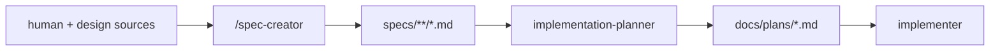
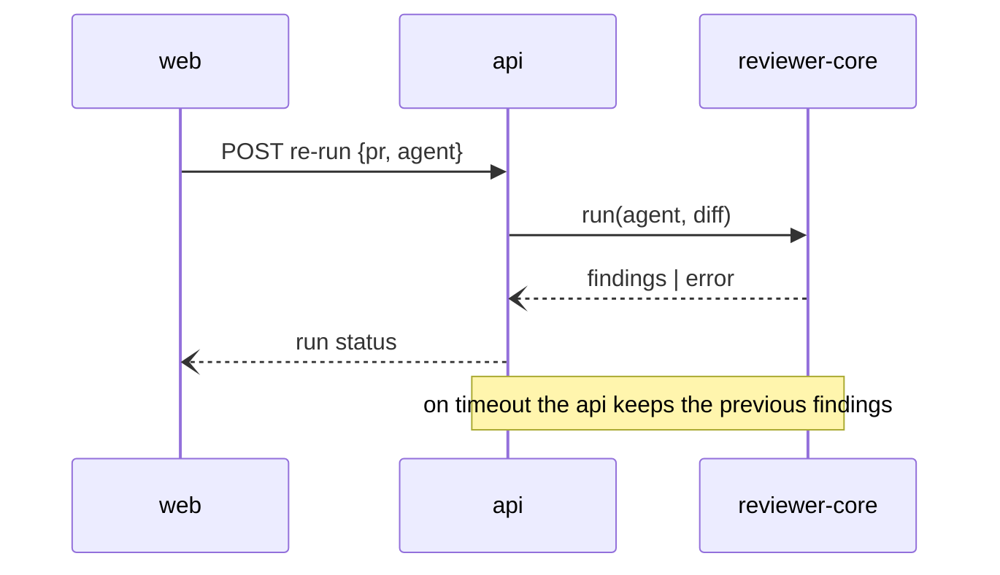

# spec-creator — design

- **Date:** 2026-08-22
- **Status:** draft — the human approves before `implementation-planner` writes
  the implementation plan.
- **Revision 12:** open questions are now classified blocking or minor — the
  skill asks blocking ones through `AskUserQuestion` and minor ones inline, and
  the agent marks the kind beside each `[NEEDS CLARIFICATION]`. Since the
  planner gate refuses any spec carrying a marker, the human's triage depends
  on knowing which markers actually block.
- **Revision 11:** two rules added from the first real runs. A spec written for
  behaviour that already exists must check its criteria against the code and
  report contradictions — design sources go stale, and a deliberate reversal is
  usually recorded in `INSIGHTS.md` or a commit, not in the design document.
  The self-check gained a Reality row and learned to catch an open question
  that another section of the same spec already answers. Both defects were
  found by `implementation-planner` reading a produced spec, not by the
  document review or the conformance script.
- **Revision 10:** `onion-architecture` and `frontend-architecture` moved from
  the on-demand allowlist into the preloaded set — the agent's own architectural
  stop rule depends on them, and a judgement that decides whether it writes at
  all may not rest on an optional load. The agent also states explicitly that
  research is finished before it runs: it has no `Agent`, a finding is evidence
  and not a requirement, and a missing fact becomes a `[NEEDS CLARIFICATION]`
  rather than a reason to research inside its own turn.
- **Revision 9:** the reference project drops `Inputs and provenance` in favour
  of `Cross-module interactions` and `Contracts`; this repository keeps all
  four sections, because provenance and untrusted-input handling are the only
  place a spec records that a diff reaching a model is data and not
  instructions. The two new sections were added with their jobs separated
  explicitly, so they do not silently duplicate provenance.
- **Revision 8:** compared against the reference project's `specs/README.md`.
  Two conventions differed. The **Spec ID** was aligned to the reference's
  `SPEC-YYYY-MM-DD-<kebab-feature-name>`, which also closes the counter-
  collision question of §11. The **layout** was deliberately not aligned: the
  reference keeps single-module specs beside their module (`server/specs/`),
  this repository keeps them under `specs/<module>/` — a conscious deviation,
  decided by the human. `mcp` is kept as a module with specs although the
  reference's table omits it.
- **Revision 7:** a best-practice pass over the written agent added the four
  things a pile of rules was missing: an ordered operating procedure with an
  explicit definition of done, a refusal to overwrite an existing spec, a
  stated source for today's date (the agent has no shell), and one canonical
  format for the source and verification annotations.
- **Revision 6:** the six clarification categories the human supplied — data &
  loading, display & sorting, interactions, state & persistence, feedback, edge
  cases — became a mandatory pass in both halves: questions in the skill
  (phase 3b), a coverage gate in the agent, and a `[NEEDS CLARIFICATION]`
  naming its category wherever one is left unanswered.
- **Revision 5:** written and reviewed. Building the agent surfaced four rules
  the design had not stated: it must refuse an invocation that is not a
  briefing (§7.5), it must report a design source it cannot read rather than
  imagining it, it must derive a mockup's element list before writing
  criteria, and a new spec is always `draft`. All four are now in the agent's
  prompt.
- **Revision 4:** research and rigour — the skill may dispatch `researcher`,
  in parallel for independent questions (§7.2); `INSIGHTS.md` reading is
  restricted to the folders in scope (§7.2); every criterion carries a source
  and a verification hint (§6.2); the final self-check became an explicit
  checklist run in both modes (§7.7).
- **Revision 3:** the review recommendations were folded in — the calibration
  anti-example (Appendix B), the splitting procedure (§6), this product's four
  non-functional questions (§6), end-to-end `AC-N` traceability (§9.3), the
  `brainstorming` boundary (§1.1), the vocabulary rule (§6), the `Revision`
  field, the five-proposal cap, the interview exit condition and the criterion
  for calling the agent a failure (§11).
- **Revision 2:** the skill policy was settled — only skills that already exist
  are wired in, and anything missing goes into the agent's prompt. `Skill` is
  granted with an allowlist (§5.1); the EARS rules, the state and degradation
  checklists and the provenance rules move into the prompt (§6.2, §7.3).
- **Revision 1:** critically reviewed on 2026-08-22 after the first draft. The
  review corrected one unverified claim about agent frontmatter (§5), three
  internal contradictions (§3, §4, AC-4), and added the two flows the first
  draft simply did not describe: revising an existing spec (§7.6) and the
  override on the status gate (§9.1).
- **Decisions locked in this document** were settled in the brainstorming
  session of 2026-08-22; every one of them is marked **[decided]**. Anything
  still open is in §11.

## 1. What we are building

A **spec-creator** capability that turns a feature idea plus the human's design
sources into one Spec-Driven-Development feature spec, written to a new
top-level `specs/` tree and to nowhere else.

It fills the gap the fleet has today. `implementation-planner` plans *how* and
states outright that it does not author requirements; `researcher`
investigates; `doc-writer` documents what already exists. Nobody writes *what
we are building* before the plan. This does.

The chain becomes:



### 1.1 Two spec folders, and which is which

After this lands the repository has two places holding documents called
"specs", and the difference must be stated once, here, or every future session
will guess:

| Folder | Holds | Written by |
|---|---|---|
| `specs/` | **SDD feature specs** — the template of §6, product behaviour, EARS criteria | `/spec-creator` |
| `docs/superpowers/specs/` | **design documents** — how a change to this repository's own tooling was decided, including this file | the `brainstorming` skill |

This document deliberately lives in the second folder: it designs a tool, it is
not a product feature spec. `specs/README.md` repeats this distinction so a
reader landing there is not left to infer it.

The distinction is also a rule about **which process to run**, and both the
skill and `specs/README.md` state it: `brainstorming` is for decisions about
this repository's own tooling and ends in a design document; `/spec-creator` is
for product behaviour and ends in a feature spec. Running the wrong one
produces a document in the wrong shape, in the wrong folder, for the wrong
reader.

## 2. Why a command plus an agent, not one agent

A subagent runs headless: it cannot ask the human a question mid-run, it can
only report at the end. The requirement is the opposite — the thing must
interrogate the human about gaps in the design and propose improvements before
committing them to a document.

So the work splits at the point where interactivity is needed **[decided]**:

| Stage | Runs where | Why there |
|---|---|---|
| Interview, design analysis, questions, proposals | Skill, in the **main session** | `AskUserQuestion` works only in the main loop |
| Writing the spec file | **Subagent** | Frontmatter `tools` physically denies it the network and the shell |

The command is a thin entry point, exactly like `.claude/commands/pr-self-review.md`.

## 3. Artifacts

**Created — four files, no production code and no test changes:**

1. `.claude/commands/spec-creator.md` — `description` + `argument-hint`,
   invokes the skill. Two invocation shapes:
   `/spec-creator <feature description>` (new spec) and
   `/spec-creator <path to an existing spec> <what changed>` (revision, §7.6).
2. `.claude/skills/spec-creator/SKILL.md` — the interview procedure (§7).
3. `.claude/agents/spec-creator.md` — the writer subagent (§5, §6).
4. `specs/README.md` plus the folder skeleton (§4).

**Modified — three existing files, because the agent cannot write them itself:**

5. `.claude/agents/implementation-planner.md` — the status gate of §9.1 and the
   traceability rule of §9.3.
6. `.claude/agents/README.md` — a row in the chain, the responsibility table,
   the permissions table and the artifacts table.
7. `CLAUDE.md` — one "Read when" line pointing at `specs/`.

## 4. Layout, IDs, file names

**[decided]** The tree is top-level `specs/`, a sibling of `docs/`, not inside it.

```
specs/
  README.md
  2026-08-22-<slug>.md        <- touches two or more modules
  server/       client/       reviewer-core/       mcp/       e2e/
    2026-08-22-<slug>.md      <- touches exactly one module
```

- **File name [decided]:** `YYYY-MM-DD-<kebab-slug>.md`, the slug being the
  feature name, so two specs are told apart at a glance.
- **Spec ID [decided, revised]:** `SPEC-` plus the file's own name without the
  extension — `specs/server/2026-08-22-rerun-one-review-agent.md` carries
  `SPEC-2026-08-22-rerun-one-review-agent`. The first decision here was a
  per-folder counter (`SPEC-SERVER-01`); it was replaced after comparison with
  the reference project, which uses the file-name form. The counter bought a
  shorter citation and cost a merge-time collision between branches and a
  folder read on every run; the file-name form costs neither.
- **Routing [decided]:** one module → `specs/<module>/`; two or more → the root
  of `specs/`. `specs/README.md` states exactly this rule, so the convention
  survives without the agent.
- **Who computes what.** The **skill** derives both the target path and the next
  free ID — the ID lives inside the files, not in their names, so deriving it
  means reading the specs already in that one folder — and shows both to the
  human for confirmation. The **subagent** re-checks that the ID it was handed
  is still unused in that folder and reports a collision instead of silently
  renumbering; it never invents a path.
- **Who picks the module [decided]:** the skill infers it from the description
  and the code, the human confirms. The subagent receives the path already
  settled.

## 5. The subagent's permissions

**[decided]** The restriction is prompt plus `tools` — no `PreToolUse` hook.

| Field | Value |
|---|---|
| `model` / `effort` | `opus` / `high` |
| `tools` | `Read`, `Grep`, `Glob`, `Write`, `Edit`, `TodoWrite`, `Skill` |
| `disallowedTools` | `Bash`, `WebSearch`, `WebFetch`, `Agent`, `NotebookEdit` |
| `skills` | `mermaid-diagram` (preloaded) |
| Rule in the body | "The only paths you may write to are `specs/**`. Any `Write` or `Edit` outside `specs/` is a violation: stop and report instead." |

Two departures from the rest of the fleet, both deliberate:

- **No `Bash` at all**, unlike `implementation-planner`. The fleet's own
  `README.md` admits that a read-only `Bash` is read-only by prompt alone and
  that writing through redirection is not blocked. For an agent whose single
  constraint is *do not write outside `specs/`*, keeping `Bash` would leave a
  hole in exactly that constraint. The cost is that reading a folder's existing
  IDs happens through `Glob` + `Read` rather than `ls | grep`, which is fine.
- **No `Agent`, deliberately.** Research is real work for this capability
  (§7.2), but it happens in the skill half, before the writer is dispatched.
  The writer receives findings as part of its briefing (§7.5). Keeping it a
  leaf of the chain means the last step — the one that touches files — is the
  simplest one to reason about, and a spec is never written on evidence the
  human never saw.
- **`Skill` granted, and constrained by a criterion rather than by the tool.**
  An earlier draft withheld `Skill` and preloaded `mermaid-diagram` through the
  `skills:` frontmatter alone. The repository contradicts that: all three
  agents that use `skills:` — `architecture-reviewer`, `doc-writer`,
  `implementation-planner` — also carry `Skill` in `tools`, so nothing here
  demonstrates that preloading works without the tool, and the design must not
  rest on an unverified assumption. The agent therefore carries `Skill`, is
  configured exactly like the three that already work, and is limited by the
  allowlist of §5.1. `Skill` cannot be restricted selectively, only wholly, so
  the limit is a criterion in the prompt — the fleet's documented approach. For
  an agent with no `Bash`, no network and no write path outside `specs/`, an
  over-eager skill load costs tokens and nothing else.

`Edit` is granted **[decided]**, scoped to `specs/**` by the same rule: the
agent must be able to fold the human's answers into Open questions, clear
`[NEEDS CLARIFICATION]` markers, move `Status`, and maintain the supersede pair
(§7.6).

### 5.1 Which skills, and no new ones

**[decided] Only skills that already exist in this repository are wired in.
Knowledge the agent needs that no existing skill carries goes into the agent's
own prompt — it does not become a new skill.** This work therefore creates no
`.claude/skills/` entry beyond the `spec-creator` skill itself (§3).

| Skill | When | Why a spec writer needs it |
|---|---|---|
| `mermaid-diagram` | preloaded, always | §6.1 requires `flowchart`, `stateDiagram` and `sequenceDiagram` |
| `security` | on demand — the feature touches authentication, uploads, or third-party input | Feeds Untrusted inputs and the security part of Non-functional requirements |
| `onion-architecture` | on demand — the owning module is unclear, or the request looks architectural | Decides which module owns the behaviour (routing, §4) and whether the §6 stop rule fires |
| `frontend-architecture` | on demand — the feature has UI | Same two decisions on the client side |
| everything else — `drizzle-orm-patterns`, `postgresql-table-design`, `fastify-best-practices`, `next-best-practices`, `react-best-practices`, `react-testing-library`, `typescript-expert`, `zod` | never | All of them answer *how to build it*; a spec stops where that question starts |

Three bodies of knowledge have no existing skill and are therefore written into
the agent's prompt directly:

- **EARS** — the five patterns, the vague-to-checkable rewrite, the rubber-word
  list (§6.2).
- **The design-gap checklists** — states and degradations (§7.3).
- **Provenance and prompt injection** — this product feeds model prompts with
  diffs, PR titles and comments, which the `security` skill does not cover
  (§7.3, Untrusted inputs).

## 6. What a spec document contains

The body is the human's template, verbatim, in **English [decided]** — even
when the interview was conducted in another language. Domain nouns are taken
from the code, not translated freshly: a `run`, a `finding`, an `agent`, a
`pull request` keep the names the codebase and the UI already use, so the spec
and the implementation cannot drift apart in vocabulary.

```
# Spec: <feature name>
> Spec ID: SPEC-YYYY-MM-DD-<kebab-feature-name>
> Status: draft | approved | implemented
> Supersedes: <spec id and path, if this spec replaces an earlier decision>
> Superseded-by: <spec id and path, filled in on the older spec when replaced>
> Revision: <one line per revision: what changed and why; absent on a first draft>
## Problem and user
## Goals / Non-goals
## User stories
## Acceptance criteria (EARS)
## Edge cases
## Cross-module interactions
## Contracts
## Non-functional requirements
## Inputs and provenance
## Untrusted inputs
## Open questions
## Design review          <- proposals; see §8
```

`Superseded-by` and `Revision` are additions to the human's template, both
forced by §7.6. Without a reciprocal field, a reader of the old spec never
learns it is dead; without a revision line, a spec that moves from `draft` to
`approved` loses the record of what changed on the way and why.

**Scope [decided]: feature specs only.** The architectural spec — module
boundaries, contracts, data flow, stack, invariants — lives long and belongs in
`docs/`; this agent does not write it. When a request would change the
skeleton, the agent stops and says so rather than smuggling an architectural
decision in under a feature spec's name.

**Length.** As short as the problem allows. A growing document is a signal that
either two features got mixed, or requirements got mixed with a technical plan.

**Splitting is a procedure, not a feeling.** When the interview shows two
features — two problems, two users, or two sets of acceptance criteria that
never reference each other — the agent stops before writing. It proposes a
split: a name and a one-line scope for each spec, and which one comes first.
The human picks. It never writes one document covering both and never silently
drops the second.

**Sections earn their place.** *User stories* are written only when they
clarify behaviour that the acceptance criteria alone leave ambiguous.
*Non-functional requirements* lists only the categories that actually apply to
this feature — performance, security, accessibility, observability — and a
category with nothing to say is omitted, not filled with ceremony.

**Four questions this product always asks.** Generic non-functional headings
are close to useless here; these four are not, and a feature that reaches a
model answers every one of them:

1. Does this call a model at all, and on which path — the main one or an
   explicitly triggered one?
2. What does one run cost, and how is that cost attributed?
3. What does the user see when the model is unavailable, fails, or times out?
4. Does the main path stay deterministic without the model?

The blast-radius spec answers all four — "the main path makes zero LLM calls" —
and that is the standard, not a happy accident.

### 6.1 Diagrams and contracts

A spec may carry, when they clarify behaviour:

- a **workflow diagram** — Mermaid `flowchart` or `stateDiagram`;
- a **service-communication diagram** — Mermaid `sequenceDiagram`, showing which
  module calls which, with the failure and timeout edges drawn, not implied;
- a **contract sketch** — the shape of the data crossing a boundary: field
  names, types, required or optional, error cases.

The line that must hold: **no implementation detail.** A contract sketch states
the shape and the meaning of each field; it does not state SQL, table or column
names, function bodies, file paths for code that does not exist yet, or library
choices — unless one of those is itself a constraint the feature must respect,
in which case it belongs in Non-functional requirements as a constraint with a
reason. If a diagram cannot be drawn without inventing implementation, that is
a signal the decision has not been made yet, and it becomes an Open question.

Diagrams are Mermaid code blocks, never image files — the same rule
`doc-writer` follows.

### 6.2 EARS rules

Every acceptance criterion:

- carries an id: `AC-1`, `AC-2`, …;
- uses one of the five canonical EARS patterns — ubiquitous, `WHEN` (event),
  `WHILE` (state), `IF … THEN` (unwanted behaviour), `WHERE` (optional
  feature) — with the modal `shall`;
- states exactly one checkable behaviour, so it converts to one test;
- contains no rubber words: *fast*, *robust*, *user-friendly*, *properly*,
  *as needed*, *should work well*. A requirement that can only be phrased that
  way is rewritten around a threshold and an observable result, or it moves to
  Open questions.

**Every criterion also carries where it came from and how it will be checked.**
Two short annotations, both on the same line as the criterion:

- **Source** — the design source or the interview answer it came from: a mockup
  path, a `researcher` finding with its `path:line`, or "human, 2026-08-22".
  A criterion whose source is the agent's own judgement is not a criterion; it
  is a proposal, and it belongs in Design review until the human accepts it.
- **Verification hint** — which suite will prove it, in this repository's own
  vocabulary from `TESTING.md`: `client`, `server-unit`, `server-integration`,
  `reviewer-core`, `e2e`, `mcp`, or `manual` when no suite can reach it. The
  hint is a hint, not a commitment: `implementation-planner` may move it, but
  it must argue with something. A criterion nobody can suggest a suite for is
  usually not verifiable, and that is worth finding out in the spec rather than
  three steps later.

Worked rewrite, kept in the agent's prompt as the calibration example:

| Vague | Checkable |
|---|---|
| "must work fine on large repositories" | WHEN the repository exceeds the indexing threshold, the system shall build the overview from deterministic facts only, without reading every file in full. |
| "must not crash when the model is unavailable" | IF the structured model call fails, THEN the system shall render the deterministic overview together with the reason for the degradation. |

## 7. The interview method

Five phases. Phases 1–4 run in the skill, in the main session; phase 5 is the
subagent. §7.6 describes the second mode, revision.

**Phase 1 — intake of sources.** The human supplies the design sources and
names them **[decided]**: paths to mockups or screenshots in the repo, a
written description, paths to existing screens in `client/src`. The skill
re-reads every source (`Read` renders PNG and JPG as an image) and echoes back
an explicit list of what it took in, so a spec is never written against the
wrong mockup. With no source at all, no spec is written: the first question is
what this is based on. No Figma, no network **[decided]**.

**Phase 2 — grounding in the code.** Before drawing any conclusion, read what
already exists: the contracts in `vendor/shared`, the neighbouring routes and
services, and the conventions of the modules involved. This is what stops a
"gap in the design" from being something the code already does.

*Which `INSIGHTS.md` to read — and which not to.* **[decided]** Only the ones
belonging to the folders this feature actually touches: `<module>/INSIGHTS.md`
for each module in scope, plus the finer-grained file when the feature reaches
a subsystem that has its own — `server/src/modules/repo-intel/INSIGHTS.md` is
the existing example. Read the `AGENTS.md` of the same folders alongside them.
Reading every `INSIGHTS.md` in the repository is wrong twice over: it costs
context that the interview needs, and it drags in hard-won lessons about
subsystems this feature will never touch, which then leak into the spec as
requirements nobody asked for. `CLAUDE.md` treats these files as
high-confidence guidance, so what they say about a module in scope outranks a
guess — but each is explicitly a draft to spot-check, not ground truth, so a
claim that matters to the spec is confirmed against the code before it becomes
a requirement.

*When the answer is not in the repository — dispatch `researcher`.* **[decided]**
The skill may launch the `researcher` agent, and several of them in parallel
when the questions are independent, exactly as `implementation-planner` does.
It is worth doing when a decision in the spec turns on a fact nobody in the
session knows: how an existing flow really behaves across packages, what an
upstream library does in the version pinned here, what a standard actually
requires. Rules that keep it from becoming a ritual:

- **One question per agent, phrased as a question.** Parallel researchers are
  for independent questions; a question that depends on another's answer waits
  for it.
- **Two or three at a time, not a fleet.** If a feature needs more than that
  before its spec can be written, the problem is that the feature is not
  understood yet — say so instead of researching around it.
- **Evidence, not opinion.** A researcher returns findings with `path:line` or
  a URL, and its own list of what it could not establish. That list becomes
  Open questions; it is never quietly rounded up to a fact.
- **A finding is not a requirement.** Research says what *is*; the spec says
  what *shall be*. Turning one into the other is the human's call, in phase 4.
- **Skip it for a small spec.** Most features need no research at all, and
  spending three agents on one is a cost with no reader.

**Phase 3 — design analysis, four lenses.**

| Lens | Looks for |
|---|---|
| Gaps | states the mockup does not show: loading, empty, error, partial data, long text, zero items, permissions |
| Corner cases | data boundaries, concurrent actions, retries, disconnects, stale cache, an external service failing |
| Cross-module communication | who calls whom, under which contract, what happens on timeout and how it degrades, whether `vendor/shared` changes — and therefore both mirrored copies |
| UX | redundant steps, irreversible actions without confirmation, invisible progress, accessibility |

Because no existing skill carries them (§5.1), the two checklists the lenses
run on live in the agent's prompt:

- **States**, per screen and per resource: zero, one, many, too many to render;
  loading, empty, error, partial data; stale or cached data; no permission;
  very long text; the same action fired twice.
- **Degradations**, per boundary crossed: the callee times out, returns an
  error, returns late after the user moved on, or returns something the caller
  cannot parse. Each one needs a decision in the spec — retry, degrade to a
  deterministic result, or surface the failure — never silence.

**Provenance and prompt injection.** This product puts third-party text —
diffs, pull-request titles, comments — into model prompts, and the `security`
skill does not cover that class of risk. So for any feature that reaches a
model, the spec answers three questions in Inputs and provenance and Untrusted
inputs: where the text comes from, whether it enters a prompt, and what happens
when it tries to act as an instruction. The default sentence, which the agent
writes unless the human decides otherwise, is that such text is data and never
instructions.

**The boundary that governs this phase:** a mockup is a specification, not a
draft. What it omits is a decision, not a gap to be filled in. The agent
therefore **never adds elements to acceptance criteria on its own authority**.
A gap becomes either a question to the human or a proposal — and reaches the
acceptance criteria only after an explicit yes.

**Phase 4 — questions and proposals**, kept deliberately separate:

- **Questions** — things without which the spec cannot be finished. At most 4
  per round through `AskUserQuestion`, at most 2 rounds. Whatever stays
  unresolved becomes `[NEEDS CLARIFICATION]` under Open questions — never a
  silent assumption.
- **Proposals** — improvements the human accepts or rejects in one word. A
  rejected proposal is not discarded: it lands in Non-goals with its reason, so
  it is not re-litigated a month later. **At most five per spec, ordered by
  impact.** An uncapped wish list stops being read, and the design analysis
  then produces nothing.

**The exit condition, and the way out.** The phase ends with the human
confirming the target path, the Spec ID and a one-line scope statement. If
after both rounds the problem still cannot be stated in one sentence, the
feature is not ready and the agent says so instead of writing a spec that
documents the confusion.

### 7.5 The briefing handed to the subagent

The subagent sees none of this session, so the briefing is the whole contract
between the two halves. **Its minimum is a confirmed target path, a Spec ID and
at least one design source** (mode B: the spec's path and what changed); an
invocation carrying less is refused by the agent rather than answered with a
draft, because the agent is visible in the agent list and will be invoked
directly by people who never ran the interview. It carries, explicitly:

- the target path and the confirmed Spec ID;
- the one-line scope statement, and the non-goals agreed in phase 4;
- **paths** to every design source, not summaries of them — the agent re-reads
  the mockup itself, so nothing is lost to paraphrase;
- every question asked in phase 4 with its answer, and every question left
  unanswered, verbatim;
- every proposal with its verdict — accepted, or rejected with the reason;
- the findings of the four lenses, each already tagged with the section it
  belongs to (§8);
- every `researcher` finding with its `path:line` or URL, and the researchers'
  own list of what they could not establish — the latter goes to Open questions
  verbatim, not summarised away.

**Phase 5 — writing.** The subagent writes the template of §6, then runs the
final self-check of §7.7 before returning.

### 7.6 Mode B — revising an existing spec

Invoked as `/spec-creator <path to an existing spec> <what changed>`. The
subagent reads the whole file first, then edits it in place. Three cases:

| Case | What happens |
|---|---|
| Answers to Open questions | The answer is folded into the section it belongs to, the `[NEEDS CLARIFICATION]` marker is removed, and the Open questions entry is deleted rather than left contradicting the body. |
| Status change | `draft` → `approved` **only on the human's explicit word in this session**; the agent never promotes a spec because it judges it complete. `approved` → `implemented` after the change is merged. |
| Any revision | The agent appends one `Revision:` line saying what changed and why, so the history of a decision survives inside the spec rather than only in git. |
| Supersede | The new spec fills `Supersedes`; the **old** spec gains the reciprocal `Superseded-by` line and its `Status` is left as it was. This is the one case where the agent edits two files, both under `specs/**`. |

Rewriting a spec beyond recognition is not a revision: if the feature itself
changed, a new spec supersedes the old one, so the record of what was decided
earlier survives.

Mode B ends with the same final self-check as mode A (§7.7): an edited spec is
held to the standard of a new one, or the standard decays with every revision.

### 7.7 The final self-check

Run at the end of both modes, before the agent reports. It fixes what it finds
inline and names in its report anything it could not fix.

| Check | What fails it |
|---|---|
| Placeholders | a `TBD`, a `TODO`, an unfinished sentence, or a `[NEEDS CLARIFICATION]` that was actually answered in the interview |
| Internal consistency | a goal contradicting a non-goal, a criterion contradicting an edge case, a diagram showing a flow no criterion describes |
| Scope | more than one feature in the document — if so, it stops and proposes the split of §6 instead of reporting success |
| Ambiguity | a criterion that can be read two ways, or a rubber word from the §6.2 list |
| Altitude | an implementation detail that crept in: a table, a column, a route, a file path for code that does not exist, a library choice with no constraint behind it |
| Completeness | a feature that reaches a model without the four answers of §6; an external input with no entry under Inputs and provenance or Untrusted inputs |
| Traceability | a criterion with no `AC-N` id, no source, or no verification hint (§6.2) |
| Template | a missing required field — `Spec ID`, `Status`, and `Revision` on an edit — or a section left as an empty heading rather than omitted |
| Boundary | any file touched outside `specs/**`, or a second file touched for anything other than the supersede pair |

The check that matters most is the third: reporting a spec that quietly covers
two features is worse than reporting that the interview is not finished.

## 8. Where each finding lands

```
design gap ─────────────▶ Edge cases  (+ AC-N once the human confirms behaviour)
corner case ────────────▶ Edge cases
cross-module interaction▶ Inputs and provenance (+ a sequenceDiagram when useful)
external / user text ───▶ Untrusted inputs
UX proposal ────────────▶ Design review
rejected proposal ──────▶ Non-goals, with the reason
unresolved question ────▶ Open questions [NEEDS CLARIFICATION]
```

## 9. Fleet integration

**Chat output** beside the file: the path, the Spec ID, the Open questions, and
the Design review proposals. That is what the human answers next.

**Handoff.** `implementation-planner` already restates every requirement as
`R1`, `R2`… with its source in phase 1; a spec arriving with `AC-1…AC-N` makes
that a mechanical mapping, and the plan header gains an `Input spec:` line, as
the blast-radius plan already does.

Three integration decisions, all **[decided]**:

### 9.1 Status is a gate, with one named override

`implementation-planner` does not build a plan from a spec that still carries a
`[NEEDS CLARIFICATION]` marker. One rule in the planner's prompt, not a hook.

Two qualifications the first draft missed, and both matter:

- **It binds only when a spec is the input.** The planner keeps accepting a
  plain task description, exactly as it does today; this adds no requirement
  that every task have a spec.
- **The human can override, explicitly and on the record.** Some clarifications
  are genuinely answerable only during implementation. The override is the
  human saying so in the invocation, and the planner then names the deferred
  clarification in the plan header. Without this, an unanswerable question
  deadlocks the whole chain — which is worse than planning around a known gap.

### 9.2 Status lifecycle

`draft` → `approved` (only on the human's explicit word; the agent moves it with
`Edit`) → `implemented` (after merge). Supersede maintains both sides of the
pair, per §7.6.

### 9.3 Traceability, end to end

An `AC-N` id is worth having only if it survives the whole chain. Two rules,
both landing in `implementation-planner`'s prompt beside the gate:

- every plan step names the acceptance criteria it satisfies;
- every test written for a criterion carries its id in the test name.

`plan-verifier` then checks coverage of the spec mechanically — criterion by
criterion — instead of judging whether the plan "looks complete".

### 9.4 Fleet documentation

`spec-creator` cannot document itself: it writes only under `specs/`. The rows
in `.claude/agents/README.md` and the "Read when" line in `CLAUDE.md` are
written by hand as part of this work (§3, items 5–7).

## 10. Non-goals

- Writing the architectural spec (§6).
- Writing implementation plans, code, or tests.
- Reviewing code, running gates, or committing.
- Touching anything outside `specs/**` — including `docs/`, module READMEs, and
  `.claude/`.
- Any network access: no Figma, no `WebFetch`, no `WebSearch`.
- A `PreToolUse` hook enforcing the write boundary — explicitly rejected in
  favour of prompt plus `tools`.
- Requiring a spec before `implementation-planner` will plan anything (§9.1).
- Creating new skills. Only existing skills are wired in; missing knowledge goes
  into the agent's prompt (§5.1).
- Research by the writer subagent. `researcher` is dispatched from the skill,
  before the writer runs (§5, §7.2).
- Migrating the existing documents in `docs/superpowers/specs/` into `specs/`
  (§1.1). They are design documents and stay where they are.

## 11. Open questions

None blocking. Two worth revisiting after the first few specs are written:

- ~~**Counter collisions across branches.**~~ **Resolved** by adopting the
  reference project's file-name-based ID: with no counter, there is nothing for
  two branches to mint twice.
- **Two-round question cap.** If real sessions routinely exhaust both rounds
  and still leave many `[NEEDS CLARIFICATION]` markers, the cap is wrong and
  should become a soft limit.

**The criterion for calling this a failure.** If two consecutive specs need the
human to rewrite more than half of what the agent produced, the problem is the
prompt, not the human's patience: rework it rather than living with it. Stated
here so that quiet degradation has a name and a threshold.

## 12. Acceptance criteria for building this

There is no automated harness for skills and agents in this repository, so each
criterion names how it is checked. "Dry run" means invoking `/spec-creator` on
a real feature and reading what happens; "inspect" means reading the produced
file or the frontmatter.

- **AC-1** — WHEN `/spec-creator` is invoked with a feature description, the
  skill shall echo the list of design sources it read before asking any
  question. *(dry run)*
- **AC-2** — WHEN the skill has settled the module, it shall present the target
  path and the Spec ID to the human for confirmation before dispatching the
  subagent. *(dry run)*
- **AC-3** — IF a question from phase 4 is left unanswered, THEN the written
  spec shall carry it under Open questions marked `[NEEDS CLARIFICATION]`.
  *(dry run, then inspect)*
- **AC-4** — The subagent shall create and modify files only under `specs/**`,
  writing exactly one new spec per run, and shall report a violation instead of
  writing anywhere else. *(inspect frontmatter and prompt; `git status` after a
  dry run)*
- **AC-5** — WHERE a run supersedes an existing spec, the agent shall edit that
  one older spec to add its `Superseded-by` line, and no other file. *(dry run
  on a superseding spec, then `git diff --name-only`)*
- **AC-6** — Every acceptance criterion the agent writes shall carry an `AC-N`
  id and use one of the five EARS patterns with `shall`. *(inspect)*
- **AC-7** — WHERE a spec includes a diagram, the agent shall emit it as a
  Mermaid code block and shall not name tables, columns, functions or files
  that do not yet exist. *(inspect)*
- **AC-8** — IF a request would change module boundaries, contracts, stack or
  invariants, THEN the agent shall stop and report it as an architectural
  change instead of writing the spec. *(dry run with a deliberately
  architectural request)*
- **AC-9** — The `implementation-planner` prompt shall refuse to plan from a
  spec containing `[NEEDS CLARIFICATION]`, unless the human names the deferred
  clarification in the invocation. *(inspect the prompt; dry run both ways)*
- **AC-10** — `specs/README.md` shall state the routing rule of §4 and the
  distinction of §1.1. *(inspect)*
- **AC-11** — The agent's prompt shall carry the EARS rules, the state and
  degradation checklists, and the provenance rules inline, and this work shall
  add no new skill to `.claude/skills/` beyond `spec-creator` itself.
  *(inspect the prompt; `git status` after the work)*
- **AC-12** — The agent shall write at most five Design review proposals per
  spec, ordered by impact. *(inspect)*
- **AC-13** — WHEN the agent edits an existing spec, it shall append a
  `Revision:` line stating what changed and why. *(dry run in mode B, then
  inspect)*
- **AC-14** — WHERE a feature reaches a model, the spec shall answer all four
  questions of §6: which path calls the model, the cost and its attribution,
  the behaviour on failure or timeout, and whether the main path stays
  deterministic. *(inspect)*
- **AC-15** — IF the interview shows two features rather than one, THEN the
  agent shall propose a split with a name and a one-line scope per spec instead
  of writing a single document. *(dry run with a deliberately double request)*
- **AC-16** — The `implementation-planner` prompt shall require every plan step
  to name the acceptance criteria it satisfies. *(inspect the prompt)*
- **AC-17** — WHERE a decision turns on a fact the session does not hold, the
  skill shall dispatch `researcher` — several in parallel only for independent
  questions — and shall carry each finding into the briefing with its
  `path:line` or URL. *(dry run on a feature needing an unknown fact)*
- **AC-18** — The skill shall read only the `INSIGHTS.md` and `AGENTS.md` files
  of the folders the feature touches, including a subsystem's own file where
  one exists, and shall not read the others. *(dry run, then inspect which
  files were opened)*
- **AC-19** — Before reporting, the agent shall run the final self-check of
  §7.7 in both modes, and shall name in its report anything it could not fix.
  *(inspect the prompt; dry run in mode B)*
- **AC-20** — Every acceptance criterion the agent writes shall carry a source
  and a verification hint drawn from this repository's suite vocabulary.
  *(inspect)*

## Appendix A — calibration example

A short, complete spec, kept in the agent's prompt so it writes to this shape
rather than to a generic idea of one. Shortened here to the parts that carry
the conventions.

````markdown
# Spec: Re-run one review agent on a pull request
> Spec ID: SPEC-2026-08-22-rerun-one-review-agent
> Status: draft
> Supersedes: —
> Superseded-by: —

## Problem and user
A reviewer reading a PR page sees findings from a run that used an older
prompt. Today the only way to refresh them is to import the pull request
again, which discards the findings of every other agent.

## Goals / Non-goals
**Goals** — re-run exactly one agent on an already-imported PR and show its new
findings beside the untouched findings of the others.
**Non-goals** — re-running every agent at once (rejected in review: it hides
which findings are new); editing the agent's prompt from the PR page.

## Acceptance criteria (EARS)
- **AC-1** — WHEN the reviewer confirms a re-run for one agent, the system
  shall start a new run for that agent alone and leave every other agent's
  findings unchanged. *(source: mockup `docs/design/pr-page-rerun.png`;
  verify: server-integration)*
- **AC-2** — WHILE a re-run is in progress, the system shall show that agent's
  card as running and shall keep its previous findings visible.
  *(source: human, 2026-08-22; verify: client)*
- **AC-3** — IF the run fails, THEN the system shall keep the previous findings
  and show the failure reason on the card. *(source: gap found in review, human
  confirmed; verify: client)*
- **AC-4** — The system shall record every re-run with its trigger, so cost
  attribution stays per run. *(source: researcher — cost is aggregated per run
  in `server/src/modules/runs`; verify: server-integration)*

## Edge cases
- The PR has no prior run for that agent — the card offers a first run, not a
  re-run.
- A re-run is requested while one is already in progress for the same agent.
- The pull request was closed upstream between import and re-run.

## Inputs and provenance

Contract sketch, request: `{ prId: uuid, agentId: uuid }`; response:
`{ runId: uuid, status: "queued" | "running" | "failed" }`.

## Untrusted inputs
The diff and the PR title come from GitHub and reach the model; they are data,
never instructions.

## Open questions
- [NEEDS CLARIFICATION] Does a re-run replace the previous findings, or are
  both kept and shown as versions?

## Design review
- The mockup shows no confirmation step; a re-run costs money, so a one-line
  confirmation with the estimated cost is proposed.
````

## Appendix B — anti-example

The counterpart to Appendix A, kept in the prompt so the failure modes have
names. Every line below is wrong, and the reason is stated beside it.

````markdown
## User stories
As a user, I want to re-run an agent, so that I can re-run an agent.
                    ^ restates the acceptance criteria and adds nothing;
                      a story earns its place only by clarifying behaviour

## Acceptance criteria (EARS)
- **AC-1** — The re-run should be fast and the UI should stay responsive.
                    ^ two behaviours, no pattern, no `shall`, and "fast"
                      names no threshold: three defects in one line
- **AC-2** — WHEN the user clicks the button, the system shall write a row to
  `agent_runs` with `trigger = 'manual'` and call `POST /api/runs`.
                    ^ correct EARS, wrong altitude: table, column, value and
                      route are the plan's decisions, not the spec's
- **AC-3** — The system shall handle errors properly.
                    ^ "properly" is the requirement that was not written

## Edge cases
- Various error states are handled.
                    ^ names no state, so it can never fail a review

## Non-functional requirements
- Performance: good.
- Accessibility: N/A.
                    ^ ceremony; an inapplicable category is omitted, and this
                      feature calls a model, so the four questions of §6 are
                      the ones that actually needed answering

## Open questions
- None.
                    ^ written after the interview left two decisions unmade;
                      an unresolved decision is a [NEEDS CLARIFICATION] entry,
                      not an empty section
````
